# イベント

<a href="./EVENTS.md"><strong>EN</strong></a> · <a href="./EVENTS.zh.md"><strong>中文</strong></a> · <strong>日本語</strong>

ポスター、会場、申し込み。README は国ごとに都市を並べ、名前を押すとこのページの該当イベントへ飛びます。

[一覧に戻る](./README.ja.md)

### 中国

<table><tr><td width="320" valign="top"></td><td valign="top"><strong>Grok Bot Macau Student Workshop</strong> 2026-09-05（土）14:30-17:30（GMT+8） マカオ大学ゲストハウス N1-1005  無料の学生ワークショップ。Grok Bot 実習と創業者トーク。広東語（英語サポートあり）。40 席は満席、ウェイティング可。  <a href="https://luma.com/cursor-macau-creativity-workshop-2026-sep"><strong>Luma でウェイティング登録 →</strong></a></td></tr></table>

<table><tr><td width="320" valign="top"></td><td valign="top"><strong>Grok Bot Meetup Chengdu</strong> 2026-09-05（土）14:30–17:30（GMT+8） 成都 · 登録後に住所を表示  中国 2 回目の Grok Bot オフライン。アイスブレイクと共有 / Workshop。主催者承認、残席 22。  <a href="https://luma.com/pdj34ofn"><strong>Luma で申し込む（主催者承認） →</strong></a></td></tr></table>

<table><tr><td width="320" valign="top"><a href="https://luma.com/spacexai-kh2x">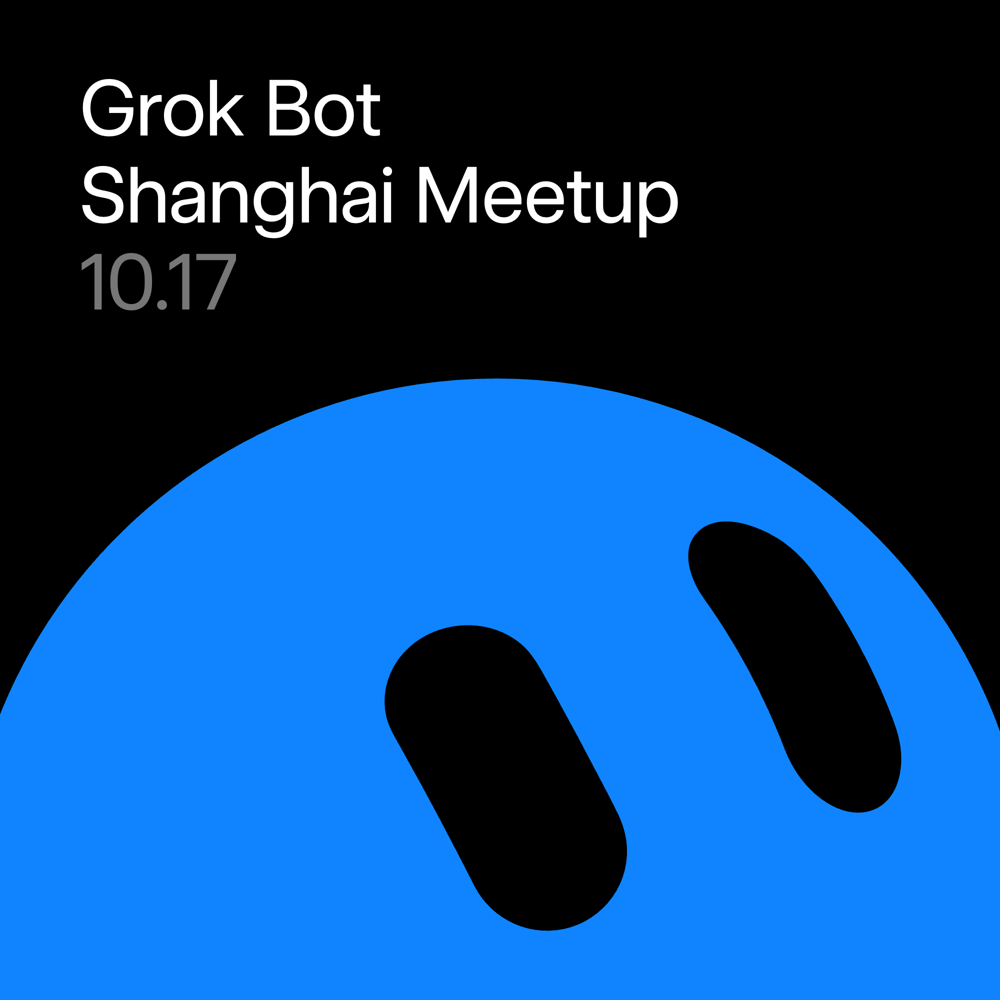</a></td><td valign="top"><strong>Grok Bot Meetup Shanghai</strong> 2026-10-17（日）14:00–17:00（GMT+8） 上海 · 登録後に住所を表示  上海の対面 Grok Bot。アイスブレイクと Workshop。承認制。forum 170454。Luma API 時刻は誤り気味 → 14:00–17:00 +08 を採用。  <a href="https://luma.com/spacexai-kh2x"><strong>Luma で申し込む → →</strong></a></td></tr></table>

<table><tr><td width="320" valign="top"><a href="https://luma.com/x72vqp3u">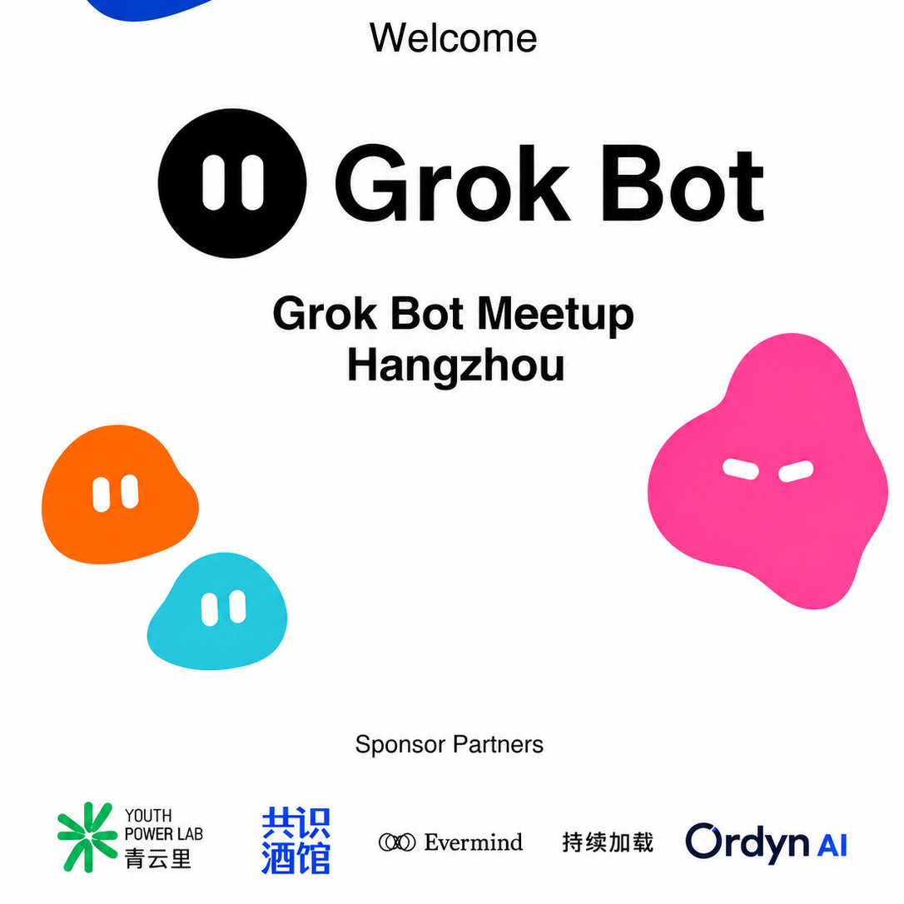</a></td><td valign="top"><strong>Grok Bot Meetup Hangzhou</strong> 2026-09-05（土）14:00–18:00（GMT+8） 杭州 · 登録後に住所を表示  杭州の対面 Grok Bot（成都と同日）。承認制・約 14 名。会場は登録後。  <a href="https://luma.com/x72vqp3u"><strong>Luma で申し込む（主催者承認） →</strong></a></td></tr></table>

<table><tr><td width="320" valign="top"></td><td valign="top"><strong>Grok Bot Meetup Hangzhou</strong> 2026-09-19（土）14:00–17:30（GMT+8） 杭州 · 登録後に住所を表示  SpaceXAI 杭州の対面。公式挨拶・事例共有・オープンマイク・交流。承認制。会場は登録後。  <a href="https://luma.com/gb05xpbc"><strong>Luma で申し込む（主催者承認） →</strong></a></td></tr></table>

<table><tr><td width="320" valign="top"></td><td valign="top"><strong>Grok Bot Meetup Beijing</strong> 2026-09-19（土）14:00–18:00（GMT+8） 北京 · 登録後に住所を表示  SpaceXAI 北京の対面（主催 Yafang）。紹介と事例共有。承認制・約 150 席。会場は登録後。  <a href="https://luma.com/spacexai-chwk"><strong>Luma で申し込む（主催者承認） →</strong></a></td></tr></table>

### アメリカ

<table><tr><td width="320" valign="top"></td><td valign="top"><strong>Grok Bot Meetup Las Vegas</strong> 2026-09-15（月）18:00-20:00（PDT） ラスベガス · 登録承認後に会場を表示  交流、トーク / Workshop、Cursor チームのビデオ Q&A。主催者承認制、会場は未定。  <a href="https://luma.com/cursor-kaua"><strong>Luma で申し込む →</strong></a></td></tr></table>

<table><tr><td width="320" valign="top"><a href="https://luma.com/spacexai-qdwh">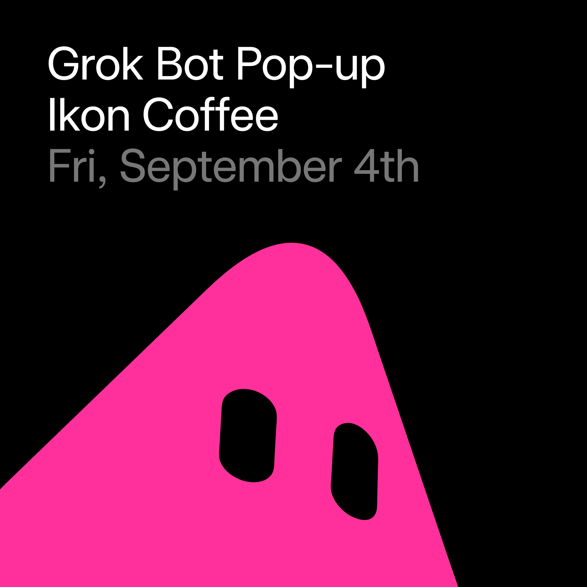</a></td><td valign="top"><strong>Grok Bot Pop-up @ Ikon Coffee</strong> 2026-09-04（金）10:00–14:00（PDT） San Francisco, CA · Ikon Coffee, 1302 22nd St  Ikon Coffee の午前ポップアップ。Matt Palmer と交流、Grok Bot 体験、credits と無料月。承認制（Sarah Goomar / Matt Palmer）。  <a href="https://luma.com/spacexai-qdwh"><strong>Luma で申し込む → →</strong></a></td></tr></table>

<table><tr><td width="320" valign="top"></td><td valign="top"><strong>Build with Grok Bot @ Hawaii Tech Week</strong> 2026-09-05（金）09:00–12:30（HST） Honolulu, HI · Entrepreneurs Sandbox, 643 Ilalo St  Hawaii Tech Week の午前。Grok Bot エージェントで cowork / ship。無料・満席/ウェイトリスト（Hawaii Tech Week / Ray Fernando）。  <a href="https://luma.com/hawaii-z15e"><strong>Luma で申し込む → →</strong></a></td></tr></table>

<table><tr><td width="320" valign="top"><a href="https://luma.com/spacexai-i8qf">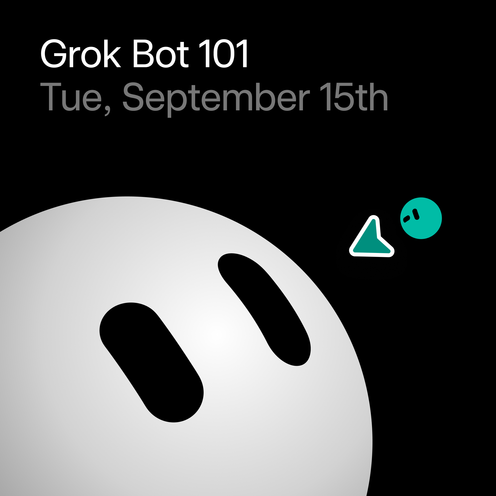</a></td><td valign="top"><strong>Grok Bot 101（SF）</strong> 2026-09-15（月）09:00–10:00（PDT） San Francisco, CA · The Howard SF, 661 Howard St  The Howard での公式 Grok Bot 入門。独自コンピュータを持つ AI チームメイト。無料・残席約 146。  <a href="https://luma.com/spacexai-i8qf"><strong>Luma で申し込む → →</strong></a></td></tr></table>

<table><tr><td width="320" valign="top"><a href="https://luma.com/spacexai-n2o0">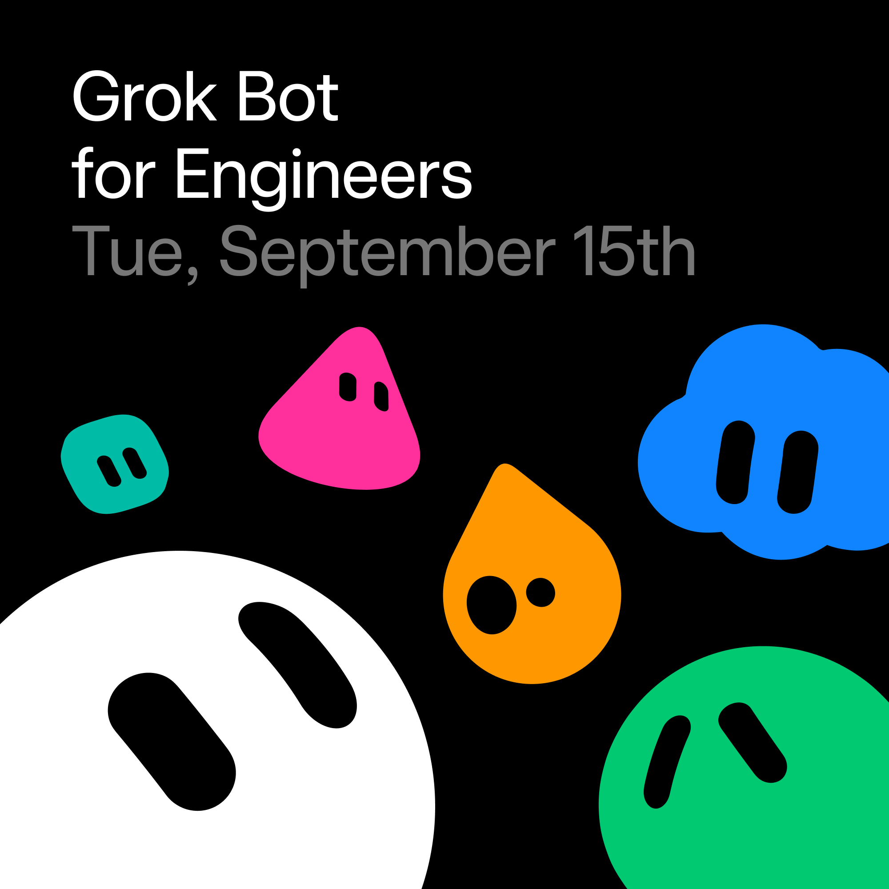</a></td><td valign="top"><strong>Grok Bot for Engineers（SF）</strong> 2026-09-15（月）12:30–14:00（PDT） San Francisco, CA · The Howard SF, 661 Howard St  エンジニア向け公式 Grok Bot ワークショップ（The Howard）。無料・残席約 145。  <a href="https://luma.com/spacexai-n2o0"><strong>Luma で申し込む → →</strong></a></td></tr></table>

<table><tr><td width="320" valign="top"><a href="https://luma.com/spacexai-7n4l">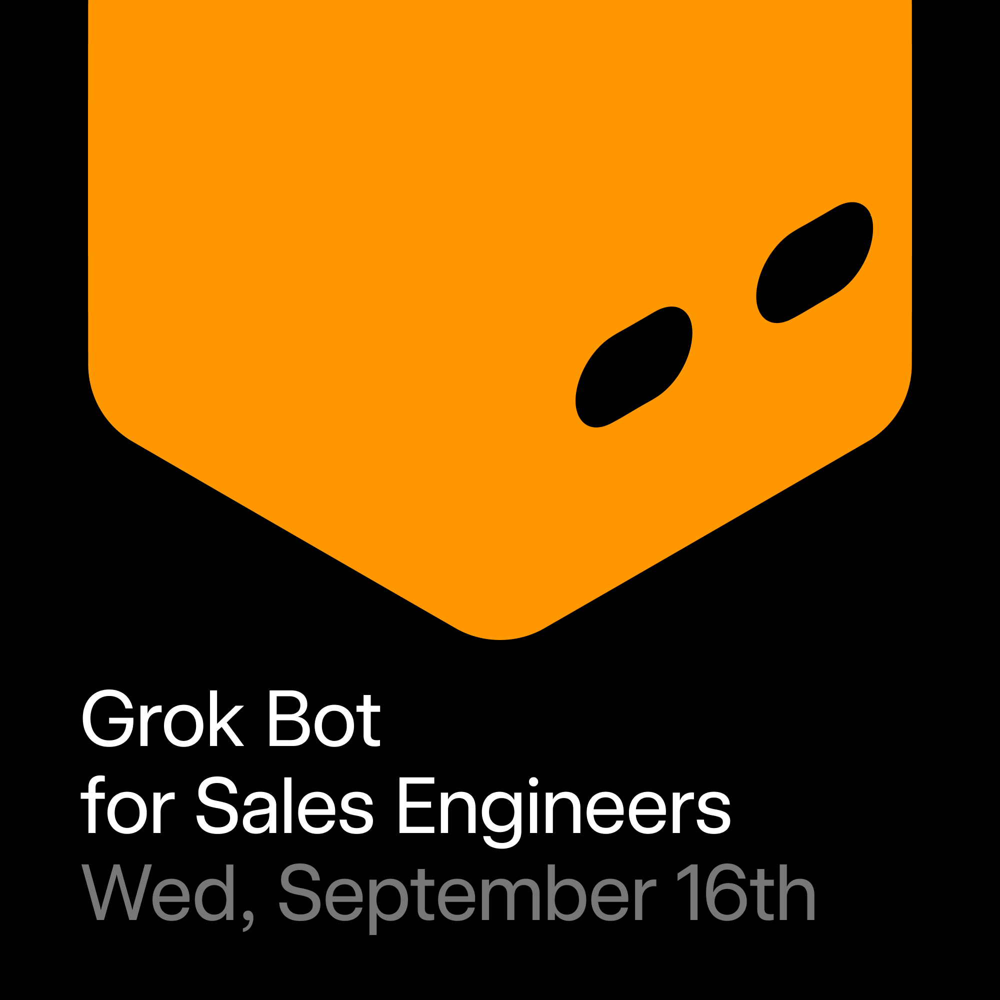</a></td><td valign="top"><strong>Grok Bot for Sales Engineering（SF）</strong> 2026-09-16（火）09:00–10:30（PDT） San Francisco, CA · The Howard SF, 661 Howard St  Sales Engineering 向け公式セッション（The Howard）。無料・残席約 146（Jenna Nanpei / Kathryn Trainor）。  <a href="https://luma.com/spacexai-7n4l"><strong>Luma で申し込む → →</strong></a></td></tr></table>

<table><tr><td width="320" valign="top"><a href="https://luma.com/spacexai-dtez">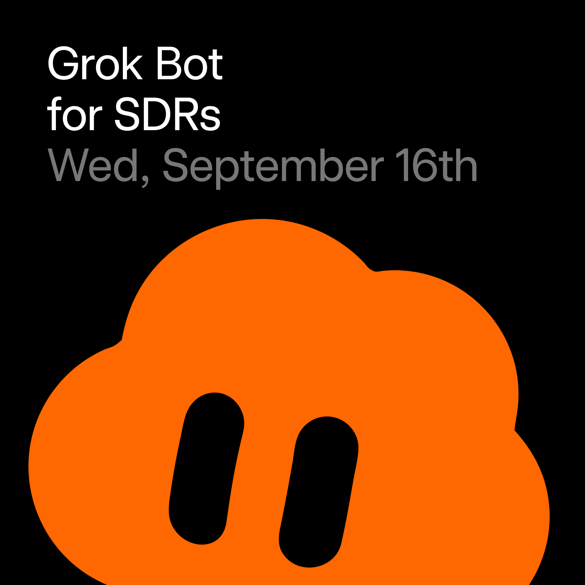</a></td><td valign="top"><strong>Grok Bot for SDRs（SF）</strong> 2026-09-16（火）14:30–15:30（PDT） San Francisco, CA · The Howard SF, 661 Howard St  SDR 向け公式ワークショップ（The Howard）。無料・残席約 147（Jenna Nanpei）。  <a href="https://luma.com/spacexai-dtez"><strong>Luma で申し込む → →</strong></a></td></tr></table>

<table><tr><td width="320" valign="top"><a href="https://luma.com/spacexai-obof">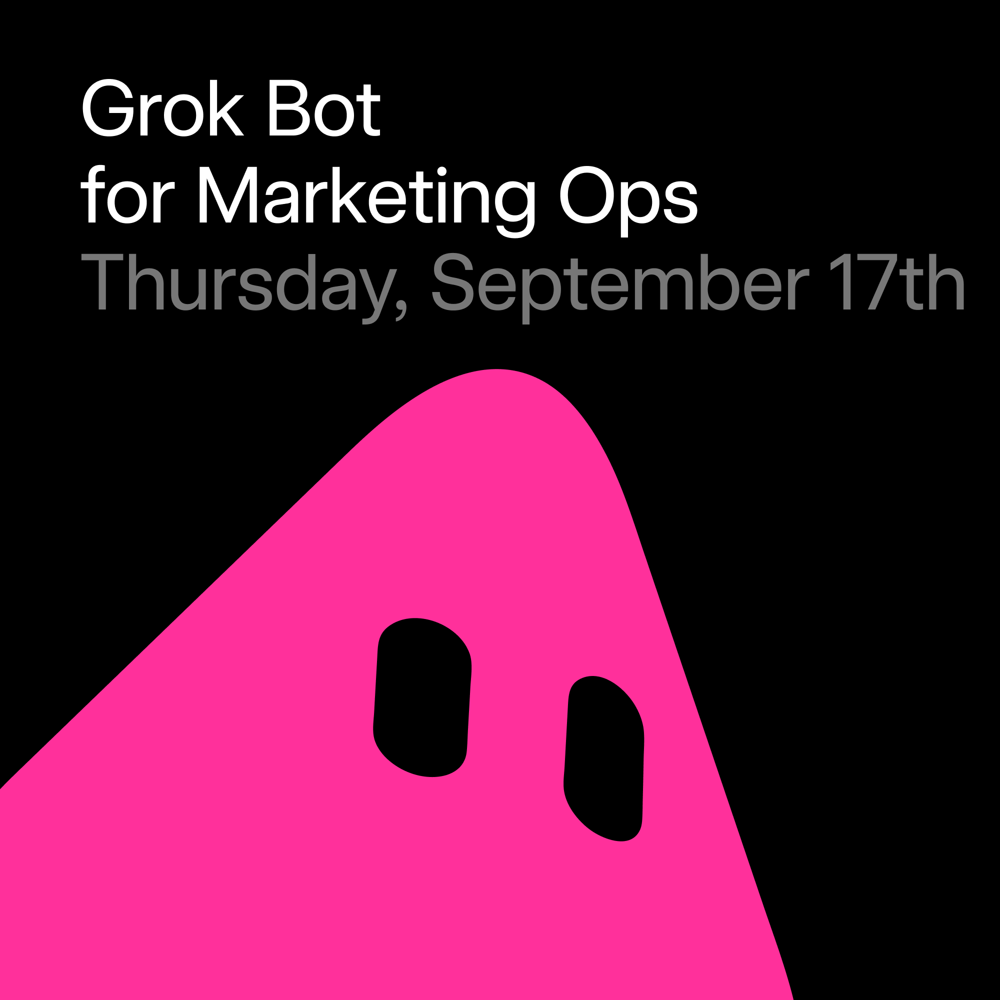</a></td><td valign="top"><strong>Grok Bot for Marketing Operations（SF）</strong> 2026-09-17（水）09:00–10:30（PDT） San Francisco, CA · The Howard SF, 661 Howard St  Marketing Ops 向け公式セッション（The Howard）。無料・残席約 146（Jenna Nanpei）。  <a href="https://luma.com/spacexai-obof"><strong>Luma で申し込む → →</strong></a></td></tr></table>

<table><tr><td width="320" valign="top"><a href="https://luma.com/spacexai-kczr">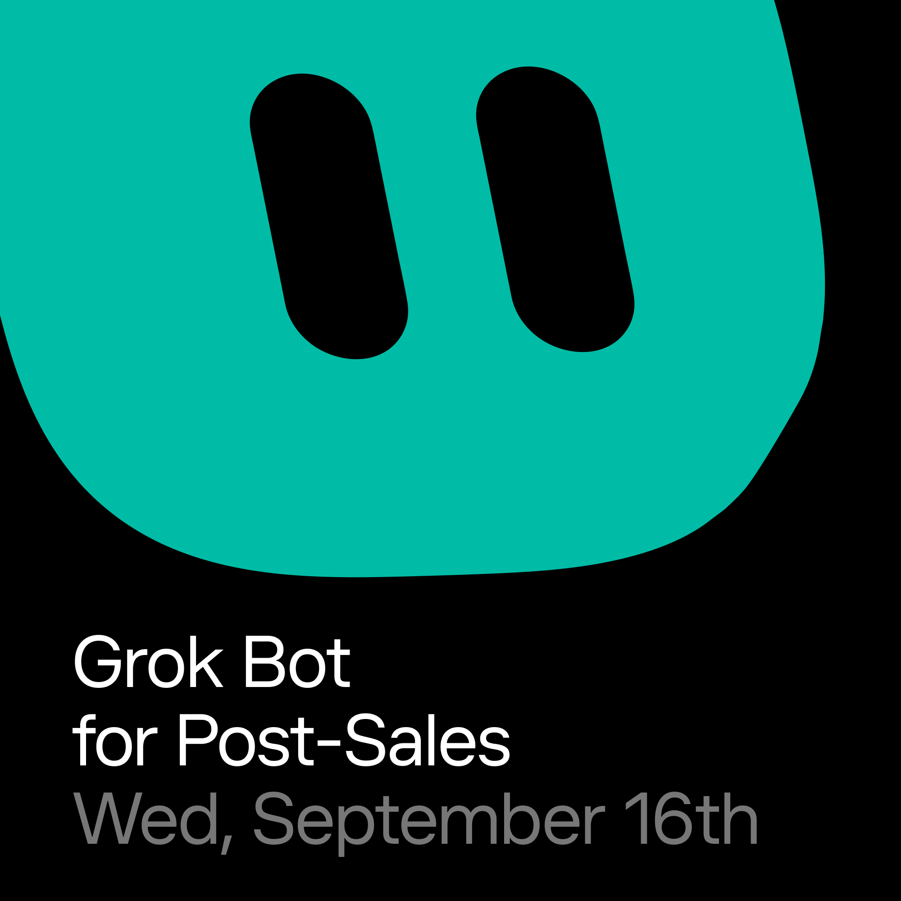</a></td><td valign="top"><strong>Grok Bot for Post-Sales（SF）</strong> 2026-09-17（水）12:30–13:30（PDT） San Francisco, CA · The Howard SF, 661 Howard St  Post-Sales 向け公式ワークショップ（The Howard）。無料・残席約 148（Jenna Nanpei）。  <a href="https://luma.com/spacexai-kczr"><strong>Luma で申し込む → →</strong></a></td></tr></table>

<table><tr><td width="320" valign="top"></td><td valign="top"><strong>Grok Bot for Marketing（SF）</strong> 2026-09-17（水）14:30–16:00（PDT） San Francisco, CA · The Howard SF, 661 Howard St  Marketing 向け公式セッション（The Howard）。無料・残席約 148（Jenna Nanpei / Kathryn Trainor）。  <a href="https://luma.com/spacexai-1ctm"><strong>Luma で申し込む → →</strong></a></td></tr></table>

<table><tr><td width="320" valign="top"><a href="https://luma.com/spacexai-qki6">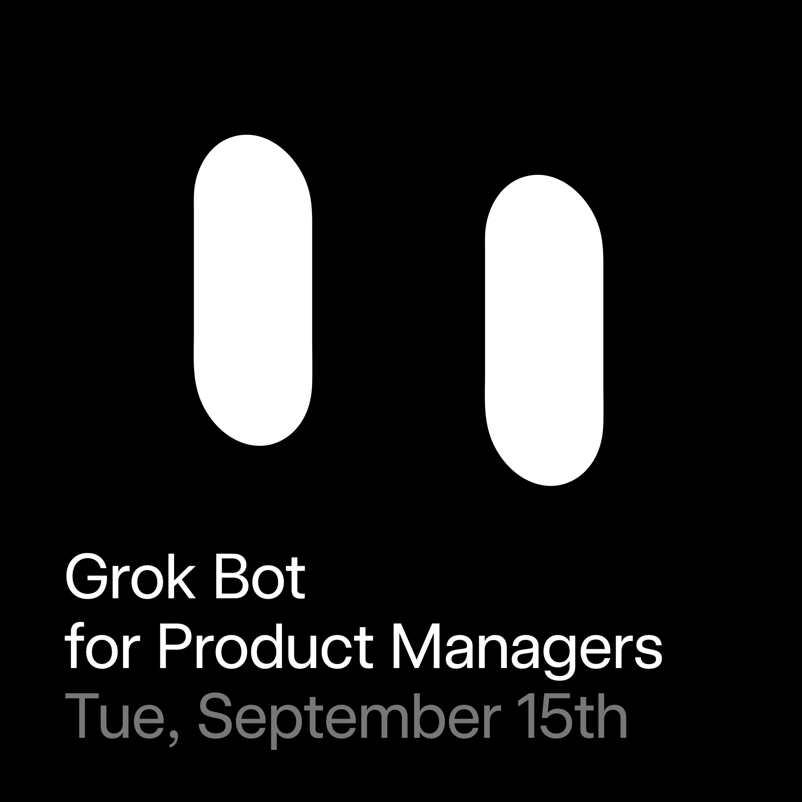</a></td><td valign="top"><strong>Grok Bot for Product Managers（SF）</strong> 2026-09-15（月）14:30–16:00（PDT） San Francisco, CA · The Howard SF, 661 Howard St  PM 向け公式 Grok Bot ワークショップ（The Howard / Kevin Niparko）。無料・残席約 143（Jenna Nanpei）。  <a href="https://luma.com/spacexai-qki6"><strong>Luma で申し込む → →</strong></a></td></tr></table>

<table><tr><td width="320" valign="top"><a href="https://luma.com/spacexai-74df">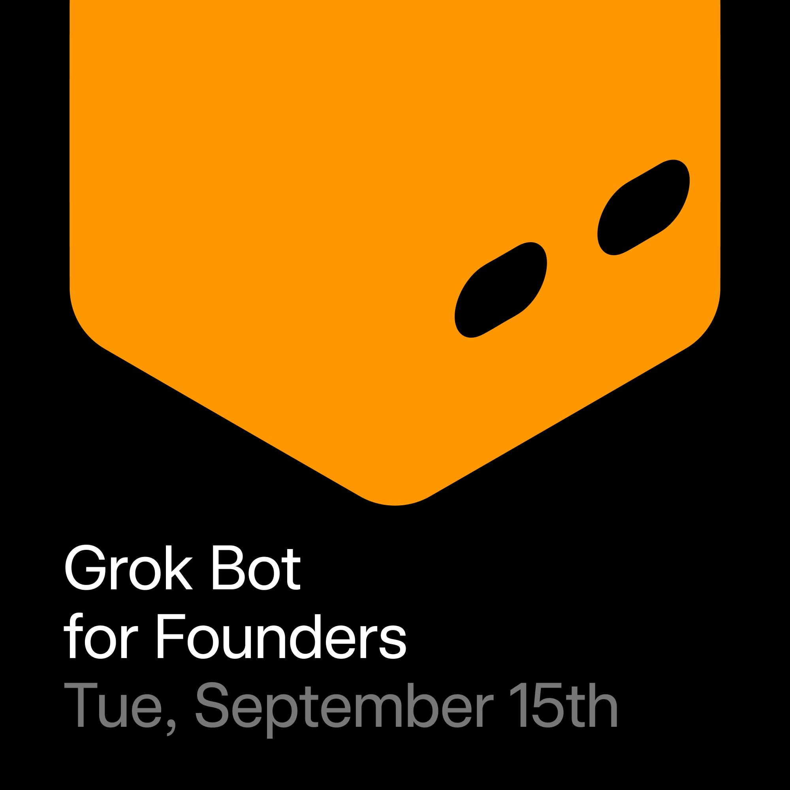</a></td><td valign="top"><strong>Grok Bot for Founders（SF）</strong> 2026-09-15（月）16:30–17:30（PDT） San Francisco, CA · The Howard SF, 661 Howard St  ファウンダー向け公式セッション（The Howard / Shub Gaur）。無料・残席約 144（Jenna Nanpei）。  <a href="https://luma.com/spacexai-74df"><strong>Luma で申し込む → →</strong></a></td></tr></table>

<table><tr><td width="320" valign="top"><a href="https://luma.com/spacexai-vpud">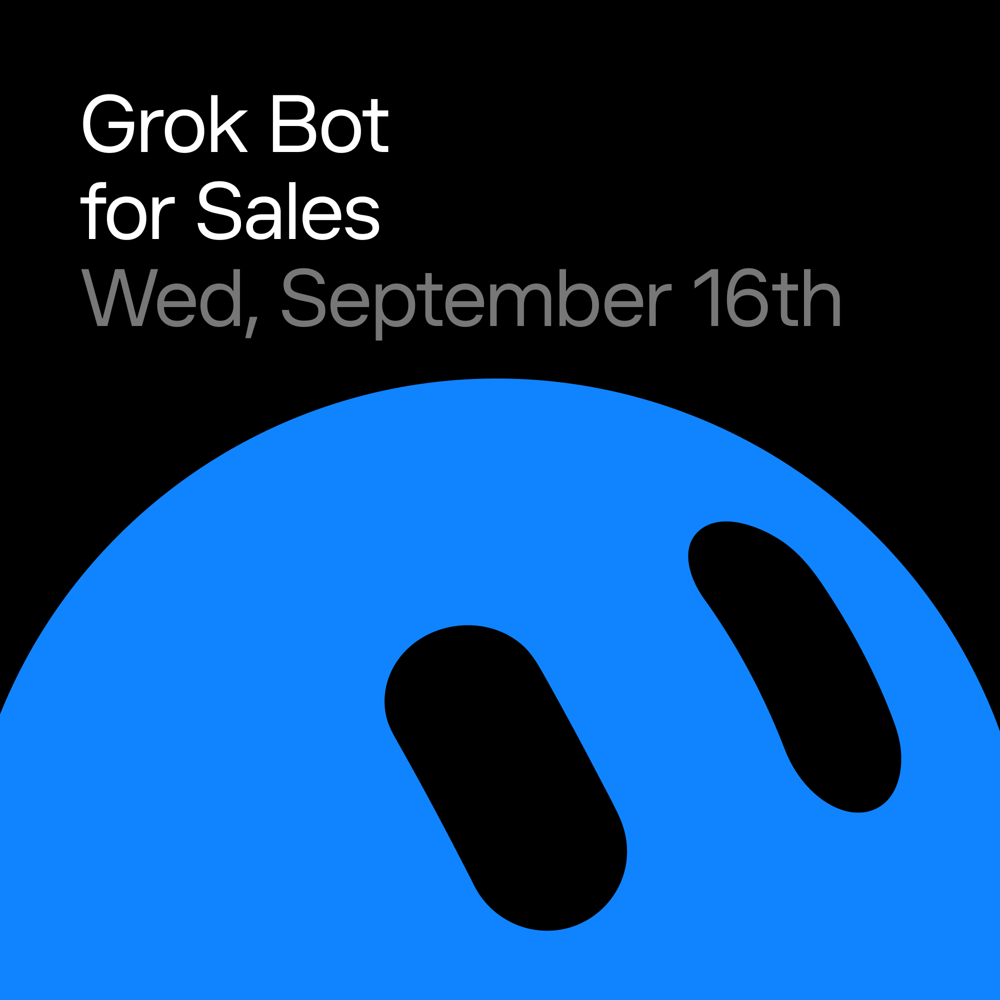</a></td><td valign="top"><strong>Grok Bot for Sales（SF）</strong> 2026-09-16（火）12:30–14:30（PDT） San Francisco, CA · The Howard SF, 661 Howard St  セールス向け公式 Grok Bot ワークショップ（The Howard／Sales Eng と SDR の間）。無料・残席約 144・承認制。  <a href="https://luma.com/spacexai-vpud"><strong>Luma で申し込む（主催者承認） →</strong></a></td></tr></table>

### アルゼンチン

<table><tr><td width="320" valign="top"></td><td valign="top"><strong>Grok Bot Meetup Bariloche</strong> 2026-09-10（木）19:00–21:30（ART） バリローチェ Av. Ezequiel Bustillo 3241  バリローチェの対面 Grok Bot。無料、残席 8。  <a href="https://luma.com/cursor-38kv"><strong>Luma で申し込む →</strong></a></td></tr></table>

<table><tr><td width="320" valign="top"></td><td valign="top"><strong>Grok Bot Meetup Buenos Aires</strong> 2026-09-16（水）18:00–20:00（ART） ブエノスアイレス · 登録後に住所を表示  ブエノスアイレスの対面 Grok Bot。無料、主催者承認、ウェイティング可、残席 100。  <a href="https://luma.com/8l9u6sns"><strong>Luma で申し込む（主催者承認） →</strong></a></td></tr></table>

<table><tr><td width="320" valign="top"></td><td valign="top"><strong>Grok Bot Meetup Mendoza</strong> 2026-10-03（土）17:00–20:00（ART） メンドーサ TIC テクノパーク、Rafael Cubillos 2100-2198  メンドーサの対面 Grok Bot。先着。  <a href="https://luma.com/cursor-mtu0"><strong>Luma で申し込む →</strong></a></td></tr></table>

<table><tr><td width="320" valign="top"><a href="https://luma.com/cursor-sh4i">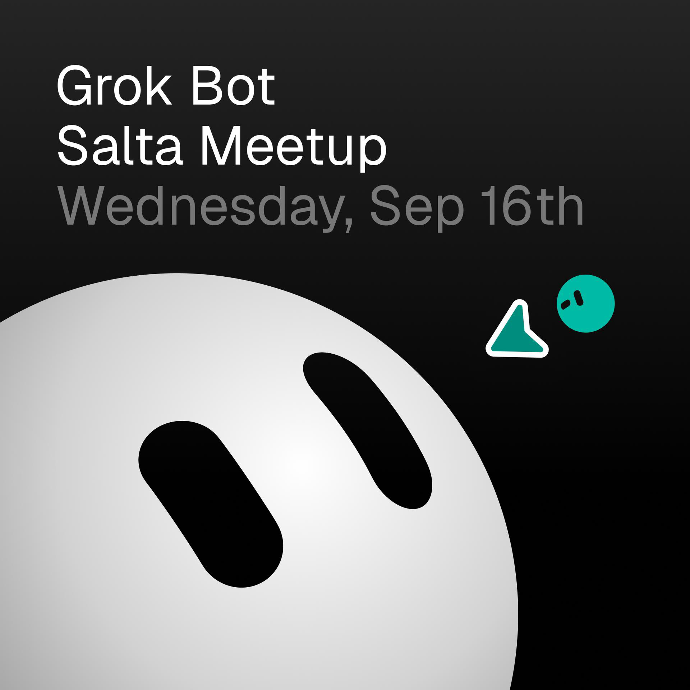</a></td><td valign="top"><strong>Grok Bot Meetup Salta</strong> 2026-09-16（水）18:00–20:00（ART） サルタ · SorboLabs, Dean Funes 244（登録後に住所）  サルタ初の Grok Bot。入門ワークショップ、実用例、Q&A、持参 PC でコーワーク。ツールにログインして仕事を仕上げて戻る。主催者承認。充電器持参。  <a href="https://luma.com/cursor-sh4i"><strong>Luma で申し込む（主催者承認） →</strong></a></td></tr></table>

### カナダ

<table><tr><td width="320" valign="top"></td><td valign="top"><strong>Grok Bot Meetup Calgary</strong> 2026-09-30（水）17:30–20:30（MDT） カルガリー · 会場は登録後に案内  カルガリーの対面 Grok Bot。無料・先着。  <a href="https://luma.com/cursor-coel"><strong>Luma で申し込む →</strong></a></td></tr></table>

<table><tr><td width="320" valign="top"></td><td valign="top"><strong>Grok Bot Meetup Victoria BC</strong> 2026-09-21（月）18:00–21:00（PDT） ビクトリア（BC）· 登録後に住所を表示  ビクトリアの Grok Bot ビルドナイト。主催者承認が必要。  <a href="https://luma.com/grokbot"><strong>Luma で申し込む（主催者承認） →</strong></a></td></tr></table>

<table><tr><td width="320" valign="top"></td><td valign="top"><strong>Grok Bot Meetup Sudbury #1</strong> 2026-09-17（木）18:00–20:00（EDT） サドベリー · 登録後に住所を表示  サドベリー初の Grok Bot。主催者承認が必要。参加者にクレジットあり。  <a href="https://luma.com/cursor-nmzu"><strong>Luma で申し込む（主催者承認） →</strong></a></td></tr></table>

<table><tr><td width="320" valign="top"><a href="https://luma.com/grok-bot-toronto">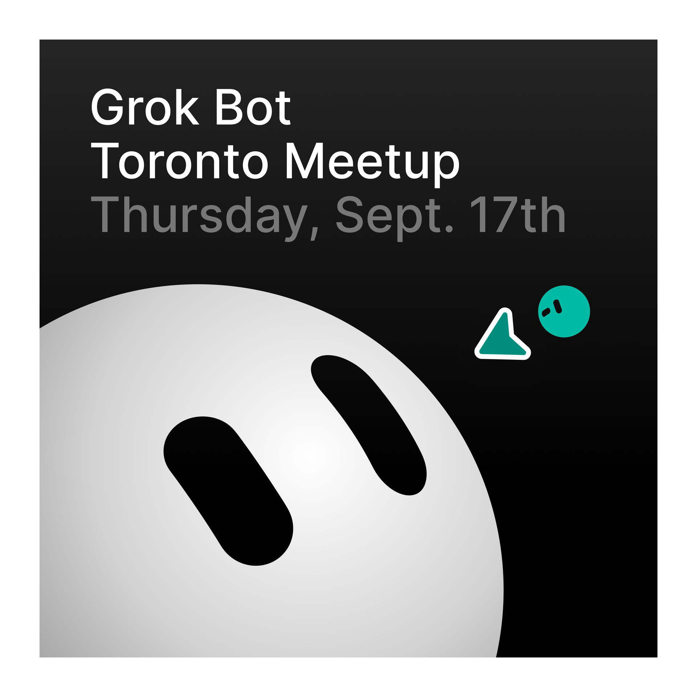</a></td><td valign="top"><strong>Grok Bot Meetup Toronto</strong> 2026-09-17（木）17:30–20:30（EDT） トロント · 会場 TBD（登録後に住所）。ノート PC 持参。18:15 閉門。  トロント初の対面 Grok Bot（Cursor Community）。アジェンダは未定。主催者承認。ノート PC 持参。  <a href="https://luma.com/grok-bot-toronto"><strong>Luma で申し込む（主催者承認） →</strong></a></td></tr></table>

### インドネシア

<table><tr><td width="320" valign="top"><a href="https://luma.com/grok-bot-tgr">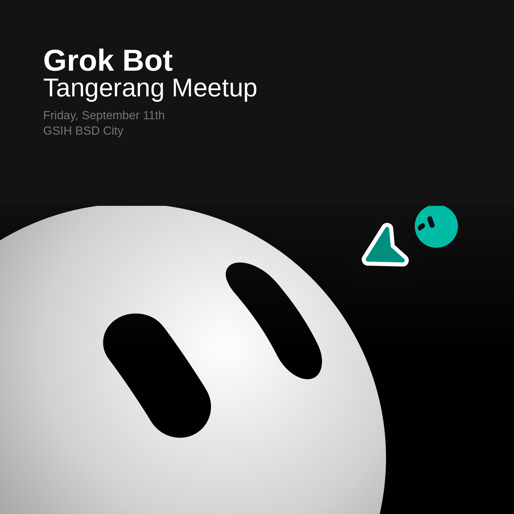</a></td><td valign="top"><strong>Grok Bot Workshop｜Tangerang</strong> 2026-09-11（金）18:00–20:30（WIB） タンゲラン · Garuda Spark Innovation Hub（BSD City）  タンゲランの Grok Bot ワークショップ。デモとハンズオン。ノート PC / iPhone、x.ai/bot 事前 DL。承認制。  <a href="https://luma.com/grok-bot-tgr"><strong>Luma で申し込む → →</strong></a></td></tr></table>

<table><tr><td width="320" valign="top"><a href="https://luma.com/bn7nfv0s">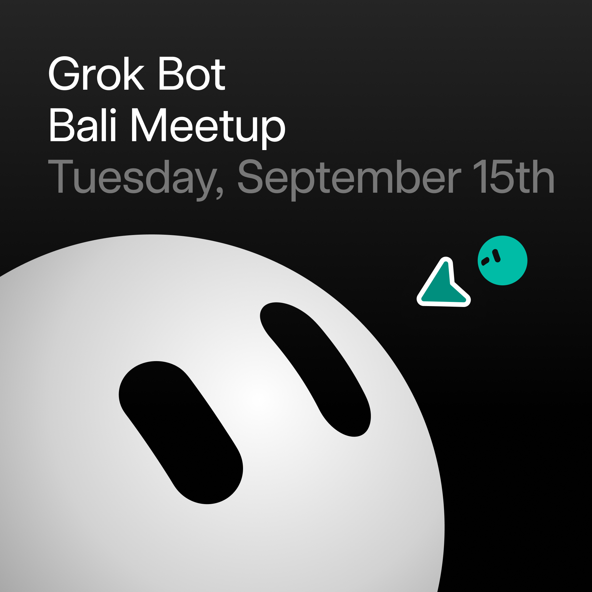</a></td><td valign="top"><strong>Grok Bot Meetup Bali</strong> 2026-09-15（月）16:00–21:00（WITA） バリ Uluwatu · BukitHub Coworking, Jl. Pura Batu Pageh No.177AA, Ungasan  Uluwatu 初の Grok Bot Meetup。体験・デモ・交流。無料 30 席・承認制（forum 170338）。  <a href="https://luma.com/bn7nfv0s"><strong>Luma で申し込む → →</strong></a></td></tr></table>

<table><tr><td width="320" valign="top"></td><td valign="top"><strong>Grokbot Workshop Bali（Udayana）</strong> 2026-10-04（日）11:00–14:00（WITA） バリ Jimbaran · Udayana University, Jl. Raya Kampus Unud  インドネシア向けキャンパス Workshop。9/15 BukitHub（bli-20260915）とは別。forum 170448・承認制。  <a href="https://luma.com/lkmh86ad"><strong>Luma で申し込む → →</strong></a></td></tr></table>

<table><tr><td width="320" valign="top"></td><td valign="top"><strong>Grok Bot Meetup Bandung</strong> 2026-09-19（土）14:00–18:00（WIB） バンドン · 登録後に住所を表示  バンドンのハンズオン（SpaceXAI）。主催 Faiz Intifada。承認制・約 60 席。会場は登録後。  <a href="https://luma.com/grokbot-bdg"><strong>Luma で申し込む（主催者承認） →</strong></a></td></tr></table>

### メキシコ

<table><tr><td width="320" valign="top"></td><td valign="top"><strong>Grok Meetup Monterrey</strong> 2026-09-10（水）18:00–21:00（Monterrey） Tec de Monterrey HUB、Av. Eugenio Garza Sada 2501 Sur  Cursor コミュニティの集まり。モンテレイ工科大ハブで Grok / Grok Bot の実例を見る。  <a href="https://luma.com/cursor-wgsj"><strong>Luma で申し込む →</strong></a></td></tr></table>

<table><tr><td width="320" valign="top"></td><td valign="top"><strong>Grok Bot Meetup Puebla</strong> 2026-09-24（木）18:00–22:00（CST） プエブラ · 登録後に住所を表示  プエブラ初の Grok Bot ミートアップ。主催者承認が必要。  <a href="https://luma.com/puebla-d4iw"><strong>Luma で申し込む（主催者承認） →</strong></a></td></tr></table>

<table><tr><td width="320" valign="top"><a href="https://luma.com/spacexai-7lje">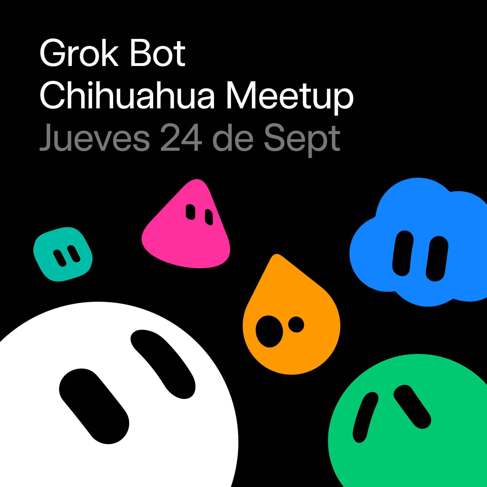</a></td><td valign="top"><strong>Grok Bot Meetup Chihuahua</strong> 2026-09-24（木）16:00–19:00（Chihuahua） Chihuahua · LivingLab CUU, Av. George Washington 3701-13  チワワ初の Grok Bot × SpaceXAI（LivingLab CUU）。主催 Alfonso Reyes。承認制・約 200 席。  <a href="https://luma.com/spacexai-7lje"><strong>Luma で申し込む（主催者承認） →</strong></a></td></tr></table>

<table><tr><td width="320" valign="top"><a href="https://luma.com/spacexai-89bf">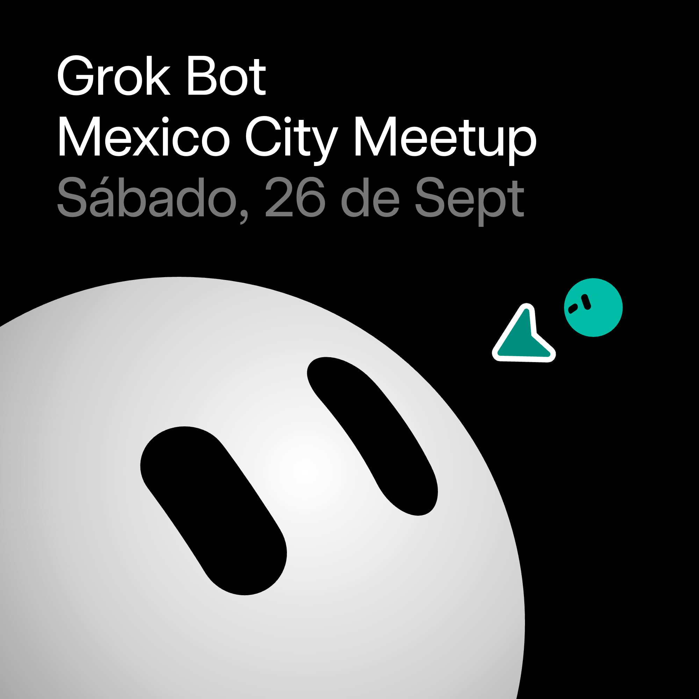</a></td><td valign="top"><strong>Grok Bot Meetup Mexico City</strong> 2026-09-26（土）09:00–13:00（CDMX） Mexico City · Sandbox Hub, Luis G. Urbina 4-dpto. 103, Polanco  CDMX 初の対面（Sandbox Hub Polanco）。主催 Javier Rivero / Ben Kim / Ricardo García。承認制・約 60 席。  <a href="https://luma.com/spacexai-89bf"><strong>Luma で申し込む（主催者承認） →</strong></a></td></tr></table>

### ブラジル

<table><tr><td width="320" valign="top"></td><td valign="top"><strong>Cursor + Grok Bot Workshop Recife</strong> 2026-09-23（水）14:00–17:30（BRT） レシフェの Hub Plural Espinheiro  レシフェのハンズオン。Cursor と Grok Bot で出荷し、Bot をエディタ横の仲間として扱う。  <a href="https://luma.com/cursor-obsw"><strong>Luma で申し込む（主催者承認） →</strong></a></td></tr></table>

<table><tr><td width="320" valign="top"></td><td valign="top"><strong>Grok Bot Curitiba Startups Meetup</strong> 2026-11-11（水）18:30–21:00（BRT） クリチバ Rua Marcos Moro 72  クリチバのスタートアップ向け。Grok Bot での作り方、創業者の知見、エージェント時代の出荷（登壇者は未定）。主催者承認が必要。  <a href="https://luma.com/cursor-dx23"><strong>Luma で申し込む（主催者承認） →</strong></a></td></tr></table>

<table><tr><td width="320" valign="top"><a href="https://luma.com/c293hlgc">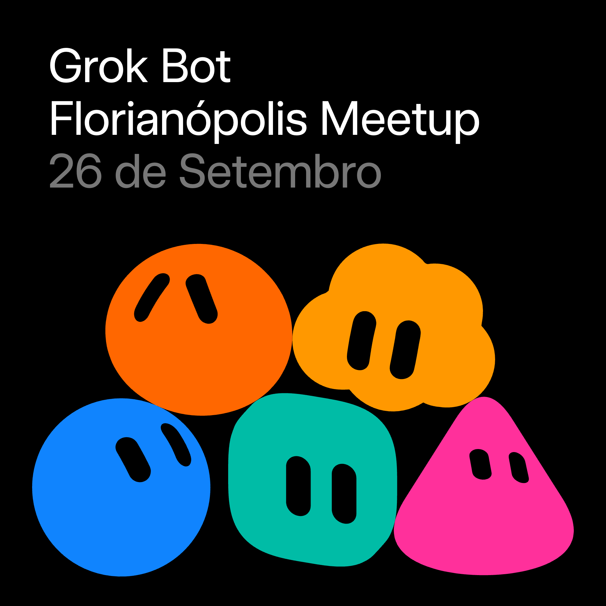</a></td><td valign="top"><strong>Grok Bot Meetup Florianópolis</strong> 2026-09-26（土）18:00–20:00（BRT） フロリアノポリス · Founder Haus - Jurerê In, Av. dos Merlins 156  フロリアノポリス初の Grok Bot Meetup。デモと交流。forum 170449・関心約 25・承認制。  <a href="https://luma.com/c293hlgc"><strong>Luma で申し込む → →</strong></a></td></tr></table>

### エクアドル

<table><tr><td width="320" valign="top"></td><td valign="top"><strong>Grok Bot Manta Workshop</strong> 2026-09-12（土）08:30–12:30（ECT） エクアドル マンタ · 登録後に住所を表示  Grok Bot で新しいエージェント開発スタックを扱うワークショップ。無料、ウェイティング可、残席 41。  <a href="https://luma.com/grokbot-manta"><strong>Luma で申し込む →</strong></a></td></tr></table>

<table><tr><td width="320" valign="top"></td><td valign="top"><strong>Grok Bot Meetup Quito</strong> 2026-09-24（木）19:30–21:30（ECT） キト · 登録後に住所を表示  キトの対面 Grok Bot。無料、主催者承認、残席 47。  <a href="https://luma.com/grokbotquitomeetup"><strong>Luma で申し込む（主催者承認） →</strong></a></td></tr></table>

<table><tr><td width="320" valign="top"></td><td valign="top"><strong>Grok Bot Meetup Cumbayá</strong> 2026-10-03（土）09:30–12:00（ECT） キト近郊 Cumbayá  キト近郊 Cumbayá の対面 Grok Bot。無料、ウェイティング可、残席 37。  <a href="https://luma.com/cccumbaya"><strong>Luma で申し込む →</strong></a></td></tr></table>

### 日本

<table><tr><td width="320" valign="top"></td><td valign="top"><strong>Grok Bot Meetup 札幌 #2</strong> 2026-10-02（金）19:00–22:00（JST） 札幌 · 登録後に住所を表示  札幌 2 回目の Grok Bot ミートアップ。無料、主催者承認。  <a href="https://luma.com/91kju0je"><strong>Luma で申し込む（主催者承認） →</strong></a></td></tr></table>

<table><tr><td width="320" valign="top"></td><td valign="top"><strong>Grok Bot Meetup 東京</strong> 2026-09-09（水）19:00–21:30（JST） 港区三田 ログラス / 国際興業三田第2ビル 9F  東京の対面 Grok Bot。先着。  <a href="https://luma.com/grokbottokyo"><strong>Luma で申し込む →</strong></a></td></tr></table>

<table><tr><td width="320" valign="top"></td><td valign="top"><strong>Grok Bot Meetup 大阪</strong> 2026-09-17（木）19:00–21:30（JST） 大阪市北区梅田 North Gate Building  大阪の対面 Grok Bot。主催者承認が必要。  <a href="https://luma.com/grokbotosaka"><strong>Luma で申し込む（主催者承認） →</strong></a></td></tr></table>

### グアテマラ

<table><tr><td width="320" valign="top"></td><td valign="top"><strong>Grok Bot Meetup Guatemala (Xela)</strong> 2026-09-20（日）09:00–15:00（CST） ケツァルテナンゴの Universidad Mesoamericana  ケツァルテナンゴ終日。マヤ語、農村・農業、中小企業、医療・教育のトラックで Grok Bot の試作。  <a href="https://luma.com/cursor-kfex"><strong>Luma で申し込む（主催者承認） →</strong></a></td></tr></table>

<table><tr><td width="320" valign="top"><a href="https://luma.com/cursor-is2h">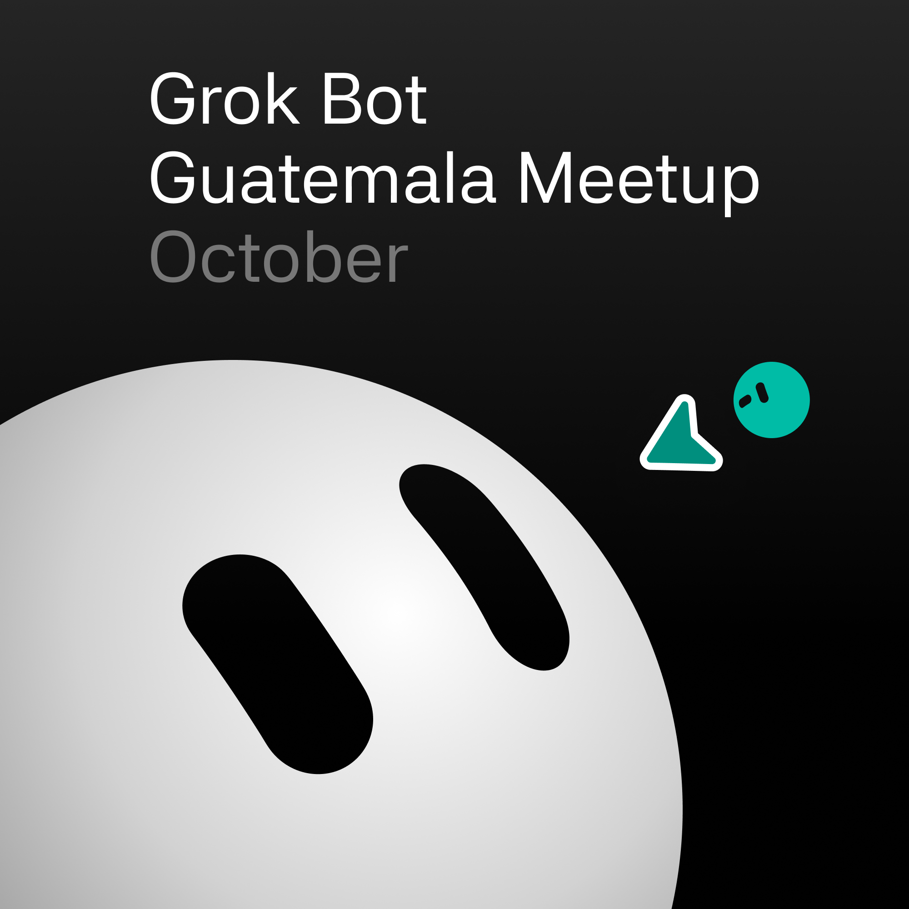</a></td><td valign="top"><strong>Grok Bot Meetup グアテマラシティ</strong> 2026-10-03（土）10:00–14:00（CST） グアテマラシティ Zona 10 フランシスコ・マロキン大学 · 登録後に住所を表示  Open2 主催のグアテマラシティ Grok Bot ミートアップ。単発タスクを超える指示・文脈・一気通貫フローと試用クレジット（約 36 going、主催者承認）。  <a href="https://luma.com/cursor-is2h"><strong>Luma で申し込む（主催者承認） →</strong></a></td></tr></table>

### インド

<table><tr><td width="320" valign="top"></td><td valign="top"><strong>Grok Bot Meetup Vadodara</strong> 2026-09-05（土）10:00–13:00（IST） ヴァドーダラー · 登録後に住所を表示  ヴァドーダラーの対面 Grok Bot。主催者承認が必要。  <a href="https://luma.com/grokbot-vad-1"><strong>Luma で申し込む（主催者承認） →</strong></a></td></tr></table>

<table><tr><td width="320" valign="top"><a href="https://luma.com/hc0xjkw3">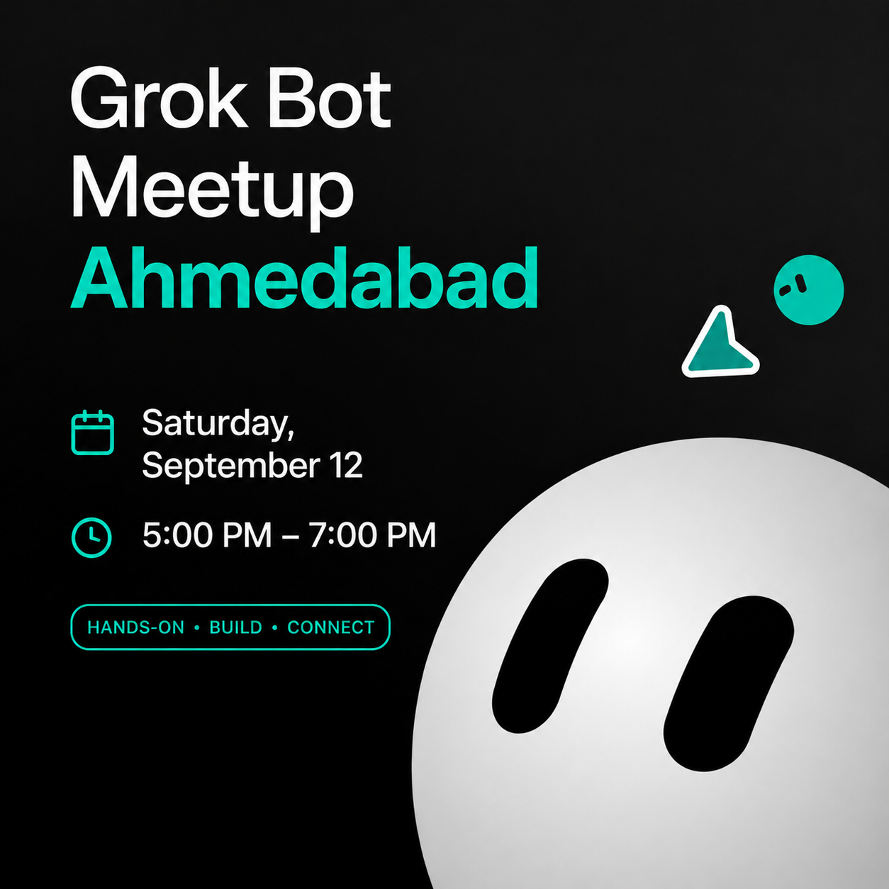</a></td><td valign="top"><strong>Grok Bot Meetup Ahmedabad</strong> 2026-09-12（土）17:00–19:00（IST） Ahmedabad, India · 会場 TBA  Ahmedabad のハンズオン。Grok Bot を実ツールと使う AI チームメイト体験。無料・残席約 29・承認制（Aakash）。  <a href="https://luma.com/hc0xjkw3"><strong>Luma で申し込む → →</strong></a></td></tr></table>

### オランダ

<table><tr><td width="320" valign="top"></td><td valign="top"><strong>Grok Bot Meetup Utrecht</strong> 2026-10-29（木）19:00–21:30（CET） ユトレヒト · 登録後に住所を表示  ユトレヒト 2 回目の Grok Bot コミュニティ集会。主催者承認が必要。  <a href="https://luma.com/cfk3aokj"><strong>Luma で申し込む（主催者承認） →</strong></a></td></tr></table>

<table><tr><td width="320" valign="top"><a href="https://luma.com/grok-bot-amsterdam">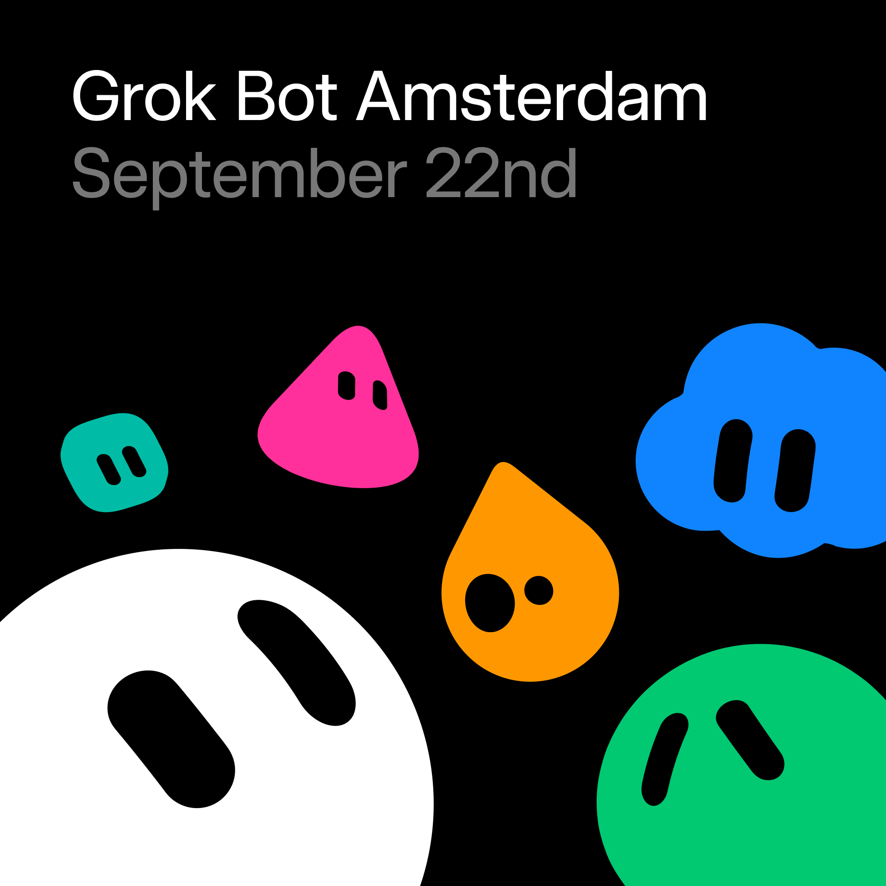</a></td><td valign="top"><strong>Grok Bot Meetup Amsterdam</strong> 2026-09-22（火）18:00–21:00（CEST） アムステルダム · 会場 TBD（Luma / 登録後に住所）  アムステルダム初の Grok Bot。夕方コーワークと地元パワーユーザーデモ、ノート PC 持参でクレジット。無料登録。  <a href="https://luma.com/grok-bot-amsterdam"><strong>Luma で申し込む → →</strong></a></td></tr></table>

### ペルー

<table><tr><td width="320" valign="top"></td><td valign="top"><strong>Grok Bot Arequipa Build Night</strong> 2026-09-11（金）19:00–23:00（PET） アレキパ サンタマリア・カトリック大学（Yanahuara / Umacollo）  アレキパの Grok Bot ビルドナイト。無料、主催者承認、ウェイティング可、残席 42。  <a href="https://luma.com/vcow8a4c"><strong>Luma で申し込む（主催者承認） →</strong></a></td></tr></table>

<table><tr><td width="320" valign="top"></td><td valign="top"><strong>Grok Bot Lima Build Night</strong> 2026-09-11（金）19:00–23:00（PET） リマ ペルー・カトリック大学（San Miguel）  リマの Grok Bot ビルドナイト。無料、主催者承認、ウェイティング可、残席 36。  <a href="https://luma.com/ybo7udvo"><strong>Luma で申し込む（主催者承認） →</strong></a></td></tr></table>

### フィリピン

<table><tr><td width="320" valign="top"></td><td valign="top"><strong>Grok Bot Meetup Manila</strong> 2026-09-04（金）17:00–21:00（PHT） マニラ Pasig / Ortigas · 登録後に住所を表示  Cursor Manila の対面 Grok Bot ナイト。無料・先着、残席 282。  <a href="https://luma.com/grok-bot-manila-01"><strong>Luma で申し込む →</strong></a></td></tr></table>

<table><tr><td width="320" valign="top"></td><td valign="top"><strong>Grok Bot Meetup Cebu</strong> 2026-09-19（土）09:00–11:30（PHT） セブ · 登録後に住所を表示  セブの対面 Grok Bot。主催者承認が必要。  <a href="https://luma.com/cursor-dyb8"><strong>Luma で申し込む（主催者承認） →</strong></a></td></tr></table>

### アルバニア

<table><tr><td width="320" valign="top"></td><td valign="top"><strong>Grok Bot Meetup Tirana</strong> 2026-09-17（木）18:30–20:00（CEST） ティラナ · 登録後に住所を表示  ティラナの 9 月 Grok Bot / Cursor ミートアップ。主催者承認が必要。  <a href="https://luma.com/cursor-ibxj"><strong>Luma で申し込む（主催者承認） →</strong></a></td></tr></table>

### オーストラリア

<table><tr><td width="320" valign="top"></td><td valign="top"><strong>Grok Bot Meetup Sydney</strong> 2026-10-07（水）17:30–21:00（AEDT） シドニー · 登録後に住所を表示  8 月開催の次、公式 Cursor Sydney の Grok Bot ナイト。主催者承認が必要。  <a href="https://luma.com/cursor-d70v"><strong>Luma で申し込む（主催者承認） →</strong></a></td></tr></table>

### ベルギー

<table><tr><td width="320" valign="top"><a href="https://luma.com/spacexai-leuven-meetup">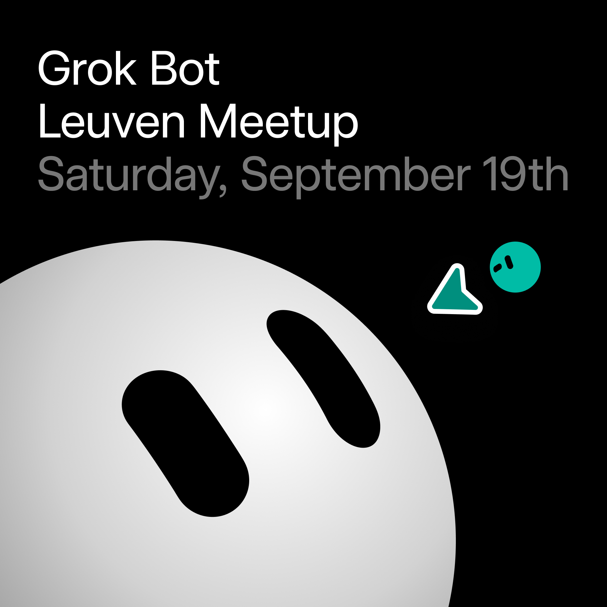</a></td><td valign="top"><strong>Grok Bot Meetup Leuven</strong> 2026-09-19（土）14:00–17:30（CEST） ルーヴェン · Blijde Inkomststraat 22  ベルギー初の Grok Bot Meetup。デモと交流。forum 170453・承認制。  <a href="https://luma.com/spacexai-leuven-meetup"><strong>Luma で申し込む → →</strong></a></td></tr></table>

### カメルーン

<table><tr><td width="320" valign="top"></td><td valign="top"><strong>Grok Bot Meetup Yaoundé</strong> 2026-09-10（木）11:30–15:00（WAT） ヤウンデ · 登録後に住所を表示  ヤウンデの対面 Grok Bot。主催者承認が必要。  <a href="https://luma.com/cursor-90pj"><strong>Luma で申し込む（主催者承認） →</strong></a></td></tr></table>

### コロンビア

<table><tr><td width="320" valign="top"><a href="https://luma.com/grokbot-meetup-cartago">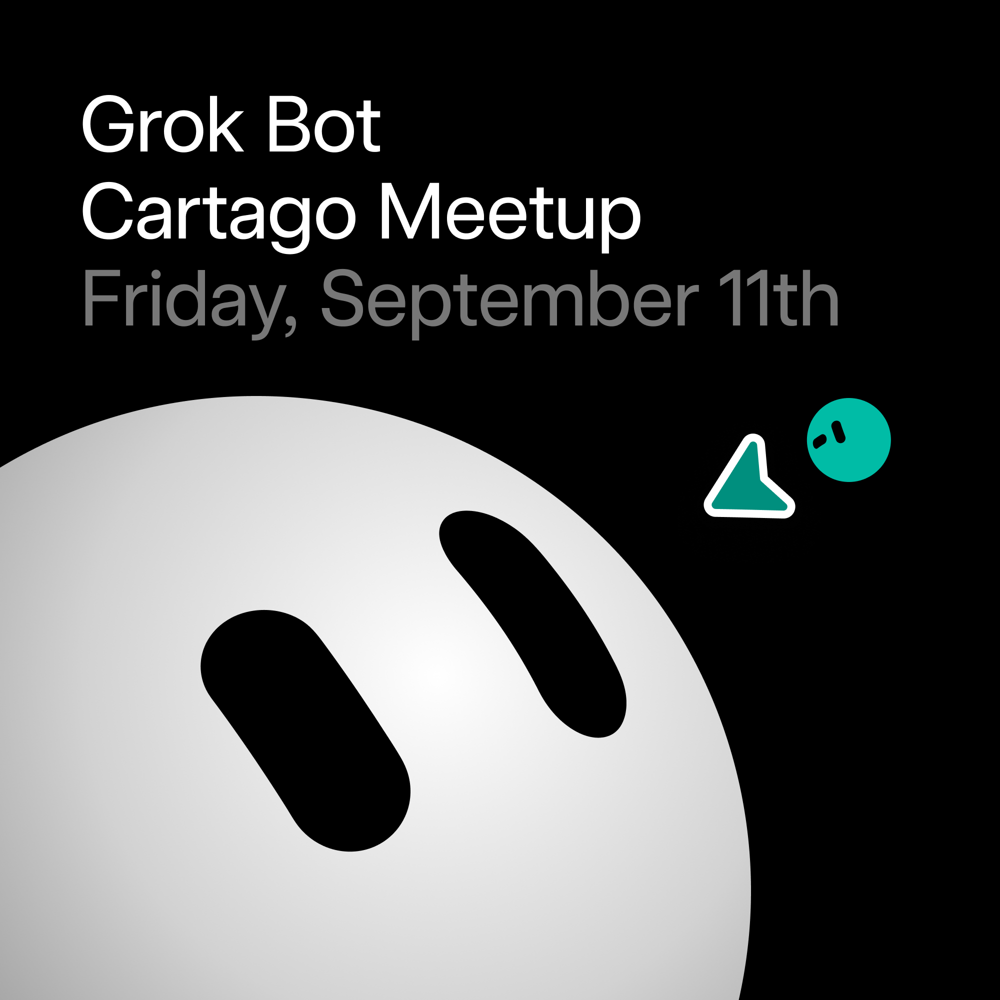</a></td><td valign="top"><strong>Grok Bot Meetup Cartago</strong> 2026-09-11（金）14:00–18:00（COT） コロンビア Cartago · Cámara de Comercio, Cra. 4 # 12-101  Cartago のオフライン。Cursor / SpaceXAI と Grok Bot の実例、スピーカー 5 名。商工会議所。  <a href="https://luma.com/grokbot-meetup-cartago"><strong>Luma で申し込む → →</strong></a></td></tr></table>

### ドイツ

<table><tr><td width="320" valign="top"><a href="https://luma.com/grok-bot-freiburg">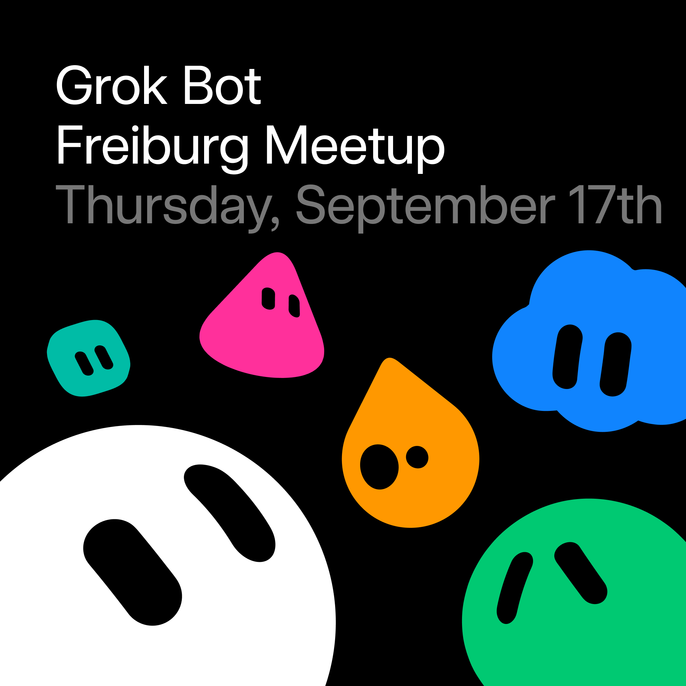</a></td><td valign="top"><strong>Grok Bot Meetup Freiburg</strong> 2026-09-17（木）18:00–21:00（CEST） Freiburg im Breisgau · Stefan-Meier-Straße 8  フライブルク初の対面。製品体験と交流。主催 Aniruth / Foundersclub Freiburg。承認制・約 57 席。  <a href="https://luma.com/grok-bot-freiburg"><strong>Luma で申し込む（主催者承認） →</strong></a></td></tr></table>

### デンマーク

<table><tr><td width="320" valign="top"></td><td valign="top"><strong>Grok Bot Meetup Copenhagen</strong> 2026-09-09（水）17:00–20:00（CEST） コペンハーゲン · Trustpilot A/S, Pilestræde 58  コペンハーゲン初の Grok Bot ミートアップ。主催者承認が必要。  <a href="https://luma.com/cursor-t9m9"><strong>Luma で申し込む（主催者承認） →</strong></a></td></tr></table>

### イギリス

<table><tr><td width="320" valign="top"></td><td valign="top"><strong>Grok Bot Meetup London</strong> 2026-09-16（水）18:00–21:00（BST） ロンドン · Granola 主催（登録後に住所）  ロンドン初の Grok Bot。夕方コーワークと地元パワーユーザーデモ（SpaceXAI フィールドエンジニア）、ノート PC とクレジット。無料登録。  <a href="https://luma.com/grok-bot-london"><strong>Luma で申し込む → →</strong></a></td></tr></table>

### イスラエル

<table><tr><td width="320" valign="top"></td><td valign="top"><strong>Grok Bot Meetup Tel Aviv</strong> 2026-09-08（月）18:00–20:00（IDT） テルアビブ · Sarona（登録後に住所）  テルアビブ初の Grok Bot ミートアップ。実作業を任せる AI チームメイト。  <a href="https://luma.com/cursor-qdl0"><strong>Luma で申し込む →</strong></a></td></tr></table>

### ケニア

<table><tr><td width="320" valign="top"></td><td valign="top"><strong>Grok Bot Meetup Nairobi</strong> 2026-09-17（木）15:30–18:00（EAT） ナイロビ · 会場は登録後に案内  ナイロビのハンズオン Grok Bot。無料、主催者承認、残席 60。  <a href="https://luma.com/cursor-0yk6"><strong>Luma で申し込む（主催者承認） →</strong></a></td></tr></table>

### ミャンマー

<table><tr><td width="320" valign="top"></td><td valign="top"><strong>Grok Bot Yangon Workshop @ ACY</strong> 2026-09-26（土）13:30–17:00（MMT） ヤンゴン American Center Yangon  ヤンゴン American Center での Grok Bot ハンズオン。主催者承認が必要。  <a href="https://luma.com/cursor-qu3x"><strong>Luma で申し込む（主催者承認） →</strong></a></td></tr></table>

### マルタ

<table><tr><td width="320" valign="top"></td><td valign="top"><strong>Grok Bot Meetup Malta</strong> 2026-09-17（木）18:00–21:00（CEST） マルタ Ta' Xbiex · Coffee Circus Porto, 149 Triq D'Argens  マルタ初の SpaceXAI Grok Bot Meetup。デモ、Bot/エージェント体験、交流。無料、残席約 31。  <a href="https://luma.com/grok-bot-malta"><strong>Luma で申し込む → →</strong></a></td></tr></table>

### マレーシア

<table><tr><td width="320" valign="top"></td><td valign="top"><strong>Grok Bot Meetup Kuala Lumpur</strong> 2026-09-19（土）18:00–20:00（MYT） クアラルンプール · 登録後に住所を表示  クアラルンプールの対面 Grok Bot。無料、主催者承認、ウェイティング可、残席 99。  <a href="https://luma.com/grok-bot"><strong>Luma で申し込む（主催者承認） →</strong></a></td></tr></table>

### ポルトガル

<table><tr><td width="320" valign="top"></td><td valign="top"><strong>Grok Bot Meetup Porto</strong> 2026-09-09（水）17:30–20:00（WEST） ポルト · The Social Hub Porto, Praça de Dom João I 80  ポルト公式 Grok Bot Meetup。ビルダー向け対面。Luma 承認制（関心約 19）。  <a href="https://luma.com/wpvpza3f"><strong>Luma で申し込む → →</strong></a></td></tr></table>

### シンガポール

<table><tr><td width="320" valign="top"><a href="https://luma.com/grokbotsg">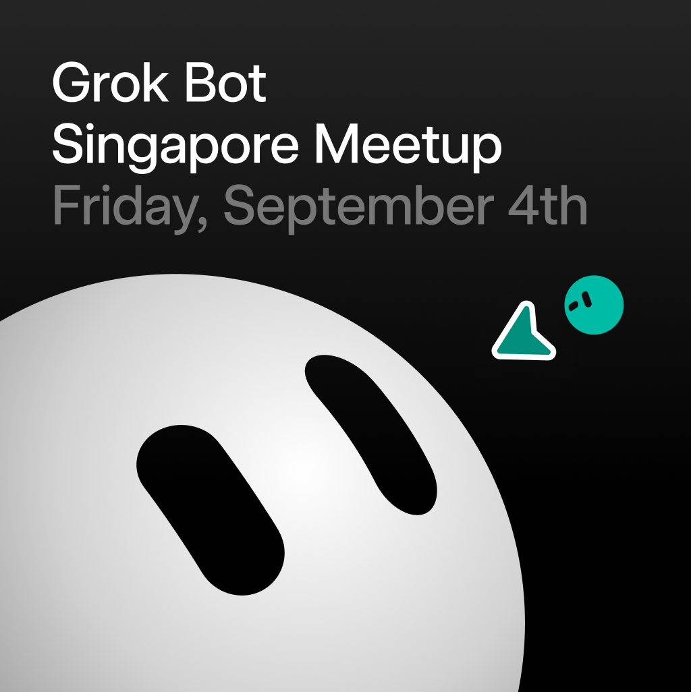</a></td><td valign="top"><strong>Grok Bot Meetup Singapore</strong> 2026-09-04（金）18:00–21:00（SGT） シンガポール川 SGInnovate · 登録後に住所を表示  シンガポール初の Grok Bot オフライン。クラウドパソコン仲間の実演、ワークフロー共有、その場でクレジット試用（ノートでもスマホでも可）。SpaceX ファミリーのサプライズゲストあり。主催者承認、SGInnovate 共催。  <a href="https://luma.com/grokbotsg"><strong>Luma で申し込む（主催者承認） →</strong></a></td></tr></table>

### エルサルバドル

<table><tr><td width="320" valign="top"><a href="https://luma.com/bot">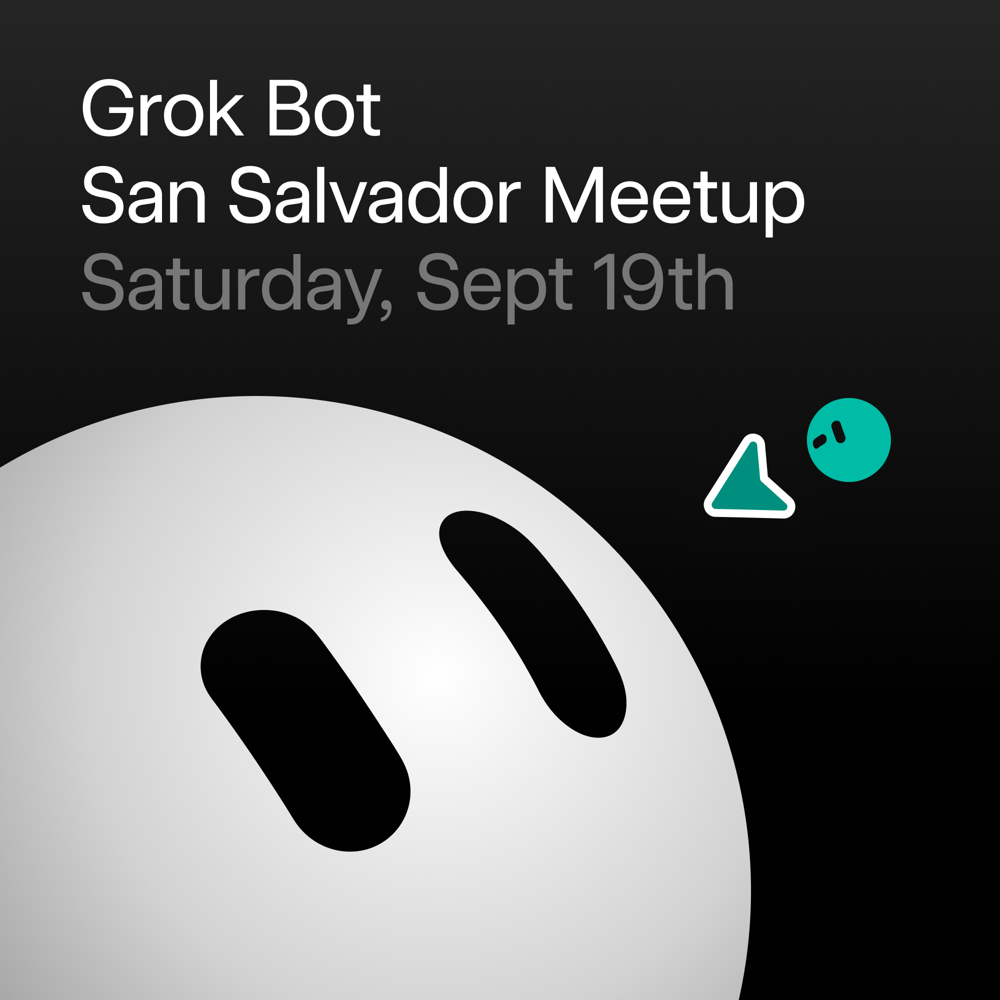</a></td><td valign="top"><strong>Grok Bot Meetup サンサルバドル</strong> 2026-09-19（土）15:00–19:00（El Salvador） サンサルバドル · 住所 TBD（登録後に表示）  Ai Labs 主催のサンサルバドル Grok Bot ミートアップ。単発タスクを超える指示・文脈・一気通貫フローを探る（約 50 going）。  <a href="https://luma.com/bot"><strong>Luma で申し込む →</strong></a></td></tr></table>

### トーゴ

<table><tr><td width="320" valign="top"></td><td valign="top"><strong>Grok Bot Meetup Lomé</strong> 2026-09-12（土）09:00–13:00（GMT） ロメ トーゴ・フランス学院  ロメの対面 Grok Bot。無料、ウェイティング可、残席 198。  <a href="https://luma.com/cursor-ec8v"><strong>Luma で申し込む →</strong></a></td></tr></table>
