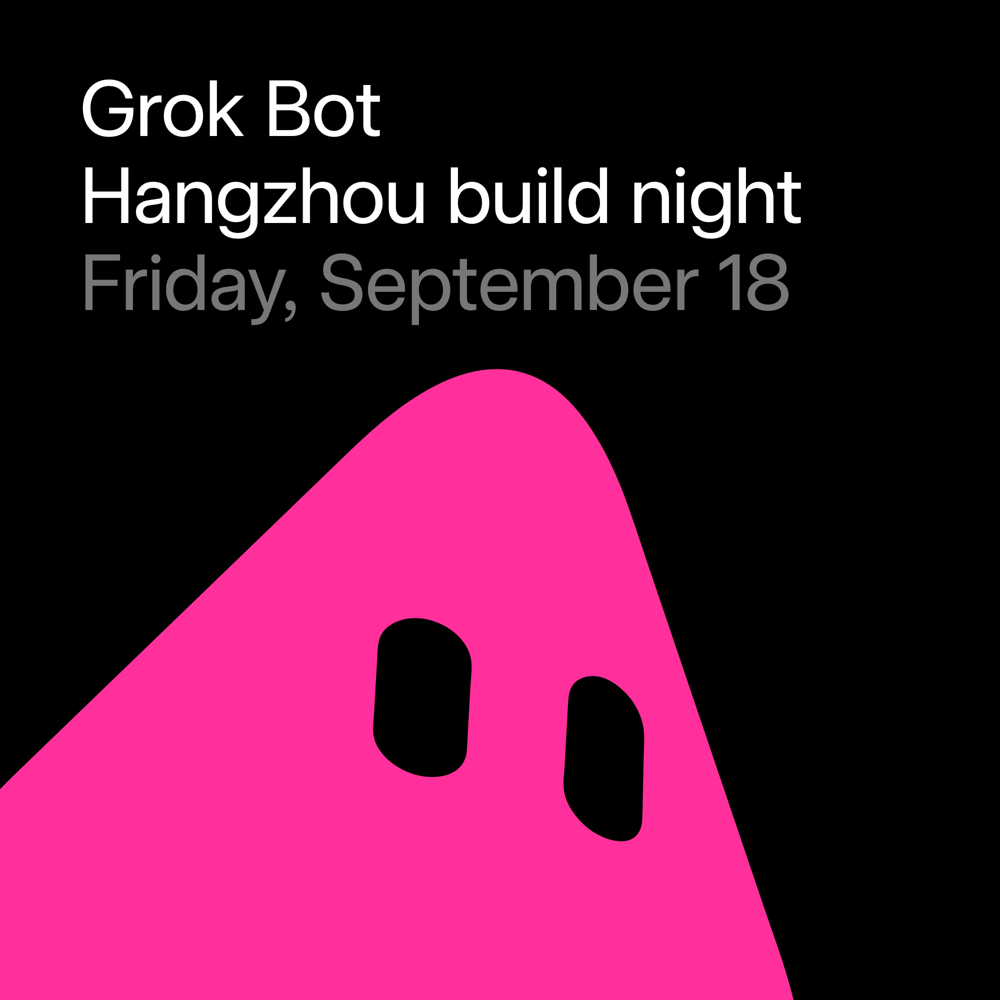

# イベント

<a href="./EVENTS.md"><strong>EN</strong></a> · <a href="./EVENTS.zh.md"><strong>中文</strong></a> · <strong>日本語</strong>

ポスター、会場、申し込み。README は国ごとに都市を並べ、名前を押すとこのページの該当イベントへ飛びます。

[一覧に戻る](./README.ja.md)

### 中国

<table><tr><td width="320" valign="top"></td><td valign="top"><strong>Grok Bot Meetup Shanghai</strong> 2026-10-18（日）14:00–18:30（CST） 上海 · 登録後に住所を表示  上海の対面 Grok Bot。アイスブレイクと Workshop。承認制。forum 170454。Luma API 時刻は誤り気味 → 14:00–17:00 +08 を採用。  <a href="https://luma.com/spacexai-kh2x"><strong>Luma で申し込む → →</strong></a></td></tr></table>

<table><tr><td width="320" valign="top"></td><td valign="top"><strong>Grok Bot Meetup Hangzhou</strong> 2026-09-19（土）14:00–17:30（GMT+8） 杭州 · 登録後に住所を表示  SpaceXAI 杭州の対面。公式挨拶・事例共有・オープンマイク・交流。承認制。会場は登録後。  <a href="https://luma.com/gb05xpbc"><strong>Luma で申し込む（主催者承認） →</strong></a></td></tr></table>

<table><tr><td width="320" valign="top"></td><td valign="top"><strong>Grok Bot Meetup Beijing</strong> 2026-09-19（土）14:00–18:00（GMT+8） 北京 · 登録後に住所を表示  SpaceXAI 北京の対面（主催 Yafang）。紹介と事例共有。承認制・約 150 席。会場は登録後。  <a href="https://luma.com/spacexai-chwk"><strong>Luma で申し込む（主催者承認） →</strong></a></td></tr></table>

<table><tr><td width="320" valign="top"></td><td valign="top"><strong>Grok Bot Meetup Wuhan</strong> 2026-10-17（土）14:00–17:30（Asia/Shanghai） 武漢（会場未定・確定後に Luma で更新）  武漢の Grok Bot ミートアップ。アイスブレイク＋シェア／ワークショップ。SpaceXAI 製品説明（ツールにログインし成果を持ち帰る AI チームメイト）。事前登録・承認制、承認後に WeChat グループ。登壇／ボランティア歓迎。主催 Hanbing Zhang、chenchong、yuepu。無料・約150席。同日の sha-20261017 上海とは別開催。  <a href="https://luma.com/kss59f4e"><strong>Luma で申し込む（主催者承認） →</strong></a></td></tr></table>

<table><tr><td width="320" valign="top"></td><td valign="top"><strong>Grok Bot 珠海ミートアップ</strong> 2026-09-20（日）15:00–17:00（Asia/Hong_Kong、HKT、UTC+8） 珠海 · Skyline Incubator（星匯創孵中心）、香洲区跨境二路33号 星匯中心25階  SpaceXAI for Macau コミュニティの珠海 Grok Bot ミートアップ（主催 John Ku / Skyline Incubator）。講義でもワークショップでもなく、Grok Bot の使い方や AI プロジェクトを気軽に共有。無料・人数限定・スキャン時 1 名。日英中の案内あり。  <a href="https://luma.com/spacexai-zhuhai-meetup-sep-20"><strong>Luma で申し込む → →</strong></a></td></tr></table>

<table><tr><td width="320" valign="top"></td><td valign="top"><strong>Grok Bot 杭州ビルドナイト</strong> 2026-09-18（金） 19:00–22:00（Asia/Shanghai、UTC+8） 中国・杭州（オフライン；Luma 上は秘匿、RSVP 後に案内）  杭州 Grok Bot ビルドナイト（SpaceXAI Ambassador Mai Yang）。翌日の hzo-20260919 とは別。約 19:00–22:00：紹介・デモ・Q&A・ビルド・クレジット。無料・承認制（残 20）。新 slug wpzawz6x；フォーラム投稿なし。  <a href="https://luma.com/wpzawz6x"><strong>Luma で登録 → →</strong></a></td></tr></table>

### アメリカ

<table><tr><td width="320" valign="top"></td><td valign="top"><strong>Grok Bot Meetup Pittsburgh</strong> 2026-10-13（火）18:30–20:30（EDT） ピッツバーグ · Oakland / Lawrenceville（登録後に住所を表示）  ピッツバーグ初のシティ向け対面ミートアップ（キャンパス限定ではない）。短いデモの後にビルド／セットアップ共有。学生・社会人歓迎。主催 Micah Smith。無料・先着約30席。  <a href="https://luma.com/6lx5t8ru"><strong>Luma で申し込む →</strong></a></td></tr></table>

<table><tr><td width="320" valign="top"></td><td valign="top"><strong>Cursor + Grok Bot Dallas Meetup</strong> 2026-09-19（土）10:30–14:30（CDT） ダラス · Kiln Preston Hollow（9850 N Central Expy #230）  ダラス初の Grok Bot ミートアップ。短いトーク／デモの後にビルド。ノートPC推奨（x.ai/bot）。Cursor と SpaceXAI API クレジット（音声／チャット／画像／動画）先着。会場 Kiln Preston Hollow（North Dallas、無料駐車）。主催 Pradipta Shrestha、Sebastian Mendo、Tyler Vea。無料・承認制・約60席（スキャン時約33名）。  <a href="https://luma.com/cursor-ym79"><strong>Luma で申し込む（主催者承認） →</strong></a></td></tr></table>

<table><tr><td width="320" valign="top"></td><td valign="top"><strong>Grok Bot Miami Kickoff</strong> 2026-09-23（水）18:30–21:30（America/New_York、EDT） マイアミ · The DOCK、400 NW 26th St（Wynwood）  SpaceXAI for Miami（旧 Cursor Community Miami）初の Grok Bot Kickoff。ライブデモ・ビルダー交流、AIエージェント実践の第一歩。アジェンダは後日。ノートPC歓迎。会場 The DOCK（Wynwood）。主催 Ben Milshtein & The LAB Miami。無料・手動承認。スキャン時 0 名。  <a href="https://luma.com/spacexai-kxjz"><strong>申し込む →</strong></a></td></tr></table>

<table><tr><td width="320" valign="top"></td><td valign="top"><strong>Grok Bot Meetup Atlanta</strong> 2026-09-24（木）18:00–20:00（America/New_York、EDT） アトランタ都市圏 Alpharetta · Tech North Atlanta、925 North Point Pkwy Ste 130  SpaceXAI for Atlanta のイントロMeetup。退勤後デモ中心：Grok Bot概要・ウォークスルー・ライブデモ・Q&A／オープンマイク・飲食・無料駐車。主催 Raj Poloju & Sreyas Gentela。無料・承認不要。ノートPC任意。スキャン時 0 名。Forum 171336。  <a href="https://luma.com/ihgtq394"><strong>Luma で申し込む → →</strong></a></td></tr></table>

<table><tr><td width="320" valign="top"></td><td valign="top"><strong>Grok Bot Meetup Philadelphia</strong> 2026-09-29（火）18:00–20:30（America/New_York、EDT、UTC−4） フィラデルフィア · Indy Hall Clubhouse、709 N 2nd St 3rd Floor  SpaceXAI for Philadelphia 初の Grok Bot Meetup（主催 Luis Cielak / Malcolm Jones）。マルチエージェント共有・Think–Pair–Share・飲食・Free Grok credits。無料・承認不要・スキャン時 49 名。会場 Indy Hall。隔夜リネーム：9/12 夕は “Cursor Meetup Philadelphia — September”（未提案の Cursor 枠）→ 現在は Grok Bot Meetup。期限切れの campus 枠 phl-20260903 / tmp-20260903 とは別。  <a href="https://luma.com/cursor-hdle"><strong>Luma で申し込む →</strong></a></td></tr></table>

<table><tr><td width="320" valign="top"></td><td valign="top"><strong>Grok Bot for Design build night (LA)</strong> 2026-09-22（火）17:00–20:30（America/Los_Angeles、PDT、UTC−7） ロサンゼルス · 会場 TBA（オフライン）  SpaceXAI Community の Design 向けビルドナイト（主催 Sunita Rao；forum 171544）。17:00–20:30。オフライン無料。ローカル日 9/22（UTC 開始 9/23 00:00）。slug grokbotdesign-la（= spacexai-o5ji）。  <a href="https://luma.com/grokbotdesign-la"><strong>Luma で申し込む → →</strong></a></td></tr></table>

<table><tr><td width="320" valign="top"></td><td valign="top"><strong>Grok Bot for Engineering build night (Seattle)</strong> 2026-09-24（木）17:00–20:30（America/Los_Angeles、PDT、UTC−7） シアトル · 会場 TBA（オフライン）  SpaceXAI Community の Engineering 向けビルドナイト（主催 Sunita Rao；forum 171546）。太平洋時間 17:00–20:30。オフライン無料。ローカル日 9/24。slug grokbotengineering-seattle（= spacexai-xn5j）。  <a href="https://luma.com/grokbotengineering-seattle"><strong>Luma で申し込む → →</strong></a></td></tr></table>

<table><tr><td width="320" valign="top"></td><td valign="top"><strong>Grok Bot for Product build night (SF)</strong> 2026-09-29（火）17:00–20:30（America/Los_Angeles、PDT、UTC−7） サンフランシスコ · 会場 TBA（オフライン）  SpaceXAI Community の Product 向けビルドナイト（主催 Sunita Rao；forum 171547）。Howard の sfpm-20260915（9/15）とは別。17:00–20:30。ローカル日 9/29。slug grokbotproduct-sf（= spacexai-81pf）。  <a href="https://luma.com/grokbotproduct-sf"><strong>Luma で申し込む → →</strong></a></td></tr></table>

<table><tr><td width="320" valign="top"></td><td valign="top"><strong>Grok Bot build night for Recruiting (Chicago)</strong> 2026-09-30（水）17:00–20:30（America/Chicago、CDT、UTC−5） シカゴ · 会場 TBA（オフライン）  SpaceXAI Community の Recruiting 向けビルドナイト（主催 Sunita Rao；forum 171548）。シカゴ時間 17:00–20:30。オフライン無料。初のシカゴ枠。slug grokbotrecruiting-chicago（= spacexai-k0po）。  <a href="https://luma.com/grokbotrecruiting-chicago"><strong>Luma で申し込む → →</strong></a></td></tr></table>

<table><tr><td width="320" valign="top"></td><td valign="top"><strong>Grok Bot Meetup グリーンビル</strong> 2026-10-08（木）18:00–20:00（America/New_York、ET、UTC−4） サウスカロライナ州グリーンビル（会場未定）（オフライン；ソフト定員 50–75、ウェイティングあり）  グリーンビル初のカタログ掲載 Grok Bot ミートアップ（主催 Brad Shannon；個人 Luma カレンダー）。アジェンダ：入場〜紹介〜ライブデモ〜Q&A〜ビルド。ノートPC持参、https://x.ai/bot を事前DL推奨。無料RSVP（スキャン時残り約66、guest_count 9）。会場は後日更新。新 discover slug utdchtxv；フォーラムの New event 投稿はまだなし。  <a href="https://luma.com/utdchtxv"><strong>Luma で申し込む → →</strong></a></td></tr></table>

### カナダ

<table><tr><td width="320" valign="top"></td><td valign="top"><strong>Grok Bot Meetup Calgary</strong> 2026-09-30（水）17:30–20:30（MDT） カルガリー · 会場は登録後に案内  カルガリーの対面 Grok Bot。無料・先着。  <a href="https://luma.com/cursor-coel"><strong>Luma で申し込む →</strong></a></td></tr></table>

<table><tr><td width="320" valign="top"></td><td valign="top"><strong>Grok Bot Meetup Victoria BC</strong> 2026-09-21（月）18:00–21:00（PDT） ビクトリア（BC）· 登録後に住所を表示  ビクトリアの Grok Bot ビルドナイト。主催者承認が必要。  <a href="https://luma.com/grokbot"><strong>Luma で申し込む（主催者承認） →</strong></a></td></tr></table>

<table><tr><td width="320" valign="top"></td><td valign="top"><strong>Official Grok Bot Meetup Montreal - BUILD DAY</strong> 2026-10-03（土）12:00–17:00（America/Toronto、EDT） モントリオール · Reflex（63 Rue de Brésoles、SpaceXAI Community 連携）  モントリオール公式 Grok Bot Meetup（Reflex）。短いチュートリアル、コミュニティデモ、交流とメンター。クレジットとスワッグあり。主催 Lucas & Samira G.。無料・承認制。午後対面。EventScheduled。  <a href="https://luma.com/hkujao4q"><strong>申し込む →</strong></a></td></tr></table>

<table><tr><td width="320" valign="top"></td><td valign="top"><strong>Grok Bot Meetup Toronto（10月）</strong> 2026-10-26（月）17:30–20:30（America/Toronto、UTC-4） カナダ・トロント 800 Bay 周辺（Luma で住所ぼかし）（オフライン）  トロント月次 Grok Bot ミートアップ（10月／ホスト Jia Ming Huang ほか；カタログ済 yyz-20260917 の続編）。800 Bay で約17:30–20:30：交流・スピーカー2名・Q&A・ビルド。食事付き。ノートPC持参、18:15入場締切。無料・承認制（スキャン時残り約400）。新 slug mj5bmugc；yyz-20260917 と混同しないこと。  <a href="https://luma.com/mj5bmugc"><strong>Luma で登録 → →</strong></a></td></tr></table>

<table><tr><td width="320" valign="top"></td><td valign="top"><strong>Grok Bot Meetup オタワ</strong> 2026-10-10（土） 18:00–22:00（America/Toronto、UTC-4） カナダ・オタワ Carleton University Nicol Building, 1125 Colonel By Dr（オフライン、部屋は後日）  オタワ初のカタログ掲載 Grok Bot ミートアップ（Builders Collective Ottawa ほか）。Carleton University の夜：紹介・デモ・ショーケース・クレジット・交流。無料・承認制。ノートPC持参。新 slug phs5tofz；フォーラムの New event 投稿はまだなし。  <a href="https://luma.com/phs5tofz"><strong>Luma で登録 → →</strong></a></td></tr></table>

### ブラジル

<table><tr><td width="320" valign="top"></td><td valign="top"><strong>Grok Bot Meetup ヴィトーリア・ダ・コンキスタ</strong> 2026-10-14（水）19:00–22:00（America/Bahia、UTC−3） ブラジル・バイーア州ヴィトーリア・ダ・コンキスタ Hub Conquista（Av. Juracy Magalhães 3405, Boa Vista）（オフライン）  バイーア州ヴィトーリア・ダ・コンキスタのオフライン Grok Bot ミートアップ（SpaceXAI for Salvador カレンダー掲載；主催 Benjamin Bauer、Sarah Ferreira Reis）。ネットワーキング・トーク/ワークショップ・Q&A。会場 Hub Conquista（住所あり）。無料・承認不要；スキャン時 guest_count 1。コミュニティ暦の新 slug cursor-iutk + フォーラム 171709。  <a href="https://luma.com/cursor-iutk"><strong>Luma で申し込む → →</strong></a></td></tr></table>

<table><tr><td width="320" valign="top"></td><td valign="top"><strong>Grok Bot Curitiba Startups Meetup</strong> 2026-11-11（水）18:30–21:00（BRT） クリチバ Rua Marcos Moro 72  クリチバのスタートアップ向け。Grok Bot での作り方、創業者の知見、エージェント時代の出荷（登壇者は未定）。主催者承認が必要。  <a href="https://luma.com/cursor-dx23"><strong>Luma で申し込む（主催者承認） →</strong></a></td></tr></table>

<table><tr><td width="320" valign="top"></td><td valign="top"><strong>Grok Bot Meetup Florianópolis</strong> 2026-09-26（土）18:00–20:00（BRT） フロリアノポリス · Founder Haus - Jurerê In, Av. dos Merlins 156  フロリアノポリス初の Grok Bot Meetup。デモと交流。forum 170449・関心約 25・承認制。  <a href="https://luma.com/c293hlgc"><strong>Luma で申し込む → →</strong></a></td></tr></table>

### インドネシア

<table><tr><td width="320" valign="top"></td><td valign="top"><strong>Grokbot Workshop Bali（Udayana）</strong> 2026-10-04（日）11:00–14:00（WITA） バリ Jimbaran · Udayana University, Jl. Raya Kampus Unud  インドネシア向けキャンパス Workshop。9/15 BukitHub（bli-20260915）とは別。forum 170448・承認制。  <a href="https://luma.com/lkmh86ad"><strong>Luma で申し込む → →</strong></a></td></tr></table>

<table><tr><td width="320" valign="top"></td><td valign="top"><strong>Grok Bot Meetup Bandung</strong> 2026-09-19（土）14:00–17:30（WIB） バンドン · 登録後に住所を表示  バンドンのハンズオン（SpaceXAI）。主催 Faiz Intifada。承認制・約 60 席。会場は登録後。  <a href="https://luma.com/grokbot-bdg"><strong>Luma で申し込む（主催者承認） →</strong></a></td></tr></table>

<table><tr><td width="320" valign="top"></td><td valign="top"><strong>Grok Bot Meetup Jakarta</strong> 2026-10-03（土）10:00 – 2026-10-04（日）13:00（Asia/Jakarta、WIB） ジャカルタ · 会場表記 Jakarta（SpaceXAI for Jakarta カレンダー）  ジャカルタの Grok Bot Meetup（SpaceXAI for Jakarta）。事例・Personal Agents・アンバサダー活用・Q&A・交流。主催 Naufaldi。無料・承認制・約 100 席。スキャン時 0 名。対面・EventScheduled・API_OK。バンドン／タンゲランとは別 終了は 2026-10-04（日）13:00 WIB に変更（+1日）。  <a href="https://luma.com/spacexai-zb6b"><strong>Luma で申し込む（主催者承認） →</strong></a></td></tr></table>

### メキシコ

<table><tr><td width="320" valign="top"></td><td valign="top"><strong>Grok Bot Meetup Puebla</strong> 2026-09-24（木）18:00–22:00（CST） プエブラ · 登録後に住所を表示  プエブラ初の Grok Bot ミートアップ。主催者承認が必要。  <a href="https://luma.com/puebla-d4iw"><strong>Luma で申し込む（主催者承認） →</strong></a></td></tr></table>

<table><tr><td width="320" valign="top"></td><td valign="top"><strong>Grok Bot Meetup Chihuahua</strong> 2026-09-24（木）16:00–19:00（Chihuahua） Chihuahua · LivingLab CUU, Av. George Washington 3701-13  チワワ初の Grok Bot × SpaceXAI（LivingLab CUU）。主催 Alfonso Reyes。承認制・約 200 席。  <a href="https://luma.com/spacexai-7lje"><strong>Luma で申し込む（主催者承認） →</strong></a></td></tr></table>

<table><tr><td width="320" valign="top"></td><td valign="top"><strong>Grok Bot Meetup Mexico City</strong> 2026-09-26（土）09:00–13:00（CDMX） Mexico City · Sandbox Hub, Luis G. Urbina 4-dpto. 103, Polanco  CDMX 初の対面（Sandbox Hub Polanco）。主催 Javier Rivero / Ben Kim / Ricardo García。承認制・約 60 席。  <a href="https://luma.com/spacexai-89bf"><strong>Luma で申し込む（主催者承認） →</strong></a></td></tr></table>

### ドイツ

<table><tr><td width="320" valign="top"></td><td valign="top"><strong>Grok Bot Meetup Cologne</strong> 2026-10-09（金）18:00–21:00（CEST） ケルン（登録後に住所公開）  ケルンの Grok Bot ミートアップ。交流・トーク／ワークショップ・実タスクでハンズオン（Windows／Mac ノートまたは iPhone、x.ai/bot を事前DL）。18:00 受付→18:30 デモ＆ハンズオン→20:00 雑談。追加スピーカー歓迎。主催 Emmanuel Ketcha、Eyad Kelleh、Babajide Mayowa Moibi、Teoman Köse。無料・承認制・約50席。  <a href="https://luma.com/spacexai-cologne-meetup1"><strong>Luma で申し込む（主催者承認） →</strong></a></td></tr></table>

<table><tr><td width="320" valign="top"></td><td valign="top"><strong>Grok Bot Meetup シュトゥットガルト</strong> 2026-10-15（木） 17:30–21:00（Europe/Berlin、UTC+2 / CEST） ドイツ・シュトゥットガルト Epplestraße 225/haus 3, 70567 Stuttgart-Möhringen（オフライン、1階）  シュトゥットガルト初の Grok Bot ミートアップ（Sachin Agrawal；AI collective Stuttgart / SpaceXAI ambassador）。夜の体験・デモ・交流。無料・承認制（残 84）。slug spacexai-z2er；フォーラム 171988。  <a href="https://luma.com/spacexai-z2er"><strong>Luma で登録 → →</strong></a></td></tr></table>

### エクアドル

<table><tr><td width="320" valign="top"></td><td valign="top"><strong>Grok Bot Meetup Quito</strong> 2026-09-24（木）19:30–21:30（ECT） キト · 登録後に住所を表示  キトの対面 Grok Bot。無料、主催者承認、残席 47。  <a href="https://luma.com/grokbotquitomeetup"><strong>Luma で申し込む（主催者承認） →</strong></a></td></tr></table>

<table><tr><td width="320" valign="top"></td><td valign="top"><strong>Grok Bot Meetup Cumbayá</strong> 2026-10-03（土）09:30–12:00（ECT） キト近郊 Cumbayá  キト近郊 Cumbayá の対面 Grok Bot。無料、ウェイティング可、残席 37。  <a href="https://luma.com/cccumbaya"><strong>Luma で申し込む →</strong></a></td></tr></table>

### スペイン

<table><tr><td width="320" valign="top"></td><td valign="top"><strong>Grok Bot Meetup バルセロナ</strong> 2026-09-29（火）18:00–20:00（Europe/Madrid、CEST、UTC+2） バルセロナ Carrer de Llull（詳細住所は後日）· Poblenou 地下鉄 L4 近く · オフライン（満席時は配信）  バルセロナ初の Grok Bot Meetup（SpaceXAI for Barcelona；主催 Marc Nebot I Moyano、Walter Troiani）。スペイン語の実践ワークショップ：18:00 受付・クレジット、18:15 紹介、18:30 短デモ、19:00 ビルド、19:45 Q&A。ノートPC/スマホ持参、クレジット現場配布、事前インストール不要。会場は Carrer de Llull（Poblenou L4 近く、詳細後日）。承認制；スキャン時 guest_count 7。満席時のみ配信。コミュニティ暦の新 slug 802d0upt + フォーラム 171706。  <a href="https://luma.com/802d0upt"><strong>Luma で申し込む → →</strong></a></td></tr></table>

<table><tr><td width="320" valign="top"></td><td valign="top"><strong>Grok Bot Meetup Madrid</strong> 2026-09-29（火）17:30–21:30（Europe/Madrid、CEST） スペイン・マドリード · Pl. del Callao, 1（Samplia Hub / mad.builders）  マドリード初の Grok Bot Meetup。実践ワークショップ：ライブ試用・短いデモの後、持参（または主催案）の自動化課題で bot を構築。会場でクレジット配布。ノートPC/スマホ可。スペイン語（英語歓迎）。17:30 受付→18:00 紹介→18:20 デモ→19:00 WS→20:30 交流/~21:30。主催 Felipe Basurto & Alvaro Fragoso（Mad Builders）。無料・承認制。約 60 席。スキャン時 0 名。forum 171020。  <a href="https://luma.com/grokbotmadrid1"><strong>申し込む →</strong></a></td></tr></table>

### グアテマラ

<table><tr><td width="320" valign="top"></td><td valign="top"><strong>Grok Bot Meetup Guatemala (Xela)</strong> 2026-09-20（日）09:00–15:00（CST） ケツァルテナンゴの Universidad Mesoamericana  ケツァルテナンゴ終日。マヤ語、農村・農業、中小企業、医療・教育のトラックで Grok Bot の試作。  <a href="https://luma.com/cursor-kfex"><strong>Luma で申し込む（主催者承認） →</strong></a></td></tr></table>

<table><tr><td width="320" valign="top"></td><td valign="top"><strong>Grok Bot Meetup グアテマラシティ</strong> 2026-10-03（土）10:00–14:00（CST） グアテマラシティ Zona 10 フランシスコ・マロキン大学 · 登録後に住所を表示  Open2 主催のグアテマラシティ Grok Bot ミートアップ。単発タスクを超える指示・文脈・一気通貫フローと試用クレジット（約 36 going、主催者承認）。  <a href="https://luma.com/cursor-is2h"><strong>Luma で申し込む（主催者承認） →</strong></a></td></tr></table>

### カザフスタン

<table><tr><td width="320" valign="top"></td><td valign="top"><strong>Grok Bot Meetup アスタナ</strong> 2026-10-02（金） 14:00–17:00（Asia/Almaty、UTC+5） カザフスタン・アスタナ（オフライン；Luma は都市レベル、RSVP 後に会場案内）  アスタナ初の Grok Bot オフラインミートアップ（中央アジア＆コーカサス連続）。体験・デモ・交流。Luma 無料RSVP（slug t1l3nqrc）。2026-09-18 にページ確認済み。  <a href="https://luma.com/t1l3nqrc"><strong>Luma で RSVP →</strong></a></td></tr></table>

<table><tr><td width="320" valign="top"></td><td valign="top"><strong>Grok Bot Meetup アルマトイ</strong> 2026-10-04（日） 14:00–17:00（Asia/Almaty、UTC+5） カザフスタン・アルマトイ（オフライン；Luma は都市レベル、RSVP 後に会場案内）  アルマトイ初の Grok Bot オフラインミートアップ（中央アジア＆コーカサス連続）。体験・デモ・交流。Luma 無料RSVP（slug vod1qyrk）。2026-09-18 にページ確認済み。  <a href="https://luma.com/vod1qyrk"><strong>Luma で RSVP →</strong></a></td></tr></table>

### ベトナム

<table><tr><td width="320" valign="top"></td><td valign="top"><strong>Grok Bot Meetup ダナン</strong> 2026-10-03（土）13:00–16:00（Asia/Ho_Chi_Minh、UTC+7） 1710 Cafe & Society, 10 Trần Quý Cáp, Hải Châu, Đà Nẵng 550000, Vietnam（オフライン）  ベトナム・ダナンの Grok Bot ミートアップ（ホスト Keith Vaughan, Laksh Arora；Frontier Club Da Nang 支援）。13:00–16:00：受付、アイスブレイク、SpaceXAI/Cursor Q&A、ライトニングデモ、交流。無料オープンRSVP（スキャン時残り約70）。会場 1710 Cafe & Society。新 slug spacexai-80r9；フォーラムの New event 投稿はまだなし。  <a href="https://luma.com/spacexai-80r9"><strong>Luma で登録 → →</strong></a></td></tr></table>

<table><tr><td width="320" valign="top"></td><td valign="top"><strong>Grok Bot Meetup ホーチミン</strong> 2026-09-26（土） 13:00–17:00（Asia/Ho_Chi_Minh、UTC+7） ベトナム・ホーチミン（オフライン；Luma は都市レベル、RSVP 後に会場案内）  ホーチミン初の公式 Grok Bot ミートアップ（David Zhang / Ivan Paulo / Sandra Vu；SpaceXAI Community）。土曜午後の体験・デモ・交流。無料・承認制（残 94）。ダナン dad-20261003 とは別。slug spacexai-wgmy；フォーラム 171994。  <a href="https://luma.com/spacexai-wgmy"><strong>Luma で登録 → →</strong></a></td></tr></table>

### アルゼンチン

<table><tr><td width="320" valign="top"></td><td valign="top"><strong>Grok Bot Meetup Mendoza</strong> 2026-10-03（土）17:00–20:00（ART） メンドーサ TIC テクノパーク、Rafael Cubillos 2100-2198  メンドーサの対面 Grok Bot。先着。  <a href="https://luma.com/cursor-mtu0"><strong>Luma で申し込む →</strong></a></td></tr></table>

### オーストラリア

<table><tr><td width="320" valign="top"></td><td valign="top"><strong>Grok Bot Meetup Sydney</strong> 2026-10-07（水）17:30–21:00（AEDT） シドニー · 登録後に住所を表示  8 月開催の次、公式 Cursor Sydney の Grok Bot ナイト。主催者承認が必要。  <a href="https://luma.com/cursor-d70v"><strong>Luma で申し込む（主催者承認） →</strong></a></td></tr></table>

### アゼルバイジャン

<table><tr><td width="320" valign="top"></td><td valign="top"><strong>Grok Bot Meetup バクー</strong> 2026-09-27（日） 15:00–18:00（Asia/Baku、UTC+4） アゼルバイジャン・バクー（オフライン；Luma は都市レベル、RSVP 後に会場案内）  バクー初の Grok Bot オフラインミートアップ（中央アジア＆コーカサス連続）。体験・デモ・交流。Luma 無料RSVP（slug ydy9qy6h）。2026-09-18 にページ確認済み。  <a href="https://luma.com/ydy9qy6h"><strong>Luma で RSVP →</strong></a></td></tr></table>

### バングラデシュ

<table><tr><td width="320" valign="top"></td><td valign="top"><strong>Grok Bot Dhaka Cowork</strong> 2026-09-20（日）13:00–16:30（Asia/Dhaka、GMT+6） ダッカ（登録後に住所公開）  ダッカのハンズオン Grok Bot コワーク。サイドプロジェクトやアイデアを持ち寄り、単独／ペアで構築・共有・学習。主催 Mahinoor Rahman（SpaceXAI for Dhaka）。無料・主催承認制・約90席。ノートPC持参。初心者歓迎。  <a href="https://luma.com/spacexai-b80k"><strong>Luma で申し込む →</strong></a></td></tr></table>

### ベルギー

<table><tr><td width="320" valign="top"></td><td valign="top"><strong>Grok Bot Meetup Leuven</strong> 2026-09-19（土）14:00–17:30（CEST） ルーヴェン · Blijde Inkomststraat 22  ベルギー初の Grok Bot Meetup。デモと交流。forum 170453・承認制。  <a href="https://luma.com/spacexai-leuven-meetup"><strong>Luma で申し込む → →</strong></a></td></tr></table>

### ベナン

<table><tr><td width="320" valign="top"></td><td valign="top"><strong>Grok Bot ベナン Workshop</strong> 2026-10-03（土）09:00–13:00（Africa/Lagos、WAT、UTC+1） ベナン・ゴドメー（コトヌー都市圏）Bibliothèque Benin Excellence（オフライン）  SpaceXAI Benin Community 主催のゴドメー/コトヌーでのオフライン Workshop（ホスト Aina René Régis KIKI；カレンダー SpaceXAI for Cotonou）。Grok Bot 入門、AI coding / プロンプト、アイデアから試作までのプロダクト構築、ネットワーキング。学生・開発者歓迎。無料RSVP（スキャン時 guest_count 0）。会場：Bibliothèque Benin Excellence。slug spacexai-fd2l；フォーラムの New event 投稿はまだなし。  <a href="https://luma.com/spacexai-fd2l"><strong>Luma で申し込む → →</strong></a></td></tr></table>

### ボリビア

<table><tr><td width="320" valign="top"></td><td valign="top"><strong>Grok Bot Meetup サンタクルス</strong> 2026-09-26（土）08:30–12:00（America/La_Paz、UTC-4） ボリビア・サンタクルス・デ・ラ・シエラ Universidad Central (Unicen), Ave Trinidad 425（オフライン）  ボリビア・サンタクルス初のカタログ掲載 Grok Bot ミートアップ（ホスト Diego Oliver）。スペイン語の午前ワークショップ：紹介・ビルド・共有・交流。無料・承認制。会場 Universidad Central (Unicen)。新 slug spacexai-gc1m；フォーラムの New event 投稿はまだなし。  <a href="https://luma.com/spacexai-gc1m"><strong>Luma で登録 → →</strong></a></td></tr></table>

### ジョージア

<table><tr><td width="320" valign="top"></td><td valign="top"><strong>Grok Bot Meetup トビリシ</strong> 2026-09-26（土） 15:00–17:30（Asia/Tbilisi、UTC+4） ジョージア・トビリシ（オフライン；Luma は都市レベル、RSVP 後に会場案内）  トビリシ初の Grok Bot オフラインミートアップ（中央アジア＆コーカサス連続）。体験・デモ・交流。Luma 無料RSVP（slug 0scz2dff）。2026-09-18 にページ確認済み。  <a href="https://luma.com/0scz2dff"><strong>Luma で RSVP →</strong></a></td></tr></table>

### アイルランド

<table><tr><td width="320" valign="top"></td><td valign="top"><strong>Grok Bot Dublin Builder Day</strong> 2026-10-04（日）11:00–17:30（Europe/Dublin、IST） アイルランド・ダブリン · Baseline（61 Thomas St、Dublin AI Week × Bronto）  ダブリン終日 Grok Bot ビルドデイ（SpaceXAI for Dublin、Dublin AI Week の一環、Bronto 提携）。ライブデモ、ボット／ワークフロー構築、昼食、ライトニングデモ。事前に x.ai/bot を導入。主催 Sanat Thukral & Manoj。無料・承認制・約 96 席・ウェイトリストあり。  <a href="https://luma.com/grokbot-dublin"><strong>申し込む →</strong></a></td></tr></table>

### 日本

<table><tr><td width="320" valign="top"></td><td valign="top"><strong>Grok Bot Meetup 札幌 #2</strong> 2026-10-02（金）19:00–22:00（JST） 札幌 · 登録後に住所を表示  札幌 2 回目の Grok Bot ミートアップ。無料、主催者承認。  <a href="https://luma.com/91kju0je"><strong>Luma で申し込む（主催者承認） →</strong></a></td></tr></table>

### キルギス

<table><tr><td width="320" valign="top"></td><td valign="top"><strong>Grok Bot Meetup ビシュケク</strong> 2026-10-01（木） 10:00–12:30（Asia/Bishkek、UTC+6） キルギス・ビシュケク（オフライン；Luma は都市レベル、RSVP 後に会場案内）  ビシュケク初の Grok Bot オフラインミートアップ（中央アジア＆コーカサス連続）。体験・デモ・交流。Luma 無料RSVP（slug 7bexxjvh）。2026-09-18 にページ確認済み。  <a href="https://luma.com/7bexxjvh"><strong>Luma で RSVP →</strong></a></td></tr></table>

### カンボジア

<table><tr><td width="320" valign="top"></td><td valign="top"><strong>Grok Bot Meetup Phnom Penh</strong> 2026-10-03（土）14:00–16:00（Asia/Bangkok、GMT+7） プノンペン · Smart Startup Space（Connexion Building, Koh Pich）  カンボジア初の Grok Bot ミートアップ。デモ・アイデア交換、現地クレジット試用（ノート／スマホ可）、オンラインゲストあり。Smart Startup Space 共催。主催 Taka Kiyone & Luis Romero。無料・承認制・約80席。初心者歓迎。  <a href="https://luma.com/spacexai-jt05"><strong>Luma で申し込む（主催者承認） →</strong></a></td></tr></table>

### クウェート

<table><tr><td width="320" valign="top"></td><td valign="top"><strong>Grok Bot Meetup Kuwait</strong> 2026-09-22（月）12:30–14:30（Asia/Riyadh、GMT+3） クウェート Mubarak Al-Abdullah（Hawalli）· 登録後に住所を表示  クウェート初の Grok Bot × SpaceXAI ミートアップ。紹介とハンズオン、地元ビルダー交流。参加者に Grok Bot 1ヶ月クレジット、軽食あり。iPhone/Android/Windows/Mac 持参（Cursor 不要）。主催 Asama Akhtar。無料・承認制・残席約24。次回は Build with Grok Bot ワークショップ予定。  <a href="https://luma.com/197n9c91"><strong>Luma で申し込む（主催者承認） →</strong></a></td></tr></table>

### モロッコ

<table><tr><td width="320" valign="top"></td><td valign="top"><strong>Grok Bot Morocco Cowork</strong> 2026-09-19（土）10:00–16:00（Africa/Casablanca、GMT+1） カサブランカ、モロッコ（登録後に住所公開・ALTS Morocco 共催）  カサブランカの土曜 Grok Bot コワーク／ビルダソン（ALTS Morocco 共催）。Oumayma Essarhi の短いワークショップの後、深掘り作業とデモ。Grok Bot 製品説明（ツールにログインできる AI チームメイト）。イベント中クレジットあり。主催 OUMAYMA ESSARHI & El Bachir Outidrarine。無料・承認制・約100席。SpaceXAI for Morocco カレンダー。  <a href="https://luma.com/spacexai-okg3"><strong>Luma で申し込む（主催者承認） →</strong></a></td></tr></table>

### ミャンマー

<table><tr><td width="320" valign="top"></td><td valign="top"><strong>Grok Bot Yangon Workshop @ ACY</strong> 2026-09-26（土）13:30–17:00（MMT） ヤンゴン American Center Yangon  ヤンゴン American Center での Grok Bot ハンズオン。主催者承認が必要。  <a href="https://luma.com/cursor-qu3x"><strong>Luma で申し込む（主催者承認） →</strong></a></td></tr></table>

### マレーシア

<table><tr><td width="320" valign="top"></td><td valign="top"><strong>Grok Bot Meetup Kuala Lumpur</strong> 2026-09-19（土）14:00–18:00（MYT） クアラルンプール · 登録後に住所を表示  クアラルンプールの対面 Grok Bot。無料、主催者承認、ウェイティング可、残席 99。  <a href="https://luma.com/grok-bot"><strong>Luma で申し込む（主催者承認） →</strong></a></td></tr></table>

### オランダ

<table><tr><td width="320" valign="top"></td><td valign="top"><strong>Grok Bot Meetup Amsterdam</strong> 2026-09-22（火）18:30–21:30（CEST） アムステルダム · 会場 TBD（Luma / 登録後に住所）  アムステルダム初の Grok Bot。夕方コーワークと地元パワーユーザーデモ、ノート PC 持参でクレジット。無料登録。  <a href="https://luma.com/grok-bot-amsterdam"><strong>Luma で申し込む → →</strong></a></td></tr></table>

### フィリピン

<table><tr><td width="320" valign="top"></td><td valign="top"><strong>Grok Bot Meetup Cebu</strong> 2026-10-10（土）09:00–11:30（Asia/Manila / PHT） フィリピン・マンダウエ Zero-Ten Park Cebu Mandaue（オフライン）  セブの対面 Grok Bot（2026-10-10（土）に変更）。主催者承認が必要。  <a href="https://luma.com/cursor-dyb8"><strong>Luma で申し込む（主催者承認） →</strong></a></td></tr></table>

### エルサルバドル

<table><tr><td width="320" valign="top"></td><td valign="top"><strong>Grok Bot Meetup サンサルバドル</strong> 2026-09-19（土）15:00–19:00（El Salvador） サンサルバドル · 住所 TBD（登録後に表示）  Ai Labs 主催のサンサルバドル Grok Bot ミートアップ。単発タスクを超える指示・文脈・一気通貫フローを探る（約 50 going）。  <a href="https://luma.com/bot"><strong>Luma で申し込む →</strong></a></td></tr></table>

### ウガンダ

<table><tr><td width="320" valign="top"></td><td valign="top"><strong>Grok Bot Meetup Kampala</strong> 2026-10-03（土）14:00–17:00（Africa/Nairobi、EAT、UTC+3／カンパラ同オフセット） ウガンダ・カンパラ · 会場未定（登録後に案内）  SpaceXAI for Kampala, Uganda, Africa の午後Meetup（主催 Ronnie 3.0）。Grok Bot は実作業ができるクラウドエージェント付き AI アシスタント（チャットだけではない）、という製品コピー。始め方・実務ワークフロー・Q&A。Android/Mac/iOS/Linux 対応・初心者歓迎。無料・承認不要・残席100・スキャン時0名。会場は登録後。morning discover / community cal に無く新規。  <a href="https://luma.com/spacexai-upc4"><strong>Luma で申し込む → →</strong></a></td></tr></table>

### ウズベキスタン

<table><tr><td width="320" valign="top"></td><td valign="top"><strong>Grok Bot Meetup タシュケント</strong> 2026-09-29（火） 18:00–21:00（Asia/Samarkand、UTC+5） ウズベキスタン・タシュケント（オフライン；Luma は都市レベル、RSVP 後に会場案内）  タシュケント初の Grok Bot オフラインミートアップ（中央アジア＆コーカサス連続）。体験・デモ・交流。Luma 無料RSVP（slug pz9gxlzu）。2026-09-18 にページ確認済み。  <a href="https://luma.com/pz9gxlzu"><strong>Luma で RSVP →</strong></a></td></tr></table>

### ザンビア

<table><tr><td width="320" valign="top"></td><td valign="top"><strong>Grok Bot Meetup Lusaka</strong> 2026-10-02（金）09:00–14:00（Africa/Maputo、CAT、UTC+2） ザンビア・ルサカ · 会場未定（登録後に案内）  SpaceXAI Zambia / SpaceXAI for Lusaka のハンズオンMeetup（主催 Lloyd situmbeko）。Grok Bot はツールにログインして実作業を完了する AI 同僚、という製品コピー。ライブデモ・クレジット・オープンビルド・飲食ネットワーキング。無料・承認制・約70席。スキャン時 0 名。会場は登録後。midday discover 比で新規。  <a href="https://luma.com/spacexai-ol65"><strong>Luma で申し込む → →</strong></a></td></tr></table>
