# イベント

<a href="./EVENTS.md"><strong>EN</strong></a> · <a href="./EVENTS.zh.md"><strong>中文</strong></a> · <strong>日本語</strong>

ポスター、会場、申し込み。README は国ごとに都市を並べ、名前を押すとこのページの該当イベントへ飛びます。

[一覧に戻る](./README.ja.md)

### 中国

<table><tr><td width="320" valign="top"></td><td valign="top"><strong>Grok Bot Meetup Shanghai</strong> 2026-10-18（日）14:00–18:30（CST） 上海 · 登録後に住所を表示  上海の対面 Grok Bot。アイスブレイクと Workshop。承認制。forum 170454。Luma API 時刻は誤り気味 → 14:00–17:00 +08 を採用。  <a href="https://luma.com/spacexai-kh2x"><strong>Luma で申し込む → →</strong></a></td></tr></table>

<table><tr><td width="320" valign="top"></td><td valign="top"><strong>Grok Bot Meetup Hangzhou</strong> 2026-09-19（土）14:00–17:30（GMT+8） 杭州 · 登録後に住所を表示  SpaceXAI 杭州の対面。公式挨拶・事例共有・オープンマイク・交流。承認制。会場は登録後。  <a href="https://luma.com/gb05xpbc"><strong>Luma で申し込む（主催者承認） →</strong></a></td></tr></table>

<table><tr><td width="320" valign="top"></td><td valign="top"><strong>Grok Bot Meetup Beijing</strong> 2026-09-19（土）14:00–18:00（GMT+8） 北京 · 登録後に住所を表示  SpaceXAI 北京の対面（主催 Yafang）。紹介と事例共有。承認制・約 150 席。会場は登録後。  <a href="https://luma.com/spacexai-chwk"><strong>Luma で申し込む（主催者承認） →</strong></a></td></tr></table>

<table><tr><td width="320" valign="top"></td><td valign="top"><strong>Grok Bot Meetup Guangzhou</strong> 2026-09-13（日）14:00–17:30（GMT+8） 広州 · 登録後に住所が表示されます  広州の対面ミートアップ。製品紹介・ユースケース共有・オープンマイク・交流。主催 Mai Yang / Kin Gao / Jason Zhu / Orange Wang。無料・承認制。  <a href="https://luma.com/l0jfxz91"><strong>Luma で申し込む（主催者承認） →</strong></a></td></tr></table>

<table><tr><td width="320" valign="top"><a href="https://luma.com/kss59f4e">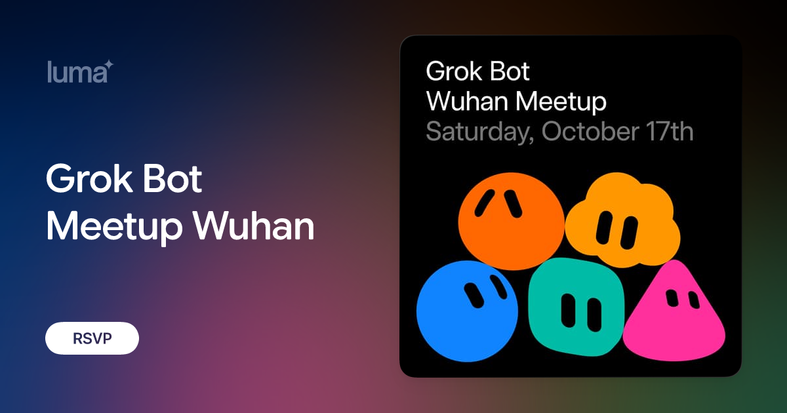</a></td><td valign="top"><strong>Grok Bot Meetup Wuhan</strong> 2026-10-17（土）14:00–17:30（Asia/Shanghai） 武漢（会場未定・確定後に Luma で更新）  武漢の Grok Bot ミートアップ。アイスブレイク＋シェア／ワークショップ。SpaceXAI 製品説明（ツールにログインし成果を持ち帰る AI チームメイト）。事前登録・承認制、承認後に WeChat グループ。登壇／ボランティア歓迎。主催 Hanbing Zhang、chenchong、yuepu。無料・約150席。同日の sha-20261017 上海とは別開催。  <a href="https://luma.com/kss59f4e"><strong>Luma で申し込む（主催者承認） →</strong></a></td></tr></table>

### アメリカ

<table><tr><td width="320" valign="top"></td><td valign="top"><strong>Grok Bot Meetup Las Vegas</strong> 2026-09-15（月）18:00-20:00（PDT） ラスベガス · 登録承認後に会場を表示  交流、トーク / Workshop、Cursor チームのビデオ Q&A。主催者承認制、会場は未定。  <a href="https://luma.com/cursor-kaua"><strong>Luma で申し込む →</strong></a></td></tr></table>

<table><tr><td width="320" valign="top"></td><td valign="top"><strong>Grok Bot 101（SF）</strong> 2026-09-15（月）09:00–10:00（PDT） San Francisco, CA · The Howard SF, 661 Howard St  The Howard での公式 Grok Bot 入門。独自コンピュータを持つ AI チームメイト。無料・残席約 146。  <a href="https://luma.com/spacexai-i8qf"><strong>Luma で申し込む → →</strong></a></td></tr></table>

<table><tr><td width="320" valign="top"></td><td valign="top"><strong>Grok Bot for Engineers（SF）</strong> 2026-09-15（月）12:30–14:00（PDT） San Francisco, CA · The Howard SF, 661 Howard St  エンジニア向け公式 Grok Bot ワークショップ（The Howard）。無料・残席約 145。  <a href="https://luma.com/spacexai-n2o0"><strong>Luma で申し込む → →</strong></a></td></tr></table>

<table><tr><td width="320" valign="top"></td><td valign="top"><strong>Grok Bot for Sales Engineering（SF）</strong> 2026-09-16（火）09:00–10:30（PDT） San Francisco, CA · The Howard SF, 661 Howard St  Sales Engineering 向け公式セッション（The Howard）。無料・残席約 146（Jenna Nanpei / Kathryn Trainor）。  <a href="https://luma.com/spacexai-7n4l"><strong>Luma で申し込む → →</strong></a></td></tr></table>

<table><tr><td width="320" valign="top"></td><td valign="top"><strong>Grok Bot for SDRs（SF）</strong> 2026-09-16（火）14:30–15:30（PDT） San Francisco, CA · The Howard SF, 661 Howard St  SDR 向け公式ワークショップ（The Howard）。無料・残席約 147（Jenna Nanpei）。  <a href="https://luma.com/spacexai-dtez"><strong>Luma で申し込む → →</strong></a></td></tr></table>

<table><tr><td width="320" valign="top"></td><td valign="top"><strong>Grok Bot for Marketing Operations（SF）</strong> 2026-09-17（水）09:00–10:30（PDT） San Francisco, CA · The Howard SF, 661 Howard St  Marketing Ops 向け公式セッション（The Howard）。無料・残席約 146（Jenna Nanpei）。  <a href="https://luma.com/spacexai-obof"><strong>Luma で申し込む → →</strong></a></td></tr></table>

<table><tr><td width="320" valign="top"></td><td valign="top"><strong>Grok Bot for Post-Sales（SF）</strong> 2026-09-17（水）12:30–13:30（PDT） San Francisco, CA · The Howard SF, 661 Howard St  Post-Sales 向け公式ワークショップ（The Howard）。無料・残席約 148（Jenna Nanpei）。  <a href="https://luma.com/spacexai-kczr"><strong>Luma で申し込む → →</strong></a></td></tr></table>

<table><tr><td width="320" valign="top"></td><td valign="top"><strong>Grok Bot for Marketing（SF）</strong> 2026-09-17（水）14:30–16:00（PDT） San Francisco, CA · The Howard SF, 661 Howard St  Marketing 向け公式セッション（The Howard）。無料・残席約 148（Jenna Nanpei / Kathryn Trainor）。  <a href="https://luma.com/spacexai-1ctm"><strong>Luma で申し込む → →</strong></a></td></tr></table>

<table><tr><td width="320" valign="top"></td><td valign="top"><strong>Grok Bot for Product Managers（SF）</strong> 2026-09-15（月）14:30–15:30（PDT） San Francisco, CA · The Howard SF, 661 Howard St  PM 向け公式 Grok Bot ワークショップ（The Howard / Kevin Niparko）。無料・残席約 143（Jenna Nanpei）。  <a href="https://luma.com/spacexai-qki6"><strong>Luma で申し込む → →</strong></a></td></tr></table>

<table><tr><td width="320" valign="top"></td><td valign="top"><strong>Grok Bot for Founders（SF）</strong> 2026-09-15（月）16:30–17:30（PDT） San Francisco, CA · The Howard SF, 661 Howard St  ファウンダー向け公式セッション（The Howard / Shub Gaur）。無料・残席約 144（Jenna Nanpei）。  <a href="https://luma.com/spacexai-74df"><strong>Luma で申し込む → →</strong></a></td></tr></table>

<table><tr><td width="320" valign="top"></td><td valign="top"><strong>Grok Bot for Sales（SF）</strong> 2026-09-16（火）12:30–14:00（PDT） San Francisco, CA · The Howard SF, 661 Howard St  セールス向け公式 Grok Bot ワークショップ（The Howard／Sales Eng と SDR の間）。無料・残席約 144・承認制。  <a href="https://luma.com/spacexai-vpud"><strong>Luma で申し込む（主催者承認） →</strong></a></td></tr></table>

<table><tr><td width="320" valign="top"></td><td valign="top"><strong>Grok Bot Meetup Pittsburgh</strong> 2026-10-13（火）18:30–20:30（EDT） ピッツバーグ · Oakland / Lawrenceville（登録後に住所を表示）  ピッツバーグ初のシティ向け対面ミートアップ（キャンパス限定ではない）。短いデモの後にビルド／セットアップ共有。学生・社会人歓迎。主催 Micah Smith。無料・先着約30席。  <a href="https://luma.com/6lx5t8ru"><strong>Luma で申し込む →</strong></a></td></tr></table>

<table><tr><td width="320" valign="top"><a href="https://luma.com/cursor-ym79">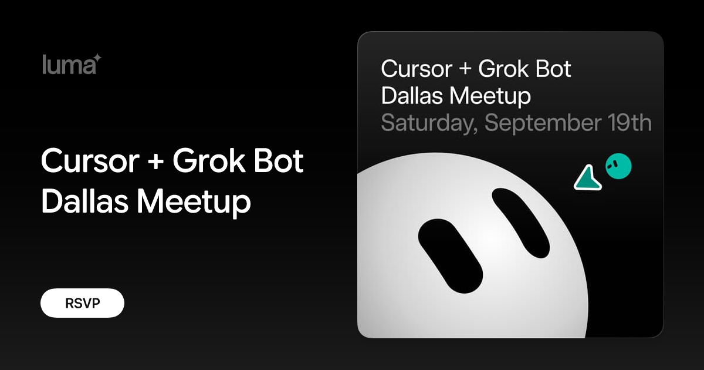</a></td><td valign="top"><strong>Cursor + Grok Bot Dallas Meetup</strong> 2026-09-19（土）10:30–14:30（CDT） ダラス · Kiln Preston Hollow（9850 N Central Expy #230）  ダラス初の Grok Bot ミートアップ。短いトーク／デモの後にビルド。ノートPC推奨（x.ai/bot）。Cursor と SpaceXAI API クレジット（音声／チャット／画像／動画）先着。会場 Kiln Preston Hollow（North Dallas、無料駐車）。主催 Pradipta Shrestha、Sebastian Mendo、Tyler Vea。無料・承認制・約60席（スキャン時約33名）。  <a href="https://luma.com/cursor-ym79"><strong>Luma で申し込む（主催者承認） →</strong></a></td></tr></table>

<table><tr><td width="320" valign="top"></td><td valign="top"><strong>Grok Bot Miami Kickoff</strong> 2026-09-23（水）18:30–21:30（America/New_York、EDT） マイアミ · The DOCK、400 NW 26th St（Wynwood）  SpaceXAI for Miami（旧 Cursor Community Miami）初の Grok Bot Kickoff。ライブデモ・ビルダー交流、AIエージェント実践の第一歩。アジェンダは後日。ノートPC歓迎。会場 The DOCK（Wynwood）。主催 Ben Milshtein & The LAB Miami。無料・手動承認。スキャン時 0 名。  <a href="https://luma.com/spacexai-kxjz"><strong>申し込む →</strong></a></td></tr></table>

<table><tr><td width="320" valign="top"><a href="https://luma.com/ihgtq394">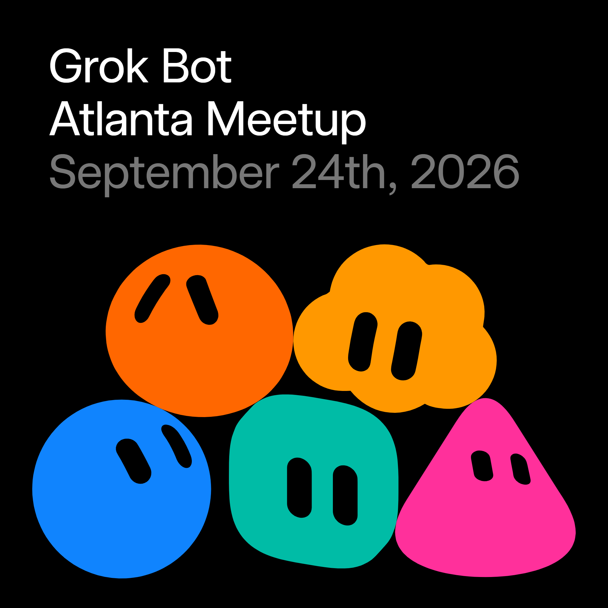</a></td><td valign="top"><strong>Grok Bot Meetup Atlanta</strong> 2026-09-24（木）18:00–20:00（America/New_York、EDT） アトランタ都市圏 Alpharetta · Tech North Atlanta、925 North Point Pkwy Ste 130  SpaceXAI for Atlanta のイントロMeetup。退勤後デモ中心：Grok Bot概要・ウォークスルー・ライブデモ・Q&A／オープンマイク・飲食・無料駐車。主催 Raj Poloju & Sreyas Gentela。無料・承認不要。ノートPC任意。スキャン時 0 名。Forum 171336。  <a href="https://luma.com/ihgtq394"><strong>Luma で申し込む → →</strong></a></td></tr></table>

### カナダ

<table><tr><td width="320" valign="top"></td><td valign="top"><strong>Grok Bot Meetup Calgary</strong> 2026-09-30（水）17:30–20:30（MDT） カルガリー · 会場は登録後に案内  カルガリーの対面 Grok Bot。無料・先着。  <a href="https://luma.com/cursor-coel"><strong>Luma で申し込む →</strong></a></td></tr></table>

<table><tr><td width="320" valign="top"></td><td valign="top"><strong>Grok Bot Meetup Victoria BC</strong> 2026-09-21（月）18:00–21:00（PDT） ビクトリア（BC）· 登録後に住所を表示  ビクトリアの Grok Bot ビルドナイト。主催者承認が必要。  <a href="https://luma.com/grokbot"><strong>Luma で申し込む（主催者承認） →</strong></a></td></tr></table>

<table><tr><td width="320" valign="top"></td><td valign="top"><strong>Grok Bot Meetup Sudbury #1</strong> 2026-09-15（火）18:00–20:00（EDT） サドベリー · Cliff Fielding Research, Innovation and Engineering Building  サドベリー初の Grok Bot。主催者承認が必要。参加者にクレジットあり。  <a href="https://luma.com/cursor-nmzu"><strong>Luma で申し込む（主催者承認） →</strong></a></td></tr></table>

<table><tr><td width="320" valign="top"></td><td valign="top"><strong>Grok Bot Meetup Toronto</strong> 2026-09-17（木）17:30–20:30（EDT） トロント · 会場 TBD（登録後に住所）。ノート PC 持参。18:15 閉門。  トロント初の対面 Grok Bot（Cursor Community）。アジェンダは未定。主催者承認。ノート PC 持参。  <a href="https://luma.com/grok-bot-toronto"><strong>Luma で申し込む（主催者承認） →</strong></a></td></tr></table>

<table><tr><td width="320" valign="top"><a href="https://luma.com/hkujao4q">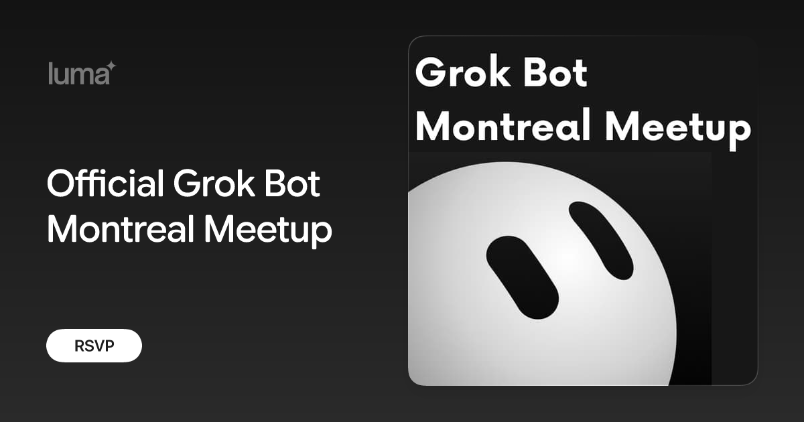</a></td><td valign="top"><strong>Official Grok Bot Meetup Montreal</strong> 2026-09-19（土）12:00–17:00（America/Toronto、EDT） モントリオール · Reflex（63 Rue de Brésoles、SpaceXAI Community 連携）  モントリオール公式 Grok Bot Meetup（Reflex）。短いチュートリアル、コミュニティデモ、交流とメンター。クレジットとスワッグあり。主催 Lucas & Samira G.。無料・承認制。午後対面。EventScheduled。  <a href="https://luma.com/hkujao4q"><strong>申し込む →</strong></a></td></tr></table>

### インドネシア

<table><tr><td width="320" valign="top"></td><td valign="top"><strong>Grok Bot Meetup Bali</strong> 2026-09-15（月）16:00–21:00（WITA） バリ Uluwatu · BukitHub Coworking, Jl. Pura Batu Pageh No.177AA, Ungasan  Uluwatu 初の Grok Bot Meetup。体験・デモ・交流。無料 30 席・承認制（forum 170338）。  <a href="https://luma.com/bn7nfv0s"><strong>Luma で申し込む → →</strong></a></td></tr></table>

<table><tr><td width="320" valign="top"></td><td valign="top"><strong>Grokbot Workshop Bali（Udayana）</strong> 2026-10-04（日）11:00–14:00（WITA） バリ Jimbaran · Udayana University, Jl. Raya Kampus Unud  インドネシア向けキャンパス Workshop。9/15 BukitHub（bli-20260915）とは別。forum 170448・承認制。  <a href="https://luma.com/lkmh86ad"><strong>Luma で申し込む → →</strong></a></td></tr></table>

<table><tr><td width="320" valign="top"></td><td valign="top"><strong>Grok Bot Meetup Bandung</strong> 2026-09-19（土）14:00–18:00（WIB） バンドン · 登録後に住所を表示  バンドンのハンズオン（SpaceXAI）。主催 Faiz Intifada。承認制・約 60 席。会場は登録後。  <a href="https://luma.com/grokbot-bdg"><strong>Luma で申し込む（主催者承認） →</strong></a></td></tr></table>

<table><tr><td width="320" valign="top"><a href="https://luma.com/spacexai-zb6b">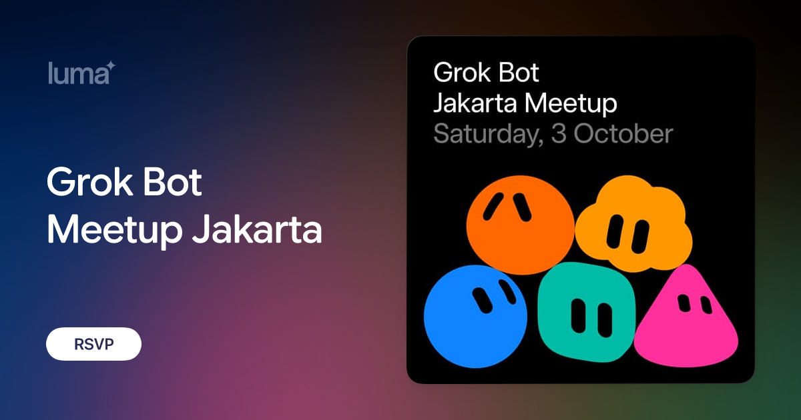</a></td><td valign="top"><strong>Grok Bot Meetup Jakarta</strong> 2026-10-03（土）10:00–13:00（Asia/Jakarta、WIB） ジャカルタ · 会場表記 Jakarta（SpaceXAI for Jakarta カレンダー）  ジャカルタの Grok Bot Meetup（SpaceXAI for Jakarta）。事例・Personal Agents・アンバサダー活用・Q&A・交流。主催 Naufaldi。無料・承認制・約 100 席。スキャン時 0 名。対面・EventScheduled・API_OK。バンドン／タンゲランとは別。  <a href="https://luma.com/spacexai-zb6b"><strong>Luma で申し込む（主催者承認） →</strong></a></td></tr></table>

### インド

<table><tr><td width="320" valign="top"><a href="https://luma.com/132jx6pw">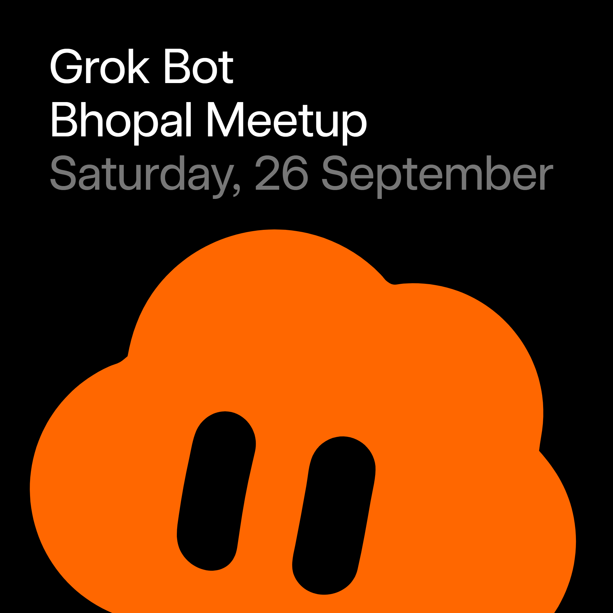</a></td><td valign="top"><strong>Grok Bot Meetup - Bhopal</strong> 2026-09-26（土）18:00–20:00（IST） Bhopal, India · 会場 TBA  ボーパール初の Grok Bot ハンズオン。SpaceXAI のワークコンパニオンがツールにログインして実タスクを完了。交流・入門WS・ハンズオン・Q&A・クレジット。主催 Mohneesh Gupta。無料・承認制・約100席。充電済みノートPCとホットスポット持参。スキャン時 0 名。  <a href="https://luma.com/132jx6pw"><strong>Luma で申し込む（主催者承認）→ →</strong></a></td></tr></table>

<table><tr><td width="320" valign="top"><a href="https://luma.com/q6650bso">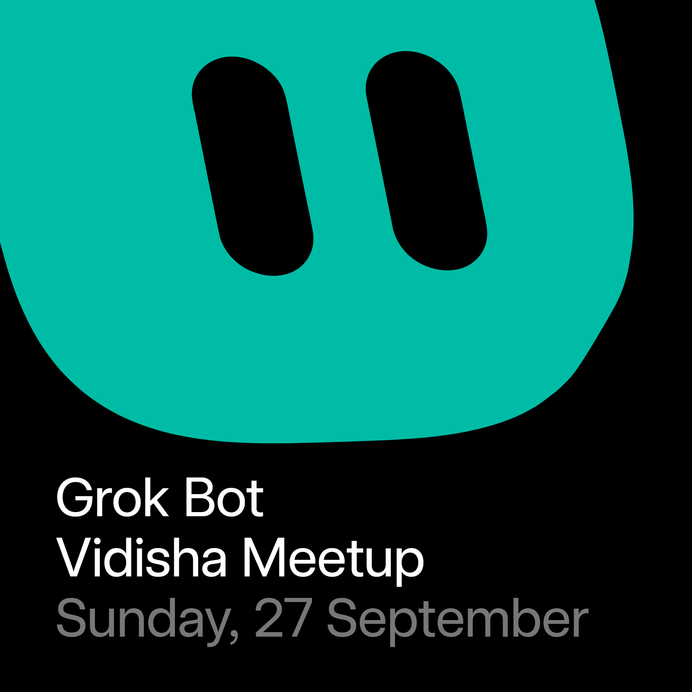</a></td><td valign="top"><strong>Grok Bot Meetup - Vidisha</strong> 2026-09-27（日）18:00–20:00（IST） Vidisha, India · 会場 TBA  ヴィディシャー初の Grok Bot ハンズオン。SpaceXAI のワークコンパニオンがツールにログインして実タスクを完了。交流・入門WS・ハンズオン・Q&A・クレジット。主催 Mohneesh Gupta。無料・承認制・約100席。充電済みノートPCとホットスポット持参。スキャン時 0 名。  <a href="https://luma.com/q6650bso"><strong>Luma で申し込む（主催者承認）→ →</strong></a></td></tr></table>

<table><tr><td width="320" valign="top"></td><td valign="top"><strong>Grok Bot Get Together - Delhi</strong> 2026-10-03（土）13:00–16:00（IST） デリー · 登録後に住所を表示  デリーの Grok Bot ハンズオン交流会。SpaceXAI のワークコンパニオンがツールにログインして実タスクを完了。交流・入門WS・ハンズオン・Q&A・クレジット。主催 Knowvy Technologies。無料・承認制・約100席。住所は登録後公開。充電済みノートPCとホットスポット持参。スキャン時 0 名。  <a href="https://luma.com/1cgd0t25"><strong>Luma で申し込む（主催者承認）→ →</strong></a></td></tr></table>

<table><tr><td width="320" valign="top"><a href="https://luma.com/0t6obx5c">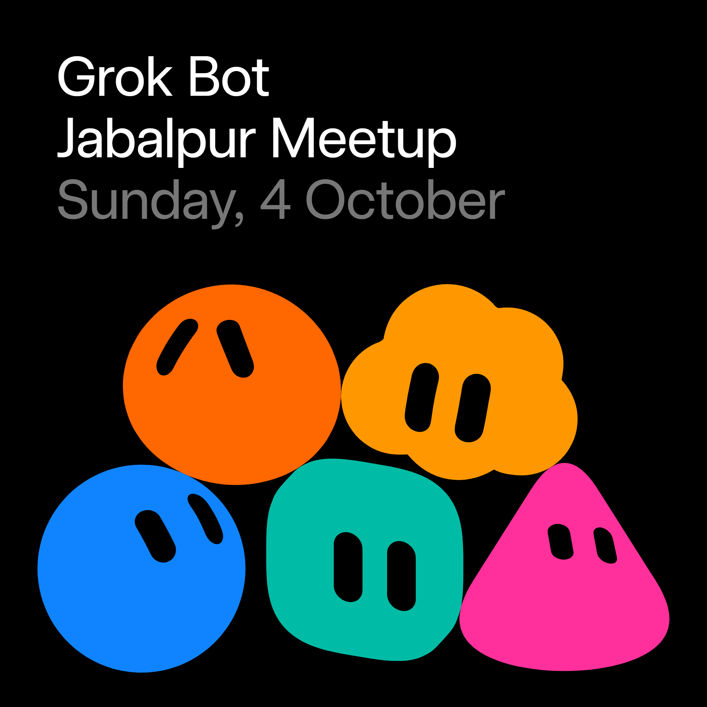</a></td><td valign="top"><strong>Grok Bot Meetup - Jabalpur</strong> 2026-10-04（日）16:00–18:00（IST） Jabalpur, India · 会場 TBA  ジャバルプルの Grok Bot ハンズオン。SpaceXAI のワークコンパニオンがツールにログインして実タスクを完了。交流・入門WS・ハンズオン・Q&A・クレジット。主催 Knowvy Technologies。無料・承認制・約100席。充電済みノートPCとホットスポット持参。スキャン時 0 名。  <a href="https://luma.com/0t6obx5c"><strong>Luma で申し込む（主催者承認）→ →</strong></a></td></tr></table>

### アルゼンチン

<table><tr><td width="320" valign="top"></td><td valign="top"><strong>Grok Bot Meetup Buenos Aires</strong> 2026-09-16（水）18:00–20:00（ART） ブエノスアイレス · 登録後に住所を表示  ブエノスアイレスの対面 Grok Bot。無料、主催者承認、ウェイティング可、残席 100。  <a href="https://luma.com/8l9u6sns"><strong>Luma で申し込む（主催者承認） →</strong></a></td></tr></table>

<table><tr><td width="320" valign="top"></td><td valign="top"><strong>Grok Bot Meetup Mendoza</strong> 2026-10-03（土）17:00–20:00（ART） メンドーサ TIC テクノパーク、Rafael Cubillos 2100-2198  メンドーサの対面 Grok Bot。先着。  <a href="https://luma.com/cursor-mtu0"><strong>Luma で申し込む →</strong></a></td></tr></table>

<table><tr><td width="320" valign="top"></td><td valign="top"><strong>Grok Bot Meetup Salta</strong> 2026-09-16（水）18:00–20:00（ART） サルタ · SorboLabs, Dean Funes 244（登録後に住所）  サルタ初の Grok Bot。入門ワークショップ、実用例、Q&A、持参 PC でコーワーク。ツールにログインして仕事を仕上げて戻る。主催者承認。充電器持参。  <a href="https://luma.com/cursor-sh4i"><strong>Luma で申し込む（主催者承認） →</strong></a></td></tr></table>

### エクアドル

<table><tr><td width="320" valign="top"></td><td valign="top"><strong>Grok Bot Manta Workshop</strong> 2026-09-12（土）08:30–12:30（ECT） エクアドル マンタ · 登録後に住所を表示  Grok Bot で新しいエージェント開発スタックを扱うワークショップ。無料、ウェイティング可、残席 41。  <a href="https://luma.com/grokbot-manta"><strong>Luma で申し込む →</strong></a></td></tr></table>

<table><tr><td width="320" valign="top"></td><td valign="top"><strong>Grok Bot Meetup Quito</strong> 2026-09-24（木）19:30–21:30（ECT） キト · 登録後に住所を表示  キトの対面 Grok Bot。無料、主催者承認、残席 47。  <a href="https://luma.com/grokbotquitomeetup"><strong>Luma で申し込む（主催者承認） →</strong></a></td></tr></table>

<table><tr><td width="320" valign="top"></td><td valign="top"><strong>Grok Bot Meetup Cumbayá</strong> 2026-10-03（土）09:30–12:00（ECT） キト近郊 Cumbayá  キト近郊 Cumbayá の対面 Grok Bot。無料、ウェイティング可、残席 37。  <a href="https://luma.com/cccumbaya"><strong>Luma で申し込む →</strong></a></td></tr></table>

### メキシコ

<table><tr><td width="320" valign="top"></td><td valign="top"><strong>Grok Bot Meetup Puebla</strong> 2026-09-24（木）18:00–22:00（CST） プエブラ · 登録後に住所を表示  プエブラ初の Grok Bot ミートアップ。主催者承認が必要。  <a href="https://luma.com/puebla-d4iw"><strong>Luma で申し込む（主催者承認） →</strong></a></td></tr></table>

<table><tr><td width="320" valign="top"></td><td valign="top"><strong>Grok Bot Meetup Chihuahua</strong> 2026-09-24（木）16:00–19:00（Chihuahua） Chihuahua · LivingLab CUU, Av. George Washington 3701-13  チワワ初の Grok Bot × SpaceXAI（LivingLab CUU）。主催 Alfonso Reyes。承認制・約 200 席。  <a href="https://luma.com/spacexai-7lje"><strong>Luma で申し込む（主催者承認） →</strong></a></td></tr></table>

<table><tr><td width="320" valign="top"></td><td valign="top"><strong>Grok Bot Meetup Mexico City</strong> 2026-09-26（土）09:00–13:00（CDMX） Mexico City · Sandbox Hub, Luis G. Urbina 4-dpto. 103, Polanco  CDMX 初の対面（Sandbox Hub Polanco）。主催 Javier Rivero / Ben Kim / Ricardo García。承認制・約 60 席。  <a href="https://luma.com/spacexai-89bf"><strong>Luma で申し込む（主催者承認） →</strong></a></td></tr></table>

### ブラジル

<table><tr><td width="320" valign="top"></td><td valign="top"><strong>Grok Bot Curitiba Startups Meetup</strong> 2026-11-11（水）18:30–21:00（BRT） クリチバ Rua Marcos Moro 72  クリチバのスタートアップ向け。Grok Bot での作り方、創業者の知見、エージェント時代の出荷（登壇者は未定）。主催者承認が必要。  <a href="https://luma.com/cursor-dx23"><strong>Luma で申し込む（主催者承認） →</strong></a></td></tr></table>

<table><tr><td width="320" valign="top"></td><td valign="top"><strong>Grok Bot Meetup Florianópolis</strong> 2026-09-26（土）18:00–20:00（BRT） フロリアノポリス · Founder Haus - Jurerê In, Av. dos Merlins 156  フロリアノポリス初の Grok Bot Meetup。デモと交流。forum 170449・関心約 25・承認制。  <a href="https://luma.com/c293hlgc"><strong>Luma で申し込む → →</strong></a></td></tr></table>

### ドイツ

<table><tr><td width="320" valign="top"></td><td valign="top"><strong>Grok Bot Meetup Freiburg</strong> 2026-09-17（木）18:00–21:00（CEST） Freiburg im Breisgau · Stefan-Meier-Straße 8  フライブルク初の対面。製品体験と交流。主催 Aniruth / Foundersclub Freiburg。承認制・約 57 席。  <a href="https://luma.com/grok-bot-freiburg"><strong>Luma で申し込む（主催者承認） →</strong></a></td></tr></table>

<table><tr><td width="320" valign="top"><a href="https://luma.com/spacexai-cologne-meetup1">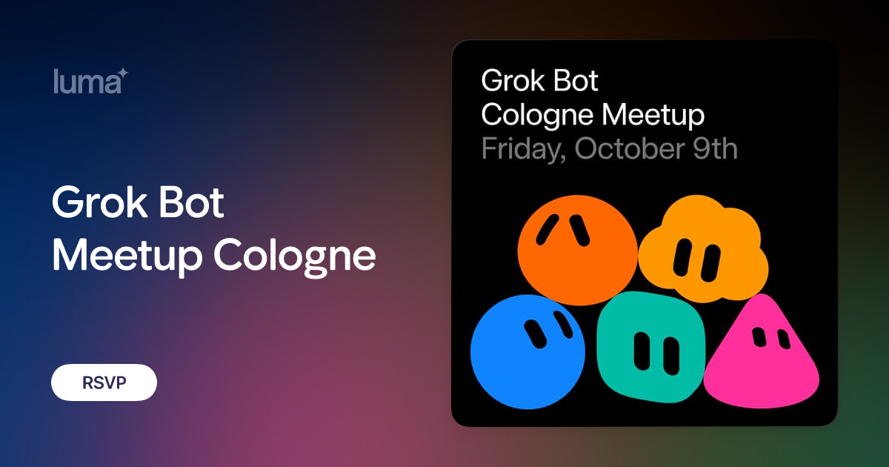</a></td><td valign="top"><strong>Grok Bot Meetup Cologne</strong> 2026-10-09（金）18:00–21:00（CEST） ケルン（登録後に住所公開）  ケルンの Grok Bot ミートアップ。交流・トーク／ワークショップ・実タスクでハンズオン（Windows／Mac ノートまたは iPhone、x.ai/bot を事前DL）。18:00 受付→18:30 デモ＆ハンズオン→20:00 雑談。追加スピーカー歓迎。主催 Emmanuel Ketcha、Eyad Kelleh、Babajide Mayowa Moibi、Teoman Köse。無料・承認制・約50席。  <a href="https://luma.com/spacexai-cologne-meetup1"><strong>Luma で申し込む（主催者承認） →</strong></a></td></tr></table>

### イギリス

<table><tr><td width="320" valign="top"></td><td valign="top"><strong>Grok Bot Meetup London</strong> 2026-09-16（水）18:00–21:00（BST） ロンドン · Granola 主催（登録後に住所）  ロンドン初の Grok Bot。夕方コーワークと地元パワーユーザーデモ（SpaceXAI フィールドエンジニア）、ノート PC とクレジット。無料登録。  <a href="https://luma.com/grok-bot-london"><strong>Luma で申し込む → →</strong></a></td></tr></table>

<table><tr><td width="320" valign="top"><a href="https://luma.com/spacexai-hnzl">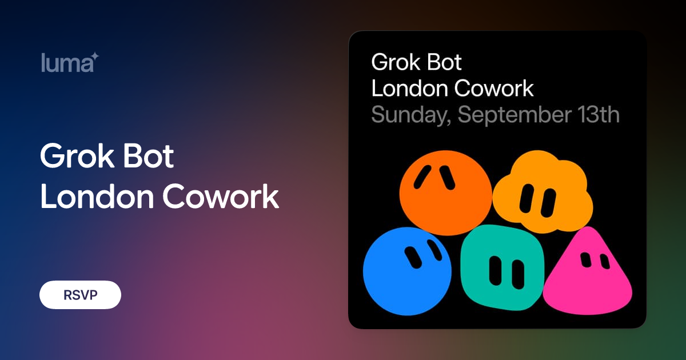</a></td><td valign="top"><strong>Grok Bot London Cowork</strong> 2026-09-13（日）11:00–17:30（BST） ロンドン（登録後に住所公開・CoLoop ホスト）  ロンドン日中の Grok Bot コワーク（CoLoop）。デスク／ソファ／フォンブース／フォーカスルーム、WiFi・ホワイトボード、コーヒーとクッキー等。Grok Bot / Origin / Cursor で作業しつつ軽く共有。ネットワーキング中心ではない。主催 Francisco Terpolilli & Oscar Falemara。無料・承認制・約45席。ldn-20260916 夜のミートアップとは別開催。  <a href="https://luma.com/spacexai-hnzl"><strong>Luma で申し込む（主催者承認） →</strong></a></td></tr></table>

### グアテマラ

<table><tr><td width="320" valign="top"></td><td valign="top"><strong>Grok Bot Meetup Guatemala (Xela)</strong> 2026-09-20（日）09:00–15:00（CST） ケツァルテナンゴの Universidad Mesoamericana  ケツァルテナンゴ終日。マヤ語、農村・農業、中小企業、医療・教育のトラックで Grok Bot の試作。  <a href="https://luma.com/cursor-kfex"><strong>Luma で申し込む（主催者承認） →</strong></a></td></tr></table>

<table><tr><td width="320" valign="top"></td><td valign="top"><strong>Grok Bot Meetup グアテマラシティ</strong> 2026-10-03（土）10:00–14:00（CST） グアテマラシティ Zona 10 フランシスコ・マロキン大学 · 登録後に住所を表示  Open2 主催のグアテマラシティ Grok Bot ミートアップ。単発タスクを超える指示・文脈・一気通貫フローと試用クレジット（約 36 going、主催者承認）。  <a href="https://luma.com/cursor-is2h"><strong>Luma で申し込む（主催者承認） →</strong></a></td></tr></table>

### 日本

<table><tr><td width="320" valign="top"></td><td valign="top"><strong>Grok Bot Meetup 札幌 #2</strong> 2026-10-02（金）19:00–22:00（JST） 札幌 · 登録後に住所を表示  札幌 2 回目の Grok Bot ミートアップ。無料、主催者承認。  <a href="https://luma.com/91kju0je"><strong>Luma で申し込む（主催者承認） →</strong></a></td></tr></table>

<table><tr><td width="320" valign="top"></td><td valign="top"><strong>Grok Bot Meetup 大阪</strong> 2026-09-17（木）19:00–21:30（JST） 大阪市北区梅田 North Gate Building  大阪の対面 Grok Bot。主催者承認が必要。  <a href="https://luma.com/grokbotosaka"><strong>Luma で申し込む（主催者承認） →</strong></a></td></tr></table>

### エルサルバドル

<table><tr><td width="320" valign="top"></td><td valign="top"><strong>Grok Bot Meetup サンサルバドル</strong> 2026-09-19（土）15:00–19:00（El Salvador） サンサルバドル · 住所 TBD（登録後に表示）  Ai Labs 主催のサンサルバドル Grok Bot ミートアップ。単発タスクを超える指示・文脈・一気通貫フローを探る（約 50 going）。  <a href="https://luma.com/bot"><strong>Luma で申し込む →</strong></a></td></tr></table>

<table><tr><td width="320" valign="top"><a href="https://luma.com/khw2316m">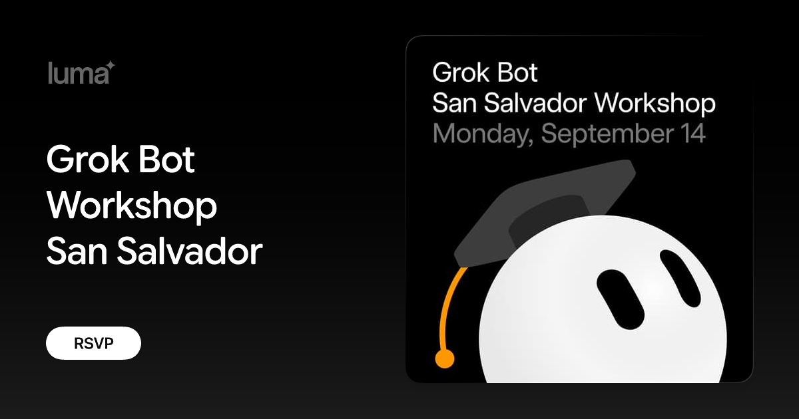</a></td><td valign="top"><strong>Grok Bot Workshop San Salvador</strong> 2026-09-14（日）09:00–11:30（America/El_Salvador、GMT-6） エルサルバドル・ソヤパンゴ · Universidad Don Bosco（Soyapango キャンパス）  サンサルバドルの Sprint 2 Demo Day。Flutter+AI の短いトーク後、Grok Bot で 1 時間スプリント、Mini Demo Day でピッチ。9/19 の同市 meetup（sal-20260919）とは別。主催 Beatriz Del Pinal、Walter Morales、Anthony Romero。無料・承認制。スキャン時残り約 19 席（約 11 名）。Flutter 済みノート PC 持参。forum 170538。  <a href="https://luma.com/khw2316m"><strong>申し込む →</strong></a></td></tr></table>

### アルバニア

<table><tr><td width="320" valign="top"></td><td valign="top"><strong>Grok Bot Meetup Tirana</strong> 2026-09-17（木）18:30–20:00（CEST） ティラナ · 登録後に住所を表示  ティラナの 9 月 Grok Bot / Cursor ミートアップ。主催者承認が必要。  <a href="https://luma.com/cursor-ibxj"><strong>Luma で申し込む（主催者承認） →</strong></a></td></tr></table>

### オーストラリア

<table><tr><td width="320" valign="top"></td><td valign="top"><strong>Grok Bot Meetup Sydney</strong> 2026-10-07（水）17:30–21:00（AEDT） シドニー · 登録後に住所を表示  8 月開催の次、公式 Cursor Sydney の Grok Bot ナイト。主催者承認が必要。  <a href="https://luma.com/cursor-d70v"><strong>Luma で申し込む（主催者承認） →</strong></a></td></tr></table>

### バングラデシュ

<table><tr><td width="320" valign="top"><a href="https://luma.com/spacexai-b80k">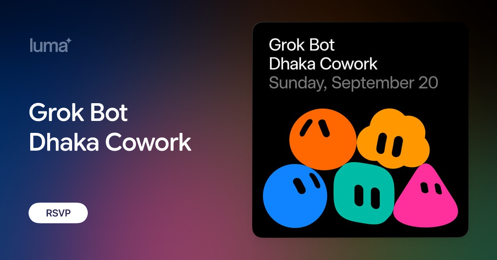</a></td><td valign="top"><strong>Grok Bot Dhaka Cowork</strong> 2026-09-20（日）13:00–16:30（Asia/Dhaka、GMT+6） ダッカ（登録後に住所公開）  ダッカのハンズオン Grok Bot コワーク。サイドプロジェクトやアイデアを持ち寄り、単独／ペアで構築・共有・学習。主催 Mahinoor Rahman（SpaceXAI for Dhaka）。無料・主催承認制・約90席。ノートPC持参。初心者歓迎。  <a href="https://luma.com/spacexai-b80k"><strong>Luma で申し込む →</strong></a></td></tr></table>

### ベルギー

<table><tr><td width="320" valign="top"></td><td valign="top"><strong>Grok Bot Meetup Leuven</strong> 2026-09-19（土）14:00–17:30（CEST） ルーヴェン · Blijde Inkomststraat 22  ベルギー初の Grok Bot Meetup。デモと交流。forum 170453・承認制。  <a href="https://luma.com/spacexai-leuven-meetup"><strong>Luma で申し込む → →</strong></a></td></tr></table>

### スペイン

<table><tr><td width="320" valign="top"></td><td valign="top"><strong>Grok Bot Meetup Madrid</strong> 2026-09-29（火）17:30–21:30（Europe/Madrid、CEST） スペイン・マドリード · Pl. del Callao, 1（Samplia Hub / mad.builders）  マドリード初の Grok Bot Meetup。実践ワークショップ：ライブ試用・短いデモの後、持参（または主催案）の自動化課題で bot を構築。会場でクレジット配布。ノートPC/スマホ可。スペイン語（英語歓迎）。17:30 受付→18:00 紹介→18:20 デモ→19:00 WS→20:30 交流/~21:30。主催 Felipe Basurto & Alvaro Fragoso（Mad Builders）。無料・承認制。約 60 席。スキャン時 0 名。forum 171020。  <a href="https://luma.com/grokbotmadrid1"><strong>申し込む →</strong></a></td></tr></table>

### アイルランド

<table><tr><td width="320" valign="top"><a href="https://luma.com/grokbot-dublin">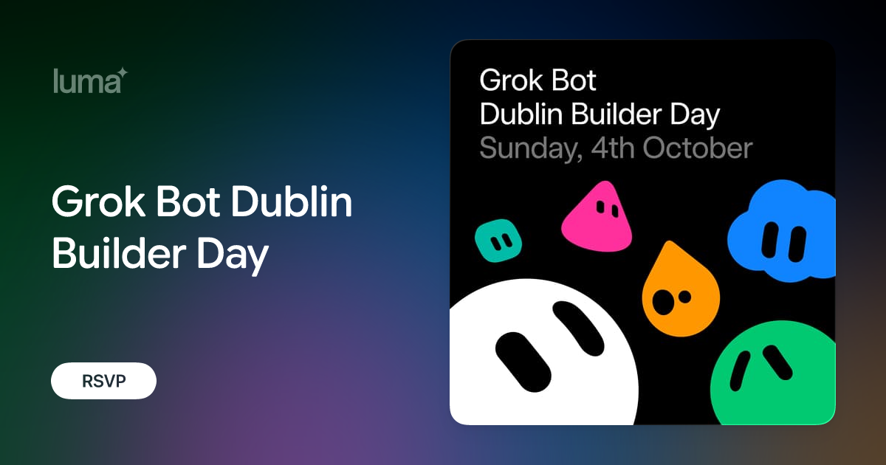</a></td><td valign="top"><strong>Grok Bot Dublin Builder Day</strong> 2026-10-04（日）11:00–17:30（Europe/Dublin、IST） アイルランド・ダブリン · Baseline（61 Thomas St、Dublin AI Week × Bronto）  ダブリン終日 Grok Bot ビルドデイ（SpaceXAI for Dublin、Dublin AI Week の一環、Bronto 提携）。ライブデモ、ボット／ワークフロー構築、昼食、ライトニングデモ。事前に x.ai/bot を導入。主催 Sanat Thukral & Manoj。無料・承認制・約 96 席・ウェイトリストあり。  <a href="https://luma.com/grokbot-dublin"><strong>申し込む →</strong></a></td></tr></table>

### ケニア

<table><tr><td width="320" valign="top"></td><td valign="top"><strong>Grok Bot Meetup Nairobi</strong> 2026-09-17（木）15:30–18:00（EAT） ナイロビ · 会場は登録後に案内  ナイロビのハンズオン Grok Bot。無料、主催者承認、残席 60。  <a href="https://luma.com/cursor-0yk6"><strong>Luma で申し込む（主催者承認） →</strong></a></td></tr></table>

### カンボジア

<table><tr><td width="320" valign="top"><a href="https://luma.com/spacexai-jt05">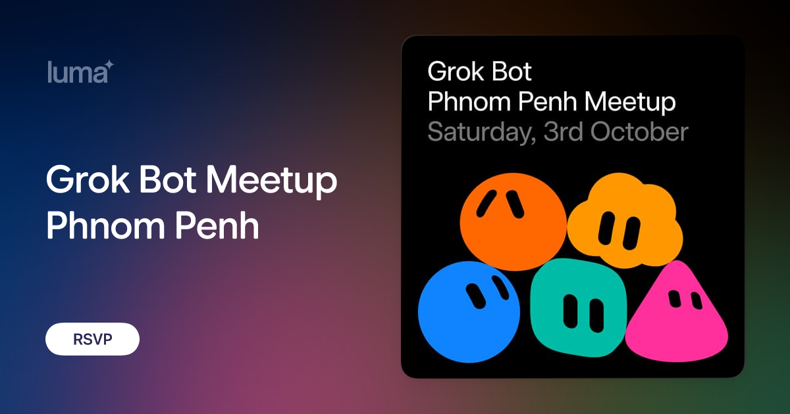</a></td><td valign="top"><strong>Grok Bot Meetup Phnom Penh</strong> 2026-10-03（土）14:00–16:00（Asia/Bangkok、GMT+7） プノンペン · Smart Startup Space（Connexion Building, Koh Pich）  カンボジア初の Grok Bot ミートアップ。デモ・アイデア交換、現地クレジット試用（ノート／スマホ可）、オンラインゲストあり。Smart Startup Space 共催。主催 Taka Kiyone & Luis Romero。無料・承認制・約80席。初心者歓迎。  <a href="https://luma.com/spacexai-jt05"><strong>Luma で申し込む（主催者承認） →</strong></a></td></tr></table>

### クウェート

<table><tr><td width="320" valign="top"><a href="https://luma.com/197n9c91">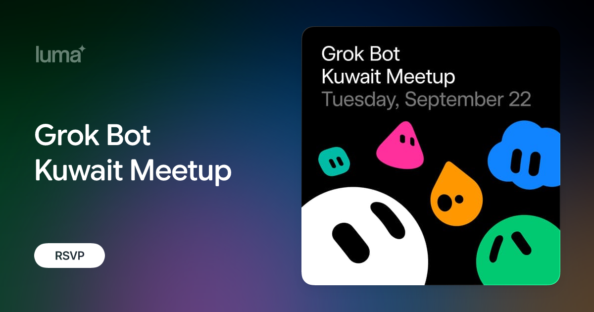</a></td><td valign="top"><strong>Grok Bot Meetup Kuwait</strong> 2026-09-22（月）12:30–14:30（Asia/Riyadh、GMT+3） クウェート Mubarak Al-Abdullah（Hawalli）· 登録後に住所を表示  クウェート初の Grok Bot × SpaceXAI ミートアップ。紹介とハンズオン、地元ビルダー交流。参加者に Grok Bot 1ヶ月クレジット、軽食あり。iPhone/Android/Windows/Mac 持参（Cursor 不要）。主催 Asama Akhtar。無料・承認制・残席約24。次回は Build with Grok Bot ワークショップ予定。  <a href="https://luma.com/197n9c91"><strong>Luma で申し込む（主催者承認） →</strong></a></td></tr></table>

### モロッコ

<table><tr><td width="320" valign="top"><a href="https://luma.com/spacexai-okg3">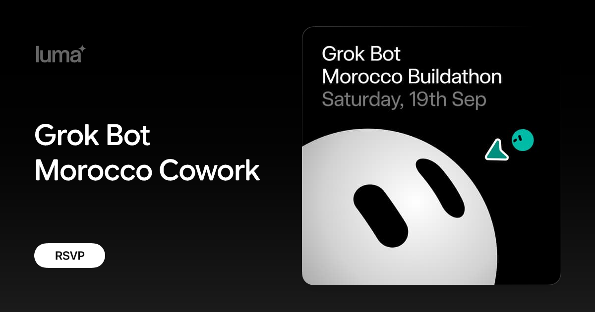</a></td><td valign="top"><strong>Grok Bot Morocco Cowork</strong> 2026-09-19（土）10:00–16:00（Africa/Casablanca、GMT+1） カサブランカ、モロッコ（登録後に住所公開・ALTS Morocco 共催）  カサブランカの土曜 Grok Bot コワーク／ビルダソン（ALTS Morocco 共催）。Oumayma Essarhi の短いワークショップの後、深掘り作業とデモ。Grok Bot 製品説明（ツールにログインできる AI チームメイト）。イベント中クレジットあり。主催 OUMAYMA ESSARHI & El Bachir Outidrarine。無料・承認制・約100席。SpaceXAI for Morocco カレンダー。  <a href="https://luma.com/spacexai-okg3"><strong>Luma で申し込む（主催者承認） →</strong></a></td></tr></table>

### ミャンマー

<table><tr><td width="320" valign="top"></td><td valign="top"><strong>Grok Bot Yangon Workshop @ ACY</strong> 2026-09-26（土）13:30–17:00（MMT） ヤンゴン American Center Yangon  ヤンゴン American Center での Grok Bot ハンズオン。主催者承認が必要。  <a href="https://luma.com/cursor-qu3x"><strong>Luma で申し込む（主催者承認） →</strong></a></td></tr></table>

### マルタ

<table><tr><td width="320" valign="top"></td><td valign="top"><strong>Grok Bot Meetup Malta</strong> 2026-09-17（木）18:00–21:00（CEST） マルタ Ta' Xbiex · Coffee Circus Porto, 149 Triq D'Argens  マルタ初の SpaceXAI Grok Bot Meetup。デモ、Bot/エージェント体験、交流。無料、残席約 31。  <a href="https://luma.com/grok-bot-malta"><strong>Luma で申し込む → →</strong></a></td></tr></table>

### マレーシア

<table><tr><td width="320" valign="top"></td><td valign="top"><strong>Grok Bot Meetup Kuala Lumpur</strong> 2026-09-19（土）14:00–18:00（MYT） クアラルンプール · 登録後に住所を表示  クアラルンプールの対面 Grok Bot。無料、主催者承認、ウェイティング可、残席 99。  <a href="https://luma.com/grok-bot"><strong>Luma で申し込む（主催者承認） →</strong></a></td></tr></table>

### オランダ

<table><tr><td width="320" valign="top"></td><td valign="top"><strong>Grok Bot Meetup Amsterdam</strong> 2026-09-22（火）18:30–21:30（CEST） アムステルダム · 会場 TBD（Luma / 登録後に住所）  アムステルダム初の Grok Bot。夕方コーワークと地元パワーユーザーデモ、ノート PC 持参でクレジット。無料登録。  <a href="https://luma.com/grok-bot-amsterdam"><strong>Luma で申し込む → →</strong></a></td></tr></table>

### フィリピン

<table><tr><td width="320" valign="top"></td><td valign="top"><strong>Grok Bot Meetup Cebu</strong> 2026-09-19（土）09:00–11:30（PHT） セブ · 登録後に住所を表示  セブの対面 Grok Bot。主催者承認が必要。  <a href="https://luma.com/cursor-dyb8"><strong>Luma で申し込む（主催者承認） →</strong></a></td></tr></table>

### トーゴ

<table><tr><td width="320" valign="top"></td><td valign="top"><strong>Grok Bot Meetup Lomé</strong> 2026-09-12（土）09:00–13:00（GMT） ロメ トーゴ・フランス学院  ロメの対面 Grok Bot。無料、ウェイティング可、残席 198。  <a href="https://luma.com/cursor-ec8v"><strong>Luma で申し込む →</strong></a></td></tr></table>

### ザンビア

<table><tr><td width="320" valign="top"><a href="https://luma.com/spacexai-ol65">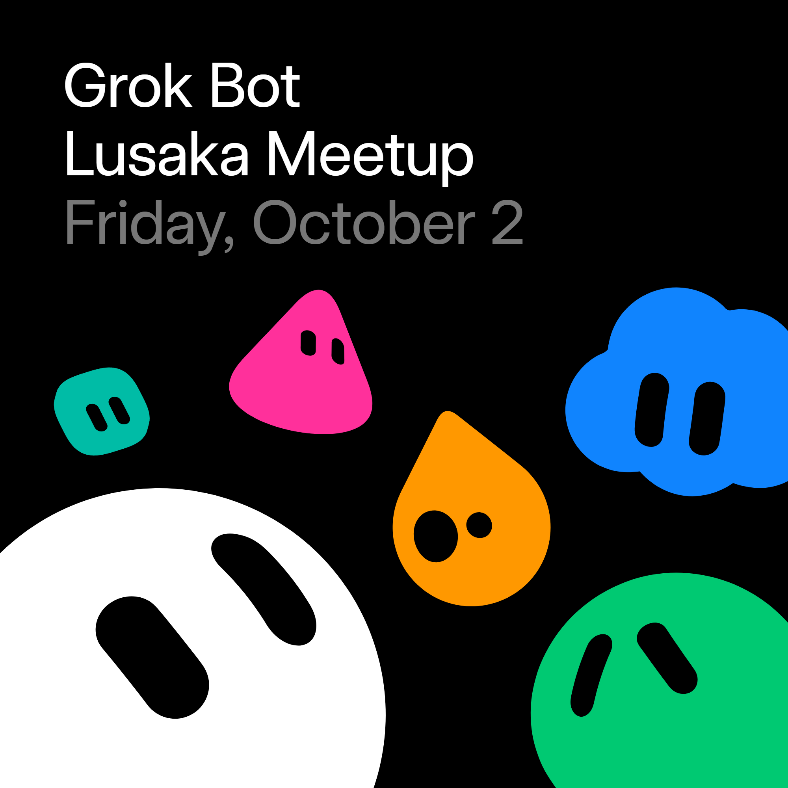</a></td><td valign="top"><strong>Grok Bot Meetup Lusaka</strong> 2026-10-02（金）09:00–14:00（Africa/Maputo、CAT、UTC+2） ザンビア・ルサカ · 会場未定（登録後に案内）  SpaceXAI Zambia / SpaceXAI for Lusaka のハンズオンMeetup（主催 Lloyd situmbeko）。Grok Bot はツールにログインして実作業を完了する AI 同僚、という製品コピー。ライブデモ・クレジット・オープンビルド・飲食ネットワーキング。無料・承認制・約70席。スキャン時 0 名。会場は登録後。midday discover 比で新規。  <a href="https://luma.com/spacexai-ol65"><strong>Luma で申し込む → →</strong></a></td></tr></table>
