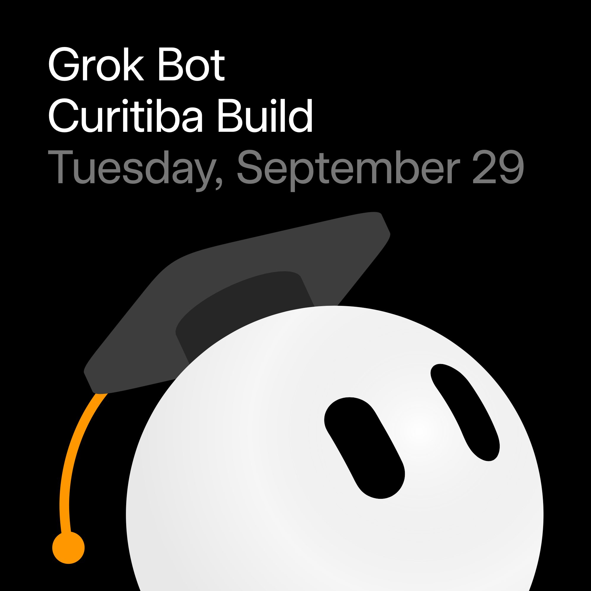
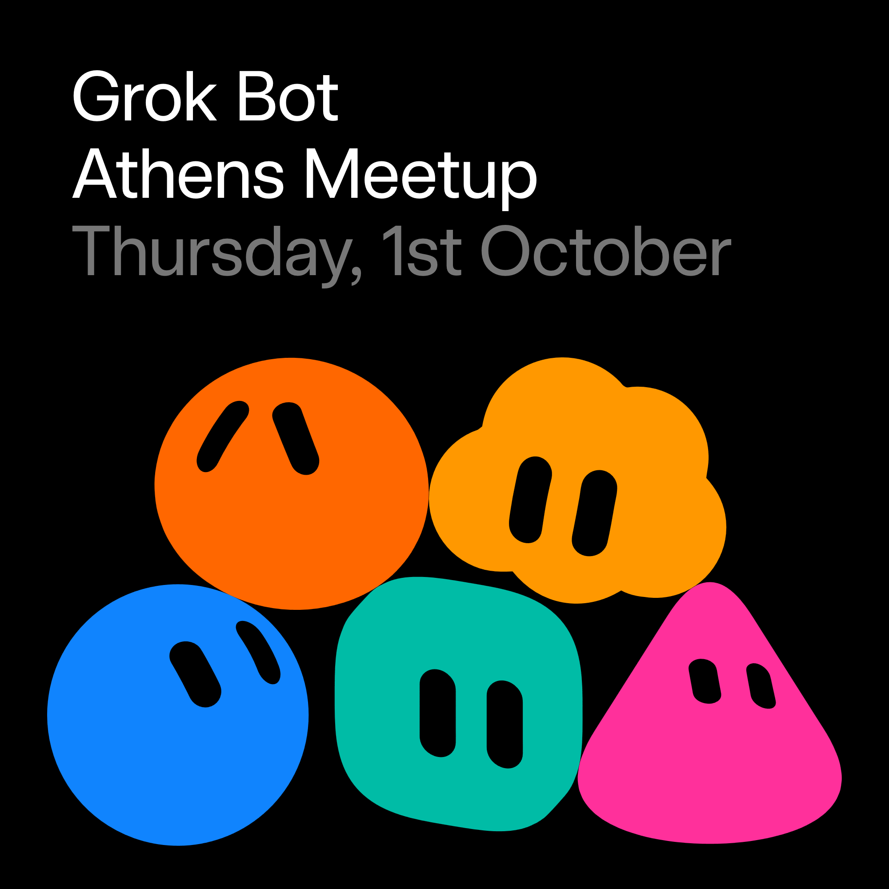
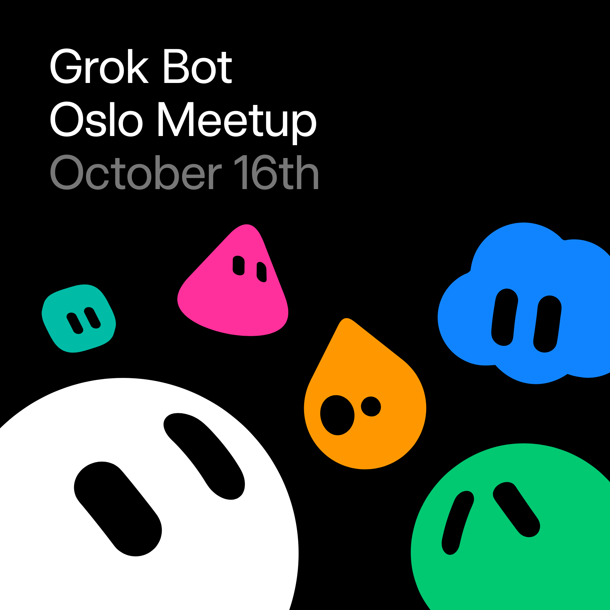

# Upcoming

<strong>EN</strong> · <a href="./EVENTS.zh.md"><strong>中文</strong></a> · <a href="./EVENTS.ja.md"><strong>日本語</strong></a>

Posters, venues, and how to register. The README groups cities by country; tap a name to jump here.

[Back to the list](./README.md)

### China

<table><tr><td width="320" valign="top"></td><td valign="top"><strong>Grok Bot Meetup Shanghai</strong> Sun 18 Oct 2026, 14:00–18:30 (CST) Shanghai · exact address after you register  Shanghai in-person Grok Bot meetup: icebreaker + talks/workshop. Pre-register, host approval. Forum 170454. Note: Luma API clock currently 09:00–10:00 HKT (1h) — use poster/forum 14:00–17:00 +08.  <a href="https://luma.com/spacexai-kh2x"><strong>Register on Luma → →</strong></a></td></tr></table>

<table><tr><td width="320" valign="top"></td><td valign="top"><strong>Grok Bot Meetup Wuhan</strong> Sat 17 Oct 2026, 14:00–17:30 (Asia/Shanghai, GMT+8) Wuhan, Hubei (venue TBD — updated on Luma after confirm)  Wuhan Grok Bot meetup: icebreaker + share/workshop. SpaceXAI product framing (AI teammates that sign into your tools and bring finished work back). Pre-registration with host approval; WeChat group after approve; speakers/volunteers welcome. Hosts Hanbing Zhang, chenchong, yuepu; free; ~150 seats. Distinct from same-day sha-20261017 Shanghai.  <a href="https://luma.com/kss59f4e"><strong>Apply on Luma (host approval) →</strong></a></td></tr></table>

### United States

<table><tr><td width="320" valign="top"></td><td valign="top"><strong>Grok Bot Meetup Pittsburgh</strong> Tue 13 Oct 2026, 18:30–20:30 (EDT) Pittsburgh · Oakland / Lawrenceville (exact address after you register)  Pittsburgh's first city Grok Bot meetup (not campus-only). Short demo then build/swap setups; students + working folks welcome. Host Micah Smith; free; open registration (~30 seats).  <a href="https://luma.com/6lx5t8ru"><strong>Register on Luma →</strong></a></td></tr></table>

<table><tr><td width="320" valign="top"></td><td valign="top"><strong>Grok Bot Miami Kickoff</strong> Wed 23 Sep 2026, 18:30–21:30 (America/New_York, EDT) Miami, FL · The DOCK, 400 NW 26th St (Wynwood)  First Grok Bot Kickoff for SpaceXAI for Miami (ex Cursor Community Miami energy): live demos, real builders, first look at putting AI agents to work. Agenda TBA; laptop welcome. Venue The DOCK Wynwood. Hosts Ben Milshtein & The LAB Miami; free; host approval (manual); guest_count 0 at scan.  <a href="https://luma.com/spacexai-kxjz"><strong>Register →</strong></a></td></tr></table>

<table><tr><td width="320" valign="top"></td><td valign="top"><strong>Grok Bot Meetup Atlanta</strong> Thu 24 Sep 2026, 18:00–20:00 (America/New_York, EDT) Alpharetta, GA (Atlanta metro) · Tech North Atlanta, 925 North Point Pkwy Ste 130  SpaceXAI for Atlanta intro meetup: demo-first after work — what Grok Bot is, product walkthrough, live AI-assisted architecture demo, Q&A/open mic, food & coffee, free parking. Hosts Raj Poloju & Sreyas Gentela; free; open registration (no approval); laptop optional; guest_count 0 at scan. Forum 171336.  <a href="https://luma.com/ihgtq394"><strong>Register on Luma → →</strong></a></td></tr></table>

<table><tr><td width="320" valign="top"></td><td valign="top"><strong>Grok Bot Meetup Philadelphia</strong> Tue 29 Sep 2026, 18:00–20:30 (America/New_York / EDT, UTC−4) Philadelphia, PA · Indy Hall Clubhouse, 709 N 2nd St 3rd Floor  SpaceXAI for Philadelphia first Grok Bot Meetup (hosts Luis Cielak, Malcolm Jones). Multi-agent workflow sharing: Think–Pair–Share on real agent setups, builders’ agentic flows, free food/drinks, Free Grok credits. Free; no approval; guest_count 49 at scan. Venue Indy Hall. Overnight rename: evening Sep12 still listed as “Cursor Meetup Philadelphia — September” (Cursor noise, not proposed); now title+body are Grok Bot Meetup. Distinct from expired campus nights phl-20260903 / tmp-20260903.  <a href="https://luma.com/cursor-hdle"><strong>Register on Luma →</strong></a></td></tr></table>

<table><tr><td width="320" valign="top"></td><td valign="top"><strong>Grok Bot for Design build night (LA)</strong> Tue 22 Sep 2026, 17:00–20:30 (America/Los_Angeles / PDT, UTC−7) Los Angeles, CA · venue TBA (offline)  SpaceXAI Community Grok Bot build night for Design (host Sunita Rao; forum 171544). Agenda 17:00–20:30: overview, SpaceXAI Design team live demos, Q&A, build time + free Grok Bot credits, attendee demos. Offline; free; guest_count 0 at scan. Local date Sep 22 (UTC start 09-23T00:00Z). Vanity grokbotdesign-la (= spacexai-o5ji).  <a href="https://luma.com/grokbotdesign-la"><strong>Register on Luma → →</strong></a></td></tr></table>

<table><tr><td width="320" valign="top"></td><td valign="top"><strong>Grok Bot for Engineering build night (Seattle)</strong> Thu 24 Sep 2026, 17:00–20:30 (America/Los_Angeles / PDT, UTC−7) Seattle, WA · venue TBA (offline)  SpaceXAI Community Grok Bot build night for Engineering (host Sunita Rao; forum 171546). Agenda 17:00–20:30 Pacific: overview, SpaceXAI Engineering demos, Q&A, build time + free Grok Bot credits. Offline; free; guest_count 0. Local date Sep 24 (UTC start 09-25T00:00Z; Luma tz America/Los_Angeles = Pacific, correct for Seattle). Vanity grokbotengineering-seattle (= spacexai-xn5j).  <a href="https://luma.com/grokbotengineering-seattle"><strong>Register on Luma → →</strong></a></td></tr></table>

<table><tr><td width="320" valign="top"></td><td valign="top"><strong>Grok Bot for Product build night (SF)</strong> Tue 29 Sep 2026, 17:00–20:30 (America/Los_Angeles / PDT, UTC−7) San Francisco, CA · venue TBA (offline)  SpaceXAI Community Grok Bot build night for Product (host Sunita Rao; forum 171547). Distinct from Howard SF sfpm-20260915 (Product Managers, Sep 15 afternoon). Agenda 17:00–20:30: SpaceXAI Product team demos, Q&A, build + free Grok Bot credits. Offline; free; guest_count 0. Local date Sep 29 (UTC start 09-30T00:00Z). Vanity grokbotproduct-sf (= spacexai-81pf).  <a href="https://luma.com/grokbotproduct-sf"><strong>Register on Luma → →</strong></a></td></tr></table>

<table><tr><td width="320" valign="top"></td><td valign="top"><strong>Grok Bot build night for Recruiting (Chicago)</strong> Wed 30 Sep 2026, 17:00–20:30 (America/Chicago / CDT, UTC−5) Chicago, IL · venue TBA (offline)  SpaceXAI Community Grok Bot build night for Recruiting (host Sunita Rao; forum 171548). Agenda 17:00–20:30 CDT: overview, SpaceXAI team demos, Q&A, build time + free Grok Bot credits. Offline; free; guest_count 0. First Chicago Grok Bot listing. Vanity grokbotrecruiting-chicago (= spacexai-k0po).  <a href="https://luma.com/grokbotrecruiting-chicago"><strong>Register on Luma → →</strong></a></td></tr></table>

<table><tr><td width="320" valign="top"></td><td valign="top"><strong>Grok Bot Meetup Greenville</strong> Thu 8 Oct 2026, 18:00–20:00 (America/New_York / ET, UTC−4) Greenville, SC — venue TBA (offline; soft capacity 50–75 with waitlist)  Greenville's first catalogued Grok Bot meetup (host Brad Shannon; personal Luma calendar). Agenda: doors ~17:45, welcome + what Grok Bot is (~10m), live demo/lightning (~25m), open Q&A (~15m), hang/build-along (~25m+). Bring laptop; download ahead from https://x.ai/bot. Designers/PMs/founders/devs welcome. Free RSVP (spots_remaining 66 at scan; guest_count 9). Venue TBA in Greenville SC — page will update when locked. New discover slug utdchtxv (evt-Xgc3aGOMGuCiWw9); no forum New-event post yet.  <a href="https://luma.com/utdchtxv"><strong>Register on Luma → →</strong></a></td></tr></table>

<table><tr><td width="320" valign="top"></td><td valign="top"><strong>Grok Bot Boston Hackathon</strong> Fri 9 Oct 2026, 09:00–15:00 (America/New_York) Boston / Cambridge · CambridgeSide — offline hackathon  Grok Bot Boston Hackathon at CambridgeSide — build with Grok Bot teammates in person. SpaceXAI Community listing.  <a href="https://luma.com/spacexai-zk6r"><strong>Register on Luma →</strong></a></td></tr></table>

<table><tr><td width="320" valign="top"></td><td valign="top"><strong>GROK BOT MASTERCLASS: Build a Mini Company with Grok Bot</strong> Sun 4 Oct 2026, 13:00–16:00 (America/Chicago) Austin · Antler VC, 800 Brazos St #340, Austin, TX 78701, USA — offline  AI Implementation Club masterclass in Austin: build a mini company with Grok Bot at Antler VC. Register on Luma.  <a href="https://luma.com/GrokBotClass"><strong>Register on Luma →</strong></a></td></tr></table>

<table><tr><td width="320" valign="top"></td><td valign="top"><strong>Cursor Meetup Philadelphia — October</strong> Tue 27 Oct 2026, 18:00–20:30 (America/New_York) Philadelphia · SpaceXAI for Philadelphia — offline  October SpaceXAI Community Cursor/Grok meetup in Philadelphia. Follow-on to the Sep 29 Grok Bot meetup; register on Luma.  <a href="https://luma.com/cursor-c2mq"><strong>Register on Luma →</strong></a></td></tr></table>

<table><tr><td width="320" valign="top"></td><td valign="top"><strong>Cursor Meetup Philadelphia — November</strong> Tue 17 Nov 2026, 18:00–20:30 (America/New_York) Philadelphia · SpaceXAI for Philadelphia — offline  November SpaceXAI Community Cursor/Grok meetup in Philadelphia. Register on Luma.  <a href="https://luma.com/cursor-acqy"><strong>Register on Luma →</strong></a></td></tr></table>

<table><tr><td width="320" valign="top"></td><td valign="top"><strong>Cursor Meetup Philadelphia — December</strong> Thu 17 Dec 2026, 18:00–20:30 (America/New_York) Philadelphia · SpaceXAI for Philadelphia — offline  December SpaceXAI Community Cursor/Grok meetup in Philadelphia. Register on Luma.  <a href="https://luma.com/cursor-8wr8"><strong>Register on Luma →</strong></a></td></tr></table>

<table><tr><td width="320" valign="top"></td><td valign="top"><strong>Grok Bot Meetup Tampa Bay</strong> Sat 14 Nov 2026, 13:00–16:00 (America/New_York) Tampa Bay, FL · venue TBA (address after register). Offline.  Offline Grok Bot meetup in Tampa Bay hosted with SpaceXAI Tampa. Register on Luma.  <a href="https://luma.com/spacexai-g0x6"><strong>Register on Luma →</strong></a></td></tr></table>

### Brazil

<table><tr><td width="320" valign="top"></td><td valign="top"><strong>Grok Bot Vitoria da Conquista Meetup</strong> Wed 14 Oct 2026, 19:00–22:00 (America/Bahia, UTC−3) Hub Conquista, Av. Juracy Magalhães 3405 — Boa Vista, Vitória da Conquista, BA, Brazil (offline)  Offline Grok Bot meetup in Vitória da Conquista, Bahia (listed under SpaceXAI for Salvador calendar; hosts Benjamin Bauer, Sarah Ferreira Reis). Agenda: networking, talks/workshop, Q&A around SpaceXAI Grok Bot (“AI teammates you can give real work to”). Venue Hub Conquista with full street address; free, no approval gate; guest_count 1 at scan. New community-cal slug cursor-iutk + forum 171709.  <a href="https://luma.com/cursor-iutk"><strong>Register on Luma → →</strong></a></td></tr></table>

<table><tr><td width="320" valign="top"></td><td valign="top"><strong>Grok Bot Curitiba Startups Meetup</strong> Wed 11 Nov 2026, 18:30–21:00 (BRT) Rua Marcos Moro 72, Curitiba  Curitiba startups meetup on building with Grok Bot, founder lessons, and shipping ideas in the agent era (speakers TBA). Host approval required.  <a href="https://luma.com/cursor-dx23"><strong>Apply on Luma (host approval) →</strong></a></td></tr></table>

<table><tr><td width="320" valign="top"></td><td valign="top"><strong>Grok Bot Meetup Florianópolis</strong> Sat 26 Sep 2026, 18:00–20:00 (BRT) Florianópolis, Brazil · Founder Haus - Jurerê In, Av. dos Merlins 156, Jurerê Internacional  First Grok Bot meetup in Florianópolis — demos of what locals are building. Forum 170449; ~25 interested; waitlist/approval.  <a href="https://luma.com/c293hlgc"><strong>Register on Luma → →</strong></a></td></tr></table>

<table><tr><td width="320" valign="top"></td><td valign="top"><strong>Grok Bot Build: Everyone can be a CTO now</strong> Tue 29 Sep 2026, 19:00–20:30 (America/Sao_Paulo) Curitiba, PR · PUCPR Bloco 6 (Escola de Medicina), Prado Velho — offline  SpaceXAI Curitiba build night: how Grok Bot teams let builders lead bot fleets. Talk + quick hands-on at PUCPR. Register on Luma.  <a href="https://luma.com/spacexai-qgll"><strong>Register on Luma →</strong></a></td></tr></table>

### Canada

<table><tr><td width="320" valign="top"></td><td valign="top"><strong>Grok Bot Meetup Calgary</strong> Wed 30 Sep 2026, 17:30–20:30 (MDT) Calgary · venue TBD after you register  In-person Grok Bot meetup in Calgary. Free, open registration.  <a href="https://luma.com/cursor-coel"><strong>Register on Luma →</strong></a></td></tr></table>

<table><tr><td width="320" valign="top"></td><td valign="top"><strong>Official Grok Bot Montreal - BUILD DAY</strong> Sat 3 Oct 2026, 12:00–17:00 (America/Toronto, EDT) Montréal, QC · Reflex (63 Rue de Brésoles), with SpaceXAI Community  Official Grok Bot Montreal Meetup at Reflex: quick Grok Bot tutorial, live community demos, open-floor social, mentors on site; credits and swag. Hosts Lucas & Samira G.; free; host approval; afternoon in-person. EventScheduled.  <a href="https://luma.com/hkujao4q"><strong>Register →</strong></a></td></tr></table>

<table><tr><td width="320" valign="top"></td><td valign="top"><strong>Grok Bot Meetup Toronto - October</strong> Mon 26 Oct 2026, 17:30–20:30 (America/Toronto, UTC-4) 800 Bay St area, Toronto, ON, Canada (exact suite obfuscated on Luma) — offline  Monthly Grok Bot Meetup Toronto — October edition (hosts Jia Ming Huang et al.; follows catalogued yyz-20260917 September). Agenda ~17:30–20:30 at 800 Bay: mingle, two speakers, Q&A, networking/building; dinner & drinks; Cursor credits for Grok Bot. Bring laptop; doors close 18:15 sharp. Free RSVP with approval (spots_remaining 400 at scan). Geo obfuscated to Toronto downtown on Luma. New discover slug mj5bmugc (evt-eO08FHgk6HTqIQW); no forum New-event post yet. Do not confuse with yyz-20260917.  <a href="https://luma.com/mj5bmugc"><strong>Register on Luma → →</strong></a></td></tr></table>

<table><tr><td width="320" valign="top"></td><td valign="top"><strong>Grok Bot Meetup Ottawa</strong> Sat 10 Oct 2026, 18:00–22:00 (America/Toronto, UTC-4) Nicol Building, Carleton University, 1125 Colonel By Dr, Ottawa, ON K1S 5B6, Canada — offline (room TBA)  First catalogued Grok Bot meetup in Ottawa (hosts Qurb E Muhammad Syed, Kaan UN, Feyza Gulbent, Builders Collective Ottawa, David Storozhenko). Evening at Carleton University: Grok Bot 101, live demos, builder showcases, credits, networking. Devs/designers/founders/PMs/students welcome — no prior experience. Free RSVP with approval; bring a laptop. Discover slug phs5tofz (evt-B35bqngFNoe8UXB); no forum New-event post yet.  <a href="https://luma.com/phs5tofz"><strong>Register on Luma → →</strong></a></td></tr></table>

### Indonesia

<table><tr><td width="320" valign="top"></td><td valign="top"><strong>Grokbot Workshop Bali (Udayana)</strong> Sun 4 Oct 2026, 11:00–14:00 (WITA) Jimbaran / Badung, Bali · Udayana University, Jl. Raya Kampus Unud  Campus Grok Bot workshop for students/devs/founders in Indonesia. Distinct from Sep 15 BukitHub meetup (bli-20260915). Forum 170448; waitlist/approval.  <a href="https://luma.com/lkmh86ad"><strong>Register on Luma → →</strong></a></td></tr></table>

<table><tr><td width="320" valign="top"></td><td valign="top"><strong>Grok Bot Meetup Jakarta</strong> Sat 3 Oct 2026 10:00 – Sun 4 Oct 2026 13:00 (Asia/Jakarta, WIB) Jakarta, Indonesia · venue listed as Jakarta (SpaceXAI for Jakarta calendar)  Official-style Grok Bot Meetup Jakarta (SpaceXAI for Jakarta): community case studies, how to use Personal Agents, how Ambassadors use Grok Bot, Q&A, networking. Host Naufaldi; free; host approval; ~100 spots; guest_count 0 at scan. Offline; HTML EventScheduled; API_OK (evt-1VwgjzY1wKKanAs). Distinct from nearby Bandung (bdg-20260919) / Tangerang (tgr-20260911) End time updated to Sun 4 Oct 2026 13:00 WIB (+1 day).  <a href="https://luma.com/spacexai-zb6b"><strong>Apply on Luma (host approval) →</strong></a></td></tr></table>

<table><tr><td width="320" valign="top"></td><td valign="top"><strong>SpaceXAI Hackathon Indonesia</strong> Sat 7 Nov 2026, 07:00–20:00 (Asia/Jakarta) Jakarta, Indonesia — offline hackathon (exact venue on Luma)  SpaceXAI Hackathon Indonesia in Jakarta — multi-day offline build around Grok Bot / SpaceXAI Community.  <a href="https://luma.com/d4b0eg4v"><strong>Register on Luma →</strong></a></td></tr></table>

<table><tr><td width="320" valign="top"></td><td valign="top"><strong>Grok Bot Meetup Bali</strong> Sun 25 Oct 2026, 13:00–16:00 (Asia/Makassar) Canggu / Badung, Bali · address after register — offline  SpaceXAI Bali Grok Bot meetup in Canggu: workflows, credits, food/drinks. Designers, PMs, founders, beginners welcome. Register on Luma.  <a href="https://luma.com/ubpln69o"><strong>Register on Luma →</strong></a></td></tr></table>

### Mexico

<table><tr><td width="320" valign="top"></td><td valign="top"><strong>Grok Bot Meetup Puebla</strong> Thu 24 Sep 2026, 18:00–22:00 (CST) Puebla · exact address after you register  First Grok Bot meetup in Puebla. Host approval required.  <a href="https://luma.com/puebla-d4iw"><strong>Apply on Luma (host approval) →</strong></a></td></tr></table>

<table><tr><td width="320" valign="top"></td><td valign="top"><strong>Grok Bot Meetup Chihuahua</strong> Thu 24 Sep 2026, 16:00–19:00 (America/Chihuahua) Chihuahua, Mexico · LivingLab CUU, Av. George Washington 3701-13  First Chihuahua Grok Bot × SpaceXAI meetup at LivingLab CUU (credits to try ideas). Host Alfonso Reyes; approval; ~200 seats.  <a href="https://luma.com/spacexai-7lje"><strong>Apply on Luma (host approval) →</strong></a></td></tr></table>

<table><tr><td width="320" valign="top"></td><td valign="top"><strong>Grok Bot Meetup Mexico City</strong> Sat 26 Sep 2026, 09:00–13:00 (CDMX) Mexico City · Sandbox Hub, Luis G. Urbina 4-dpto. 103, Polanco  First CDMX Grok Bot meetup at Sandbox Hub Polanco — hang out and swap real uses. Hosts Javier Rivero / Ben Kim / Ricardo García; approval; ~60 seats.  <a href="https://luma.com/spacexai-89bf"><strong>Apply on Luma (host approval) →</strong></a></td></tr></table>

<table><tr><td width="320" valign="top"></td><td valign="top"><strong>Grok Monterrey Hackathon</strong> Sat 3 Oct 2026, 10:00–17:00 (America/Monterrey) Monterrey, Mexico — offline (exact venue on Luma)  Grok Monterrey Hackathon (SpaceXAI for Monterrey) — day-of build event distinct from earlier mty-20260910 meetup.  <a href="https://luma.com/5ohq71b3"><strong>Register on Luma →</strong></a></td></tr></table>

### Spain

<table><tr><td width="320" valign="top"></td><td valign="top"><strong>Grok Bot Meetup Barcelona</strong> Tue 29 Sep 2026, 18:00–20:00 (Europe/Madrid / CEST, UTC+2) Carrer de Llull, Barcelona (exact address TBA) · near Poblenou metro L4 · offline (stream fallback if full)  First Grok Bot Meetup in Barcelona (SpaceXAI for Barcelona; hosts Marc Nebot I Moyano, Walter Troiani). Practical Spanish-language workshop: 18:00 setup/credits, 18:15 intro, 18:30 short community demos, 19:00 build bots, 19:45 Q&A. Bring laptop/phone; credits provided on-site, no prior install/account required. Address on Carrer de Llull TBA near Poblenou L4; approval-gated; guest_count 7 at scan. Hybrid stream only if seats fill. New community-cal slug 802d0upt + forum 171706.  <a href="https://luma.com/802d0upt"><strong>Register on Luma → →</strong></a></td></tr></table>

<table><tr><td width="320" valign="top"></td><td valign="top"><strong>Grok Bot Madrid Meetup</strong> Tue 29 Sep 2026, 17:30–21:30 (Europe/Madrid, CEST) Madrid, Spain · Pl. del Callao, 1 (Samplia Hub / mad.builders)  First Grok Bot Meetup in Madrid: practical workshop afternoon — live try Grok Bot, short community demos, then build bots for a challenge you bring (or host-supplied ideas). Credits provided on site; laptop or phone OK; Spanish (English welcome). Agenda 17:30 setup → 18:00 intro → 18:20 demos → 19:00 workshop → 20:30 networking/~21:30. Hosts Felipe Basurto & Alvaro Fragoso (Mad Builders); free; host approval; ~60 spots; guest_count 0 at scan. Forum 171020.  <a href="https://luma.com/grokbotmadrid1"><strong>Register →</strong></a></td></tr></table>

<table><tr><td width="320" valign="top"></td><td valign="top"><strong>Cafe Cursor València</strong> Fri 25 Sep 2026, 10:00–17:00 (Europe/Madrid) València · SpaceXAI for Valencia — offline  Cafe Cursor cowork session in València under the SpaceXAI Community calendar. Register on Luma.  <a href="https://luma.com/cpgwzo6n"><strong>Register on Luma →</strong></a></td></tr></table>

### Germany

<table><tr><td width="320" valign="top"></td><td valign="top"><strong>Grok Bot Meetup Cologne</strong> Fri 9 Oct 2026, 18:00–21:00 (CEST) Cologne (address revealed after registration)  Cologne Grok Bot meetup: networking, talks/workshop, hands-on with a real task (Windows/Mac laptop or iPhone; download x.ai/bot). Agenda 18:00 check-in → 18:30 demo & hands-on → 20:00 chat; open to more Grok Bot speakers. Hosts Emmanuel Ketcha, Eyad Kelleh, Babajide Mayowa Moibi, Teoman Köse; free; host approval; ~50 seats.  <a href="https://luma.com/spacexai-cologne-meetup1"><strong>Apply on Luma (host approval) →</strong></a></td></tr></table>

<table><tr><td width="320" valign="top"></td><td valign="top"><strong>Grok Bot Stuttgart Meetup</strong> Thu 15 Oct 2026, 17:30–21:00 (Europe/Berlin, UTC+2 / CEST) Epplestraße 225/haus 3, 70567 Stuttgart-Möhringen, Germany — offline (first floor)  First Grok Bot Meetup in Stuttgart (host Sachin Agrawal, AI collective Stuttgart chapter lead / SpaceXAI ambassador). Evening to try Grok Bot, see demos, hang with the SpaceXAI community. Free RSVP with approval (spots_remaining 84; guest_count 6). Luma slug spacexai-z2er (evt-DCND2YYEcL1xi1I); forum New-event 171988.  <a href="https://luma.com/spacexai-z2er"><strong>Register on Luma → →</strong></a></td></tr></table>

### Ecuador

<table><tr><td width="320" valign="top"></td><td valign="top"><strong>Grok Bot Meetup Quito</strong> Thu 24 Sep 2026, 19:30–21:30 (ECT) Quito, Ecuador · exact address after you register  In-person Grok Bot meetup in Quito. Free, host approval, 47 seats left.  <a href="https://luma.com/grokbotquitomeetup"><strong>Apply on Luma (host approval) →</strong></a></td></tr></table>

<table><tr><td width="320" valign="top"></td><td valign="top"><strong>Grok Bot Meetup Cumbayá</strong> Sat 3 Oct 2026, 09:30–12:00 (ECT) Cumbayá, Quito, Ecuador  In-person Grok Bot meetup in Cumbayá. Free, waitlist open, 37 seats left.  <a href="https://luma.com/cccumbaya"><strong>Register on Luma →</strong></a></td></tr></table>

### Guatemala

<table><tr><td width="320" valign="top"></td><td valign="top"><strong>Grok Bot Meetup Guatemala City</strong> Sat 3 Oct 2026, 10:00–14:00 (CST) Universidad Francisco Marroquín, Zona 10, Guatemala City · street after you register  Open2 Grok Bot meetup in Guatemala City: go beyond one-off tasks with better instructions, context, and end-to-end workflows, plus credits to try Grok Bot (~36 going, host approval).  <a href="https://luma.com/cursor-is2h"><strong>Apply on Luma (host approval) →</strong></a></td></tr></table>

<table><tr><td width="320" valign="top"></td><td valign="top"><strong>Grok Bot Meetup Guatemala</strong> Sat 5 Dec 2026, 15:00–20:00 (America/Guatemala) Guatemala · venue TBA (see Luma / host update) — offline  SpaceXAI Guatemala offline Grok Bot meetup (forum + Luma). Register on Luma for venue details.  <a href="https://luma.com/spacexai-97mt"><strong>Register on Luma →</strong></a></td></tr></table>

### Kazakhstan

<table><tr><td width="320" valign="top"></td><td valign="top"><strong>Grok Bot Meetup Astana</strong> Fri 2 Oct 2026, 14:00–17:00 (Asia/Almaty, UTC+5) Astana, Kazakhstan — offline (exact venue city-level on Luma / shared after RSVP)  First Grok Bot meetup in Astana — part of a Central Asia & Caucasus series. Offline builders meetup to try Grok Bot, demos and community hang. Free RSVP on Luma (slug t1l3nqrc, evt-ZSiPrvUD7Jlgf2A). Opened via discover; OG title verified 2026-09-18.  <a href="https://luma.com/t1l3nqrc"><strong>RSVP on Luma →</strong></a></td></tr></table>

<table><tr><td width="320" valign="top"></td><td valign="top"><strong>Grok Bot Meetup Almaty</strong> Sun 4 Oct 2026, 14:00–17:00 (Asia/Almaty, UTC+5) Almaty, Kazakhstan — offline (exact venue city-level on Luma / shared after RSVP)  First Grok Bot meetup in Almaty — part of a Central Asia & Caucasus series. Offline builders meetup to try Grok Bot, demos and community hang. Free RSVP on Luma (slug vod1qyrk, evt-9chPv7suc0e5yxp). Opened via discover; OG title verified 2026-09-18.  <a href="https://luma.com/vod1qyrk"><strong>RSVP on Luma →</strong></a></td></tr></table>

### Vietnam

<table><tr><td width="320" valign="top"></td><td valign="top"><strong>Grok Bot Meetup Da Nang</strong> Sat 3 Oct 2026, 13:00–16:00 (Asia/Ho_Chi_Minh, UTC+7) 1710 Cafe & Society, 10 Trần Quý Cáp, Hải Châu, Đà Nẵng 550000, Vietnam — offline  Grok Bot Meetup in Da Nang, Vietnam (hosts Keith Vaughan, Laksh Arora; Frontier Club Da Nang support). Agenda 13:00–16:00: arrive/merch, icebreakers, Q&A/office hours with SpaceXAI/Cursor team, lightning demos (Grok Bot workflows), refreshments/networking. Free open RSVP (spots_remaining 70 at scan). Venue 1710 Cafe & Society, Hải Châu. New discover slug spacexai-80r9 (evt-JtbHchgrITq7vfI); no forum New-event post yet.  <a href="https://luma.com/spacexai-80r9"><strong>Register on Luma → →</strong></a></td></tr></table>

<table><tr><td width="320" valign="top"></td><td valign="top"><strong>Grok Bot Meetup HCMC</strong> Sat 26 Sep 2026, 13:00–17:00 (Asia/Ho_Chi_Minh, UTC+7) Ho Chi Minh City, Vietnam — offline (exact venue city-level on Luma / shared after RSVP)  1st official Grok Bot Meetup in HCMC (hosts David Zhang, Ivan Paulo, Sandra Vu; SpaceXAI Community). Sat afternoon builders meetup — try Grok Bot, demos, community hang. Free RSVP with approval (spots_remaining 94; guest_count 6). Distinct from catalogued dad-20261003 Da Nang. Luma slug spacexai-wgmy (evt-VutI63orxqoXqGW); forum New-event 171994.  <a href="https://luma.com/spacexai-wgmy"><strong>Register on Luma → →</strong></a></td></tr></table>

### Argentina

<table><tr><td width="320" valign="top"></td><td valign="top"><strong>Grok Bot Meetup Mendoza</strong> Sat 3 Oct 2026, 17:00–20:00 (ART) Mendoza TIC Parque Tecnológico, Rafael Cubillos 2100-2198, Godoy Cruz  In-person Grok Bot meetup in Mendoza. Open registration.  <a href="https://luma.com/cursor-mtu0"><strong>Register on Luma →</strong></a></td></tr></table>

### Australia

<table><tr><td width="320" valign="top"></td><td valign="top"><strong>Grok Bot Meetup Sydney</strong> Wed 7 Oct 2026, 17:30–21:00 (AEDT) Sydney · exact address after you register  Next official Cursor Sydney Grok Bot night after the August meetup. Host approval required.  <a href="https://luma.com/cursor-d70v"><strong>Apply on Luma (host approval) →</strong></a></td></tr></table>

### Azerbaijan

<table><tr><td width="320" valign="top"></td><td valign="top"><strong>Grok Bot Meetup Baku</strong> Sun 27 Sep 2026, 15:00–18:00 (Asia/Baku, UTC+4) Baku, Azerbaijan — offline (exact venue city-level on Luma / shared after RSVP)  First Grok Bot meetup in Baku — part of a Central Asia & Caucasus series. Offline builders meetup to try Grok Bot, demos and community hang. Free RSVP on Luma (slug ydy9qy6h, evt-u0gJBz3jwCKYY7h). Opened via discover; OG title verified 2026-09-18.  <a href="https://luma.com/ydy9qy6h"><strong>RSVP on Luma →</strong></a></td></tr></table>

### Benin

<table><tr><td width="320" valign="top"></td><td valign="top"><strong>Grok Bot Benin Workshop</strong> Sat 3 Oct 2026, 09:00–13:00 (Africa/Lagos / WAT, UTC+1) Bibliothèque Benin Excellence, Godomey (Cotonou metro), Benin — offline  SpaceXAI Benin Community workshop in Godomey/Cotonou (host Aina René Régis KIKI; calendar SpaceXAI for Cotonou, Benin). Hands-on: Grok Bot onboarding + AI coding / prompt practices + product building from idea to testable prototype; networking with Benin's tech community. Students, beginner/advanced devs, and AI-curious welcome. Free Standard RSVP (guest_count 0 at scan; registration open). Venue: Bibliothèque Benin Excellence, Godomey. Slug spacexai-fd2l (evt-l3Gjkx4wZqGR6hg); no forum New-event post yet.  <a href="https://luma.com/spacexai-fd2l"><strong>Register on Luma → →</strong></a></td></tr></table>

### Bolivia

<table><tr><td width="320" valign="top"></td><td valign="top"><strong>Grok Bot Meetup Santa Cruz</strong> Sat 26 Sep 2026, 08:30–12:00 (America/La_Paz, UTC-4) Universidad Central (Unicen), Ave Trinidad 425, Santa Cruz de la Sierra, Bolivia — offline  First catalogued Grok Bot meetup in Santa Cruz de la Sierra, Bolivia (host Diego Oliver; Luma calendar cal-tnfyxEeXhQo3zzR). Spanish-language morning workshop: intro to Grok Bot, hands-on build time, share & learn, community networking. Devs/students/founders/curious welcome — no expertise required. Free RSVP with approval; venue Universidad Central (Unicen). New discover slug spacexai-gc1m (evt-q3GcSfBGYdfY0h1); no forum New-event post yet.  <a href="https://luma.com/spacexai-gc1m"><strong>Register on Luma → →</strong></a></td></tr></table>

### Czechia

<table><tr><td width="320" valign="top"></td><td valign="top"><strong>Cursor Hackathon Prague: Forge the Stack</strong> Wed 30 Sep 2026, 12:30–19:00 (Europe/Prague) Prague · SpaceXAI for Prague — offline  SpaceXAI Community Cursor/Grok hackathon in Prague — Forge the Stack. In-person; register on Luma.  <a href="https://luma.com/cursor-mljb"><strong>Register on Luma →</strong></a></td></tr></table>

### United Kingdom

<table><tr><td width="320" valign="top"></td><td valign="top"><strong>Cursor Commerce London Hackathon</strong> Sat 26 Sep 2026, 09:00–18:00 (Europe/London) London · SpaceXAI for London — offline  SpaceXAI Community Cursor Commerce hackathon in London. In-person builders day; register on Luma.  <a href="https://luma.com/cursor-td9f"><strong>Register on Luma →</strong></a></td></tr></table>

### Georgia

<table><tr><td width="320" valign="top"></td><td valign="top"><strong>Grok Bot Meetup Tbilisi</strong> Sat 26 Sep 2026, 15:00–17:30 (Asia/Tbilisi, UTC+4) Tbilisi, Georgia — offline (exact venue city-level on Luma / shared after RSVP)  First Grok Bot meetup in Tbilisi — part of a Central Asia & Caucasus series. Offline builders meetup to try Grok Bot, demos and community hang. Free RSVP on Luma (slug 0scz2dff, evt-JEDpRvIA8X8CNUM). Opened via discover; OG title verified 2026-09-18.  <a href="https://luma.com/0scz2dff"><strong>RSVP on Luma →</strong></a></td></tr></table>

### Greece

<table><tr><td width="320" valign="top"></td><td valign="top"><strong>Grok Bot Meetup Athens</strong> Thu 1 Oct 2026, 18:00–21:00 (Europe/Athens) Athens · venue TBA (shared after register) — offline  SpaceXAI Athens evening with Grok Bot; talk by Kiara Polychroniadi (SpaceXAI field engineer). Bring a laptop. Register on Luma.  <a href="https://luma.com/8obtzdvs"><strong>Register on Luma →</strong></a></td></tr></table>

### Ireland

<table><tr><td width="320" valign="top"></td><td valign="top"><strong>Grok Bot Dublin Builder Day</strong> Sun 4 Oct 2026, 11:00–17:30 (Europe/Dublin, IST) Dublin 8, Ireland · Baseline (61 Thomas St), Dublin AI Week × Bronto  Full-day Grok Bot community build day (SpaceXAI for Dublin, part of Dublin AI Week, partner Bronto): live demo, build bots/workflows/agents, lunch, lightning demos, show&tell. Download ahead: x.ai/bot. Hosts Sanat Thukral & Manoj; free; host approval; ~96 spots; waitlist enabled.  <a href="https://luma.com/grokbot-dublin"><strong>Register →</strong></a></td></tr></table>

### India

<table><tr><td width="320" valign="top"></td><td valign="top"><strong>Grok Bot Meetup Rajkot</strong> Sat 26 Sep 2026, 10:00–13:00 (IST) Rajkot, Gujarat, India · exact address after you register  In-person Grok Bot meetup in Rajkot (Build, Automate & Grow with AI). Hosted under SpaceXAI for Rajkot; free; host approval; venue obfuscated until registered.  <a href="https://luma.com/grok-rajkot"><strong>Apply on Luma (host approval) →</strong></a></td></tr></table>

### Italy

<table><tr><td width="320" valign="top"></td><td valign="top"><strong>Grok Hackathon Padova</strong> Fri 25 Sep 2026, 19:00–23:00 (Europe/Rome) Padua · Via della Croce Rossa, 42 — offline  Grok Hackathon Padova at Via della Croce Rossa 42 — in-person SpaceXAI Community hackathon.  <a href="https://luma.com/cursor-v5ch"><strong>Register on Luma →</strong></a></td></tr></table>

### Japan

<table><tr><td width="320" valign="top"></td><td valign="top"><strong>Grok Bot Meetup Sapporo #2</strong> Fri 2 Oct 2026, 19:00–22:00 (JST) Sapporo · exact address after you register  Second Sapporo Grok Bot meetup. Free, host approval.  <a href="https://luma.com/91kju0je"><strong>Apply on Luma (host approval) →</strong></a></td></tr></table>

### Kyrgyzstan

<table><tr><td width="320" valign="top"></td><td valign="top"><strong>Grok Bot Meetup Bishkek</strong> Thu 1 Oct 2026, 10:00–12:30 (Asia/Bishkek, UTC+6) Bishkek, Kyrgyzstan — offline (exact venue city-level on Luma / shared after RSVP)  First Grok Bot meetup in Bishkek — part of a Central Asia & Caucasus series. Offline builders meetup to try Grok Bot, demos and community hang. Free RSVP on Luma (slug 7bexxjvh, evt-rtYvGpHxG2lETbU). Opened via discover; OG title verified 2026-09-18.  <a href="https://luma.com/7bexxjvh"><strong>RSVP on Luma →</strong></a></td></tr></table>

### Cambodia

<table><tr><td width="320" valign="top"></td><td valign="top"><strong>Grok Bot Meetup Phnom Penh</strong> Sat 3 Oct 2026, 14:00–16:00 (Asia/Bangkok, GMT+7) Phnom Penh · Smart Startup Space (Connexion Building, Koh Pich)  Cambodia's first Grok Bot meetup: demos, idea swap, on-site try-with-credits (laptop or phone OK), plus an online guest speaker. Co-organized with Smart Startup Space. Hosts Taka Kiyone & Luis Romero; free; host approval; ~80 seats; beginners welcome.  <a href="https://luma.com/spacexai-jt05"><strong>Apply on Luma (host approval) →</strong></a></td></tr></table>

### Kuwait

<table><tr><td width="320" valign="top"></td><td valign="top"><strong>Grok Bot Kuwait Meetup</strong> Mon 22 Sep 2026, 12:30–14:30 (Asia/Riyadh, GMT+3) Mubarak Al-Abdullah, Kuwait (Hawalli) · address after register  First Grok Bot × SpaceXAI meetup in Kuwait: discover Grok Bot, try it hands-on, meet local builders. 1-month Grok Bot credit for participants; snacks/drinks; bring iPhone/Android/Windows/Mac (no Cursor install needed). Host Asama Akhtar; free; host approval; ~24 seats left. Follow-up Build with Grok Bot workshop planned.  <a href="https://luma.com/197n9c91"><strong>Apply on Luma (host approval) →</strong></a></td></tr></table>

### Myanmar

<table><tr><td width="320" valign="top"></td><td valign="top"><strong>Grok Bot Yangon Workshop @ ACY</strong> Sat 26 Sep 2026, 13:30–17:00 (MMT) American Center Yangon  Hands-on Grok Bot workshop at American Center Yangon. Host approval required.  <a href="https://luma.com/cursor-qu3x"><strong>Apply on Luma (host approval) →</strong></a></td></tr></table>

### Netherlands

<table><tr><td width="320" valign="top"></td><td valign="top"><strong>Grok Bot Meetup Amsterdam</strong> Tue 22 Sep 2026, 18:30–21:30 (CEST) Amsterdam · venue TBD (address on Luma / after register)  First Grok Bot meetup in Amsterdam: evening cowork, local power-user demos, bring a laptop for credits. Free registration.  <a href="https://luma.com/grok-bot-amsterdam"><strong>Register on Luma → →</strong></a></td></tr></table>

### Norway

<table><tr><td width="320" valign="top"></td><td valign="top"><strong>Grok Bot Meetup Oslo</strong> Fri 16 Oct 2026, 17:00–19:00 (Europe/Oslo) Oslo · Mesh Youngstorget (Mesh Community), Møllergata 6–8 — offline  First SpaceXAI Grok Bot meetup in Oslo at MESH: build Bots, share ideas, credits provided. Register on Luma.  <a href="https://luma.com/spacexai-94dg"><strong>Register on Luma →</strong></a></td></tr></table>

### New Zealand

<table><tr><td width="320" valign="top"></td><td valign="top"><strong>Grok Bot Auckland Meetup</strong> Thu 8 Oct 2026, 18:00–21:00 (Pacific/Auckland) Auckland CBD · address shared with guests — offline  SpaceXAI Community Grok Bot meetup in Auckland, New Zealand. In-person builders session; register on Luma.  <a href="https://luma.com/spacexai-akl01"><strong>Register on Luma →</strong></a></td></tr></table>

### Philippines

<table><tr><td width="320" valign="top"></td><td valign="top"><strong>Grok Bot Meetup Cebu</strong> Sat 10 Oct 2026, 09:00–11:30 (Asia/Manila / PHT) Zero-Ten Park Cebu Mandaue, Mandaue, Central Visayas, Philippines — offline  In-person Grok Bot meetup in Cebu (rescheduled to Sat 10 Oct 2026). Host approval required.  <a href="https://luma.com/cursor-dyb8"><strong>Apply on Luma (host approval) →</strong></a></td></tr></table>

### Pakistan

<table><tr><td width="320" valign="top"></td><td valign="top"><strong>Grok Bot Karachi Meetup</strong> Sat 26 Sep 2026, 17:00–20:00 (Asia/Karachi) Karachi · COLABS Shahrah-e-Faisal, P.E.C.H.S Block 6, Karachi, Pakistan — offline  Offline Grok Bot meetup in Karachi at COLABS Shahrah-e-Faisal. Register on Luma.  <a href="https://luma.com/grokbot-karachi"><strong>Register on Luma →</strong></a></td></tr></table>

### Turkey

<table><tr><td width="320" valign="top"></td><td valign="top"><strong>Grok Bot Meetup Istanbul w/ Neon Apps & RevenueCat</strong> Tue 29 Sep 2026, 19:00–22:00 (Europe/Istanbul) Istanbul · Neon Apps (Digital Product Development Company) — offline  SpaceXAI Community Grok Bot meetup in Istanbul hosted with Neon Apps & RevenueCat. In-person builders session; register on Luma.  <a href="https://luma.com/spacexai-neonapps-revenuecat"><strong>Register on Luma →</strong></a></td></tr></table>

### Uganda

<table><tr><td width="320" valign="top"></td><td valign="top"><strong>Grok Bot Meetup Kampala</strong> Sat 3 Oct 2026, 14:00–17:00 (Africa/Nairobi / EAT, UTC+3) Kampala, Uganda · venue TBA (details after register)  SpaceXAI for Kampala, Uganda, Africa afternoon meetup (host Ronnie 3.0). Product copy: Grok Bot — SpaceXAI’s AI assistant with cloud agents that do real work, not just chat; getting started, practical workflows (planning/ops/day-to-day), Q&A; runs on Android/Mac/iOS/Linux; beginners welcome. Free; no approval; spots_remaining 100; guest_count 0 at scan. Luma geo blank (calendar city Kampala, UG). NEW vs morning discover (not in morning unknown-grokish / community cal).  <a href="https://luma.com/spacexai-upc4"><strong>Register on Luma → →</strong></a></td></tr></table>

### Uzbekistan

<table><tr><td width="320" valign="top"></td><td valign="top"><strong>Grok Bot Meetup Tashkent</strong> Tue 29 Sep 2026, 18:00–21:00 (Asia/Samarkand, UTC+5) Tashkent, Uzbekistan — offline (exact venue city-level on Luma / shared after RSVP)  First Grok Bot meetup in Tashkent — part of a Central Asia & Caucasus series. Offline builders meetup to try Grok Bot, demos and community hang. Free RSVP on Luma (slug pz9gxlzu, evt-l4cGFBWK7pNt5Fb). Opened via discover; OG title verified 2026-09-18.  <a href="https://luma.com/pz9gxlzu"><strong>RSVP on Luma →</strong></a></td></tr></table>

### Zambia

<table><tr><td width="320" valign="top"></td><td valign="top"><strong>Grok Bot Meetup Lusaka</strong> Fri 2 Oct 2026, 09:00–14:00 (Africa/Maputo / CAT, UTC+2) Lusaka, Zambia · venue TBA (details after register)  SpaceXAI Zambia / SpaceXAI for Lusaka hands-on meetup (host Lloyd situmbeko). Product copy: Grok Bot as an AI co-worker that logs into your tools and finishes real work. Live demo (real tools/tasks, not slides), Grok Bot credits for on-site trials, open build time, networking with food & drinks. Free; approval required; ~70 seats; guest_count 0 at scan. Event geo blank on Luma (calendar city Lusaka, ZM). NEW vs midday discover.  <a href="https://luma.com/spacexai-ol65"><strong>Register on Luma → →</strong></a></td></tr></table>

### Online

<table><tr><td width="320" valign="top"></td><td valign="top"><strong>Build with Grok Bot (Online)</strong> Sat 17 Oct 2026, 10:00–12:00 (America/Sao_Paulo) Online — link shared before the event (listed under Goiânia)  Build with Grok Bot online session (America/Sao_Paulo listing). Link shared before start; free registration on Luma.  <a href="https://luma.com/y22dqtvt"><strong>Register on Luma →</strong></a></td></tr></table>
