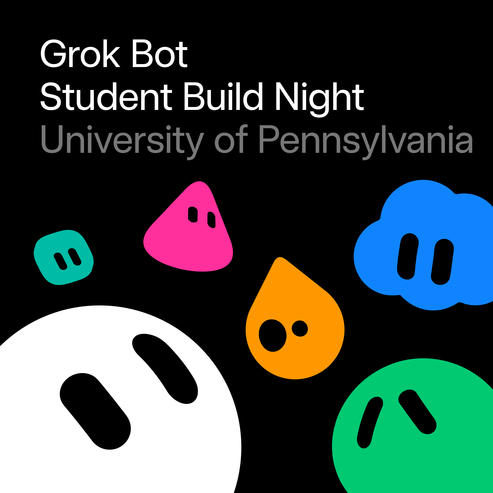
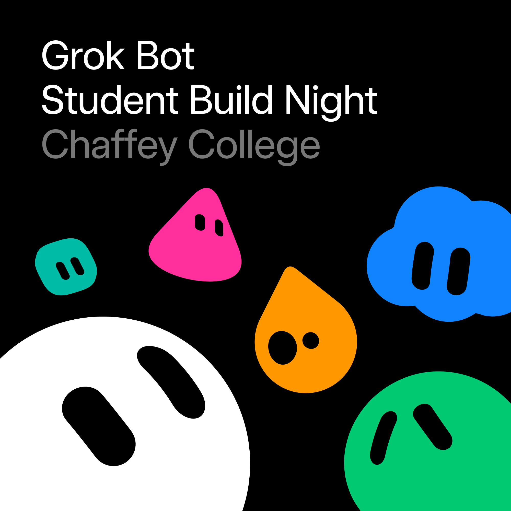
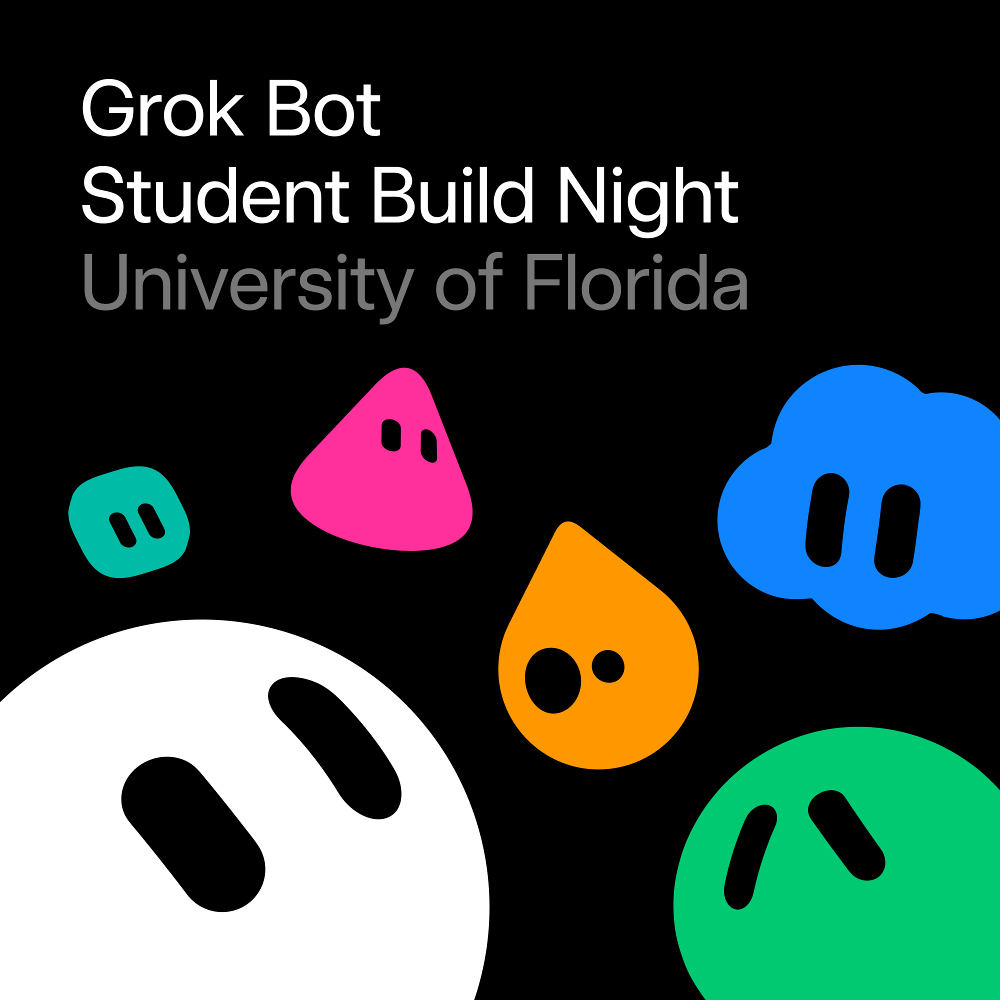
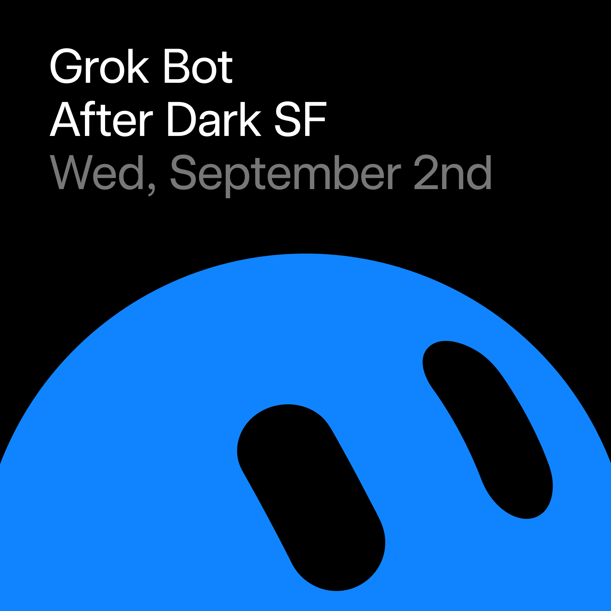
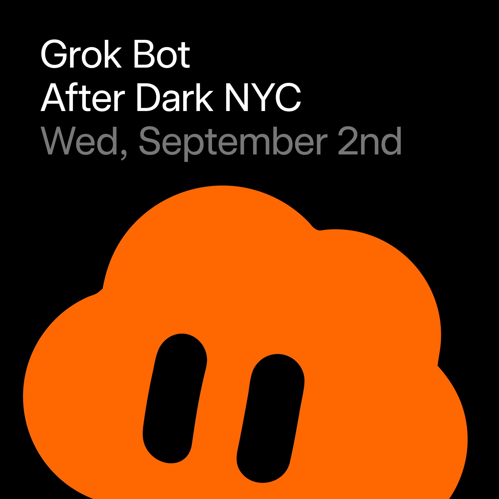
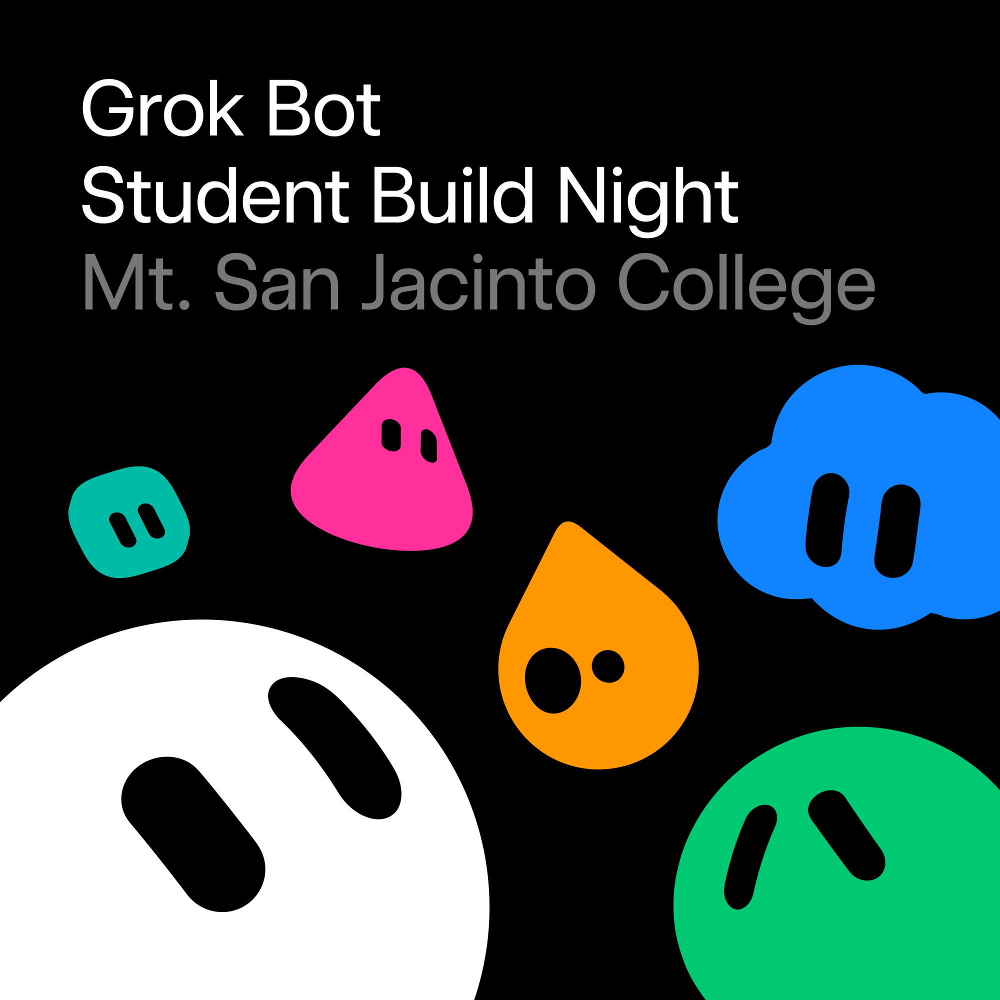
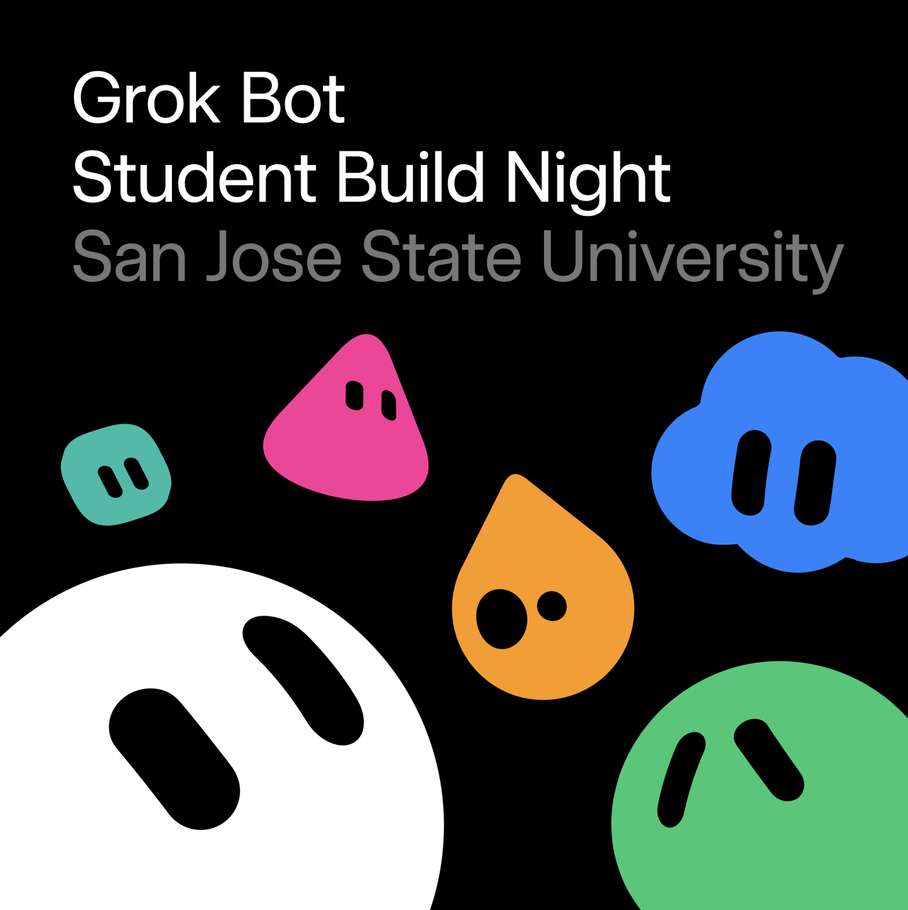

# Upcoming

<strong>EN</strong> · <a href="./EVENTS.zh.md"><strong>中文</strong></a> · <a href="./EVENTS.ja.md"><strong>日本語</strong></a>

Posters, venues, and how to register. The README groups cities by country; tap a name to jump here.

[Back to the list](./README.md)

### China

<table><tr><td width="320" valign="top"></td><td valign="top"><strong>Grok Bot Macau Student Workshop</strong> Sat 5 Sep 2026, 14:30-17:30 (GMT+8) University of Macau, Guest House N1-1005  Free student workshop: hands-on Grok Bot plus a founder talk. Cantonese with English support. 40 seats, now waitlist.  <a href="https://luma.com/cursor-macau-creativity-workshop-2026-sep"><strong>Join the waitlist on Luma →</strong></a></td></tr></table>

<table><tr><td width="320" valign="top"></td><td valign="top"><strong>Grok Bot Meetup Chengdu</strong> Sat 5 Sep 2026, 14:30–17:30 (GMT+8) Chengdu · exact address after you register  China’s second in-person Grok Bot meetup. Icebreaker + talks / workshop. Host approval, 22 seats left.  <a href="https://luma.com/pdj34ofn"><strong>Apply on Luma (host approval) →</strong></a></td></tr></table>

### United States

<table><tr><td width="320" valign="top"></td><td valign="top"><strong>Grok Bot Meetup Las Vegas</strong> Mon 15 Sep 2026, 18:00-20:00 (PDT) Las Vegas, NV, venue TBD after you register  Networking, talks/workshop, and a Cursor-team Q&A on video. Host approval required, venue still TBD.  <a href="https://luma.com/cursor-kaua"><strong>Register on Luma →</strong></a></td></tr></table>

<table><tr><td width="320" valign="top"></td><td valign="top"><strong>Grok Bot build night for women (SF)</strong> Wed 3 Sep 2026, 17:00–21:00 (PDT) a16z, 180 Townsend St, San Francisco  Low-pressure SF build night for women: learn Grok Bot capabilities and set one up together.  <a href="https://luma.com/a16zgrokbotbuildnight"><strong>Register on Luma →</strong></a></td></tr></table>

<table><tr><td width="320" valign="top"></td><td valign="top"><strong>Grok Bot Student Build Night (NYC)</strong> Thu 3 Sep 2026, 18:00–20:00 (EDT) SpaceXAI NYC · exact address after you register  Students build night at SpaceXAI NYC with a live Grok Bot demo, coworking, snacks, and a free month of Cursor Pro (includes Grok Bot).  <a href="https://luma.com/nc8i3yo7"><strong>Register on Luma →</strong></a></td></tr></table>

<table><tr><td width="320" valign="top"></td><td valign="top"><strong>Grok Bot Student Build Night (SF)</strong> Thu 3 Sep 2026, 18:00–20:00 (PDT) SpaceXAI SF · exact address after you register  Bay Area students meet at SpaceXAI SF for a Grok Bot demo, build time, networking, snacks, and a free month of Cursor Pro (includes Grok Bot).  <a href="https://luma.com/xyd87jsr"><strong>Register on Luma →</strong></a></td></tr></table>

<table><tr><td width="320" valign="top"></td><td valign="top"><strong>Grok Bot Student Build Night (Penn / Philadelphia)</strong> Thu 3 Sep 2026, 18:30–21:30 (EDT) Philadelphia (Penn Labs × PER × Product Space) · exact address after you register  Student Grok Bot build night with Penn Labs, PER, and Product Space: live demo of the always-on teammate with its own computer, then build/network/eat, plus a free month of Cursor Pro (includes Grok Bot).  <a href="https://luma.com/vkh1pg34"><strong>Register on Luma →</strong></a></td></tr></table>

<table><tr><td width="320" valign="top"></td><td valign="top"><strong>Grok Bot Build Night (UIUC / Champaign)</strong> Thu 3 Sep 2026, 17:30–19:00 (CDT) Siebel Center for Design, 1208 S 4th St, Champaign, IL (lower lobby)  UIUC student Grok Bot night at Siebel Center: one hour to build with the cloud-computer teammate, live demos, merch, and a free month of Cursor Pro (includes Grok Bot). Host approval, 30 spots.  <a href="https://luma.com/wmznb83e"><strong>Apply on Luma (host approval) →</strong></a></td></tr></table>

<table><tr><td width="320" valign="top"></td><td valign="top"><strong>Grok Bot Build Night (Iowa State / Ames)</strong> Thu 3 Sep 2026, 17:00–19:30 (CDT) Iowa State University Student Innovation Center, 606 Bissell Rd, Ames, IA  SpaceXAI × Iowa State GrokBot build night: agents that connect to Gmail/Slack/calendar/web, run on schedules, and hand off work — then live demos, plus a free month of Cursor Pro.  <a href="https://luma.com/00x0vh1t"><strong>Register on Luma →</strong></a></td></tr></table>

<table><tr><td width="320" valign="top"></td><td valign="top"><strong>Grok Bot Build Night (Pitt / Pittsburgh)</strong> Thu 3 Sep 2026, 18:00–20:00 (EDT) Sennott Square Room 5502, University of Pittsburgh, 3810 Forbes Ave, Pittsburgh, PA  SpaceXAI × AWS Cloud Club at Pitt Grok Bot build night in Sennott Square — every attendee gets one free month of Cursor Pro (includes Grok Bot).  <a href="https://luma.com/nbzn8j2m"><strong>Register on Luma →</strong></a></td></tr></table>

<table><tr><td width="320" valign="top"></td><td valign="top"><strong>Grok Bot Build Night (NC State)</strong> Thu 3 Sep 2026, 18:00–20:00 (EDT) NC State University · exact address after you register  SpaceXAI × NC State student GrokBot night: demo of always-on agents with their own computer, then build/network/eat, plus a free month of Cursor Pro (includes Grok Bot).  <a href="https://luma.com/9ck911r9"><strong>Register on Luma →</strong></a></td></tr></table>

<table><tr><td width="320" valign="top"></td><td valign="top"><strong>Grok Bot Build Night (Rose-Hulman / Terre Haute)</strong> Thu 3 Sep 2026, 18:30–20:30 (EDT) Rose-Hulman, 5500 Wabash Ave, Terre Haute, IN (CS Labs TBD)  Rose-Hulman Cursor & Grok Bot build night with SpaceXAI: demo of always-on agents that have their own computer, then build/network, plus a free month of Cursor Pro.  <a href="https://luma.com/s76hornw"><strong>Register on Luma →</strong></a></td></tr></table>

<table><tr><td width="320" valign="top"></td><td valign="top"><strong>Grok Bot Student Build Night (Rochester)</strong> Thu 3 Sep 2026, 18:30–21:00 (EDT) University of Rochester, Rochester, NY (186 Cumberland St area · confirm on Luma)  University of Rochester student Grok Bot build night (nationwide Sep 3 wave): build with Grok Bot and Cursor, live SpaceXAI demo, no advanced AI experience required.  <a href="https://luma.com/myqb4rsj"><strong>Register on Luma →</strong></a></td></tr></table>

<table><tr><td width="320" valign="top"></td><td valign="top"><strong>Grok Bot Build Night (Chaffey College)</strong> Thu 3 Sep 2026, 16:00–18:00 (PDT) Rancho Cucamonga · Rancho Library Room 333  Chaffey College Grok Bot build night at Rancho Library Room 333—come build with the always-on cloud-computer teammate.  <a href="https://luma.com/3ubz4eav"><strong>Register on Luma → →</strong></a></td></tr></table>

<table><tr><td width="320" valign="top"></td><td valign="top"><strong>Grok Bot Build Night (RIT / Rochester)</strong> Thu 3 Sep 2026, 18:30–19:30 (EDT) Rochester · RIT AI Club × SpaceXAI  RIT AI Club × SpaceXAI build night in Rochester—campus session to try Grok Bot with student organizers.  <a href="https://luma.com/4veyk6o4"><strong>Register on Luma → →</strong></a></td></tr></table>

<table><tr><td width="320" valign="top"></td><td valign="top"><strong>Grok Bot Build Night (Cal Poly)</strong> Thu 3 Sep 2026, 18:00–20:00 (PDT) Cal Poly · CIE Hatchery (Bldg 2, Room 206)  CIE Hatchery × SpaceXAI campus night: demo Grok Bot (agents on your tools with their own computer), then free-build and share ideas.  <a href="https://luma.com/821u6j1t"><strong>Register on Luma → →</strong></a></td></tr></table>

<table><tr><td width="320" valign="top"></td><td valign="top"><strong>Grok Bot Student Build Night (UCSB)</strong> Thu 3 Sep 2026, 18:00–20:00 (PDT) UC Santa Barbara (address after register)  UCSB student evening: live SpaceXAI Grok Bot demo, then build projects together—any major welcome, no prior Grok Bot experience needed.  <a href="https://luma.com/89plh2i2"><strong>Register on Luma → →</strong></a></td></tr></table>

<table><tr><td width="320" valign="top"></td><td valign="top"><strong>Grok Bot Build Night (University of Delaware)</strong> Thu 3 Sep 2026, 18:00–21:00 (EDT) Newark · University of Delaware  Hands-on University of Delaware night to build with Grok Bot and Cursor across AI, product, design, and entrepreneurship.  <a href="https://luma.com/8u9fzdtb"><strong>Register on Luma → →</strong></a></td></tr></table>

<table><tr><td width="320" valign="top"></td><td valign="top"><strong>Grok Bot Build Night (UC Davis)</strong> Thu 3 Sep 2026, 18:00–19:00 (PDT) UC Davis (address after register)  UC Davis builders night with SpaceXAI’s Grok Bot agent platform—spin up agents on Gmail and more, then build together.  <a href="https://luma.com/bqjdbblj"><strong>Register on Luma → →</strong></a></td></tr></table>

<table><tr><td width="320" valign="top"></td><td valign="top"><strong>Grok Bot Build Night (UMich / Ann Arbor)</strong> Thu 3 Sep 2026, 18:00–20:00 (EDT) Ann Arbor · University of Michigan  UMich Grok Bot Build Night: live-streamed demo, then casual build sessions with organizers and fellow builders.  <a href="https://luma.com/ephlo70e"><strong>Register on Luma → →</strong></a></td></tr></table>

<table><tr><td width="320" valign="top"></td><td valign="top"><strong>Grok Bot Build Night (UF × SASE / Gainesville)</strong> Thu 3 Sep 2026, 18:30–20:30 (EDT) Gainesville · University of Florida × SASE  University of Florida × SASE Grok Bot build night in Gainesville—demo and hands-on with campus builders.  <a href="https://luma.com/evqjr7os"><strong>Register on Luma → →</strong></a></td></tr></table>

<table><tr><td width="320" valign="top"></td><td valign="top"><strong>Grok Bot Build Night (Texas A&M / tidalTAMU)</strong> Thu 3 Sep 2026, 17:30–20:30 (CDT) College Station · BLOC 150 (Texas A&M)  Texas A&M tidalTAMU night in BLOC 150: build with Grok Bot, SpaceXAI’s agent platform for campus builders.  <a href="https://luma.com/fx9cjrpu"><strong>Register on Luma → →</strong></a></td></tr></table>

<table><tr><td width="320" valign="top"></td><td valign="top"><strong>Grok Bot Build Night (TX Luminescence)</strong> Thu 3 Sep 2026, 18:00–20:00 (CDT) Texas · TX Luminescence × SpaceXAI (address after register)  TX Luminescence × SpaceXAI: join a live Grok Bot demo, then build and share—no prior experience needed.  <a href="https://luma.com/pt7tj0rn"><strong>Register on Luma → →</strong></a></td></tr></table>

<table><tr><td width="320" valign="top"></td><td valign="top"><strong>Grok Bot Build Night (Johns Hopkins / HopAI)</strong> Thu 3 Sep 2026, 18:15–20:00 (EDT) Baltimore · Johns Hopkins University × HopAI  Johns Hopkins HopAI × SpaceXAI campus build night with Grok Bot—demo then build with student organizers.  <a href="https://luma.com/sgeks0ku"><strong>Register on Luma → →</strong></a></td></tr></table>

<table><tr><td width="320" valign="top"></td><td valign="top"><strong>Grok Bot Build Night (Princeton / HackPrinceton)</strong> Thu 3 Sep 2026, 21:15–22:15 (EDT) Princeton · Robertson Hall, 20 Prospect Ave  SpaceXAI × HackPrinceton campus hour: Grok Bot demo (always-on agents with their own computer), then build/network. Free month of Cursor Pro (includes Grok Bot). Students.  <a href="https://luma.com/7eho2mpc"><strong>Register on Luma → →</strong></a></td></tr></table>

<table><tr><td width="320" valign="top"></td><td valign="top"><strong>Grok Bot Build Night (CMU / Pittsburgh)</strong> Thu 3 Sep 2026, 16:00–18:00 (EDT) Pittsburgh · Jared L. Cohon University Center, 5032 Forbes Ave  SpaceXAI Grok Bot night at CMU: live demo then free-build/network/snack. Students (undergrad through PhD).  <a href="https://luma.com/9fjimdxk"><strong>Register on Luma → →</strong></a></td></tr></table>

<table><tr><td width="320" valign="top"></td><td valign="top"><strong>Grok Bot Build Night (Purdue / Boiler Blockchain)</strong> Thu 3 Sep 2026, 18:00–19:00 (EDT) West Lafayette · Purdue University (address after register)  Boiler Blockchain × SpaceXAI campus hour: live-streamed Grok Bot demo, then casual build. Free month of Cursor Pro and Grok Bot for attendees. No prior experience / club membership required.  <a href="https://luma.com/a3uciep0"><strong>Register on Luma → →</strong></a></td></tr></table>

<table><tr><td width="320" valign="top"></td><td valign="top"><strong>Grok Bot Build Night (McNeese / Lake Charles)</strong> Thu 3 Sep 2026, 17:30–19:30 (CDT) (check-in 17:15) Lake Charles · McNeese State University, Drew Hall Room 126  McNeese × SpaceXAI Edu Grok Bot student night: hands-on with Grok Bot + Cursor, not just a talk. Free month of Cursor Pro (includes Grok Bot). 75 seats. Bring laptop + charger.  <a href="https://luma.com/zcyllw4p"><strong>Apply on Luma (host approval) →</strong></a></td></tr></table>

<table><tr><td width="320" valign="top"></td><td valign="top"><strong>Grok Bot Build Night (Harvard)</strong> Thu 3 Sep 2026, 20:00–22:00 (EDT) Cambridge · Adams House dining hall, 26 Plympton St  Harvard × SpaceXAI Grok Bot night: live-streamed demo, then casual build with pizza/boba. Free month of Cursor Pro and Grok Bot. No prior experience needed.  <a href="https://luma.com/oddeynku"><strong>Register on Luma → →</strong></a></td></tr></table>

<table><tr><td width="320" valign="top"></td><td valign="top"><strong>Grok Bot Build Night (UCR / Riverside)</strong> Thu 3 Sep 2026, 18:00–20:00 (PDT) UC Riverside (address after register)  UCR Grok Bot Build Night: evening of building and demos with campus makers. Location TBA after register. Bring a laptop.  <a href="https://luma.com/swqijv16"><strong>Register on Luma → →</strong></a></td></tr></table>

<table><tr><td width="320" valign="top"></td><td valign="top"><strong>Grok Bot After Dark (SF)</strong> Wed 2 Sep 2026, 18:00–22:00 (PDT) San Francisco · Radhaus, 2 Marina Blvd Bldg A (Fort Mason)  SpaceXAI After Dark: creators, builders, founders, and creative technologists exploring what’s possible with Grok Bot. Host approval.  <a href="https://luma.com/spacexai-7alp"><strong>Apply on Luma (host approval) →</strong></a></td></tr></table>

<table><tr><td width="320" valign="top"></td><td valign="top"><strong>Grok Bot After Dark (NYC)</strong> Wed 2 Sep 2026, 18:00–22:00 (EDT) Brooklyn · Public Records, 233 Butler St  SpaceXAI After Dark NYC: creators, builders, founders exploring what’s possible with Grok Bot at Public Records. Host approval; currently sold out on Luma.  <a href="https://luma.com/spacexai-jm84"><strong>Apply on Luma (host approval) →</strong></a></td></tr></table>

<table><tr><td width="320" valign="top"></td><td valign="top"><strong>Grok Bot Build Night (5Cs / Claremont)</strong> Thu 3 Sep 2026, 10:00–23:30 (PDT) Claremont, CA · 130 E 7th St  5Cs (Claremont Colleges) Grok Bot Build Night on the SpaceXAI Education calendar. Offline student build session.  <a href="https://luma.com/w1bt19vc"><strong>Register on Luma → →</strong></a></td></tr></table>

<table><tr><td width="320" valign="top"></td><td valign="top"><strong>Grok Bot Build Night (Mt. San Jacinto / Temecula)</strong> Thu 3 Sep 2026, 13:00–17:00 (PDT) Temecula, CA · Mt. San Jacinto College (exact room after register)  SpaceXAI × MSJC Grok Bot night: live demo then build/share. Free month of Cursor Pro (incl. Grok Bot) via attendee code.  <a href="https://luma.com/z8jhz0zv"><strong>Register on Luma → →</strong></a></td></tr></table>

<table><tr><td width="320" valign="top"></td><td valign="top"><strong>Grok Bot Build Night (Miami University / Oxford OH)</strong> Thu 3 Sep 2026, 17:00–18:00 (EDT) Oxford, OH · Lee and Rosemary Innovation College@Elm, 20 S Elm St  SpaceXAI × Miami University: Grok Bot demo then free-build/network/food. Free month of Cursor Pro (incl. Grok Bot).  <a href="https://luma.com/q9cvyjrr"><strong>Register on Luma → →</strong></a></td></tr></table>

<table><tr><td width="320" valign="top"></td><td valign="top"><strong>Grok Bot Build Night (Temple / Philadelphia)</strong> Thu 3 Sep 2026, 17:45–19:45 (EDT) Philadelphia · Science Education and Research Center, 1925 N 12th St  SpaceXAI @ Temple: live-streamed Grok Bot demo then casual build sessions. Free month of Cursor Pro / Grok Bot for attendees. Distinct from Penn Labs phl-20260903.  <a href="https://luma.com/0wfa472i"><strong>Register on Luma → →</strong></a></td></tr></table>

<table><tr><td width="320" valign="top"></td><td valign="top"><strong>Grok Bot Build Night (UNC / Chapel Hill)</strong> Thu 3 Sep 2026, 18:00–20:00 (EDT) Chapel Hill · Innovate Carolina Junction, 136 E Rosemary St  SpaceXAI × Cursor @ UNC: live Grok Bot demo then hands-on build. Free month of Cursor Pro (incl. Grok Bot).  <a href="https://luma.com/8y156yr2"><strong>Register on Luma → →</strong></a></td></tr></table>

<table><tr><td width="320" valign="top"></td><td valign="top"><strong>Grok Bot Build Night (SJSU / San Jose)</strong> Thu 3 Sep 2026, 18:00–20:00 (PDT) San Jose, CA · San José State University, 1 Washington Sq  SJSU Grok Bot Build Night on the SpaceXAI Education calendar. Offline student build session at San José State University.  <a href="https://luma.com/7cwp04yy"><strong>Register on Luma → →</strong></a></td></tr></table>

<table><tr><td width="320" valign="top"></td><td valign="top"><strong>Grok Bot Build Night (USC / Los Angeles)</strong> Thu 3 Sep 2026, 18:20–19:20 (PDT) Los Angeles, CA · USC, 850 Bloom Walk ste 204  SpaceX AI @ USC Grokbot Build Night on the SpaceXAI Education calendar. Offline student build session.  <a href="https://luma.com/nry7q7y9"><strong>Register on Luma → →</strong></a></td></tr></table>

<table><tr><td width="320" valign="top"></td><td valign="top"><strong>Grok Bot Build Night (Babson / Wellesley)</strong> Thu 3 Sep 2026, 18:00–20:00 (EDT) Wellesley, MA · Babson College, Coleman Hall (Ground Floor)  SpaceXAI @ Babson College Grokbot Build Night. Two-hour offline student/builder session at Coleman Hall. Free, 20 seats left.  <a href="https://luma.com/fh0tsnpe"><strong>Register on Luma → →</strong></a></td></tr></table>

<table><tr><td width="320" valign="top"></td><td valign="top"><strong>RU Grok Bot Build Night</strong> Thu 3 Sep 2026, 17:00–18:00 (EDT) New Brunswick, NJ · Rutgers University  Rutgers student build night for Grok Bots — internship automation, club ops, and more. Free offline session (host Arihant Deva).  <a href="https://luma.com/rbrit5wc"><strong>Register on Luma → →</strong></a></td></tr></table>

<table><tr><td width="320" valign="top"></td><td valign="top"><strong>DePauw Grok Bot Build Night</strong> Thu 3 Sep 2026, 18:30–21:30 (EDT) Greencastle, IN · Percy L. Julian Science Center, 602 S College Ave  DePauw SpaceXAI build night: live Grok Bot demo then hands-on build. Free; approval required (host Hanje Unesaki).  <a href="https://luma.com/qr0itssu"><strong>Register on Luma → →</strong></a></td></tr></table>

<table><tr><td width="320" valign="top"></td><td valign="top"><strong>Grok Bot Build Night @ Livingstone College</strong> Thu 3 Sep 2026, 19:00–20:30 (EDT) Salisbury, NC · Livingstone College (venue TBA on RSVP)  SpaceXAI Grok Bot build night at Livingstone College. Free offline student session (host Johnson Ameyaw).  <a href="https://luma.com/airb3wma"><strong>Register on Luma → →</strong></a></td></tr></table>

<table><tr><td width="320" valign="top"></td><td valign="top"><strong>Grok Bot Pop-up @ Ikon Coffee</strong> Fri 4 Sep 2026, 10:00–14:00 (PDT) San Francisco, CA · Ikon Coffee, 1302 22nd St  Morning cowork/build pop-up at Ikon Coffee. Meet Matt Palmer, learn Grok Bot, credits + free month. Approval required (hosts Sarah Goomar, Matt Palmer).  <a href="https://luma.com/spacexai-qdwh"><strong>Register on Luma → →</strong></a></td></tr></table>

<table><tr><td width="320" valign="top"></td><td valign="top"><strong>Build with Grok Bot @ Hawaii Tech Week</strong> Fri 5 Sep 2026, 09:00–12:30 (HST) Honolulu, HI · Entrepreneurs Sandbox, 643 Ilalo St  Hawaii Tech Week morning of building with Grok Bot agents — cowork, ship, help each other. Free; sold out / waitlist (hosts Hawaii Tech Week, Ray Fernando).  <a href="https://luma.com/hawaii-z15e"><strong>Register on Luma → →</strong></a></td></tr></table>

<table><tr><td width="320" valign="top"></td><td valign="top"><strong>Grok Bot 101 (SF)</strong> Mon 15 Sep 2026, 09:00–10:00 (PDT) San Francisco, CA · The Howard SF, 661 Howard St  Official Grok Bot intro at The Howard: AI teammates with their own computer across your tools. Free; ~146 seats (Grok Bot calendar).  <a href="https://luma.com/spacexai-i8qf"><strong>Register on Luma → →</strong></a></td></tr></table>

<table><tr><td width="320" valign="top"></td><td valign="top"><strong>Grok Bot for Engineers (SF)</strong> Mon 15 Sep 2026, 12:30–14:00 (PDT) San Francisco, CA · The Howard SF, 661 Howard St  Official engineer-focused Grok Bot workshop at The Howard. Free; ~145 seats (Grok Bot calendar).  <a href="https://luma.com/spacexai-n2o0"><strong>Register on Luma → →</strong></a></td></tr></table>

<table><tr><td width="320" valign="top"></td><td valign="top"><strong>Grok Bot for Sales Engineering (SF)</strong> Tue 16 Sep 2026, 09:00–10:30 (PDT) San Francisco, CA · The Howard SF, 661 Howard St  Official Sales Engineering Grok Bot session at The Howard. Free; ~146 seats (hosts Jenna Nanpei, Kathryn Trainor).  <a href="https://luma.com/spacexai-7n4l"><strong>Register on Luma → →</strong></a></td></tr></table>

<table><tr><td width="320" valign="top"></td><td valign="top"><strong>Grok Bot for SDRs (SF)</strong> Tue 16 Sep 2026, 14:30–15:30 (PDT) San Francisco, CA · The Howard SF, 661 Howard St  Official SDR-focused Grok Bot workshop at The Howard. Free; ~147 seats (host Jenna Nanpei).  <a href="https://luma.com/spacexai-dtez"><strong>Register on Luma → →</strong></a></td></tr></table>

<table><tr><td width="320" valign="top"></td><td valign="top"><strong>Grok Bot for Marketing Operations (SF)</strong> Wed 17 Sep 2026, 09:00–10:30 (PDT) San Francisco, CA · The Howard SF, 661 Howard St  Official Marketing Operations Grok Bot session at The Howard. Free; ~146 seats (host Jenna Nanpei).  <a href="https://luma.com/spacexai-obof"><strong>Register on Luma → →</strong></a></td></tr></table>

<table><tr><td width="320" valign="top"></td><td valign="top"><strong>Grok Bot for Post-Sales (SF)</strong> Wed 17 Sep 2026, 12:30–13:30 (PDT) San Francisco, CA · The Howard SF, 661 Howard St  Official Post-Sales Grok Bot workshop at The Howard. Free; ~148 seats (host Jenna Nanpei).  <a href="https://luma.com/spacexai-kczr"><strong>Register on Luma → →</strong></a></td></tr></table>

<table><tr><td width="320" valign="top"></td><td valign="top"><strong>Grok Bot for Marketing (SF)</strong> Wed 17 Sep 2026, 14:30–16:00 (PDT) San Francisco, CA · The Howard SF, 661 Howard St  Official Marketing Grok Bot session at The Howard. Free; ~148 seats (hosts Jenna Nanpei, Kathryn Trainor).  <a href="https://luma.com/spacexai-1ctm"><strong>Register on Luma → →</strong></a></td></tr></table>

### Argentina

<table><tr><td width="320" valign="top"></td><td valign="top"><strong>Grok Bot Meetup Bariloche</strong> Thu 10 Sep 2026, 19:00–21:30 (ART) Av. Ezequiel Bustillo 3241, San Carlos de Bariloche  In-person Grok Bot meetup in Bariloche. Free, 8 seats left.  <a href="https://luma.com/cursor-38kv"><strong>Register on Luma →</strong></a></td></tr></table>

<table><tr><td width="320" valign="top"></td><td valign="top"><strong>Grok Bot Meetup Buenos Aires</strong> Wed 16 Sep 2026, 18:00–20:00 (ART) Buenos Aires · exact address after you register  In-person Grok Bot meetup in Buenos Aires. Free, host approval, waitlist open, 100 seats left.  <a href="https://luma.com/8l9u6sns"><strong>Apply on Luma (host approval) →</strong></a></td></tr></table>

<table><tr><td width="320" valign="top"></td><td valign="top"><strong>Grok Bot Meetup Mendoza</strong> Sat 3 Oct 2026, 17:00–20:00 (ART) Mendoza TIC Parque Tecnológico, Rafael Cubillos 2100-2198, Godoy Cruz  In-person Grok Bot meetup in Mendoza. Open registration.  <a href="https://luma.com/cursor-mtu0"><strong>Register on Luma →</strong></a></td></tr></table>

<table><tr><td width="320" valign="top"></td><td valign="top"><strong>Grok Bot Meetup Salta</strong> Wed 16 Sep 2026, 18:00–20:00 (ART) Salta · SorboLabs, Dean Funes 244 (exact pin after register)  First Grok Bot meetup in Salta: intro workshop, real use-cases, Q&A, and cowork on your laptop. Bots sign into your tools and return finished work. Host approval. Bring charger.  <a href="https://luma.com/cursor-sh4i"><strong>Apply on Luma (host approval) →</strong></a></td></tr></table>

### Canada

<table><tr><td width="320" valign="top"></td><td valign="top"><strong>Grok Bot Meetup Calgary</strong> Wed 30 Sep 2026, 17:30–20:30 (MDT) Calgary · venue TBD after you register  In-person Grok Bot meetup in Calgary. Free, open registration.  <a href="https://luma.com/cursor-coel"><strong>Register on Luma →</strong></a></td></tr></table>

<table><tr><td width="320" valign="top"></td><td valign="top"><strong>Grok Bot Meetup Victoria BC</strong> Mon 21 Sep 2026, 18:00–21:00 (PDT) Victoria, BC · exact address after you register  Grok Bot build night in Victoria. Host approval required.  <a href="https://luma.com/grokbot"><strong>Apply on Luma (host approval) →</strong></a></td></tr></table>

<table><tr><td width="320" valign="top"></td><td valign="top"><strong>Grok Bot Meetup Sudbury #1</strong> Thu 17 Sep 2026, 18:00–20:00 (EDT) Greater Sudbury · exact address after you register  First Grok Bot meetup in Sudbury. Host approval required; credits for participants.  <a href="https://luma.com/cursor-nmzu"><strong>Apply on Luma (host approval) →</strong></a></td></tr></table>

<table><tr><td width="320" valign="top"></td><td valign="top"><strong>Grok Bot Meetup Toronto</strong> Thu 17 Sep 2026, 17:30–20:30 (EDT) Toronto · venue TBD (address after register). Bring a laptop; doors close 18:15.  Inaugural in-person Grok Bot meetup in Toronto (Cursor Community). Agenda still TBD. Host approval. Bring a laptop.  <a href="https://luma.com/grok-bot-toronto"><strong>Apply on Luma (host approval) →</strong></a></td></tr></table>

### Ecuador

<table><tr><td width="320" valign="top"></td><td valign="top"><strong>Grok Bot Manta Workshop</strong> Sat 12 Sep 2026, 08:30–12:30 (ECT) Manta, Ecuador · exact address after you register  Workshop on the new agentic development stack with Grok Bot. Free, waitlist open, 41 seats left.  <a href="https://luma.com/grokbot-manta"><strong>Register on Luma →</strong></a></td></tr></table>

<table><tr><td width="320" valign="top"></td><td valign="top"><strong>Grok Bot Meetup Quito</strong> Thu 24 Sep 2026, 19:30–21:30 (ECT) Quito, Ecuador · exact address after you register  In-person Grok Bot meetup in Quito. Free, host approval, 47 seats left.  <a href="https://luma.com/grokbotquitomeetup"><strong>Apply on Luma (host approval) →</strong></a></td></tr></table>

<table><tr><td width="320" valign="top"></td><td valign="top"><strong>Grok Bot Meetup Cumbayá</strong> Sat 3 Oct 2026, 09:30–12:00 (ECT) Cumbayá, Quito, Ecuador  In-person Grok Bot meetup in Cumbayá. Free, waitlist open, 37 seats left.  <a href="https://luma.com/cccumbaya"><strong>Register on Luma →</strong></a></td></tr></table>

### Japan

<table><tr><td width="320" valign="top"></td><td valign="top"><strong>Grok Bot Meetup Sapporo #2</strong> Fri 2 Oct 2026, 19:00–22:00 (JST) Sapporo · exact address after you register  Second Sapporo Grok Bot meetup. Free, host approval.  <a href="https://luma.com/91kju0je"><strong>Apply on Luma (host approval) →</strong></a></td></tr></table>

<table><tr><td width="320" valign="top"></td><td valign="top"><strong>Grok Bot Meetup Tokyo</strong> Wed 9 Sep 2026, 19:00–21:30 (JST) Loglass / Kokusai Kogyo Mita 2nd Bldg 9F, Minato, Tokyo  In-person Grok Bot meetup in Tokyo. Open registration.  <a href="https://luma.com/grokbottokyo"><strong>Register on Luma →</strong></a></td></tr></table>

<table><tr><td width="320" valign="top"></td><td valign="top"><strong>Grok Bot Meetup Osaka</strong> Thu 17 Sep 2026, 19:00–21:30 (JST) North Gate Building, 3-chōme-1-3 Umeda, Kita Ward, Osaka  In-person Grok Bot meetup in Osaka. Host approval required.  <a href="https://luma.com/grokbotosaka"><strong>Apply on Luma (host approval) →</strong></a></td></tr></table>

### Mexico

<table><tr><td width="320" valign="top"></td><td valign="top"><strong>Grok Meetup Monterrey</strong> Wed 10 Sep 2026, 18:00–21:00 (Monterrey) Tec de Monterrey HUB, Av. Eugenio Garza Sada 2501 Sur  Cursor community meetup on Grok / Grok Bot practice at Tec de Monterrey innovation hub.  <a href="https://luma.com/cursor-wgsj"><strong>Register on Luma →</strong></a></td></tr></table>

<table><tr><td width="320" valign="top"></td><td valign="top"><strong>Grok Bot Meetup Puebla</strong> Thu 24 Sep 2026, 18:00–22:00 (CST) Puebla · exact address after you register  First Grok Bot meetup in Puebla. Host approval required.  <a href="https://luma.com/puebla-d4iw"><strong>Apply on Luma (host approval) →</strong></a></td></tr></table>

<table><tr><td width="320" valign="top"></td><td valign="top"><strong>Grok Bot Meetup Villahermosa</strong> Thu 3 Sep 2026, 19:00–21:30 (CST) LATI, Villahermosa · exact address after you register  In-person Villahermosa meetup for Cursor and Grok Bot builders to share workflows, cloud agents, and how teams use Grok Bot.  <a href="https://luma.com/cursor-9mh5"><strong>Apply on Luma (host approval) →</strong></a></td></tr></table>

### Brazil

<table><tr><td width="320" valign="top"></td><td valign="top"><strong>Cursor + Grok Bot Workshop Recife</strong> Wed 23 Sep 2026, 14:00–17:30 (BRT) Hub Plural Espinheiro, Recife  Hands-on Recife workshop for shipping with Cursor and Grok Bot, treating Grok Bot as a teammate alongside the editor.  <a href="https://luma.com/cursor-obsw"><strong>Apply on Luma (host approval) →</strong></a></td></tr></table>

<table><tr><td width="320" valign="top"></td><td valign="top"><strong>Grok Bot Curitiba Startups Meetup</strong> Wed 11 Nov 2026, 18:30–21:00 (BRT) Rua Marcos Moro 72, Curitiba  Curitiba startups meetup on building with Grok Bot, founder lessons, and shipping ideas in the agent era (speakers TBA). Host approval required.  <a href="https://luma.com/cursor-dx23"><strong>Apply on Luma (host approval) →</strong></a></td></tr></table>

### Guatemala

<table><tr><td width="320" valign="top"></td><td valign="top"><strong>Grok Bot Meetup Guatemala (Xela)</strong> Sun 20 Sep 2026, 09:00–15:00 (CST) Universidad Mesoamericana, Quetzaltenango  Full-day Quetzaltenango builders meetup to prototype with Grok Bot across Maya languages, rural/ag, SME, and health/education tracks.  <a href="https://luma.com/cursor-kfex"><strong>Apply on Luma (host approval) →</strong></a></td></tr></table>

<table><tr><td width="320" valign="top"></td><td valign="top"><strong>Grok Bot Meetup Guatemala City</strong> Sat 3 Oct 2026, 10:00–14:00 (CST) Universidad Francisco Marroquín, Zona 10, Guatemala City · street after you register  Open2 Grok Bot meetup in Guatemala City: go beyond one-off tasks with better instructions, context, and end-to-end workflows, plus credits to try Grok Bot (~36 going, host approval).  <a href="https://luma.com/cursor-is2h"><strong>Apply on Luma (host approval) →</strong></a></td></tr></table>

### Indonesia

<table><tr><td width="320" valign="top"></td><td valign="top"><strong>Grok Bot Workshop | Tangerang</strong> Fri 11 Sep 2026, 18:00–20:30 (WIB) Tangerang · Garuda Spark Innovation Hub - BSD City  Hands-on Grok Bot workshop in Tangerang: demo + build + hang. Bring laptop/iPhone; download x.ai/bot ahead. Approval required.  <a href="https://luma.com/grok-bot-tgr"><strong>Register on Luma → →</strong></a></td></tr></table>

<table><tr><td width="320" valign="top"></td><td valign="top"><strong>Grok Bot Meetup Bali</strong> Mon 15 Sep 2026, 16:00–21:00 (WITA) Uluwatu / Badung, Bali · BukitHub Coworking, Jl. Pura Batu Pageh No.177AA, Ungasan  First Grok Bot meetup in Uluwatu — try Grok Bot, demos, hang with Cursor/SpaceXAI community. Free; 30 seats; approval required (forum 170338; hosts Sachin S, Jacqueline Yusak, Bali Squad).  <a href="https://luma.com/bn7nfv0s"><strong>Register on Luma → →</strong></a></td></tr></table>

### India

<table><tr><td width="320" valign="top"></td><td valign="top"><strong>Grok Bot Meetup Vadodara</strong> Sat 5 Sep 2026, 10:00–13:00 (IST) Vadodara · exact address after you register  In-person Grok Bot meetup in Vadodara. Host approval required.  <a href="https://luma.com/grokbot-vad-1"><strong>Apply on Luma (host approval) →</strong></a></td></tr></table>

<table><tr><td width="320" valign="top"></td><td valign="top"><strong>Grok Bot Meetup Ahmedabad</strong> Sat 12 Sep 2026, 17:00–19:00 (IST) Ahmedabad, India · venue TBA  Hands-on Ahmedabad meetup on actually using Grok Bot as an AI teammate with real tools. Free; ~29 seats; approval required (host Aakash).  <a href="https://luma.com/hc0xjkw3"><strong>Register on Luma → →</strong></a></td></tr></table>

### Netherlands

<table><tr><td width="320" valign="top"></td><td valign="top"><strong>Grok Bot Meetup Utrecht</strong> Thu 29 Oct 2026, 19:00–21:30 (CET) Utrecht · exact address after you register  Second Grok Bot community meetup in Utrecht. Host approval required.  <a href="https://luma.com/cfk3aokj"><strong>Apply on Luma (host approval) →</strong></a></td></tr></table>

<table><tr><td width="320" valign="top"></td><td valign="top"><strong>Grok Bot Meetup Amsterdam</strong> Tue 22 Sep 2026, 18:00–21:00 (CEST) Amsterdam · venue TBD (address on Luma / after register)  First Grok Bot meetup in Amsterdam: evening cowork, local power-user demos, bring a laptop for credits. Free registration.  <a href="https://luma.com/grok-bot-amsterdam"><strong>Register on Luma → →</strong></a></td></tr></table>

### Peru

<table><tr><td width="320" valign="top"></td><td valign="top"><strong>Grok Bot Arequipa Build Night</strong> Fri 11 Sep 2026, 19:00–23:00 (PET) Catholic University of Santa María, Yanahuara / Umacollo, Arequipa  Grok Bot build night in Arequipa. Free, host approval, waitlist open, 42 seats left.  <a href="https://luma.com/vcow8a4c"><strong>Apply on Luma (host approval) →</strong></a></td></tr></table>

<table><tr><td width="320" valign="top"></td><td valign="top"><strong>Grok Bot Lima Build Night</strong> Fri 11 Sep 2026, 19:00–23:00 (PET) Pontifical Catholic University of Peru, San Miguel, Lima  Grok Bot build night in Lima. Free, host approval, waitlist open, 36 seats left.  <a href="https://luma.com/ybo7udvo"><strong>Apply on Luma (host approval) →</strong></a></td></tr></table>

### Philippines

<table><tr><td width="320" valign="top"></td><td valign="top"><strong>Grok Bot Meetup Manila</strong> Fri 4 Sep 2026, 17:00–21:00 (PHT) Pasig / Ortigas Center · exact address after you register  Cursor Manila in-person Grok Bot night. Free, open registration, 282 seats left.  <a href="https://luma.com/grok-bot-manila-01"><strong>Register on Luma →</strong></a></td></tr></table>

<table><tr><td width="320" valign="top"></td><td valign="top"><strong>Grok Bot Meetup Cebu</strong> Sat 19 Sep 2026, 09:00–11:30 (PHT) Cebu City · exact address after you register  In-person Grok Bot meetup in Cebu. Host approval required.  <a href="https://luma.com/cursor-dyb8"><strong>Apply on Luma (host approval) →</strong></a></td></tr></table>

### Albania

<table><tr><td width="320" valign="top"></td><td valign="top"><strong>Grok Bot Tirana Meetup</strong> Thu 17 Sep 2026, 18:30–20:00 (CEST) Tirana · exact address after you register  Grok Bot and Cursor meetup in Tirana this September. Host approval required.  <a href="https://luma.com/cursor-ibxj"><strong>Apply on Luma (host approval) →</strong></a></td></tr></table>

### Australia

<table><tr><td width="320" valign="top"></td><td valign="top"><strong>Grok Bot Meetup Sydney</strong> Wed 7 Oct 2026, 17:30–21:00 (AEDT) Sydney · exact address after you register  Next official Cursor Sydney Grok Bot night after the August meetup. Host approval required.  <a href="https://luma.com/cursor-d70v"><strong>Apply on Luma (host approval) →</strong></a></td></tr></table>

### Cameroon

<table><tr><td width="320" valign="top"></td><td valign="top"><strong>Grok Bot Meetup Yaoundé</strong> Thu 10 Sep 2026, 11:30–15:00 (WAT) Yaoundé · exact address after you register  In-person Grok Bot meetup in Yaoundé. Host approval required.  <a href="https://luma.com/cursor-90pj"><strong>Apply on Luma (host approval) →</strong></a></td></tr></table>

### Colombia

<table><tr><td width="320" valign="top"></td><td valign="top"><strong>Grok Bot Meetup Cartago</strong> Fri 11 Sep 2026, 14:00–18:00 (COT) Cartago, Colombia · Cámara de Comercio, Cra. 4 # 12-101  Cartago meetup on Cursor + SpaceXAI and real Grok Bot uses; 5 local speakers. Offline at the Chamber of Commerce.  <a href="https://luma.com/grokbot-meetup-cartago"><strong>Register on Luma → →</strong></a></td></tr></table>

### Denmark

<table><tr><td width="320" valign="top"></td><td valign="top"><strong>Grok Bot Copenhagen Meetup</strong> Wed 9 Sep 2026, 17:00–20:00 (CEST) Copenhagen · Trustpilot A/S, Pilestræde 58  First Grok Bot meetup in Copenhagen. Host approval required.  <a href="https://luma.com/cursor-t9m9"><strong>Apply on Luma (host approval) →</strong></a></td></tr></table>

### United Kingdom

<table><tr><td width="320" valign="top"></td><td valign="top"><strong>Grok Bot Meetup London</strong> Wed 16 Sep 2026, 18:00–21:00 (BST) London · Granola hosting (exact street after register)  First Grok Bot meetup in London: evening cowork, local power-user demos (SpaceXAI field engineer Kiara Polychroniadi), laptop + credits. Free registration.  <a href="https://luma.com/grok-bot-london"><strong>Register on Luma → →</strong></a></td></tr></table>

### Israel

<table><tr><td width="320" valign="top"></td><td valign="top"><strong>Grok Bot Meetup Tel Aviv</strong> Mon 8 Sep 2026, 18:00–20:00 (IDT) Tel Aviv-Yafo · Sarona (exact pin after register)  World first Grok Bot meetup in Tel Aviv: AI teammates you give real work to, with Cursor/SpaceXAI.  <a href="https://luma.com/cursor-qdl0"><strong>Register on Luma →</strong></a></td></tr></table>

### Kenya

<table><tr><td width="320" valign="top"></td><td valign="top"><strong>Grok Bot Meetup Nairobi</strong> Thu 17 Sep 2026, 15:30–18:00 (EAT) Nairobi · venue TBA after you register  Hands-on Grok Bot meetup in Nairobi. Free, host approval, 60 seats left.  <a href="https://luma.com/cursor-0yk6"><strong>Apply on Luma (host approval) →</strong></a></td></tr></table>

### Myanmar

<table><tr><td width="320" valign="top"></td><td valign="top"><strong>Grok Bot Yangon Workshop @ ACY</strong> Sat 26 Sep 2026, 13:30–17:00 (MMT) American Center Yangon  Hands-on Grok Bot workshop at American Center Yangon. Host approval required.  <a href="https://luma.com/cursor-qu3x"><strong>Apply on Luma (host approval) →</strong></a></td></tr></table>

### Malta

<table><tr><td width="320" valign="top"></td><td valign="top"><strong>Grok Bot Meetup Malta</strong> Thu 17 Sep 2026, 18:00–21:00 (CEST) Ta' Xbiex, Malta · Coffee Circus Porto, 149 Triq D'Argens  First SpaceXAI Grok Bot Meetup in Malta. Live demos, build with Grok Bots/agents, networking. Free, 31 seats left (host Niccolò Mascaro).  <a href="https://luma.com/grok-malta"><strong>Register on Luma → →</strong></a></td></tr></table>

### Malaysia

<table><tr><td width="320" valign="top"></td><td valign="top"><strong>Grok Bot Meetup Kuala Lumpur</strong> Sat 19 Sep 2026, 18:00–20:00 (MYT) Kuala Lumpur · exact address after you register  In-person Grok Bot meetup in Kuala Lumpur. Free, host approval, waitlist open, 99 seats left.  <a href="https://luma.com/grok-bot"><strong>Apply on Luma (host approval) →</strong></a></td></tr></table>

### Singapore

<table><tr><td width="320" valign="top"></td><td valign="top"><strong>Grok Bot Meetup Singapore</strong> Fri 4 Sep 2026, 18:00–21:00 (SGT) SGInnovate, Singapore River · exact street after you register  Singapore’s first in-person Grok Bot meetup: see what the cloud-computer teammate can do, swap workflows, try it on the spot with credits (laptop or phone). Surprise SpaceX-family guest. Host approval, collab with SGInnovate.  <a href="https://luma.com/grokbotsg"><strong>Apply on Luma (host approval) →</strong></a></td></tr></table>

### El Salvador

<table><tr><td width="320" valign="top"></td><td valign="top"><strong>Grok Bot Meetup San Salvador</strong> Sat 19 Sep 2026, 15:00–19:00 (America/El_Salvador) San Salvador, El Salvador · address TBD (shown after register)  Ai Labs Grok Bot meetup in San Salvador: go beyond one-off tasks with better instructions, context, and end-to-end workflows — builders and operators welcome (~50 going).  <a href="https://luma.com/bot"><strong>Register on Luma →</strong></a></td></tr></table>

### Togo

<table><tr><td width="320" valign="top"></td><td valign="top"><strong>Grok Bot Meetup Lomé</strong> Sat 12 Sep 2026, 09:00–13:00 (GMT) Institut Français du Togo, Lomé  In-person Grok Bot meetup in Lomé. Free, waitlist open, 198 seats left.  <a href="https://luma.com/cursor-ec8v"><strong>Register on Luma →</strong></a></td></tr></table>
