# Upcoming

<strong>EN</strong> · <a href="./EVENTS.zh.md"><strong>中文</strong></a> · <a href="./EVENTS.ja.md"><strong>日本語</strong></a>

Posters, venues, and how to register. The README groups cities by country; tap a name to jump here.

[Back to the list](./README.md)

### China

<table><tr><td width="320" valign="top"></td><td valign="top"><strong>Grok Bot Meetup Shanghai</strong> Sun 18 Oct 2026, 14:00–18:30 (CST) Shanghai · exact address after you register  Shanghai in-person Grok Bot meetup: icebreaker + talks/workshop. Pre-register, host approval. Forum 170454. Note: Luma API clock currently 09:00–10:00 HKT (1h) — use poster/forum 14:00–17:00 +08.  <a href="https://luma.com/spacexai-kh2x"><strong>Register on Luma →</strong></a></td></tr></table>

<table><tr><td width="320" valign="top"><a href="https://luma.com/kss59f4e">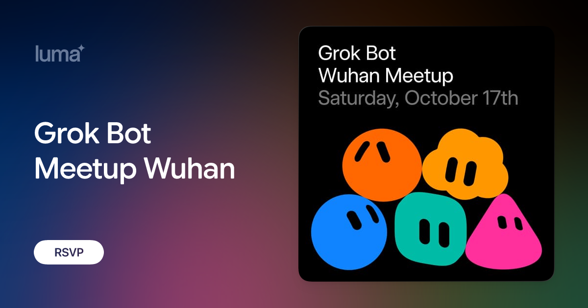</a></td><td valign="top"><strong>Grok Bot Meetup Wuhan</strong> Sat 17 Oct 2026, 14:00–17:30 (Asia/Shanghai, GMT+8) Wuhan, Hubei (venue TBD — updated on Luma after confirm)  Wuhan Grok Bot meetup: icebreaker + share/workshop. SpaceXAI product framing (AI teammates that sign into your tools and bring finished work back). Pre-registration with host approval; WeChat group after approve; speakers/volunteers welcome. Hosts Hanbing Zhang, chenchong, yuepu; free; ~150 seats. Distinct from same-day sha-20261017 Shanghai.  <a href="https://luma.com/kss59f4e"><strong>Apply on Luma (host approval) →</strong></a></td></tr></table>

<table><tr><td width="320" valign="top"></td><td valign="top"><strong>Grok Bot Macau Workshop</strong> Wed 7 Oct 2026, 19:00–21:30 (Asia/Macau, UTC+8) Macao · Macau University of Science and Technology (MUST, Cotai) — offline  SpaceXAI for Macau workshop: vibe coding with Grok Bot at MUST (Cotai). Public, free, 50 spots. Register on Luma.  <a href="https://luma.com/spacexai-macau-must-workshop-oct"><strong>Register on Luma →</strong></a></td></tr></table>

<table><tr><td width="320" valign="top"><a href="https://luma.com/spacexai-macau-hackathlon-nov">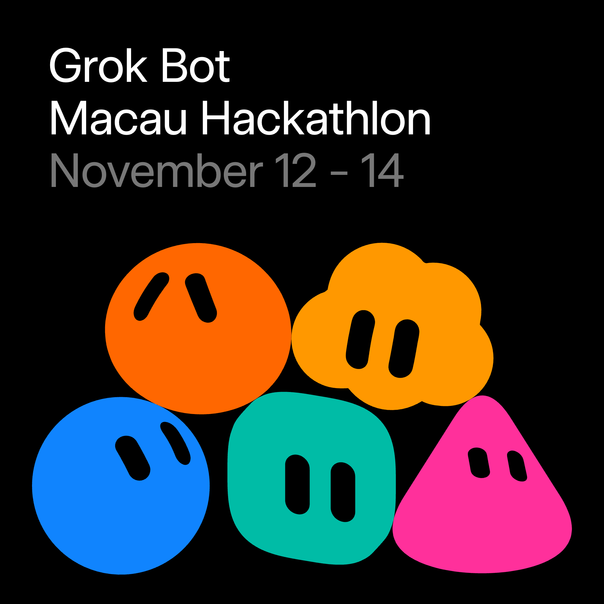</a></td><td valign="top"><strong>SpaceXAI Macao Community Hackathon｜Grok Bot × Physical AI</strong> Thu 12 – Sat 14 Nov 2026, daily 10:00–18:00 (Asia/Macau, UTC+8) Macau Tower, Macao · offline  Three-day Macao hackathon with two tracks: build a company with Grok Bot, or Physical AI × Grok Bot (open + high-school) (host John Ku; forum 173330 / Luma spacexai-macau-hackathlon-nov). BYO laptop; individual signup, team on site; approval required; spots_remaining 80 at morning scan.  <a href="https://luma.com/spacexai-macau-hackathlon-nov"><strong>Register on Luma →</strong></a></td></tr></table>

### United States

<table><tr><td width="320" valign="top"></td><td valign="top"><strong>Grok Bot Meetup Pittsburgh</strong> Tue 13 Oct 2026, 18:30–20:30 (EDT) Pittsburgh · Oakland / Lawrenceville (exact address after you register)  Pittsburgh's first city Grok Bot meetup (not campus-only). Short demo then build/swap setups; students + working folks welcome. Host Micah Smith; free; open registration (~30 seats).  <a href="https://luma.com/6lx5t8ru"><strong>Register on Luma →</strong></a></td></tr></table>

<table><tr><td width="320" valign="top"><a href="https://luma.com/utdchtxv">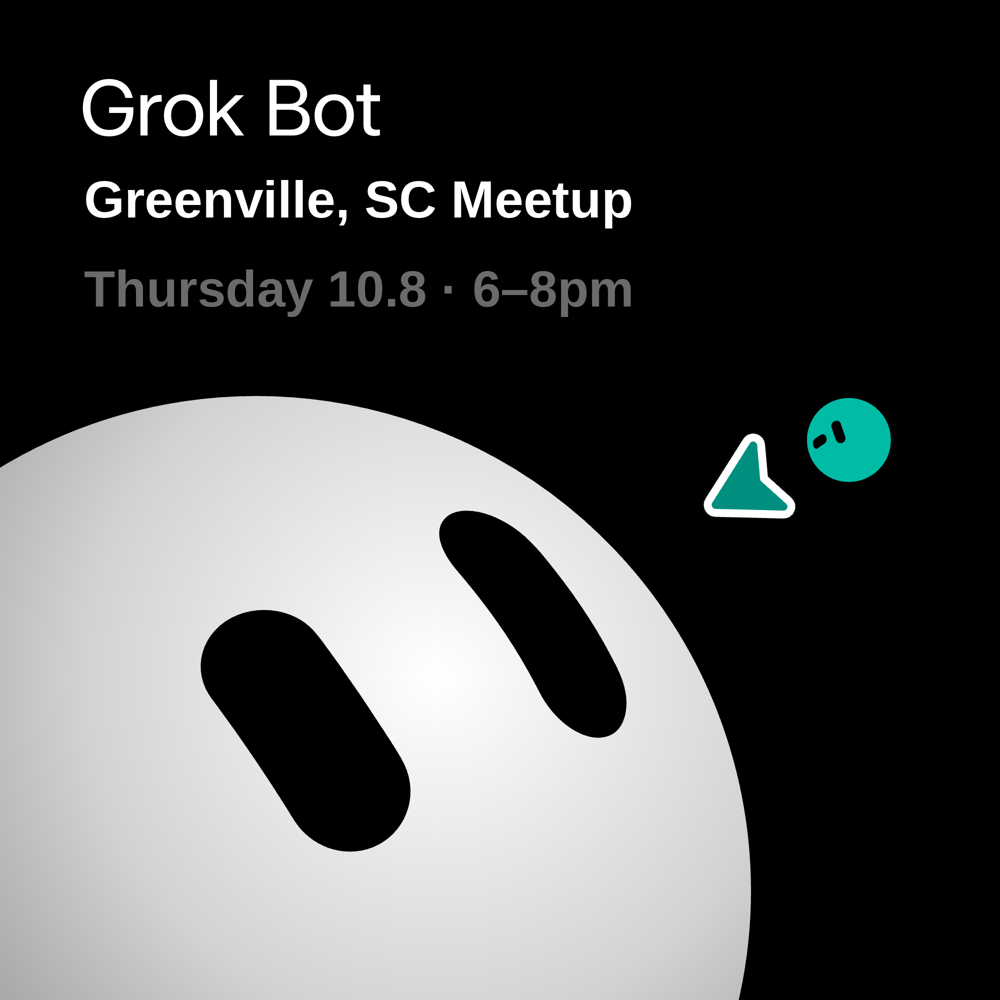</a></td><td valign="top"><strong>Grok Bot Meetup Greenville</strong> Thu 8 Oct 2026, 18:00–20:00 (America/New_York / ET, UTC−4) Greenville, SC — venue TBA (offline; soft capacity 50–75 with waitlist)  Greenville's first catalogued Grok Bot meetup (host Brad Shannon; personal Luma calendar). Agenda: doors ~17:45, welcome + what Grok Bot is (~10m), live demo/lightning (~25m), open Q&A (~15m), hang/build-along (~25m+). Bring laptop; download ahead from https://x.ai/bot. Designers/PMs/founders/devs welcome. Free RSVP (spots_remaining 66 at scan; guest_count 9). Venue TBA in Greenville SC — page will update when locked. New discover slug utdchtxv (evt-Xgc3aGOMGuCiWw9); no forum New-event post yet.  <a href="https://luma.com/utdchtxv"><strong>Register on Luma →</strong></a></td></tr></table>

<table><tr><td width="320" valign="top"><a href="https://luma.com/spacexai-zk6r">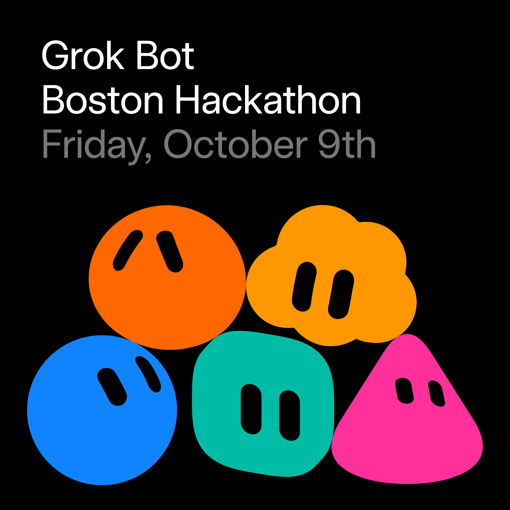</a></td><td valign="top"><strong>Grok Bot Boston Hackathon</strong> Fri 9 Oct 2026, 09:00–15:00 (America/New_York) Boston / Cambridge · CambridgeSide — offline hackathon  Grok Bot Boston Hackathon at CambridgeSide — build with Grok Bot teammates in person. SpaceXAI Community listing.  <a href="https://luma.com/spacexai-zk6r"><strong>Register on Luma →</strong></a></td></tr></table>

<table><tr><td width="320" valign="top"></td><td valign="top"><strong>Cursor Meetup Philadelphia — October</strong> Tue 27 Oct 2026, 18:00–20:30 (America/New_York) Philadelphia · SpaceXAI for Philadelphia — offline  October SpaceXAI Community Cursor/Grok meetup in Philadelphia. Follow-on to the Sep 29 Grok Bot meetup; register on Luma.  <a href="https://luma.com/cursor-c2mq"><strong>Register on Luma →</strong></a></td></tr></table>

<table><tr><td width="320" valign="top"></td><td valign="top"><strong>Cursor Meetup Philadelphia — November</strong> Tue 17 Nov 2026, 18:00–20:30 (America/New_York) Philadelphia · SpaceXAI for Philadelphia — offline  November SpaceXAI Community Cursor/Grok meetup in Philadelphia. Register on Luma.  <a href="https://luma.com/cursor-acqy"><strong>Register on Luma →</strong></a></td></tr></table>

<table><tr><td width="320" valign="top"></td><td valign="top"><strong>Cursor Meetup Philadelphia — December</strong> Thu 17 Dec 2026, 18:00–20:30 (America/New_York) Philadelphia · SpaceXAI for Philadelphia — offline  December SpaceXAI Community Cursor/Grok meetup in Philadelphia. Register on Luma.  <a href="https://luma.com/cursor-8wr8"><strong>Register on Luma →</strong></a></td></tr></table>

<table><tr><td width="320" valign="top"></td><td valign="top"><strong>Grok Bot Meetup Tampa Bay</strong> Sat 14 Nov 2026, 13:00–16:00 (America/New_York) Tampa Bay, FL · venue TBA (address after register). Offline.  Offline Grok Bot meetup in Tampa Bay hosted with SpaceXAI Tampa. Register on Luma.  <a href="https://luma.com/spacexai-g0x6"><strong>Register on Luma →</strong></a></td></tr></table>

<table><tr><td width="320" valign="top"><a href="https://luma.com/h2ijioha">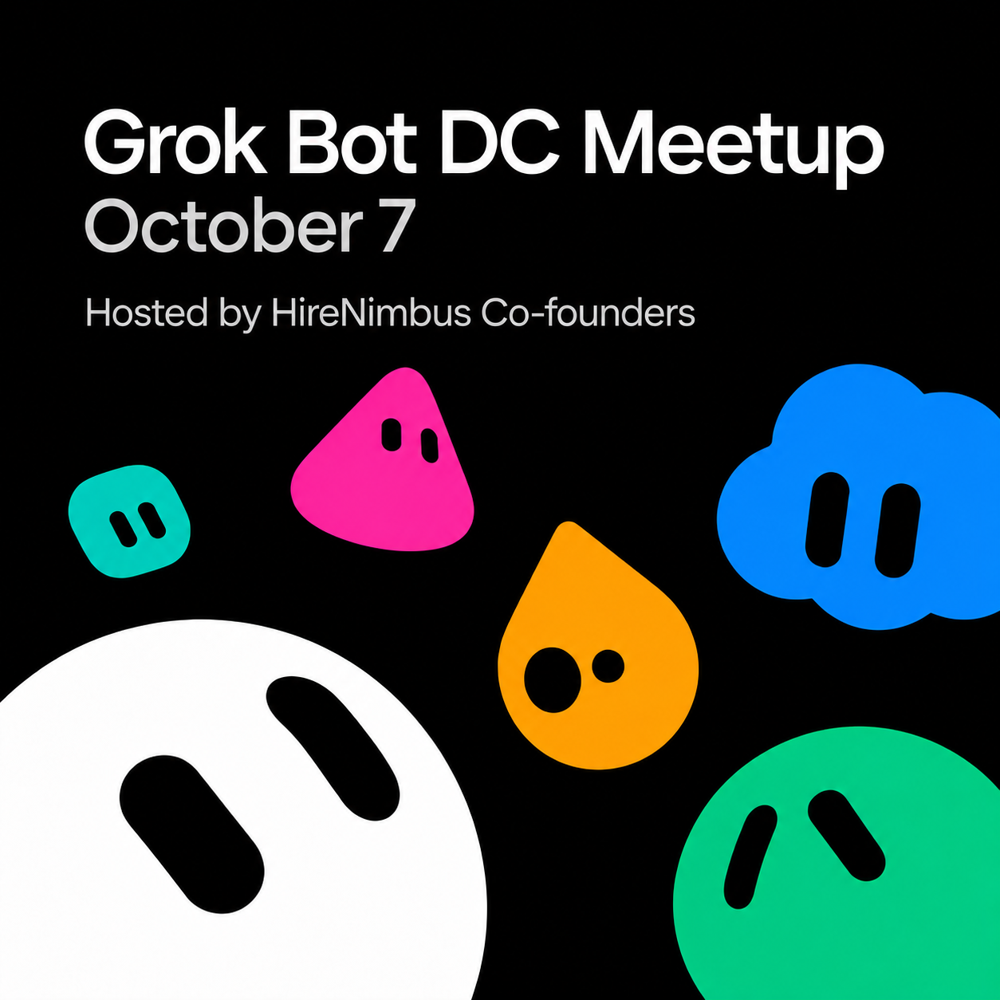</a></td><td valign="top"><strong>Grok Bot DC Meetup</strong> Wed 7 Oct 2026, 17:30–20:30 (America/New_York / EDT, UTC−4) Washington, DC · Downtown (exact venue obfuscated on Luma) — offline  DC’s first Grok Bot meetup (hosts: HireNimbus co-founders). Share how teams run on Grok Bot after SpaceXAI Galaxy SF. Free; ~15 guests so far. Register on Luma.  <a href="https://luma.com/h2ijioha"><strong>Register on Luma →</strong></a></td></tr></table>

<table><tr><td width="320" valign="top"><a href="https://luma.com/l4yagss3">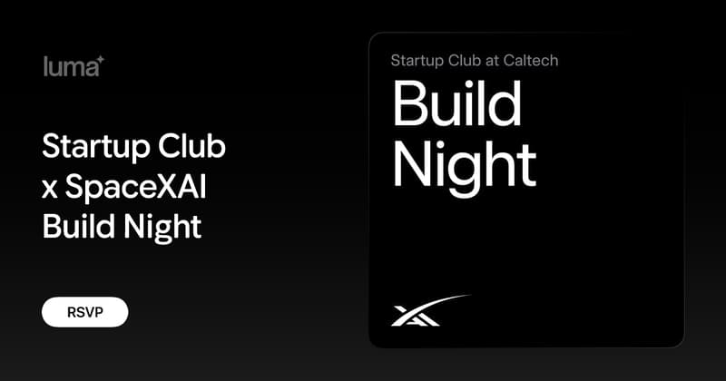</a></td><td valign="top"><strong>Startup Club × SpaceXAI Build Night (Caltech)</strong> Wed 7 Oct 2026, 19:00–21:00 (America/Los_Angeles) Pasadena, CA, USA · Hameetman Center / Winnett (Caltech) — offline  First public SpaceXAI night at Caltech with Startup Club: live repo demo then build with Cursor / Grok Bot. Register on Luma.  <a href="https://luma.com/l4yagss3"><strong>Register on Luma →</strong></a></td></tr></table>

<table><tr><td width="320" valign="top"><a href="https://luma.com/07lxjoiu">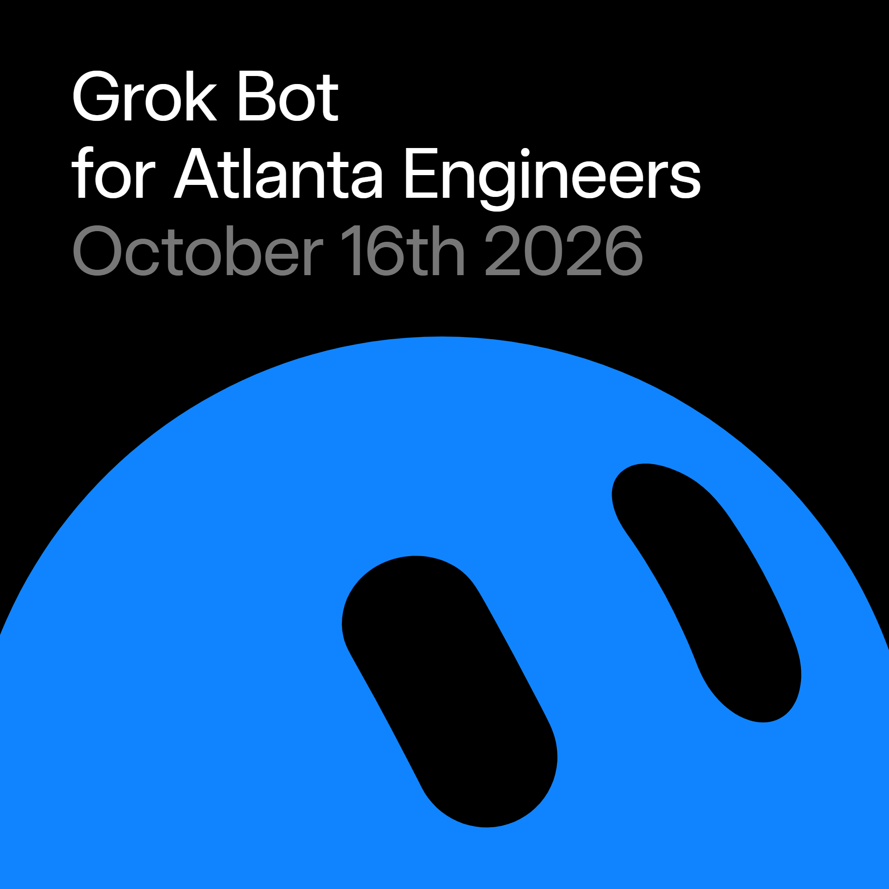</a></td><td valign="top"><strong>Grok Bot for Engineers at KSU, Atlanta</strong> Fri 16 Oct 2026, 15:00–17:00 (America/New_York, UTC-04:00) KSU Marietta, Atlanta, GA, USA — offline  Hands-on Grok Bot workshop for engineers and students at KSU Marietta (Atlanta).  <a href="https://luma.com/07lxjoiu"><strong>Register on Luma →</strong></a></td></tr></table>

<table><tr><td width="320" valign="top"><a href="https://luma.com/b0x0mc3p">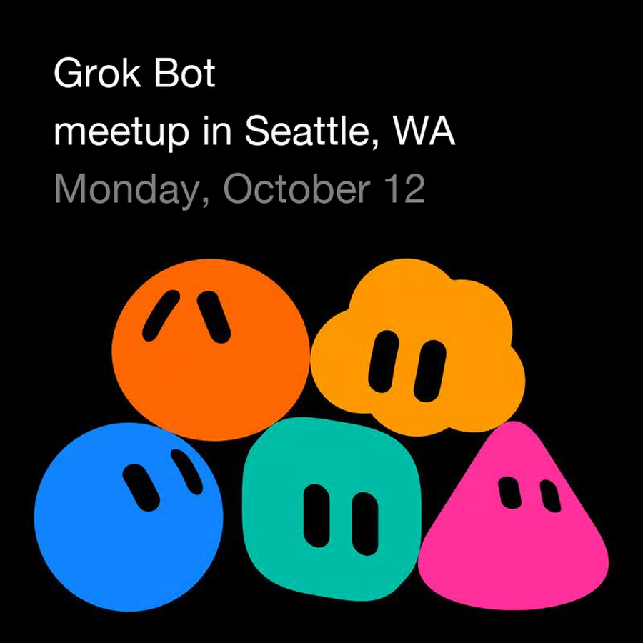</a></td><td valign="top"><strong>Grok Bot meetup Seattle</strong> Mon 12 Oct 2026, 18:00–21:00 (America/Los_Angeles / PDT, UTC−7). Seattle, WA · Westlake area (offline; exact address on Luma after approval).  First Seattle Grok Bot workshop+meetup (host shrey shah; forum 173194 / Luma b0x0mc3p = evt-2qLvibXwpI22akX). Agenda 18:00–21:00 Pacific: doors/food, hands-on Grok Bot setup, community demos/templates, networking; laptop recommended. Free; approval required; waitlist on; ~200 spots; guest_count 0 at evening scan.  <a href="https://luma.com/b0x0mc3p"><strong>Register on Luma →</strong></a></td></tr></table>

<table><tr><td width="320" valign="top"></td><td valign="top"><strong>SpaceXAI: GrokBot Job Night (Atlanta)</strong> Thu 8 Oct 2026, 18:30–20:00 (America/New_York, EDT, UTC-4) Atlanta, GA · Klaus Advanced Computing Building (266 Ferst Dr NW) · offline  SpaceXAI GrokBot Job Night in Atlanta (Klaus building). Free approval ticket; guest_count 27 at morning scan. Luma enjt7lt8. Distinct from atl-20261016 KSU engineers meetup.  <a href="https://luma.com/enjt7lt8"><strong>Register on Luma →</strong></a></td></tr></table>

### Germany

<table><tr><td width="320" valign="top"><a href="https://luma.com/spacexai-cologne-meetup1">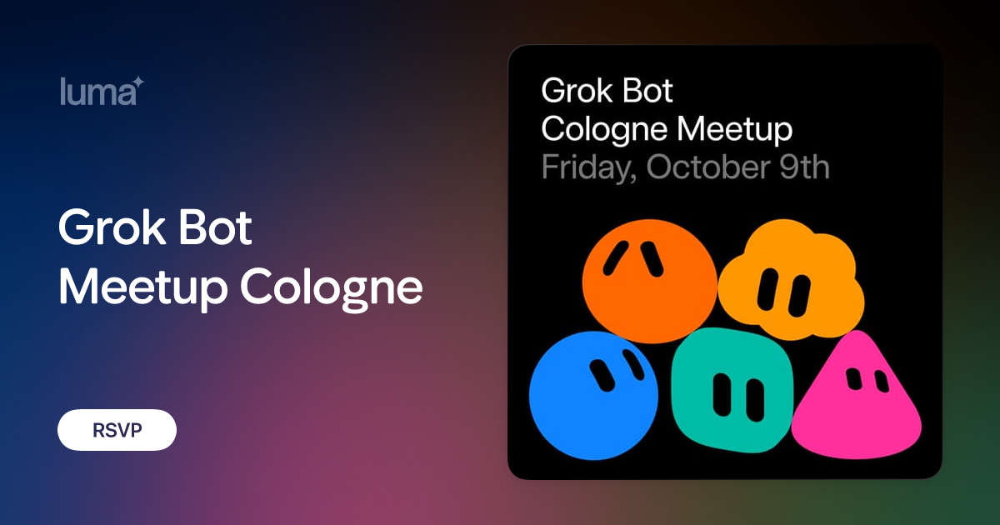</a></td><td valign="top"><strong>Grok Bot Meetup Cologne</strong> Fri 9 Oct 2026, 18:00–21:00 (CEST) Cologne (address revealed after registration)  Cologne Grok Bot meetup: networking, talks/workshop, hands-on with a real task (Windows/Mac laptop or iPhone; download x.ai/bot). Agenda 18:00 check-in → 18:30 demo & hands-on → 20:00 chat; open to more Grok Bot speakers. Hosts Emmanuel Ketcha, Eyad Kelleh, Babajide Mayowa Moibi, Teoman Köse; free; host approval; ~50 seats.  <a href="https://luma.com/spacexai-cologne-meetup1"><strong>Apply on Luma (host approval) →</strong></a></td></tr></table>

<table><tr><td width="320" valign="top"><a href="https://luma.com/spacexai-z2er">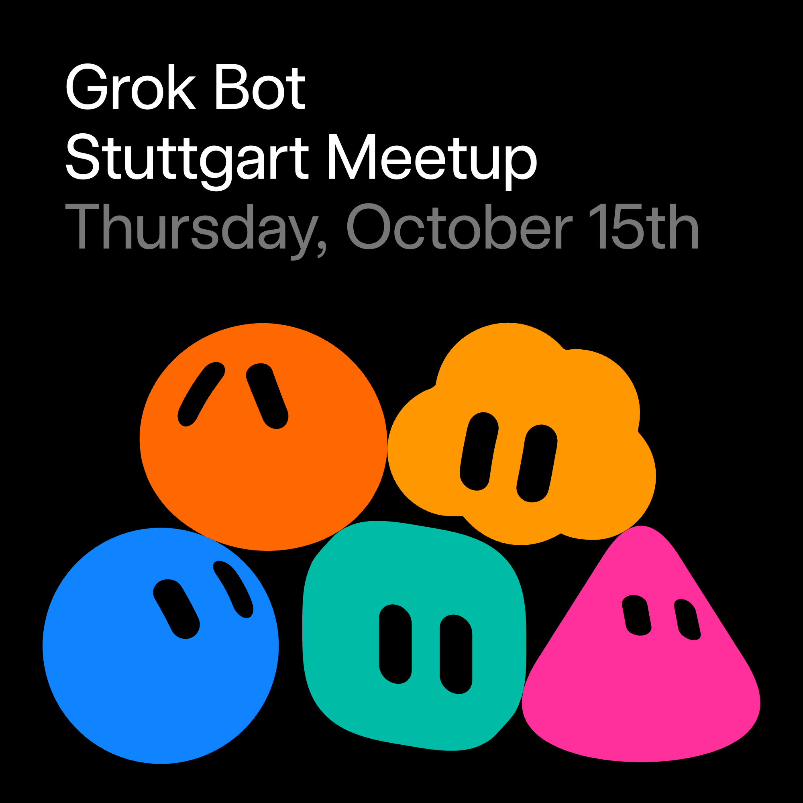</a></td><td valign="top"><strong>Grok Bot Stuttgart Meetup</strong> Thu 15 Oct 2026, 17:30–21:00 (Europe/Berlin, UTC+2 / CEST) Epplestraße 225/haus 3, 70567 Stuttgart-Möhringen, Germany — offline (first floor)  First Grok Bot Meetup in Stuttgart (host Sachin Agrawal, AI collective Stuttgart chapter lead / SpaceXAI ambassador). Evening to try Grok Bot, see demos, hang with the SpaceXAI community. Free RSVP with approval (spots_remaining 84; guest_count 6). Luma slug spacexai-z2er (evt-DCND2YYEcL1xi1I); forum New-event 171988.  <a href="https://luma.com/spacexai-z2er"><strong>Register on Luma →</strong></a></td></tr></table>

<table><tr><td width="320" valign="top"></td><td valign="top"><strong>Build with Grokbot — Frankfurt (20 Nov)</strong> Fri 20 Nov 2026, 14:00–22:30 (Europe/Berlin, UTC+1). Frankfurt am Main, Germany — Hotel Motel One Frankfurt-Messe (offline).  Next Frankfurt Build with Grokbot after the Sep/Oct nights (SpaceXAI for Frankfurt; hosts DJ Gangan, Felix Schiessl, Eyad Kelleh, Sabri Guenes). Afternoon-to-evening build at Motel One Messe; waitlist active (guest_count 3 at scan). Slug l9tfh081 (evt-uVvS2YIX7wA1ATB).  <a href="https://luma.com/l9tfh081"><strong>Register on Luma →</strong></a></td></tr></table>

<table><tr><td width="320" valign="top"></td><td valign="top"><strong>Grok Bot Kassel Meetup</strong> Thu 12 Nov 2026, 18:00–22:00 (Europe/Berlin / CET, UTC+1) Kassel, Germany · venue after registration (Bettenhausen area) · offline  Kassel’s first Grok Bot meetup (SpaceXAI for Kassel; hosts Eyad Kelleh, Maurice Pfurr, Eugen Silin, Olga Koch, Ragnar Heil; forum 173331 / Luma rx61bqy9). Hang out, demos, try credits on-site; approval + waitlist; guest_count 2 at morning scan.  <a href="https://luma.com/rx61bqy9"><strong>Register on Luma →</strong></a></td></tr></table>

<table><tr><td width="320" valign="top"><a href="https://luma.com/1rv39ekj">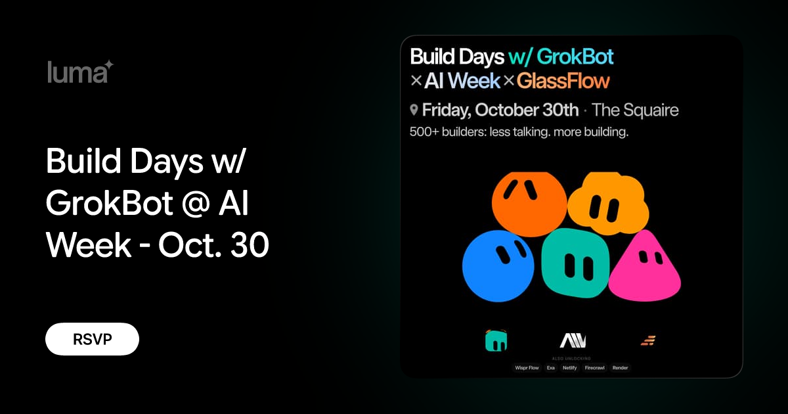</a></td><td valign="top"><strong>Build Days w/ GrokBot @ AI Week — Frankfurt (30 Oct)</strong> Fri 30 Oct 2026, 09:45–18:15 (Europe/Berlin, CET, UTC+1) Frankfurt am Main, Germany · The Squaire, Am Flughafen 12 — offline (AI Week × Glassflow)  Frankfurt Build Day with GrokBot at The Squaire (AI Week × Glassflow / SpaceXAI). Working session to ship—not a talk track. Free; waitlist; guest_count 83 at midday scan. Same Luma slug 1rv39ekj as former fra-20261023 (rescheduled Oct 23→30, venue Motel One→Squaire). Hosts DJ Gangan, Felix Schiessl, Sabri Guenes, Eyad Kelleh.  <a href="https://luma.com/1rv39ekj"><strong>Register on Luma →</strong></a></td></tr></table>

### Brazil

<table><tr><td width="320" valign="top"></td><td valign="top"><strong>Grok Bot Vitoria da Conquista Meetup</strong> Wed 14 Oct 2026, 19:00–22:00 (America/Bahia, UTC−3) Hub Conquista, Av. Juracy Magalhães 3405 — Boa Vista, Vitória da Conquista, BA, Brazil (offline)  Offline Grok Bot meetup in Vitória da Conquista, Bahia (listed under SpaceXAI for Salvador calendar; hosts Benjamin Bauer, Sarah Ferreira Reis). Agenda: networking, talks/workshop, Q&A around SpaceXAI Grok Bot (“AI teammates you can give real work to”). Venue Hub Conquista with full street address; free, no approval gate; guest_count 1 at scan. New community-cal slug cursor-iutk + forum 171709.  <a href="https://luma.com/cursor-iutk"><strong>Register on Luma →</strong></a></td></tr></table>

<table><tr><td width="320" valign="top"><a href="https://luma.com/cursor-dx23">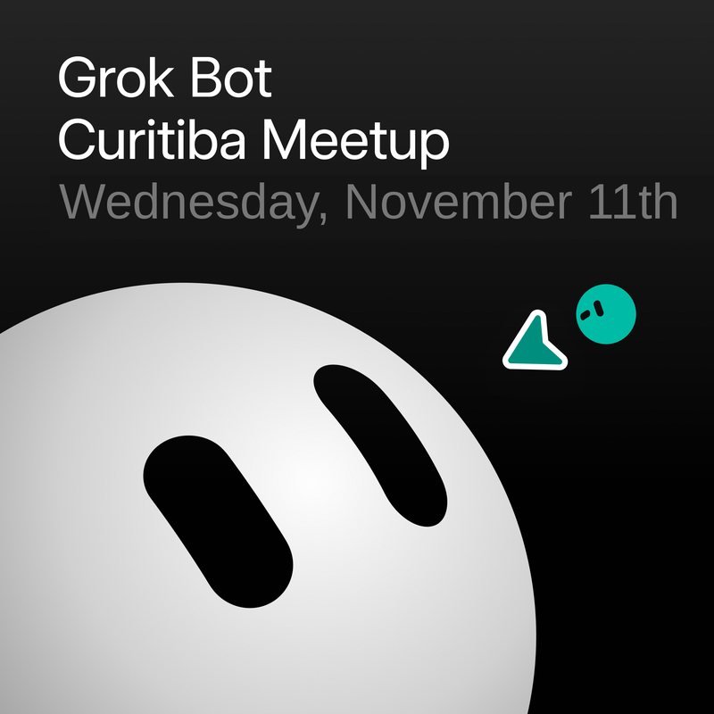</a></td><td valign="top"><strong>Grok Bot Curitiba Startups Meetup</strong> Wed 11 Nov 2026, 18:30–21:00 (BRT) Rua Marcos Moro 72, Curitiba  Curitiba startups meetup on building with Grok Bot, founder lessons, and shipping ideas in the agent era (speakers TBA). Host approval required.  <a href="https://luma.com/cursor-dx23"><strong>Apply on Luma (host approval) →</strong></a></td></tr></table>

<table><tr><td width="320" valign="top"></td><td valign="top"><strong>Grok Bot Salvador Meetup</strong> Thu 8 Oct 2026, 18:00–21:00 (America/Bahia) Salvador, BA, Brazil · UNIFACS Campus Tancredo Neves (Av. Tancredo Neves, 2131) — offline  SpaceXAI Salvador (Bahia) Grok Bot meetup: networking, talks/workshop, Q&A at UNIFACS. Register on Luma (new listing).  <a href="https://luma.com/spacexai-psox"><strong>Register on Luma →</strong></a></td></tr></table>

<table><tr><td width="320" valign="top"></td><td valign="top"><strong>Grok Bot Florianópolis Building Day</strong> Fri 16 Oct 2026, 14:00–22:00 (America/Sao_Paulo, UTC-3). Florianópolis, Brazil — Founder Haus Jurerê Internacional (offline).  All-afternoon Grok Bot Building Day in Floripa (SpaceXAI for Florianópolis; hosts Alexandre Ferrari, Founder Haus, Christian Rios). Distinct from the Sep 26 meetup; waitlist active (guest_count 6 at scan). Slug 3t86uc0s (evt-yTAjBdF1Nyo0iJZ).  <a href="https://luma.com/3t86uc0s"><strong>Register on Luma →</strong></a></td></tr></table>

### Canada

<table><tr><td width="320" valign="top"><a href="https://luma.com/mj5bmugc">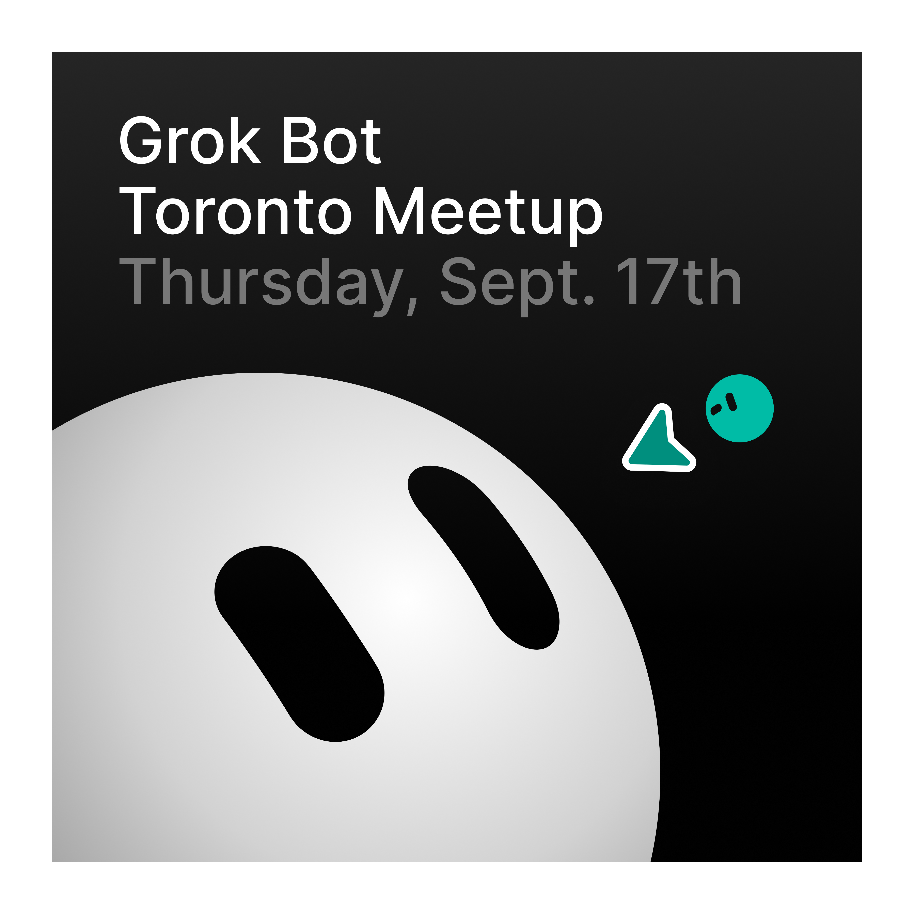</a></td><td valign="top"><strong>Grok Bot Meetup Toronto - October</strong> Mon 26 Oct 2026, 17:30–20:30 (America/Toronto, UTC-4) 800 Bay St area, Toronto, ON, Canada (exact suite obfuscated on Luma) — offline  Monthly Grok Bot Meetup Toronto — October edition (hosts Jia Ming Huang et al.; follows catalogued yyz-20260917 September). Agenda ~17:30–20:30 at 800 Bay: mingle, two speakers, Q&A, networking/building; dinner & drinks; Cursor credits for Grok Bot. Bring laptop; doors close 18:15 sharp. Free RSVP with approval (spots_remaining 400 at scan). Geo obfuscated to Toronto downtown on Luma. New discover slug mj5bmugc (evt-eO08FHgk6HTqIQW); no forum New-event post yet. Do not confuse with yyz-20260917.  <a href="https://luma.com/mj5bmugc"><strong>Register on Luma →</strong></a></td></tr></table>

<table><tr><td width="320" valign="top"><a href="https://luma.com/i9grzzp3">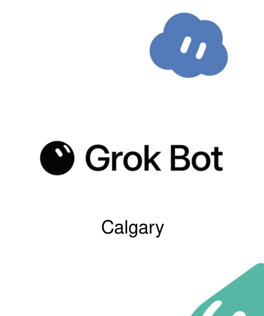</a></td><td valign="top"><strong>Grok Bot Calgary Meetup, October</strong> Wed 28 Oct 2026, 17:30–20:30 (America/Edmonton / MDT, UTC−6) Calgary, AB · venue TBD (shown on Luma) · offline  Calgary’s monthly Grok Bot Meetup (hosts Simon Loewen, Jia Ming Huang; forum 173296 / Luma i9grzzp3). Agenda 17:30–20:30 Mountain: doors, build, demos, networking; bring a laptop; waitlist on; guest_count 1 at evening scan.  <a href="https://luma.com/i9grzzp3"><strong>Register on Luma →</strong></a></td></tr></table>

<table><tr><td width="320" valign="top"><a href="https://luma.com/grok-bot-halifax">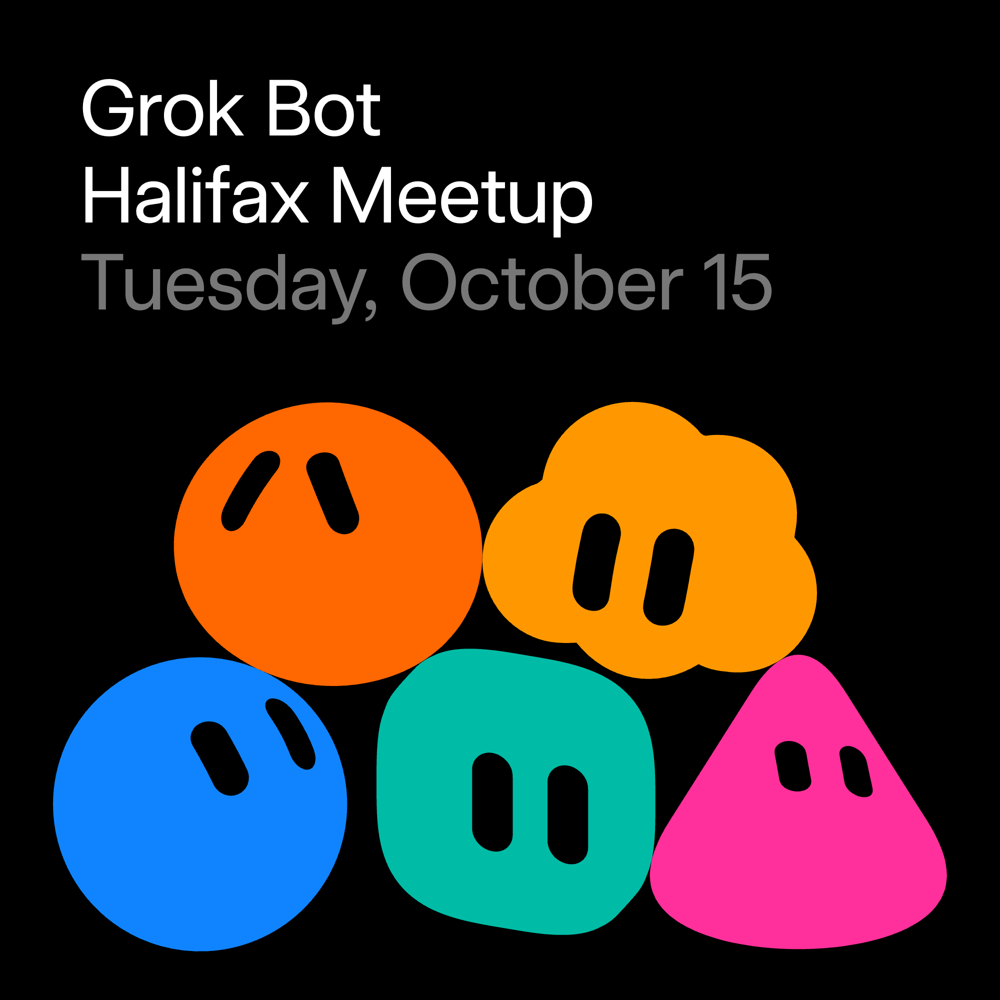</a></td><td valign="top"><strong>Grok Bot Meetup – Halifax</strong> Wed 15 Oct 2026, 18:00–20:00 (America/Halifax, ADT, UTC-3) Halifax, NS · Downtown Halifax (exact pin after register) · offline  Use-cases night with one live Grok Bot implementation (host Rishabh A / SquareCX). Laptop optional; free RSVP on Luma (slug grok-bot-halifax). Forum: 173477.  <a href="https://luma.com/grok-bot-halifax"><strong>Register on Luma →</strong></a></td></tr></table>

<table><tr><td width="320" valign="top"><a href="https://luma.com/phs5tofz">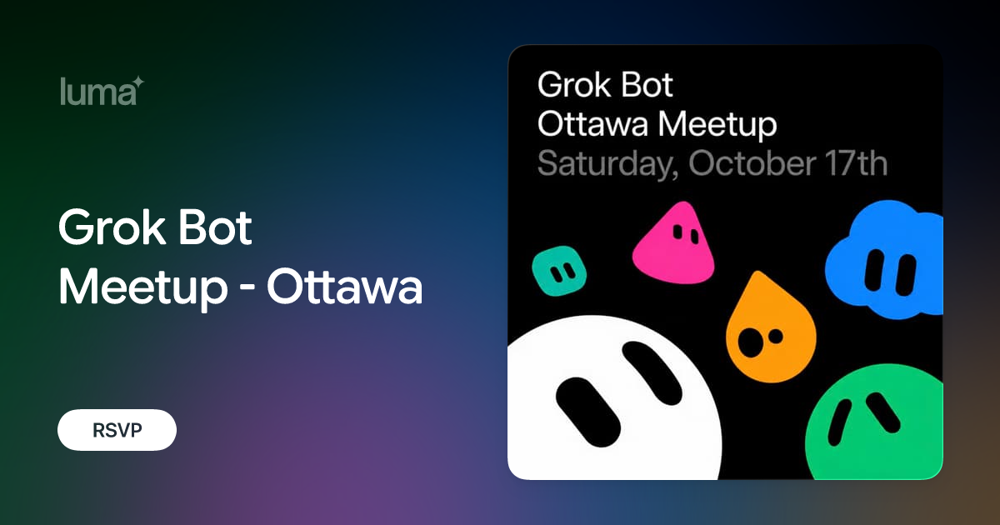</a></td><td valign="top"><strong>Grok Bot Meetup Ottawa</strong> Sat 17 Oct 2026, 18:00–22:00 (America/Toronto, EDT, UTC-4) Nicol Building, Carleton University, 1125 Colonel By Dr, Ottawa, ON K1S 5B6, Canada — offline  Ottawa Grok Bot meetup at Carleton University (Builders Collective Ottawa; hosts Qurb E Muhammad Syed, Kaan UN, Feyza Gulbent, David Storozhenko). Evening demos/networking. Free RSVP; guest_count 62 at midday scan. Same Luma slug phs5tofz as former yow-20261010 (rescheduled Oct 10→17).  <a href="https://luma.com/phs5tofz"><strong>Register on Luma →</strong></a></td></tr></table>

### Italy

<table><tr><td width="320" valign="top"></td><td valign="top"><strong>Grok Bot Meetup Rome</strong> Fri 23 Oct 2026, 10:00–13:00 (Europe/Rome) Rome, Italy · Urbe Hub (Largo Dino Frisullo, 00153 Roma RM) — offline  SpaceXAI for Rome meetup at Urbe Hub: build and share with Grok Bot. Hosted with Urbe Hub. Register on Luma.  <a href="https://luma.com/grok-bot-rome"><strong>Register on Luma →</strong></a></td></tr></table>

<table><tr><td width="320" valign="top"></td><td valign="top"><strong>Grok Bot Meetup - H-FARM Treviso</strong> Thu 22 Oct 2026, 18:30–21:00 (Europe/Rome / CEST, UTC+2). H-FARM, Via Adriano Olivetti 1, 31056 Roncade TV (Provincia di Treviso), Italy — offline.  First Veneto Grok Bot Meetup at H-FARM (SpaceXAI for Padua calendar; host Victor Motricala; opening talk Diego Pizzocaro / H-FARM AI). English evening: intro, live demo, credits, networking/food, hands-on; laptop mandatory. Free, open registration, waitlist enabled (guest_count 2 / ~128 spots at scan). Slug spacexai-kk5f (evt-DQJ18z0yEPgVagi) + forum 173108.  <a href="https://luma.com/spacexai-kk5f"><strong>Register on Luma →</strong></a></td></tr></table>

<table><tr><td width="320" valign="top"><a href="https://luma.com/spacexai-bologna-01">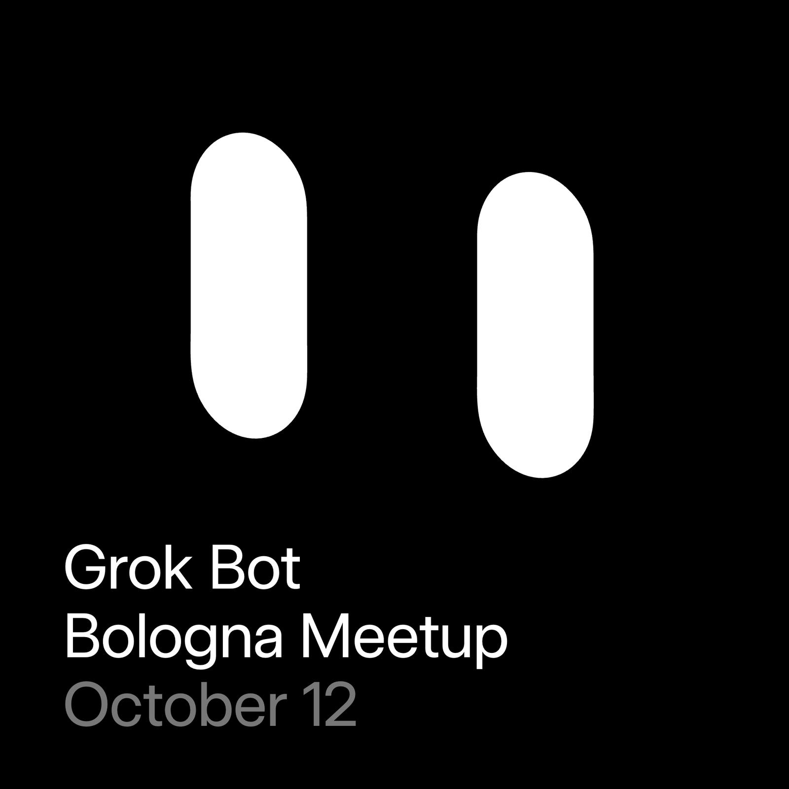</a></td><td valign="top"><strong>Grok Bot Meetup Bologna</strong> Mon 12 Oct 2026, 18:00–21:00 (Europe/Rome, CEST, UTC+2) Bologna, Italy · Serre dei Giardini Margherita, Via Castiglione 134 — offline  First Grok Bot Meetup in Bologna (Serra Liberty / Kilowatt). Live demos and laptop builds. Free; guest_count 8 at morning scan. Luma spacexai-bologna-01.  <a href="https://luma.com/spacexai-bologna-01"><strong>Register on Luma →</strong></a></td></tr></table>

<table><tr><td width="320" valign="top"></td><td valign="top"><strong>Grok Hackathon at the Museum (Pavia)</strong> Thu 5 Nov 2026, 10:00–23:30 (Europe/Rome, CET, UTC+1) Pavia, Italy · Ctrl+Alt Museum (comPVter), Via Riviera 39 — offline  SpaceXAI-linked day hackathon at the retro computing museum in Pavia (follow-on vibe from Milano Café Cursor nights). Free with host approval; forum 173708; slug spacexai-z1ys.  <a href="https://luma.com/spacexai-z1ys"><strong>Register on Luma →</strong></a></td></tr></table>

### Ecuador

<table><tr><td width="320" valign="top"><a href="https://luma.com/grokbotambatomeetup">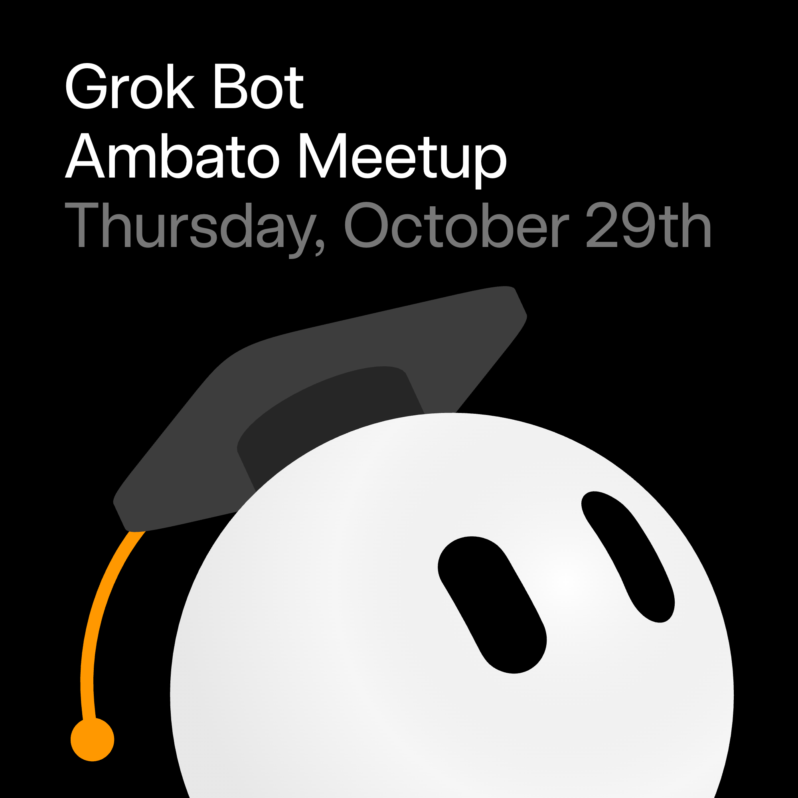</a></td><td valign="top"><strong>Grok Bot Ambato Meetup</strong> Thu 29 Oct 2026, 08:00–15:00 (America/Guayaquil, UTC-5) Ambato, Ecuador · Ambato Technical University – Campus Ingahurco · offline  SpaceXAI Ambato builders meetup at UTA Campus Ingahurco (host Kevin Morales). Free Standard ticket; forum 173478; Luma grokbotambatomeetup.  <a href="https://luma.com/grokbotambatomeetup"><strong>Register on Luma →</strong></a></td></tr></table>

<table><tr><td width="320" valign="top"></td><td valign="top"><strong>Grok Bot Quito Meetup</strong> Wed 21 Oct 2026, 17:30–20:30 (America/Guayaquil, ECT, UTC-5) Quito, Ecuador · offline (exact pin after register)  SpaceXAI Quito meetup on Grok Bot. Free Standard RSVP; guest_count 12 at morning scan. Luma spacexai-7spd. Distinct from expired uio-20260924.  <a href="https://luma.com/spacexai-7spd"><strong>Register on Luma →</strong></a></td></tr></table>

### Spain

<table><tr><td width="320" valign="top"></td><td valign="top"><strong>Grok Bot Alicante Meetup</strong> Sat 7 Nov 2026, 12:00–14:30 (Europe/Madrid) Alicante, Spain · Sausalito Premium Club (Muelle Levante, 6 / Alicante Port) — offline  First SpaceXAI Alicante lunch meetup: 5-min lightning demos of Grok Bot workflows in Cursor + networking. Register on Luma (forum 172631).  <a href="https://luma.com/spacexai-ol8x"><strong>Register on Luma →</strong></a></td></tr></table>

<table><tr><td width="320" valign="top"></td><td valign="top"><strong>Grok Bot Bilbao meetup</strong> Mon 19 Oct 2026, 18:00–21:30 (Europe/Madrid) Bilbao, Spain · La Perrera Espazioa (Sabino Arana Etorbidea, 50) — offline  SpaceXAI for Bilbao meetup at La Perrera Espazioa: meet builders and share with Grok Bot. Free registration on Luma.  <a href="https://luma.com/spacexai-euskadi"><strong>Register on Luma →</strong></a></td></tr></table>

### United Kingdom

<table><tr><td width="320" valign="top"><a href="https://luma.com/eveur09a">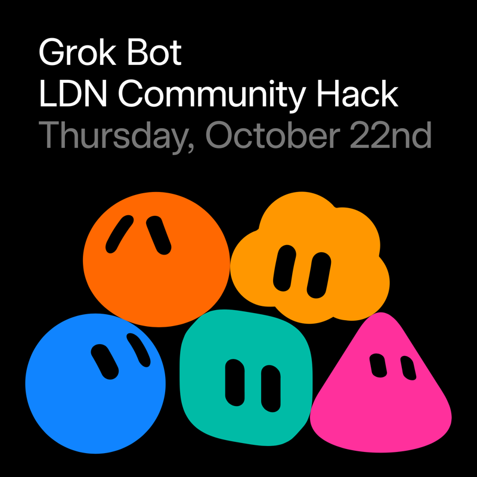</a></td><td valign="top"><strong>Grok Bot Community Engineering London Hackathon</strong> Thu 22 Oct 2026, 18:00–22:30 (Europe/London, BST, UTC+1) London, UK · venue shared after approval — offline  Evening hackathon for community engineers, DevRels and organisers: Grok Bot holds the context (Slack, Discord, inbox, calendar, Luma, CRM) and Cursor turns it into community tooling, with live demos. Free with host approval; forum 173849; slug eveur09a.  <a href="https://luma.com/eveur09a"><strong>Register on Luma →</strong></a></td></tr></table>

<table><tr><td width="320" valign="top"></td><td valign="top"><strong>Grok Bot Build NorthWest (Ormskirk)</strong> Sat 24 Oct 2026, 11:00–15:00 (Europe/London, BST, UTC+1) Ormskirk, UK · Edge Hill University, St Helens Rd, L39 4QP — offline  Build day for Grok Bot builders in North West England at Edge Hill University: team up, learn and build with Grok Bot and Cursor; all levels welcome. Free with host approval; forum 173850; slug cursor-i0ov.  <a href="https://luma.com/cursor-i0ov"><strong>Register on Luma →</strong></a></td></tr></table>

### Guatemala

<table><tr><td width="320" valign="top"><a href="https://luma.com/spacexai-97mt">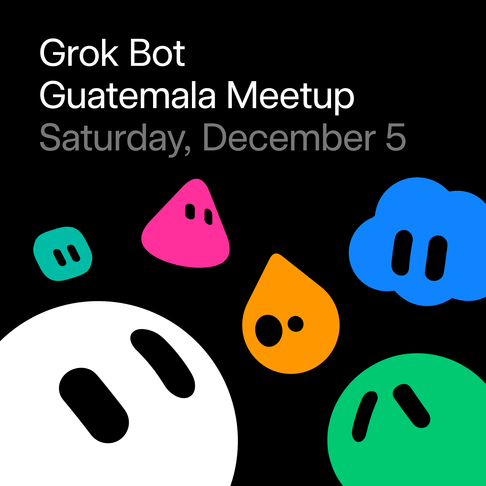</a></td><td valign="top"><strong>Grok Bot Meetup Guatemala</strong> Sat 5 Dec 2026, 15:00–20:00 (America/Guatemala) Guatemala · venue TBA (see Luma / host update) — offline  SpaceXAI Guatemala offline Grok Bot meetup (forum + Luma). Register on Luma for venue details.  <a href="https://luma.com/spacexai-97mt"><strong>Register on Luma →</strong></a></td></tr></table>

<table><tr><td width="320" valign="top"><a href="https://luma.com/c398wllp">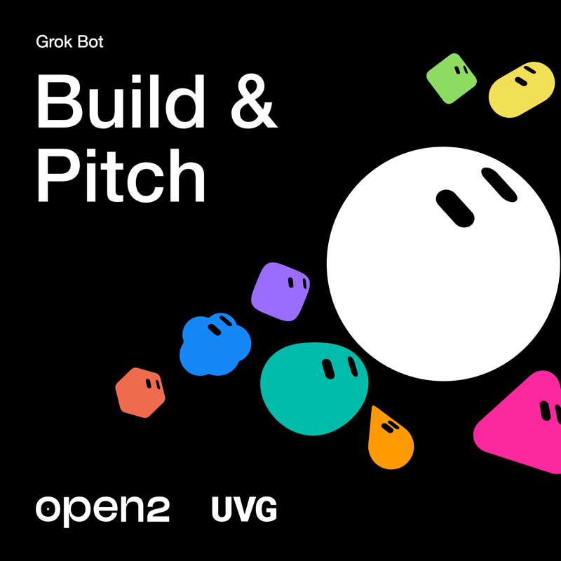</a></td><td valign="top"><strong>Grok Bot Guatemala: Build & Pitch</strong> Sat 21 Nov 2026, 08:00–15:00 (America/Guatemala, CST, UTC−6) Guatemala City · Universidad del Valle de Guatemala (exact address after RSVP) — offline  Spanish-language build-and-pitch morning: four straight hours building with Grok Bot solo or in a team, then a short pitch and direct feedback. Free RSVP; forum 173855; slug c398wllp.  <a href="https://luma.com/c398wllp"><strong>Register on Luma →</strong></a></td></tr></table>

### Indonesia

<table><tr><td width="320" valign="top"><a href="https://luma.com/d4b0eg4v">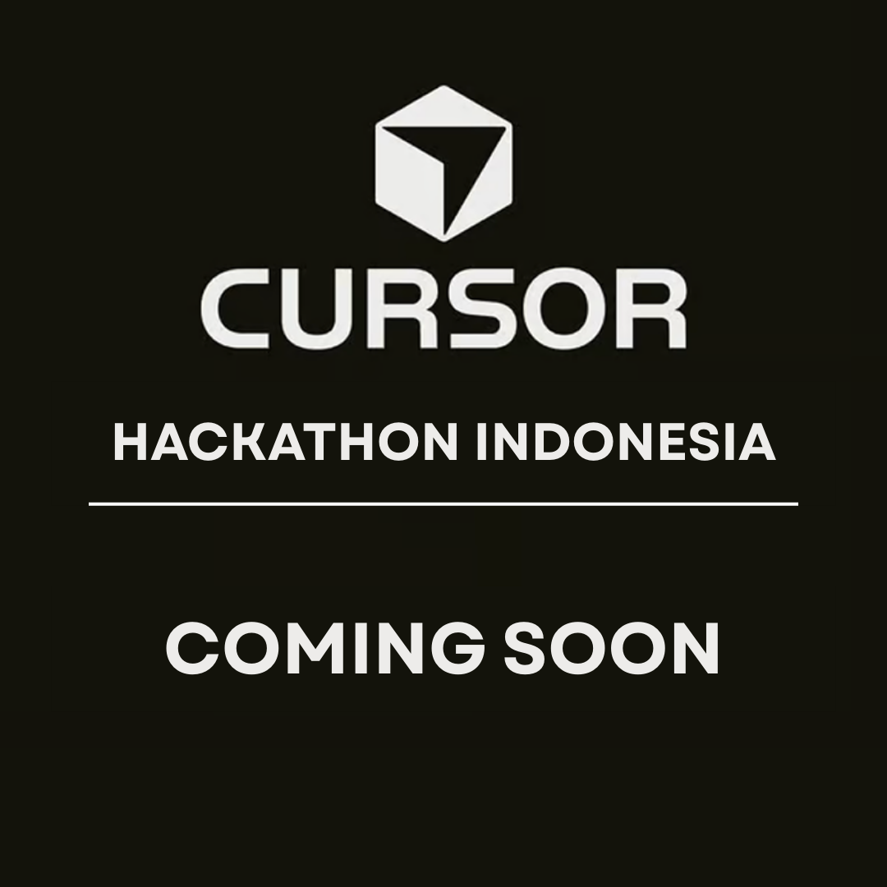</a></td><td valign="top"><strong>SpaceXAI Hackathon Indonesia</strong> Sat 7 Nov 2026, 07:00–20:00 (Asia/Jakarta) Jakarta, Indonesia — offline hackathon (exact venue on Luma)  SpaceXAI Hackathon Indonesia in Jakarta — multi-day offline build around Grok Bot / SpaceXAI Community.  <a href="https://luma.com/d4b0eg4v"><strong>Register on Luma →</strong></a></td></tr></table>

<table><tr><td width="320" valign="top"></td><td valign="top"><strong>Grok Bot Meetup Bali</strong> Sun 25 Oct 2026, 13:00–16:00 (Asia/Makassar) Canggu / Badung, Bali · address after register — offline  SpaceXAI Bali Grok Bot meetup in Canggu: workflows, credits, food/drinks. Designers, PMs, founders, beginners welcome. Register on Luma.  <a href="https://luma.com/ubpln69o"><strong>Register on Luma →</strong></a></td></tr></table>

### Japan

<table><tr><td width="320" valign="top"></td><td valign="top"><strong>Grok Bot Tokyo Hackathon</strong> Sat 11 Oct 2026, 10:00–18:00 (Asia/Tokyo) Tokyo, Japan · Ochanomizu Sola City (4-chōme-6 Kanda Surugadai, Chiyoda) — offline  SpaceXAI Tokyo hackathon at Ochanomizu Sola City: build with Grok Bot in a full-day offline session. Register on Luma.  <a href="https://luma.com/grokbot-hackathon-tokyo"><strong>Register on Luma →</strong></a></td></tr></table>

<table><tr><td width="320" valign="top"></td><td valign="top"><strong>Grok Bot Kanagawa Meetup (Kawasaki)</strong> Wed 4 Nov 2026, 18:30–21:00 (Asia/Tokyo, JST, UTC+9) Kawasaki, Japan · Uvance Innovation Studio, JR Kawasaki Tower 26F, 1-5 Omiya-cho, Saiwai-ku — offline  Hands-on meetup where everyone builds bots together and shares them in two rounds, followed by drinks; meant for people already on an eligible Grok Bot plan. Free with host approval; forum 173852; slug spacexai-kanagawa-meetup-2.  <a href="https://luma.com/spacexai-kanagawa-meetup-2"><strong>Register on Luma →</strong></a></td></tr></table>

### South Korea

<table><tr><td width="320" valign="top"></td><td valign="top"><strong>Grok Bot Meetup Seoul</strong> Tue 27 Oct 2026, 19:00–22:00 (Europe/Amsterdam on Luma; first Seoul meetup). Seoul, South Korea — offline (exact address TBA / obfuscated on Luma).  First Grok Bot meetup in Seoul (hosts Andreas Kruszakin-Liboska + Eric Kim; personal calendar). Evening of building Bots and demos; laptop recommended; credits provided. Free RSVP (guest_count 4 at scan). Slug 6ee6i3v6 (evt-E1UoQfncUbg2JSK); no forum New-event post yet.  <a href="https://luma.com/6ee6i3v6"><strong>Register on Luma →</strong></a></td></tr></table>

<table><tr><td width="320" valign="top"><a href="https://luma.com/3leebkxk">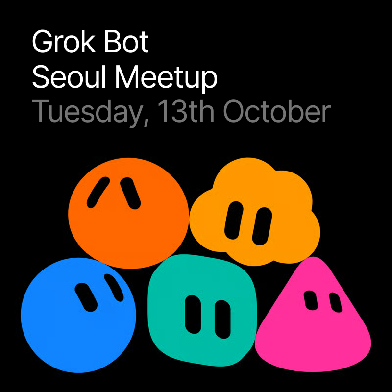</a></td><td valign="top"><strong>Grok Bot Meetup Seoul (13 Oct)</strong> Tue 13 Oct 2026, 18:00–22:00 (Asia/Seoul, KST, UTC+9) Seoul, South Korea · Grove1219, 12-19 Seoulsup 4-gil, Seongdong-gu — offline  Second Seoul Grok Bot meetup (distinct from sel-20261027 / slug 6ee6i3v6). Hosts include Jey Shim and others on a personal Luma calendar. Address: Grove1219, Seongdong-gu. Free RSVP; slug 3leebkxk (evt-dqR2wlOYLx6Jh4m).  <a href="https://luma.com/3leebkxk"><strong>Register on Luma →</strong></a></td></tr></table>

### Peru

<table><tr><td width="320" valign="top"><a href="https://luma.com/x5jqstsk">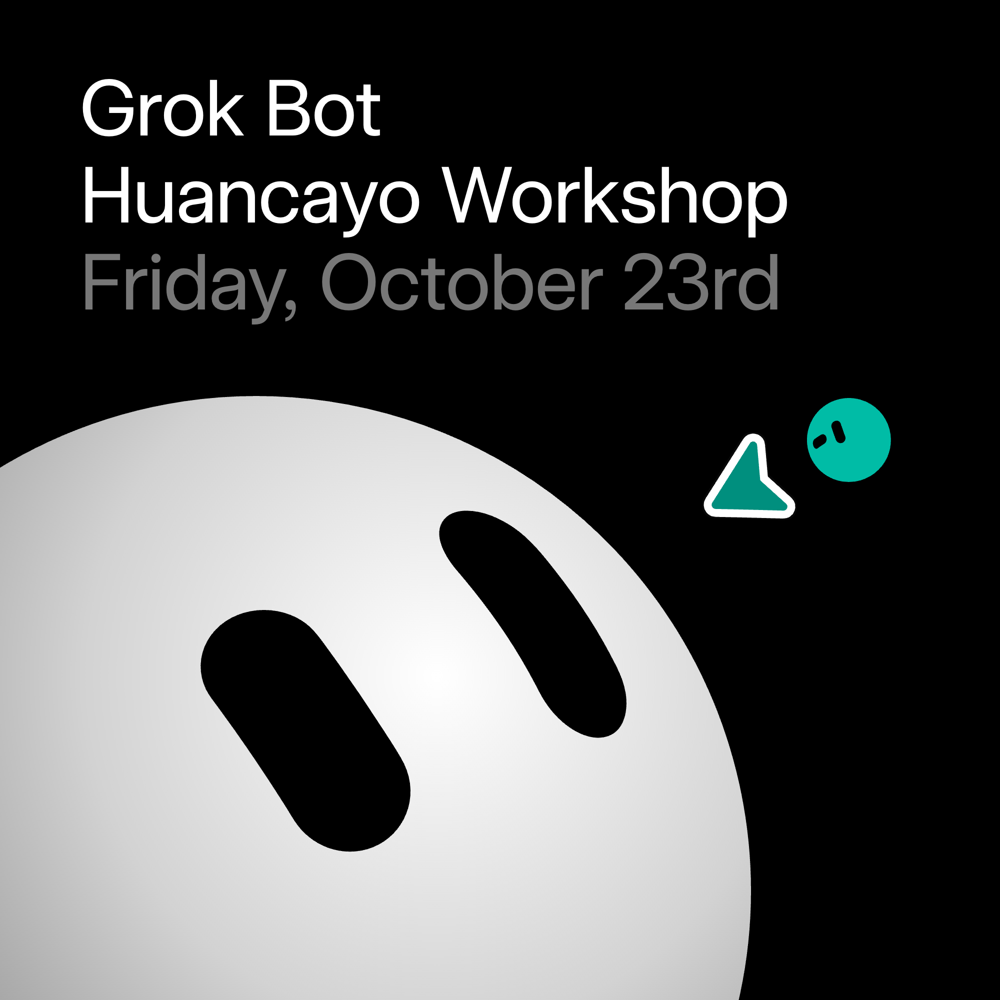</a></td><td valign="top"><strong>Grok Bot Huancayo Meetup</strong> Thu 23 Oct 2026, 16:00–19:30 (America/Lima / PET, UTC−5) Parque Huamanmarca, Huancayo 12001, Peru · offline  Hands-on Grok Bot meetup in Huancayo (host Ignacio Velasquez; forum 173396 / Luma x5jqstsk): less talk, more building—bring a laptop and ship a working app in one afternoon. Free; approval + waitlist; spots_remaining 40; guest_count 0 at evening scan.  <a href="https://luma.com/x5jqstsk"><strong>Register on Luma →</strong></a></td></tr></table>

<table><tr><td width="320" valign="top"></td><td valign="top"><strong>Grok Bot Lima: for builders</strong> Sat 17 Oct 2026, 10:00–11:30 (America/Lima, PET, UTC−5) Lima, Peru · UPCH Sede La Molina, Jr. José Antonio 310, La Molina — offline  Spanish-language Grokbot session: basics to new capabilities, a real project built with Grok Bot, starter credits and Q&A; no experience needed. Free with host approval; forum 173848; slug 7q78rrm9.  <a href="https://luma.com/7q78rrm9"><strong>Register on Luma →</strong></a></td></tr></table>

### Togo

<table><tr><td width="320" valign="top"><a href="https://luma.com/spacexai-kdvf">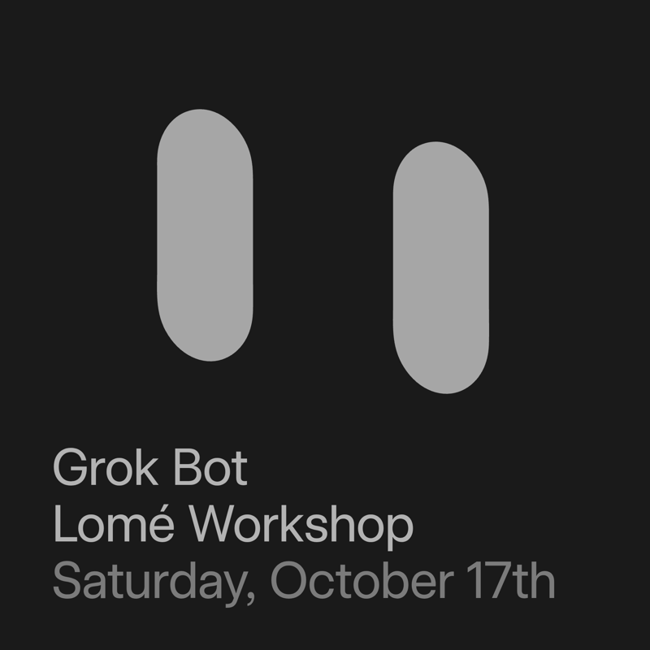</a></td><td valign="top"><strong>Grok Bot Workshop Lomé</strong> Sat 17 Oct 2026, 15:00–18:00 (Africa/Lome, GMT, UTC+0) Lomé, Togo · Lomé Business School (LBS), 96 Jean-Paul 2 — offline  Three-hour French-language hands-on workshop with the ACULPA association on Grok Bot's latest updates, live demos and setting up your own bot; bring a laptop. Free RSVP; forum 173847; slug spacexai-kdvf.  <a href="https://luma.com/spacexai-kdvf"><strong>Register on Luma →</strong></a></td></tr></table>

<table><tr><td width="320" valign="top"></td><td valign="top"><strong>Grok Bot Build Day Lomé</strong> Sat 14 Nov 2026, 09:00–17:00 (Africa/Lome, GMT, UTC+0) Lomé, Togo · Lomé Business School (LBS), 96 Jean-Paul 2 — offline  French-language one-day hackathon: a Grok Bot intro, team forming, a day of building your bot or tool, demos in front of a jury and networking; no experience needed. Free RSVP; forum 173853; slug syepftk0.  <a href="https://luma.com/syepftk0"><strong>Register on Luma →</strong></a></td></tr></table>

### Albania

<table><tr><td width="320" valign="top"><a href="https://luma.com/spacexai-kpc5">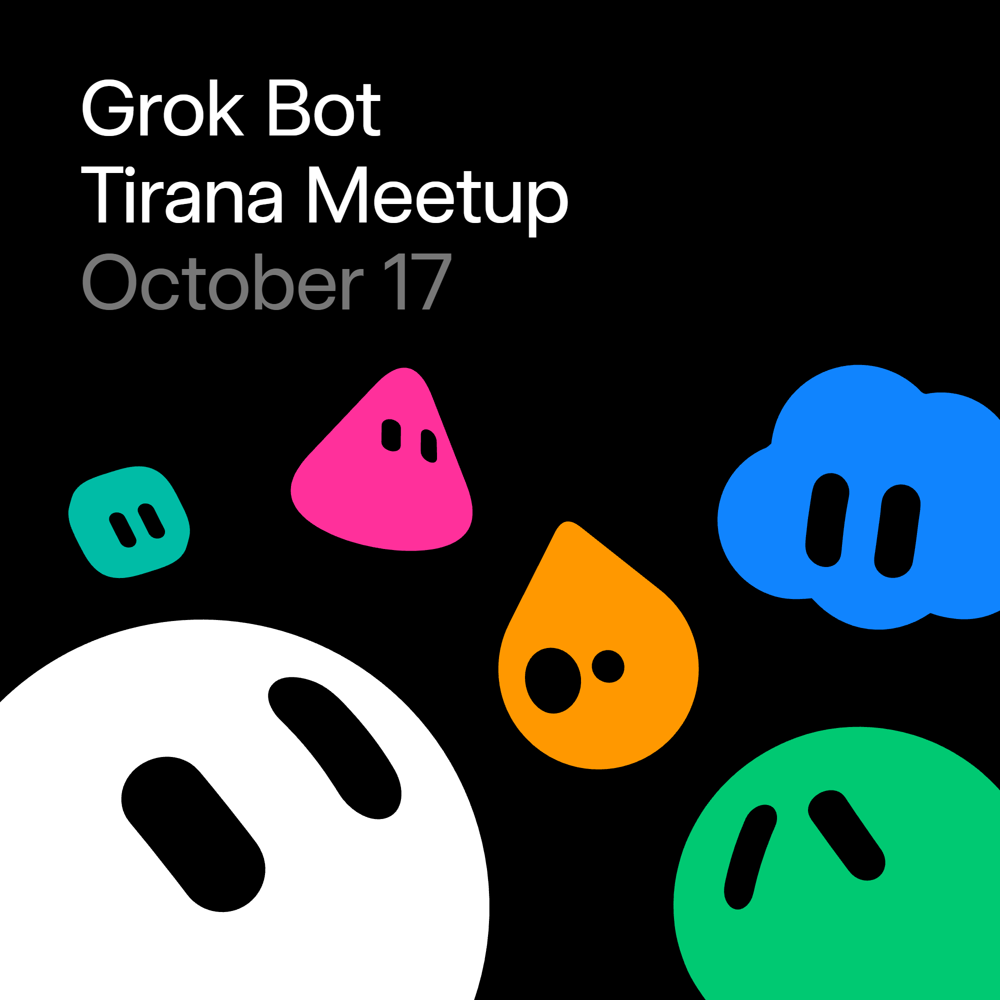</a></td><td valign="top"><strong>Grok Bot Tirana Workshop: Build Your AI Team</strong> Sat 17 Oct 2026, 12:00–13:30 (Europe/Tirane / CEST, UTC+2) Coolab, Rruga E Dibrës Nr.65, Tiranë 1015, Albania · offline  SpaceXAI Tirana workshop on building an AI team with Grok Bot (hosts Dorian Kane, Dhimiter Gero; forum 173299 / Luma spacexai-kpc5). Hands-on session at Coolab; waitlist on; guest_count 1 at evening scan.  <a href="https://luma.com/spacexai-kpc5"><strong>Register on Luma →</strong></a></td></tr></table>

### Austria

<table><tr><td width="320" valign="top"></td><td valign="top"><strong>Grok Bot Vienna Build Day</strong> Sat 31 Oct 2026, 13:00–18:00 (Europe/Vienna, CET, UTC+1) Vienna (Wien) · Roßau · hosted at Flinn (exact pin after register) · offline  Official SpaceXAI-sponsored Vienna Build Day at Flinn (host Abdul Basit Banbhan): demos, learning, networking for Grok Bot users. Free; approval ticket; forum 173479.  <a href="https://luma.com/spacexai-build-day-vienna"><strong>Register on Luma →</strong></a></td></tr></table>

### Australia

<table><tr><td width="320" valign="top"><a href="https://luma.com/cursor-d70v">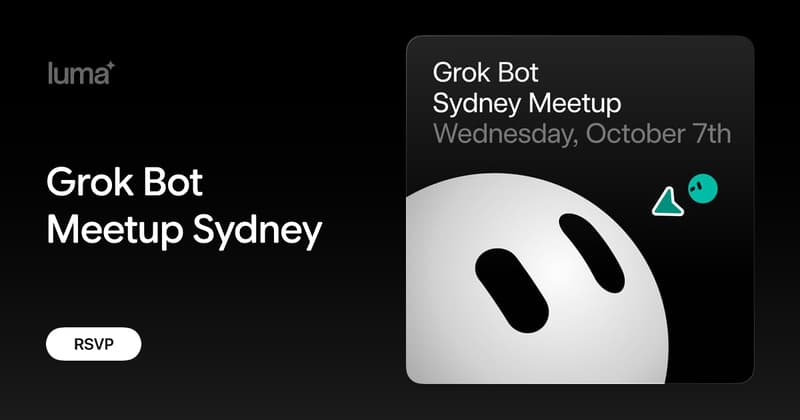</a></td><td valign="top"><strong>Grok Bot Meetup Sydney</strong> Wed 7 Oct 2026, 17:30–21:00 (AEDT) Sydney · exact address after you register  Next official Cursor Sydney Grok Bot night after the August meetup. Host approval required.  <a href="https://luma.com/cursor-d70v"><strong>Apply on Luma (host approval) →</strong></a></td></tr></table>

### Bangladesh

<table><tr><td width="320" valign="top"><a href="https://luma.com/spacexai-qnlu">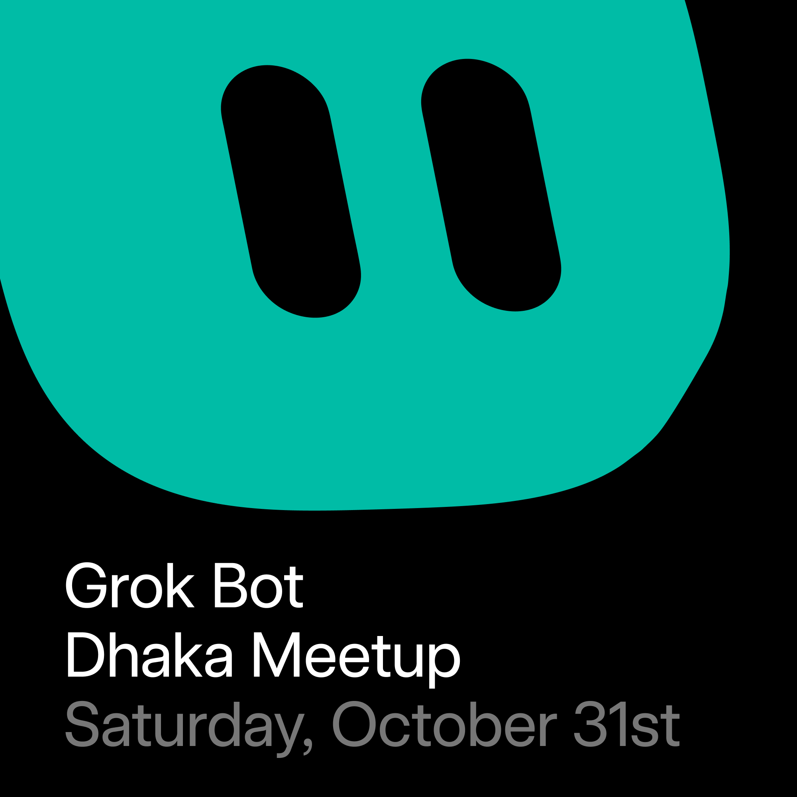</a></td><td valign="top"><strong>Grok Bot Dhaka Meetup</strong> Sat 31 Oct 2026, 14:00–16:00 (Asia/Dhaka / BST, UTC+6) Dhaka, Bangladesh · venue details on Luma (geo obfuscated until register) · offline  Hands-on Grok Bot coworking meetup in Dhaka (host Mahinoor Rahman; forum 173297 / Luma spacexai-qnlu). Explore ideas, build projects, learn together; waitlist off; guest_count 0 at evening scan.  <a href="https://luma.com/spacexai-qnlu"><strong>Register on Luma →</strong></a></td></tr></table>

### Bulgaria

<table><tr><td width="320" valign="top"><a href="https://luma.com/grok-bot-sofia">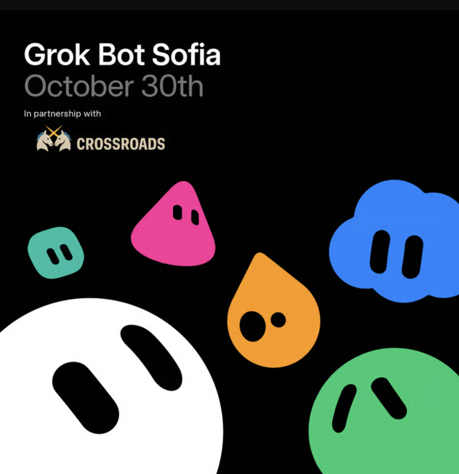</a></td><td valign="top"><strong>Grok Bot Meetup Sofia</strong> Fri 30 Oct 2026, 15:00–17:00 (Europe/Sofia, EET, UTC+2) Sofia, Bulgaria · Bulgarian Army Stadium, Borisova Gradina, bul. Dragan Tsankov 3 — offline  Two-hour hands-on Build with Grok workshop with StartUp Bulgaria Crossroads, led by SpaceXAI ambassadors Kristiyan Velkov and Niccolò Mascaro; bring a laptop, places limited. Free RSVP; forum 173851; slug grok-bot-sofia.  <a href="https://luma.com/grok-bot-sofia"><strong>Register on Luma →</strong></a></td></tr></table>

### Côte d'Ivoire

<table><tr><td width="320" valign="top"><a href="https://luma.com/spacexai-2qgv">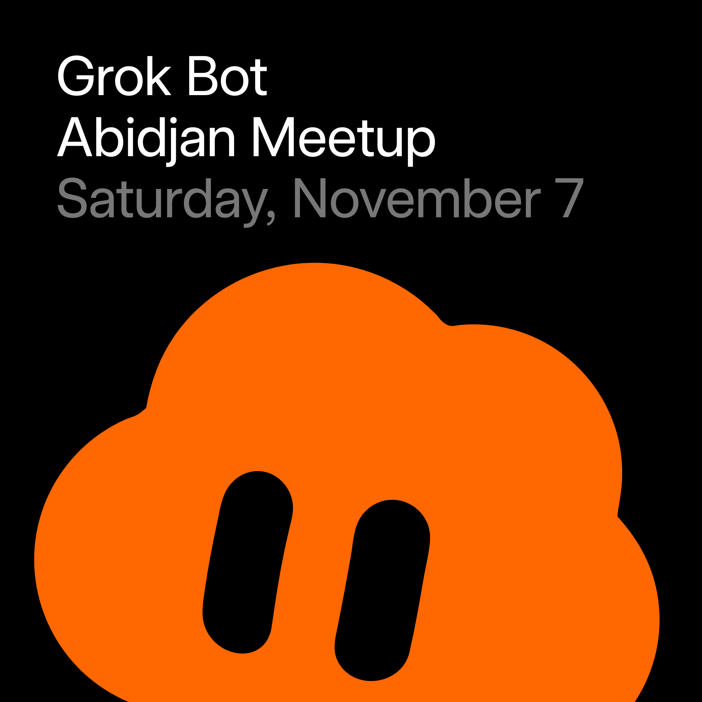</a></td><td valign="top"><strong>Grok Bot Meetup Abidjan</strong> Sat 7 Nov 2026, 09:00–17:00 (Africa/Abidjan / GMT) Abidjan, Côte d'Ivoire · Alto café (near Institut Coeur de Grace, Danga Nord) — offline  SpaceXAI for Abidjan meetup at Alto café: drop-in day to build and share with Grok Bot (follow-up to Café Cursor Abidjan). Free coffee vibe; ~11 guests. Register on Luma.  <a href="https://luma.com/spacexai-2qgv"><strong>Register on Luma →</strong></a></td></tr></table>

### Colombia

<table><tr><td width="320" valign="top"><a href="https://luma.com/spacexai-zarzal">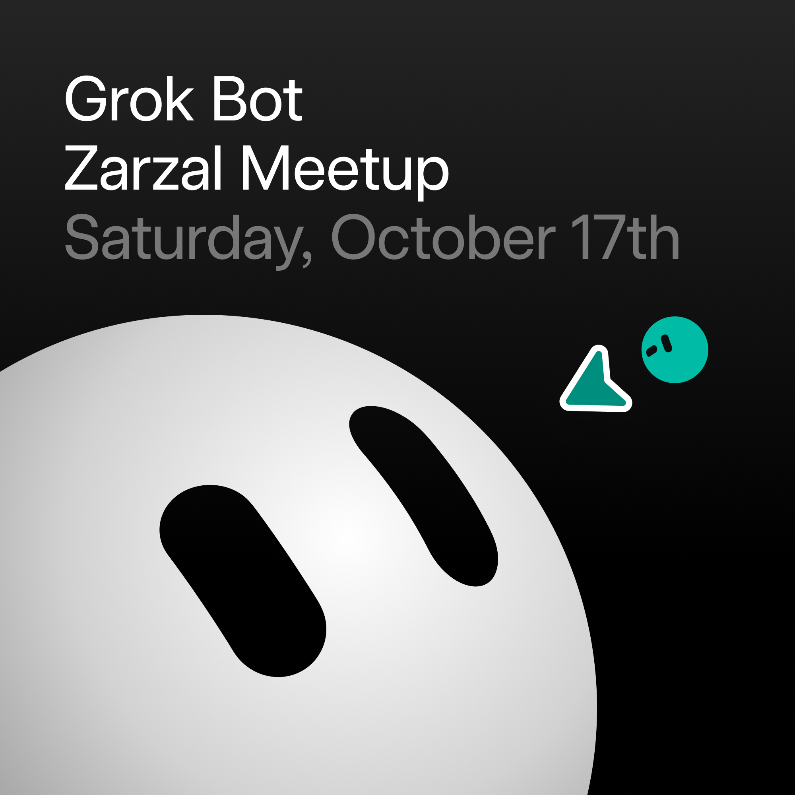</a></td><td valign="top"><strong>Grok Bot Zarzal Meetup</strong> Sat 17 Oct 2026, 14:00–16:30 (America/Bogota, COT, UTC-5) Zarzal, Colombia · Universidad del Valle Sede Zarzal — Campus "Bolivar", Cl. 14 #7-134 — offline  SpaceXAI for Pereira calendar meetup in Zarzal (Valle del Cauca): afternoon of ideas, AI, Grok, and building. Free; ~60 spots; forum 173707; slug spacexai-zarzal (evt-S8NHkYmS6gcfEAv).  <a href="https://luma.com/spacexai-zarzal"><strong>Register on Luma →</strong></a></td></tr></table>

### Ethiopia

<table><tr><td width="320" valign="top"></td><td valign="top"><strong>Grok Bot Hackathon Jimma</strong> Sat 14 Nov 08:00 – Sun 15 Nov 11:00, 2026 (Africa/Addis_Ababa, EAT, UTC+3) Jimma, Ethiopia · Jimma University — offline  Overnight Grok Bot hackathon at Jimma University from the SpaceXAI Addis Ababa calendar, hosted by natnael Eskinder and Alpha Lencho. Free RSVP; forum 173854; slug spacexai-yijh.  <a href="https://luma.com/spacexai-yijh"><strong>Register on Luma →</strong></a></td></tr></table>

### Finland

<table><tr><td width="320" valign="top"><a href="https://luma.com/aic-fi-10-27">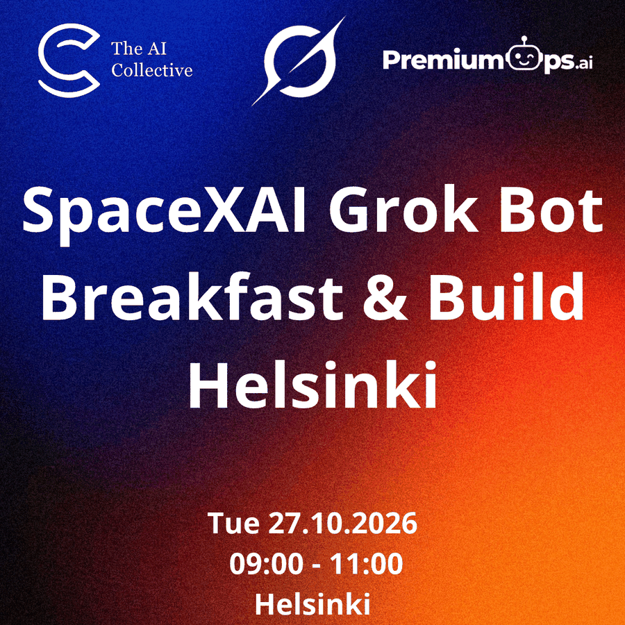</a></td><td valign="top"><strong>SpaceXAI Grok Bot — Breakfast & Build Helsinki</strong> Tue 27 Oct 2026, 09:00–11:00 (Europe/Helsinki, EET, UTC+2) Helsinki, Finland · Kamppi · offline (AI Collective Finland)  AI Collective × SpaceXAI Breakfast & Build on Grok Bot in Helsinki (Kamppi). Luma aic-fi-10-27; guest_count 0 at midday scan.  <a href="https://luma.com/aic-fi-10-27"><strong>Register on Luma →</strong></a></td></tr></table>

### Ghana

<table><tr><td width="320" valign="top"><a href="https://luma.com/grokbotaccrabuildersnight">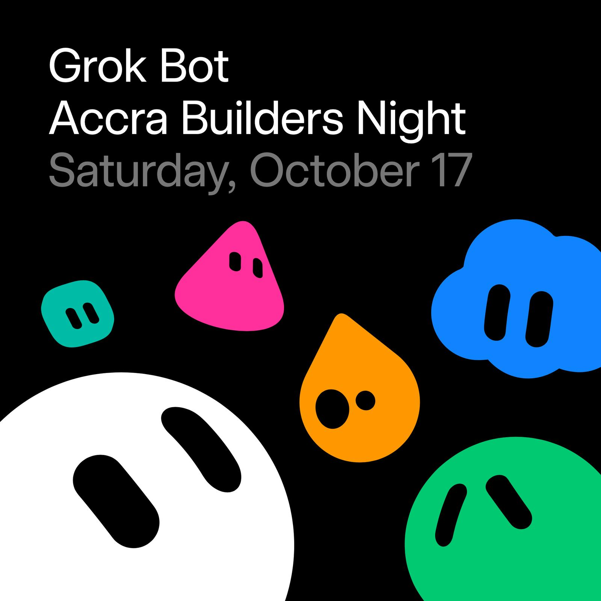</a></td><td valign="top"><strong>Grok Bot Accra Builders Night</strong> Fri 17 Oct 2026, 15:30–20:00 (Africa/Abidjan, GMT, UTC+0) Accra area, Ghana · Adjiringanor / Adenta Municipality (exact venue on Luma after RSVP) — offline  First SpaceXAI Ghana Community Grok Bot Builders Night—give a bot a job, then build while it works. Free; guest_count 98 at morning scan. Luma grokbotaccrabuildersnight.  <a href="https://luma.com/grokbotaccrabuildersnight"><strong>Register on Luma →</strong></a></td></tr></table>

### Israel

<table><tr><td width="320" valign="top"><a href="https://luma.com/ax8q461b">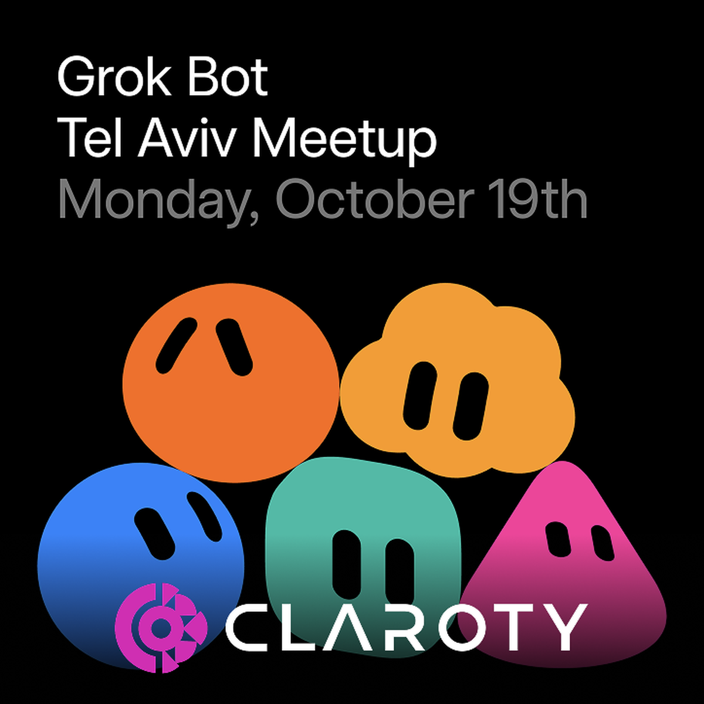</a></td><td valign="top"><strong>Grok Bot Meetup Tel Aviv</strong> Mon 19 Oct 2026, 18:00–20:00 (Asia/Jerusalem, IDT, UTC+3) Tel Aviv-Yafo · hosted by Claroty (exact pin after register) · offline  Next Tel Aviv Grok Bot meetup (hosts Elie Steinbock & Vlad Tansky; Luma ax8q461b): Claroty venue; short intros/demos plus talks on verifying agent work. Free; ~144 spots left / guest_count 206 at midday scan. Distinct from expired tlv-20260908.  <a href="https://luma.com/ax8q461b"><strong>Register on Luma →</strong></a></td></tr></table>

### Kenya

<table><tr><td width="320" valign="top"><a href="https://luma.com/spacexai-9apo">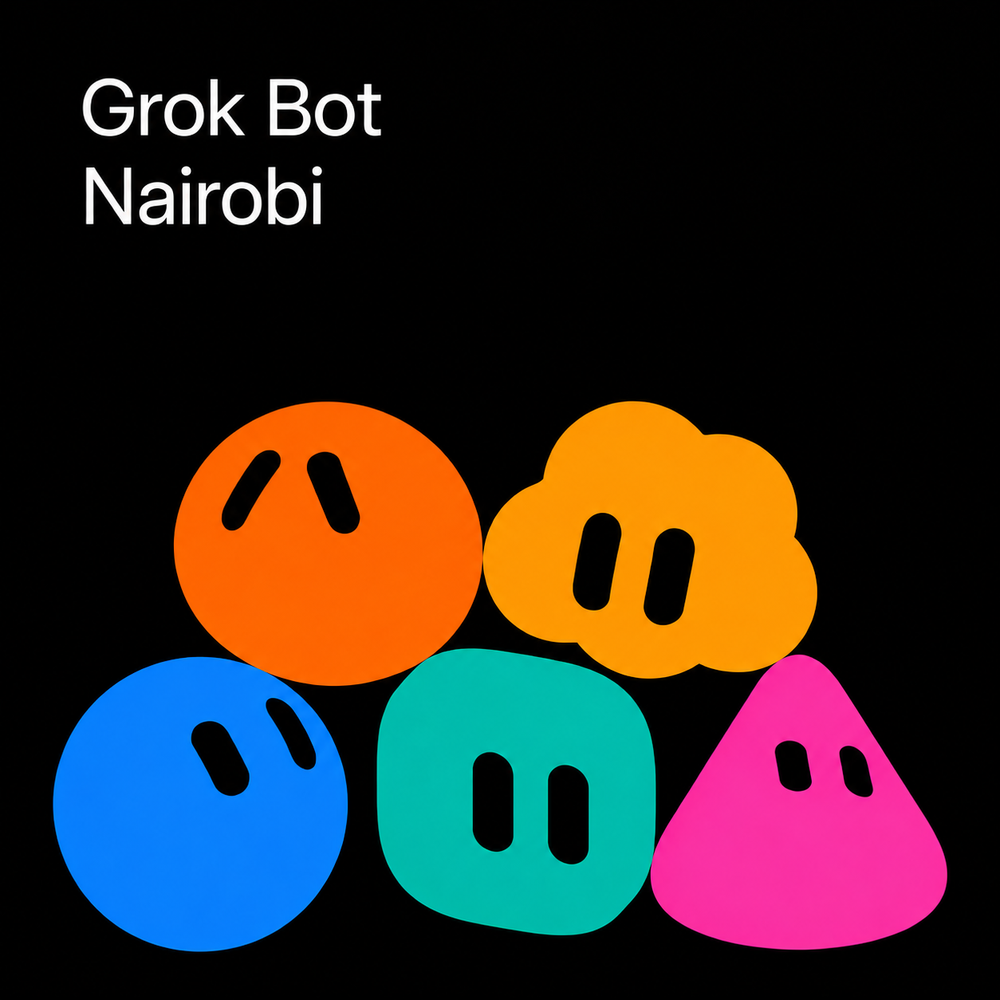</a></td><td valign="top"><strong>Grok Bot Kenya Workshop</strong> Wed 8 Oct 2026, 15:00–18:00 (Africa/Nairobi, EAT, UTC+3) Nairobi · Upper Hill Estate (exact pin after register) · offline  SpaceXAI Kenya hands-on workshop on Grok Bot in Nairobi (host Felix Jumason). Free approval ticket; guest_count 24 at evening scan; forum 173480; Luma spacexai-9apo. Distinct from expired nbo-20260917.  <a href="https://luma.com/spacexai-9apo"><strong>Register on Luma →</strong></a></td></tr></table>

### Cambodia

<table><tr><td width="320" valign="top"></td><td valign="top"><strong>Grok Bot Siem Reap Meetup</strong> Sun 1 Nov 2026, 14:00–18:00 (Asia/Bangkok / ICT, UTC+7) The Creative House, Street Wat Po, Krong Siem Reap 17251, Cambodia · offline  First-ever Siem Reap Grok Bot meetup (SpaceXAI Phnom Penh calendar; hosts Taka Kiyone, Luis Romero et al.; forum 173298 / Luma spacexai-yvwt). Hang out, demos, swap ideas; waitlist on; guest_count 0 at evening scan.  <a href="https://luma.com/spacexai-yvwt"><strong>Register on Luma →</strong></a></td></tr></table>

### Sri Lanka

<table><tr><td width="320" valign="top"><a href="https://luma.com/grokbot-cmb">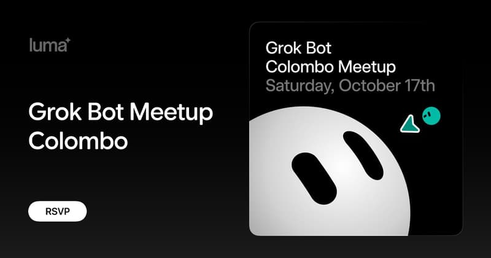</a></td><td valign="top"><strong>Grok Bot Meetup Colombo</strong> Sat 17 Oct 2026, 09:30–17:00 (Asia/Colombo, UTC+5:30) Colombo, Sri Lanka · DHPL Auditorium (42 Nawam Mawatha, Colombo 2) — offline  SpaceXAI for Colombo meetup: friendly intro with slides, live Grok Bot demo, Q&A, and networking at DHPL Auditorium. Register on Luma.  <a href="https://luma.com/grokbot-cmb"><strong>Register on Luma →</strong></a></td></tr></table>

### Morocco

<table><tr><td width="320" valign="top"><a href="https://luma.com/spacexai-slxi">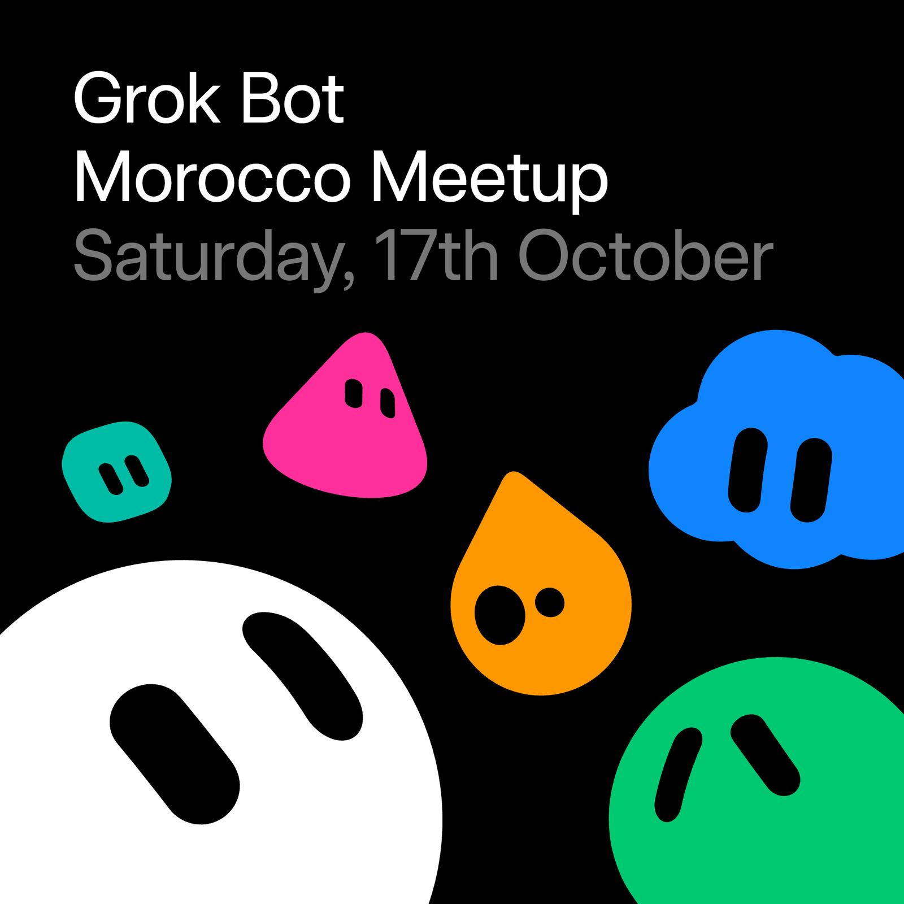</a></td><td valign="top"><strong>Grok Bot Morocco Meetup (Casablanca)</strong> Fri 17 Oct 2026, 11:00–15:00 (Africa/Casablanca, UTC+1) Casablanca, Morocco · LA GIRONDE area (exact venue on Luma after RSVP) — offline  SpaceXAI Grok Bot Morocco Meetup in Casablanca. Free; guest_count 0 at morning scan. Luma spacexai-slxi. Distinct from cas-20260919.  <a href="https://luma.com/spacexai-slxi"><strong>Register on Luma →</strong></a></td></tr></table>

### Mexico

<table><tr><td width="320" valign="top"></td><td valign="top"><strong>Grok Bot CDMX con SpaceXAI</strong> Thu 9 Oct 2026, 10:00–13:00 (America/Mexico_City, CST, UTC-6) Mexico City · Hipódromo Condesa (exact venue on Luma after RSVP) — offline  Return CDMX Grok Bot meetup with SpaceXAI—short demos of real uses. Free; guest_count 0 at morning scan. Luma spacexai-yfrs. Distinct from cdmx-20260926.  <a href="https://luma.com/spacexai-yfrs"><strong>Register on Luma →</strong></a></td></tr></table>

### Norway

<table><tr><td width="320" valign="top"></td><td valign="top"><strong>Grok Bot Meetup Oslo</strong> Fri 16 Oct 2026, 17:00–19:00 (Europe/Oslo) Oslo · Mesh Youngstorget (Mesh Community), Møllergata 6–8 — offline  First SpaceXAI Grok Bot meetup in Oslo at MESH: build Bots, share ideas, credits provided. Register on Luma.  <a href="https://luma.com/spacexai-94dg"><strong>Register on Luma →</strong></a></td></tr></table>

### New Zealand

<table><tr><td width="320" valign="top"></td><td valign="top"><strong>Grok Bot Auckland Meetup</strong> Thu 8 Oct 2026, 18:00–21:00 (Pacific/Auckland) Auckland CBD · address shared with guests — offline  SpaceXAI Community Grok Bot meetup in Auckland, New Zealand. In-person builders session; register on Luma.  <a href="https://luma.com/spacexai-akl01"><strong>Register on Luma →</strong></a></td></tr></table>

### Philippines

<table><tr><td width="320" valign="top"></td><td valign="top"><strong>Grok Bot Meetup Cebu</strong> Sat 10 Oct 2026, 09:00–11:30 (Asia/Manila / PHT) Zero-Ten Park Cebu Mandaue, Mandaue, Central Visayas, Philippines — offline  In-person Grok Bot meetup in Cebu (rescheduled to Sat 10 Oct 2026). Host approval required.  <a href="https://luma.com/cursor-dyb8"><strong>Apply on Luma (host approval) →</strong></a></td></tr></table>

### Sweden

<table><tr><td width="320" valign="top"></td><td valign="top"><strong>SpaceXAI | CXO Experience Stockholm</strong> Tue 14 Oct 2026, 08:30–13:30 (Europe/Stockholm, CEST, UTC+2) Stockholm, Sweden · Wisdome Stockholm, Museivägen 7 — offline  SpaceXAI calendar CXO Experience in Stockholm at Wisdome. Waitlist-enabled public Luma event (slug spacexai-dt0z / evt-8ReK7vGiGcyk3jk). Midday scan: new vs catalog.  <a href="https://luma.com/spacexai-dt0z"><strong>Register on Luma →</strong></a></td></tr></table>

### Trinidad and Tobago

<table><tr><td width="320" valign="top"><a href="https://luma.com/spacexai-box6">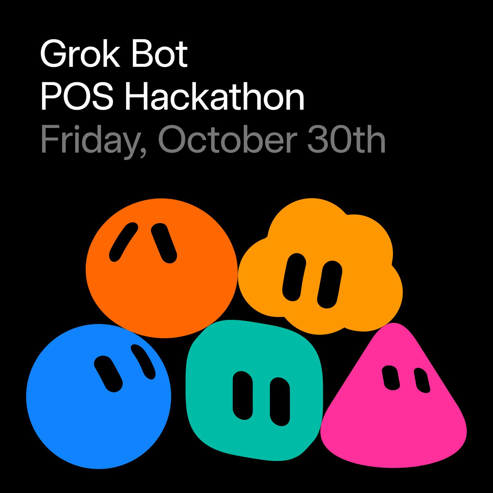</a></td><td valign="top"><strong>Grok Bot Hackathon — Port of Spain</strong> Fri 30 Oct 2026, 10:00–13:00 (AST, UTC-4) Port of Spain, Trinidad and Tobago · CinemaONE IMAX, One Woodbrook Place — offline  Free in-person Grok Bot hackathon in Port of Spain—bring a real idea and build for an afternoon. guest_count 0 at morning scan. Luma spacexai-box6.  <a href="https://luma.com/spacexai-box6"><strong>Register on Luma →</strong></a></td></tr></table>

### Online

<table><tr><td width="320" valign="top"></td><td valign="top"><strong>Build with Grok Bot (Online)</strong> Sat 17 Oct 2026, 10:00–12:00 (America/Sao_Paulo) Online — link shared before the event (listed under Goiânia)  Build with Grok Bot online session (America/Sao_Paulo listing). Link shared before start; free registration on Luma.  <a href="https://luma.com/y22dqtvt"><strong>Register on Luma →</strong></a></td></tr></table>
