# 活动

<a href="./EVENTS.md"><strong>EN</strong></a> · <strong>中文</strong> · <a href="./EVENTS.ja.md"><strong>日本語</strong></a>

海报、场地和报名方式。首页按国家列出城市，点名称跳到这一页的对应场次。[回 README](README.zh.md)。

[回清单](./README.zh.md)

### 中国

<table><tr><td width="320" valign="top"></td><td valign="top"><strong>Grok Bot 上海线下交流</strong> 2026-10-18 周日 14:00–18:30 上海 · 报名通过后可见地址  上海 Grok Bot 线下：破冰 + 分享/Workshop。预报名需审核。论坛 170454。注意：Luma API 时间目前错成 HKT 09–10（1 小时），以文案 14:00–17:00 为准。  <a href="https://luma.com/spacexai-kh2x"><strong>去 Luma 报名 → →</strong></a></td></tr></table>

<table><tr><td width="320" valign="top"></td><td valign="top"><strong>Grok Bot 武汉线下交流</strong> 2026-10-17 周六 14:00–17:30（北京时间） 武汉（场地待确认，确认后更新 Luma 页）  武汉 Grok Bot 线下：交流破冰 + 分享/Workshop。SpaceXAI 产品叙事（能登录你的工具、把做完的活带回来的 AI 队友）。预报名需审核，通过后拉微信群；欢迎分享/志愿者。主办 Hanbing Zhang、chenchong、yuepu；免费，约 150 席。与同日 sha-20261017 上海场不同。  <a href="https://luma.com/kss59f4e"><strong>去 Luma 报名（需审核） →</strong></a></td></tr></table>

### 美国

<table><tr><td width="320" valign="top"></td><td valign="top"><strong>Grok Bot 匹兹堡线下交流</strong> 2026-10-13 周二 18:30–20:30（美东） 匹兹堡 · Oakland / Lawrenceville（报名后可见详细地址）  匹兹堡首场城市级 Grok Bot 线下（非校园专场）：短演示后动手/换配置；学生与在职皆可。主办 Micah Smith；免费，开放报名（约 30 席）。  <a href="https://luma.com/6lx5t8ru"><strong>去 Luma 报名 →</strong></a></td></tr></table>

<table><tr><td width="320" valign="top"></td><td valign="top"><strong>Grok Bot 迈阿密 Kickoff</strong> 2026-09-23 周三 18:30–21:30（美东 EDT） 迈阿密 · The DOCK，400 NW 26th St（Wynwood）  迈阿密 SpaceXAI（承接原 Cursor Community Miami）首场 Grok Bot Kickoff：现场 demo、真实 builder，初探把 AI agent 用起来。议程待公布；欢迎带本。场地 The DOCK（Wynwood）。主办 Ben Milshtein、The LAB Miami；免费，人工审核；扫描时报名 0。  <a href="https://luma.com/spacexai-kxjz"><strong>报名 →</strong></a></td></tr></table>

<table><tr><td width="320" valign="top"></td><td valign="top"><strong>Grok Bot 亚特兰大线下交流</strong> 2026-09-24 周四 18:00–20:00（美东 EDT） 亚特兰大都会区 Alpharetta · Tech North Atlanta，925 North Point Pkwy Ste 130  亚特兰大 SpaceXAI 入门局：下班后 demo 优先——Grok Bot 是什么、产品走查、现场 AI 辅助架构演示、问答/开放麦、餐点咖啡、免费停车。主办 Raj Poloju、Sreyas Gentela；免费，免审核；笔记本可选；扫描时报名 0。论坛 171336。  <a href="https://luma.com/ihgtq394"><strong>去 Luma 报名 → →</strong></a></td></tr></table>

<table><tr><td width="320" valign="top"></td><td valign="top"><strong>Grok Bot 费城线下交流</strong> 2026-09-29 周二 18:00–20:30（美东纽约 EDT，UTC−4） 美国费城 · Indy Hall Clubhouse，709 N 2nd St 3rd Floor  SpaceXAI for Philadelphia 首场 Grok Bot Meetup（主办 Luis Cielak、Malcolm Jones）。多智能体工作流分享：Think–Pair–Share、agentic 流程、餐饮、Free Grok credits。免费、无需审核；扫描时报名 49。场地 Indy Hall。隔夜更名：9/12 晚间仍为 “Cursor Meetup Philadelphia — September”（Cursor 局，未收录）；现标题与正文已是 Grok Bot Meetup。不同于已过期校园场 phl-20260903 / tmp-20260903。  <a href="https://luma.com/cursor-hdle"><strong>去 Luma 报名 →</strong></a></td></tr></table>

<table><tr><td width="320" valign="top"><a href="https://luma.com/grokbotdesign-la">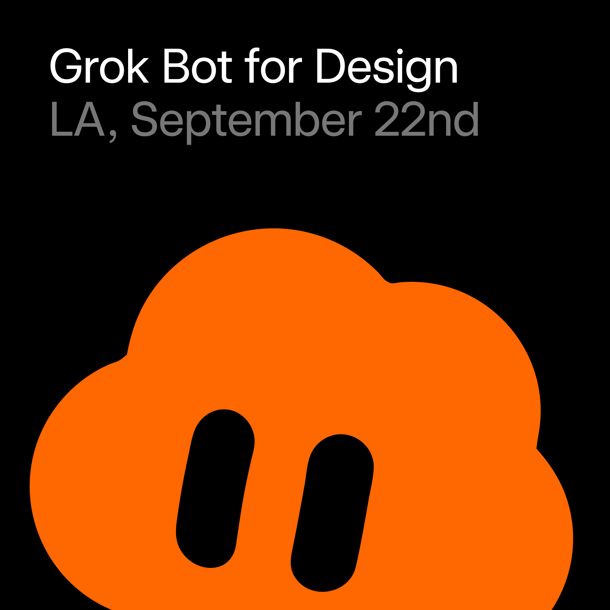</a></td><td valign="top"><strong>Grok Bot Design 洛杉矶共建夜</strong> 2026-09-22 周二 17:00–20:30（美西洛杉矶 PDT，UTC−7） 美国洛杉矶 · 场地待公布（线下）  SpaceXAI Community Grok Bot Design 共建夜（主办 Sunita Rao；论坛 171544）。17:00–20:30：概览、SpaceXAI Design 演示、Q&A、Free Grok Bot credits 动手、出席者演示。线下免费；guest_count 0。本地日 Sep 22（UTC 日起 09-23）。短链 grokbotdesign-la（= spacexai-o5ji）。  <a href="https://luma.com/grokbotdesign-la"><strong>去 Luma 报名 → →</strong></a></td></tr></table>

<table><tr><td width="320" valign="top"><a href="https://luma.com/grokbotengineering-seattle">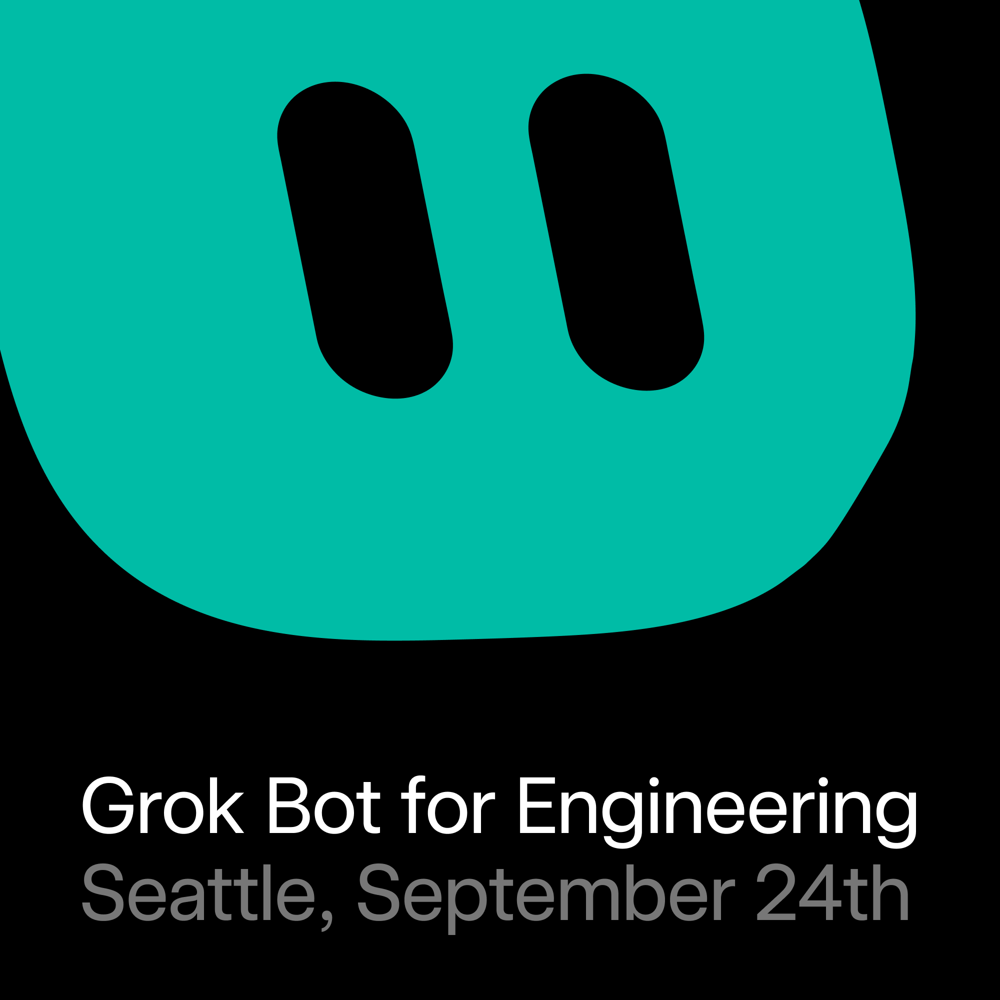</a></td><td valign="top"><strong>Grok Bot Engineering 西雅图共建夜</strong> 2026-09-24 周四 17:00–20:30（美西太平洋 PDT，UTC−7） 美国西雅图 · 场地待公布（线下）  SpaceXAI Community Grok Bot Engineering 共建夜（主办 Sunita Rao；论坛 171546）。太平洋时间 17:00–20:30。线下免费；guest_count 0。本地日 Sep 24。短链 grokbotengineering-seattle（= spacexai-xn5j）。  <a href="https://luma.com/grokbotengineering-seattle"><strong>去 Luma 报名 → →</strong></a></td></tr></table>

<table><tr><td width="320" valign="top"><a href="https://luma.com/grokbotproduct-sf">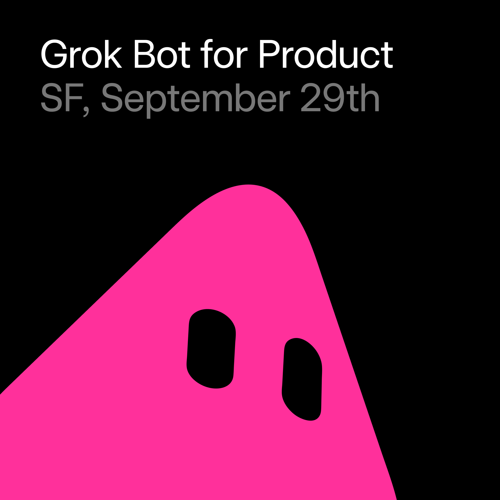</a></td><td valign="top"><strong>Grok Bot Product 旧金山共建夜</strong> 2026-09-29 周二 17:00–20:30（美西旧金山 PDT，UTC−7） 美国旧金山 · 场地待公布（线下）  SpaceXAI Community Grok Bot Product 共建夜（主办 Sunita Rao；论坛 171547）。不同于 Howard SF 的 sfpm-20260915（9/15 PM 场）。17:00–20:30；线下免费；guest_count 0。本地日 Sep 29。短链 grokbotproduct-sf（= spacexai-81pf）。  <a href="https://luma.com/grokbotproduct-sf"><strong>去 Luma 报名 → →</strong></a></td></tr></table>

<table><tr><td width="320" valign="top"><a href="https://luma.com/grokbotrecruiting-chicago">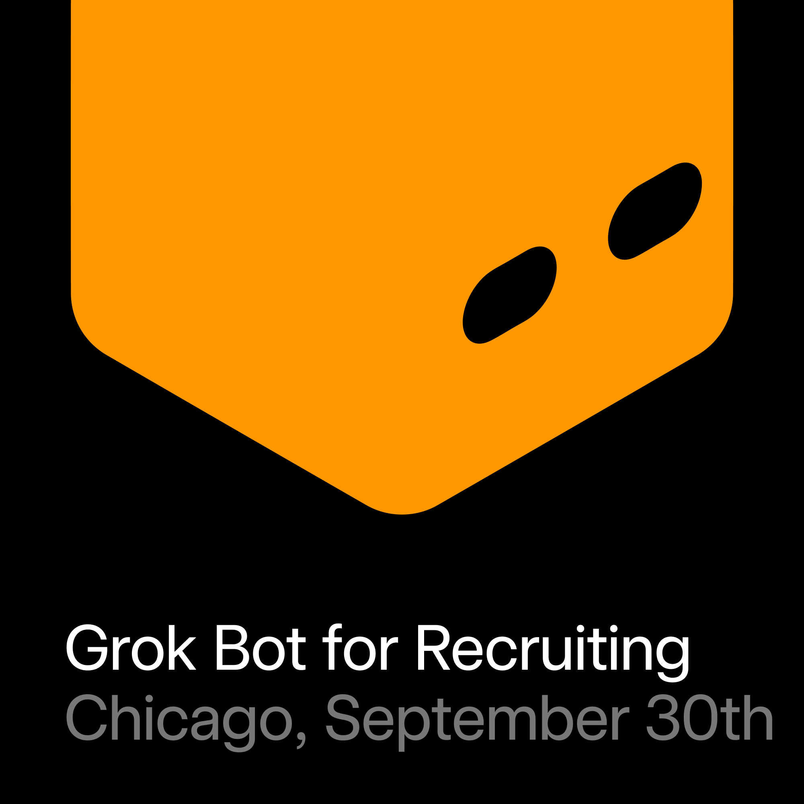</a></td><td valign="top"><strong>Grok Bot Recruiting 芝加哥共建夜</strong> 2026-09-30 周三 17:00–20:30（美中芝加哥 CDT，UTC−5） 美国芝加哥 · 场地待公布（线下）  SpaceXAI Community Grok Bot Recruiting 共建夜（主办 Sunita Rao；论坛 171548）。芝加哥时间 17:00–20:30。线下免费；guest_count 0。首场芝加哥。短链 grokbotrecruiting-chicago（= spacexai-k0po）。  <a href="https://luma.com/grokbotrecruiting-chicago"><strong>去 Luma 报名 → →</strong></a></td></tr></table>

<table><tr><td width="320" valign="top"><a href="https://luma.com/utdchtxv">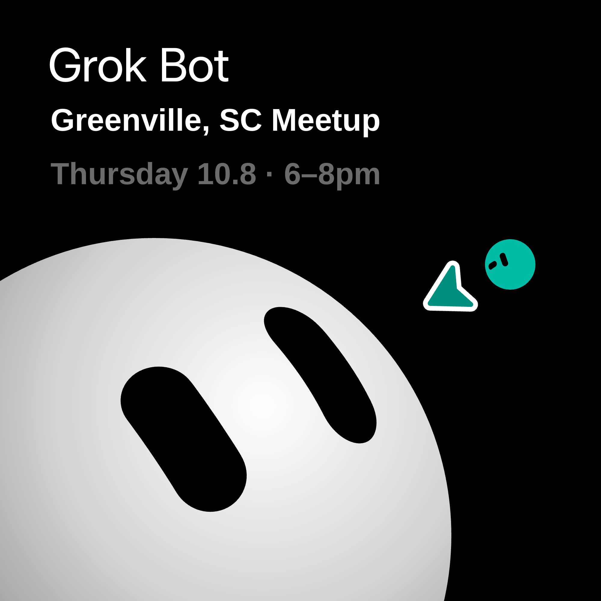</a></td><td valign="top"><strong>Grok Bot Meetup 格林维尔</strong> 2026-10-08 周四 18:00–20:00（美国南卡罗来纳州格林维尔 ET，UTC−4） 美国南卡罗来纳州格林维尔（场地待定）（线下；软容量 50–75，有候补）  格林维尔首场入库 Grok Bot 聚会（主办 Brad Shannon；个人 Luma 日历）。议程：约 17:45 入场、欢迎与介绍 Grok Bot、现场演示、Q&A、自由构建。自带电脑，建议预装 https://x.ai/bot。设计师/PM/创始人/开发者皆可。免费报名（扫描时剩余约 66、guest_count 9）。场地待定。新 discover slug utdchtxv；论坛尚无 New event 帖。  <a href="https://luma.com/utdchtxv"><strong>去 Luma 报名 → →</strong></a></td></tr></table>

<table><tr><td width="320" valign="top"><a href="https://luma.com/spacexai-zk6r">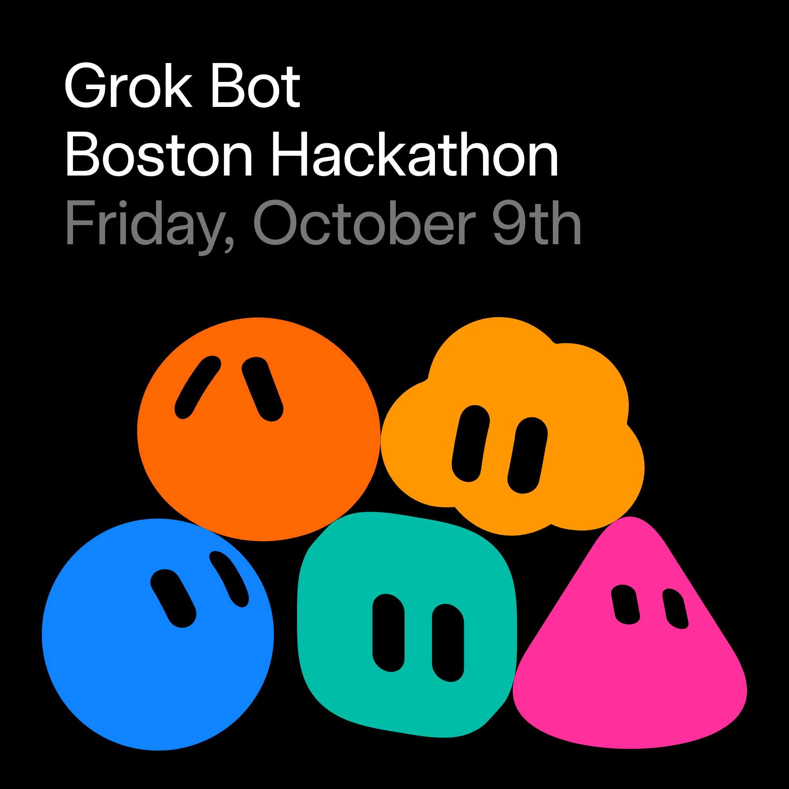</a></td><td valign="top"><strong>Grok Bot 波士顿黑客松</strong> 2026-10-09 周五 09:00–15:00（America/New_York） 波士顿／剑桥 · CambridgeSide — 线下黑客松  波士顿 Grok Bot 黑客松（CambridgeSide）：线下用 Grok Bot 队友一起做。SpaceXAI Community 挂牌。  <a href="https://luma.com/spacexai-zk6r"><strong>去 Luma 报名 →</strong></a></td></tr></table>

<table><tr><td width="320" valign="top"><a href="https://luma.com/GrokBotClass">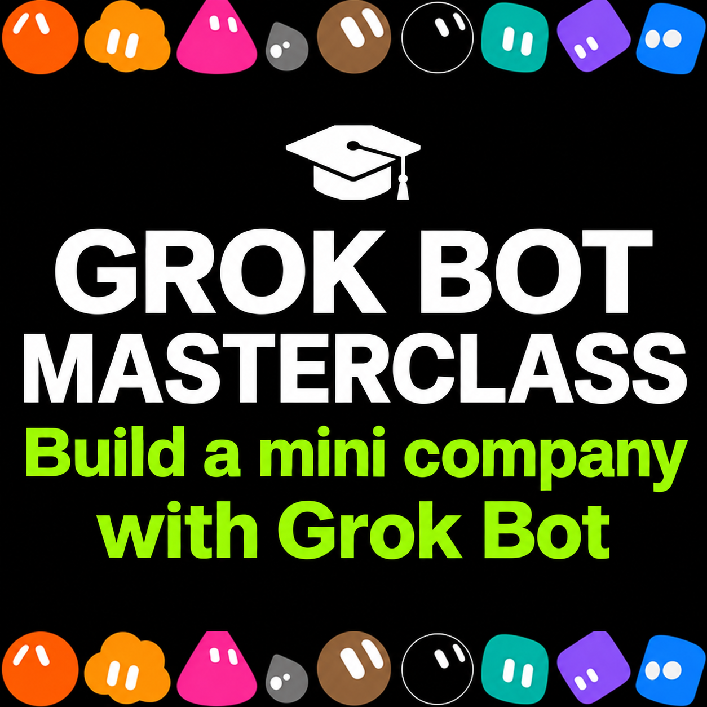</a></td><td valign="top"><strong>Grok Bot 大师课：用 Grok Bot 搭迷你公司</strong> 2026-10-04 周日 13:00–16:00（America/Chicago） 奥斯汀 · Antler VC, 800 Brazos St #340, Austin, TX 78701, USA — 线下  奥斯汀 AI Implementation Club 大师课：在 Antler VC 用 Grok Bot 搭迷你公司。Luma 报名。  <a href="https://luma.com/GrokBotClass"><strong>去 Luma 报名 →</strong></a></td></tr></table>

<table><tr><td width="320" valign="top"></td><td valign="top"><strong>Cursor Meetup 费城 — 十月场</strong> 2026-10-27 周二 18:00–20:30（America/New_York） 费城 · SpaceXAI Philadelphia — 线下  SpaceXAI Community 费城十月 Cursor/Grok 局（接 9/29 Grok Bot Meetup）。Luma 报名。  <a href="https://luma.com/cursor-c2mq"><strong>去 Luma 报名 →</strong></a></td></tr></table>

<table><tr><td width="320" valign="top"></td><td valign="top"><strong>Cursor Meetup 费城 — 十一月场</strong> 2026-11-17 周二 18:00–20:30（America/New_York） 费城 · SpaceXAI Philadelphia — 线下  SpaceXAI Community 费城十一月 Cursor/Grok 局。Luma 报名。  <a href="https://luma.com/cursor-acqy"><strong>去 Luma 报名 →</strong></a></td></tr></table>

<table><tr><td width="320" valign="top"></td><td valign="top"><strong>Cursor Meetup 费城 — 十二月场</strong> 2026-12-17 周四 18:00–20:30（America/New_York） 费城 · SpaceXAI Philadelphia — 线下  SpaceXAI Community 费城十二月 Cursor/Grok 局。Luma 报名。  <a href="https://luma.com/cursor-8wr8"><strong>去 Luma 报名 →</strong></a></td></tr></table>

### 加拿大

<table><tr><td width="320" valign="top"></td><td valign="top"><strong>Grok Bot 卡尔加里线下交流</strong> 2026-09-30 周三 17:30–20:30（卡尔加里） 卡尔加里 · 场地待定，报名后通知  卡尔加里线下 Grok Bot。免费开放报名。  <a href="https://luma.com/cursor-coel"><strong>去 Luma 报名 →</strong></a></td></tr></table>

<table><tr><td width="320" valign="top"></td><td valign="top"><strong>Grok Bot 维多利亚（BC）线下交流</strong> 2026-09-21 周一 18:00–21:00（维多利亚） 维多利亚（BC）· 报名通过后可见地址  维多利亚 Grok Bot 动手夜。需主办审核。  <a href="https://luma.com/grokbot"><strong>去 Luma 报名（需审核） →</strong></a></td></tr></table>

<table><tr><td width="320" valign="top"></td><td valign="top"><strong>Grok Bot 蒙特利尔线下交流 - BUILD DAY</strong> 2026-10-03 周六 12:00–17:00（蒙特利尔 EDT） 蒙特利尔 · Reflex（63 Rue de Brésoles；与 SpaceXAI Community 合作）  蒙特利尔官方 Grok Bot 线下（Reflex）：快速教程、社区现场 demo、自由交流与导师答疑；有试用额度与周边。主办 Lucas、Samira G.；免费需审核；下午线下。EventScheduled。  <a href="https://luma.com/hkujao4q"><strong>报名 →</strong></a></td></tr></table>

<table><tr><td width="320" valign="top"><a href="https://luma.com/mj5bmugc">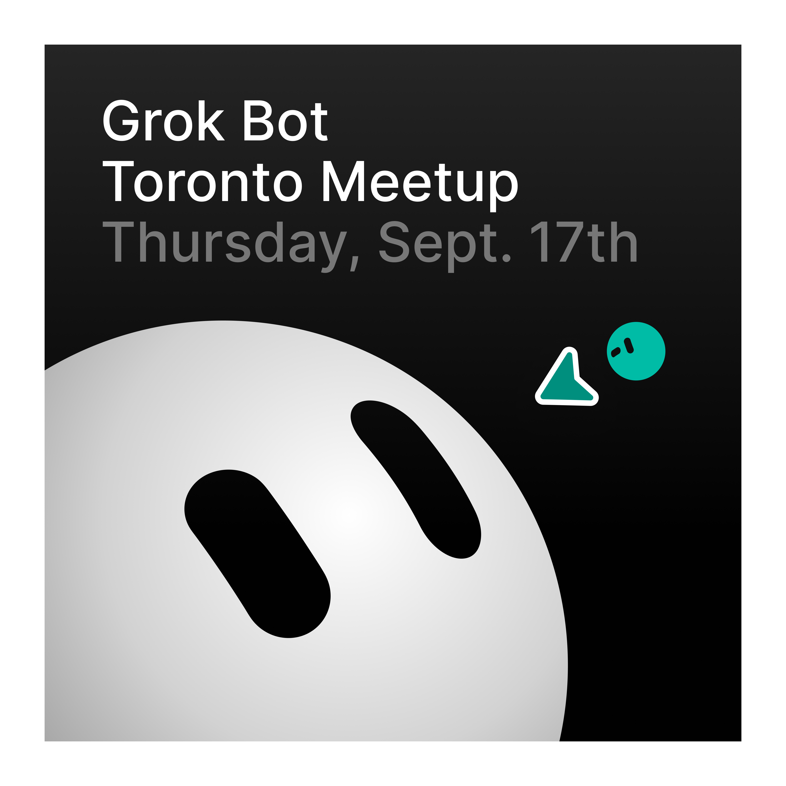</a></td><td valign="top"><strong>Grok Bot Meetup 多伦多（十月）</strong> 2026-10-26 周一 17:30–20:30（多伦多America/Toronto，UTC-4） 加拿大多伦多 800 Bay 一带（Luma 模糊地址）（线下）  多伦多月度 Grok Bot 聚会十月场（主办 Jia Ming Huang 等；承接已入库 yyz-20260917 九月场）。约 17:30–20:30 于 800 Bay：交流、两位演讲、Q&A、构建；提供餐饮与 Cursor credits。需带电脑；18:15 截止入场。免费报名需审批（扫描时剩余约 400）。新 slug mj5bmugc；勿与 yyz-20260917 混淆。  <a href="https://luma.com/mj5bmugc"><strong>去 Luma 报名 → →</strong></a></td></tr></table>

<table><tr><td width="320" valign="top"></td><td valign="top"><strong>Grok Bot Meetup 渥太华</strong> 2026-10-10 周六 18:00–22:00（America/Toronto，UTC-4） 加拿大渥太华 Carleton University Nicol Building, 1125 Colonel By Dr（线下，教室待定）  渥太华首场入库 Grok Bot 聚会（Builders Collective Ottawa 等主办）。Carleton University 晚场：Grok Bot 101、演示、展示、积分与交流。免费报名需审批；请带笔记本。新 slug phs5tofz；论坛尚无 New event 帖。  <a href="https://luma.com/phs5tofz"><strong>去 Luma 报名 → →</strong></a></td></tr></table>

### 墨西哥

<table><tr><td width="320" valign="top"></td><td valign="top"><strong>Grok Bot 普埃布拉线下交流</strong> 2026-09-24 周四 18:00–22:00（普埃布拉） 普埃布拉 · 报名通过后可见地址  普埃布拉首场 Grok Bot 线下。需主办审核。  <a href="https://luma.com/puebla-d4iw"><strong>去 Luma 报名（需审核） →</strong></a></td></tr></table>

<table><tr><td width="320" valign="top"></td><td valign="top"><strong>Grok Bot 奇瓦瓦线下交流</strong> 2026-09-24 周四 16:00–19:00（奇瓦瓦） 墨西哥奇瓦瓦 · LivingLab CUU, Av. George Washington 3701-13  奇瓦瓦首场 Grok Bot × SpaceXAI（LivingLab CUU，可领试用额度）。主办 Alfonso Reyes，需审核，约 200 席。  <a href="https://luma.com/spacexai-7lje"><strong>去 Luma 报名（需审核） →</strong></a></td></tr></table>

<table><tr><td width="320" valign="top"></td><td valign="top"><strong>Grok Bot 墨西哥城线下交流</strong> 2026-09-26 周六 09:00–13:00（墨西哥城） 墨西哥城 · Sandbox Hub, Luis G. Urbina 4-dpto. 103, Polanco  墨西哥城首场 Grok Bot（Sandbox Hub Polanco）：交流真实用法。主办 Javier Rivero / Ben Kim / Ricardo García，需审核，约 60 席。  <a href="https://luma.com/spacexai-89bf"><strong>去 Luma 报名（需审核） →</strong></a></td></tr></table>

<table><tr><td width="320" valign="top"><a href="https://luma.com/5ohq71b3">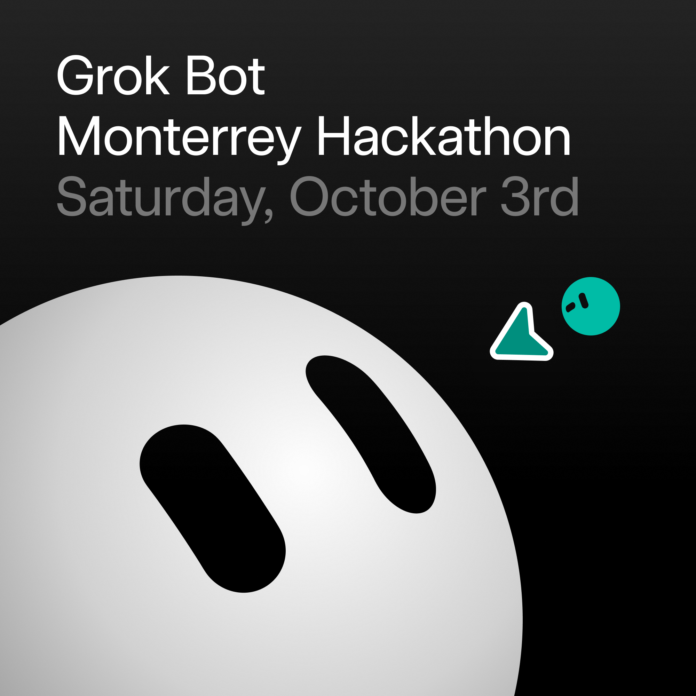</a></td><td valign="top"><strong>Grok 蒙特雷黑客松</strong> 2026-10-03 周六 10:00–17:00（America/Monterrey） 墨西哥蒙特雷 — 线下（详细场地见 Luma）  Grok 蒙特雷黑客松（SpaceXAI for Monterrey）：当日构建场，有别于早前 mty-20260910 交流。  <a href="https://luma.com/5ohq71b3"><strong>去 Luma 报名 →</strong></a></td></tr></table>

### 巴西

<table><tr><td width="320" valign="top"></td><td valign="top"><strong>Grok Bot Meetup 维多利亚·达孔基斯塔</strong> 2026-10-14 周三 19:00–22:00（巴西 Bahia，UTC−3） 巴西 Bahia 维多利亚·达孔基斯塔 Hub Conquista（Av. Juracy Magalhães 3405, Boa Vista）（线下）  巴西 Bahia 维多利亚·达孔基斯塔线下 Grok Bot 聚会（挂在 SpaceXAI for Salvador 日历；主办 Benjamin Bauer、Sarah Ferreira Reis）。议程：社交、讲座/工坊、Q&A，围绕 Grok Bot。场地 Hub Conquista 有完整地址；免费、无需审批；扫描时 guest_count 1。社区日历新 slug cursor-iutk + 论坛 171709。  <a href="https://luma.com/cursor-iutk"><strong>去 Luma 报名 → →</strong></a></td></tr></table>

<table><tr><td width="320" valign="top"></td><td valign="top"><strong>Grok Bot 库里蒂巴创业线下</strong> 2026-11-11 周三 18:30–21:00（库里蒂巴） 库里蒂巴 Rua Marcos Moro 72  库里蒂巴创业场：用 Grok Bot 做事、创始人经验，以及智能体时代怎么把想法做出来（嘉宾待定）。需主办审核。  <a href="https://luma.com/cursor-dx23"><strong>去 Luma 报名（需审核） →</strong></a></td></tr></table>

<table><tr><td width="320" valign="top"></td><td valign="top"><strong>Grok Bot 弗洛里亚诺波利斯线下交流</strong> 2026-09-26 周六 18:00–20:00（巴西） 巴西弗洛里亚诺波利斯 · Founder Haus（Jurerê Internacional）  弗洛里亚诺波利斯首场 Grok Bot：本地作品演示与交流。论坛 170449；约 25 人意向，需审核。  <a href="https://luma.com/c293hlgc"><strong>去 Luma 报名 → →</strong></a></td></tr></table>

### 西班牙

<table><tr><td width="320" valign="top"><a href="https://luma.com/802d0upt">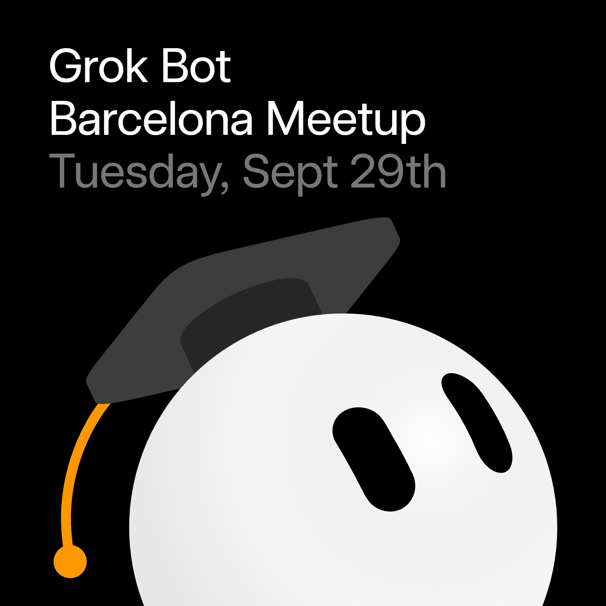</a></td><td valign="top"><strong>Grok Bot Meetup 巴塞罗那</strong> 2026-09-29 周二 18:00–20:00（西班牙巴塞罗那 CEST，UTC+2） 巴塞罗那 Carrer de Llull（确切地址待定）· 近 Poblenou 地铁 L4 · 线下（满员可看直播）  巴塞罗那首场 Grok Bot Meetup（SpaceXAI for Barcelona；主办 Marc Nebot I Moyano、Walter Troiani）。西班牙语实战工坊：18:00 入场发额度、18:15 介绍、18:30 社区短演示、19:00 动手建 bot、19:45 问答。自带电脑/手机，现场提供额度，无需预装账号。场地在 Carrer de Llull（近 Poblenou L4，地址待定）；审批报名；扫描时 guest_count 7。满员才开直播。社区日历新 slug 802d0upt + 论坛 171706。  <a href="https://luma.com/802d0upt"><strong>去 Luma 报名 → →</strong></a></td></tr></table>

<table><tr><td width="320" valign="top"></td><td valign="top"><strong>Grok Bot 马德里线下交流</strong> 2026-09-29 周二 17:30–21:30（马德里 CEST） 西班牙马德里 · Pl. del Callao, 1（Samplia Hub / mad.builders）  马德里首场 Grok Bot Meetup：偏实操工作坊——现场试用、短 demo，再针对自带（或主办准备的）自动化挑战搭 bot。现场发额度；笔记本或手机即可；西班牙语（欢迎英语）。日程 17:30 签到发额度 → 18:00 介绍 → 18:20 demo → 19:00 workshop → 20:30 交流/~21:30。主办 Felipe Basurto、Alvaro Fragoso（Mad Builders）；免费需审核；约 60 席；扫描时报名 0。论坛 171020。  <a href="https://luma.com/grokbotmadrid1"><strong>报名 →</strong></a></td></tr></table>

<table><tr><td width="320" valign="top"></td><td valign="top"><strong>Cafe Cursor 瓦伦西亚</strong> 2026-09-25 周五 10:00–17:00（Europe/Madrid） 瓦伦西亚 · SpaceXAI Valencia — 线下  SpaceXAI Community 日历下的瓦伦西亚 Cafe Cursor 共创局。Luma 报名。  <a href="https://luma.com/cpgwzo6n"><strong>去 Luma 报名 →</strong></a></td></tr></table>

### 印度尼西亚

<table><tr><td width="320" valign="top"></td><td valign="top"><strong>Grok Bot 巴厘岛工作坊（乌达亚纳大学）</strong> 2026-10-04 周日 11:00–14:00（巴厘岛） 巴厘岛金巴兰 · 乌达亚纳大学（Jl. Raya Kampus Unud）  印尼学生/开发者/创始人校园 Grok Bot 工作坊。与 9/15 BukitHub 场（bli-20260915）不同。论坛 170448；需审核。  <a href="https://luma.com/lkmh86ad"><strong>去 Luma 报名 → →</strong></a></td></tr></table>

<table><tr><td width="320" valign="top"></td><td valign="top"><strong>Grok Bot 雅加达线下交流</strong> 2026-10-03 周六 10:00 – 2026-10-04 周日 13:00（雅加达 WIB） 印尼雅加达 · 页面地址为 Jakarta（SpaceXAI for Jakarta 日历）  雅加达 Grok Bot 线下（SpaceXAI for Jakarta）：社区案例、Personal Agents 用法、Ambassador 玩法、Q&A 与社交。主办 Naufaldi；免费需审核；约 100 席；扫描时报名 0。线下；EventScheduled；API_OK。与万隆 bdg-20260919、坦格朗 tgr-20260911 不同场 结束时间改至 2026-10-04 周日 13:00 WIB（+1 天）。  <a href="https://luma.com/spacexai-zb6b"><strong>去 Luma 报名（需审核） →</strong></a></td></tr></table>

<table><tr><td width="320" valign="top"><a href="https://luma.com/d4b0eg4v">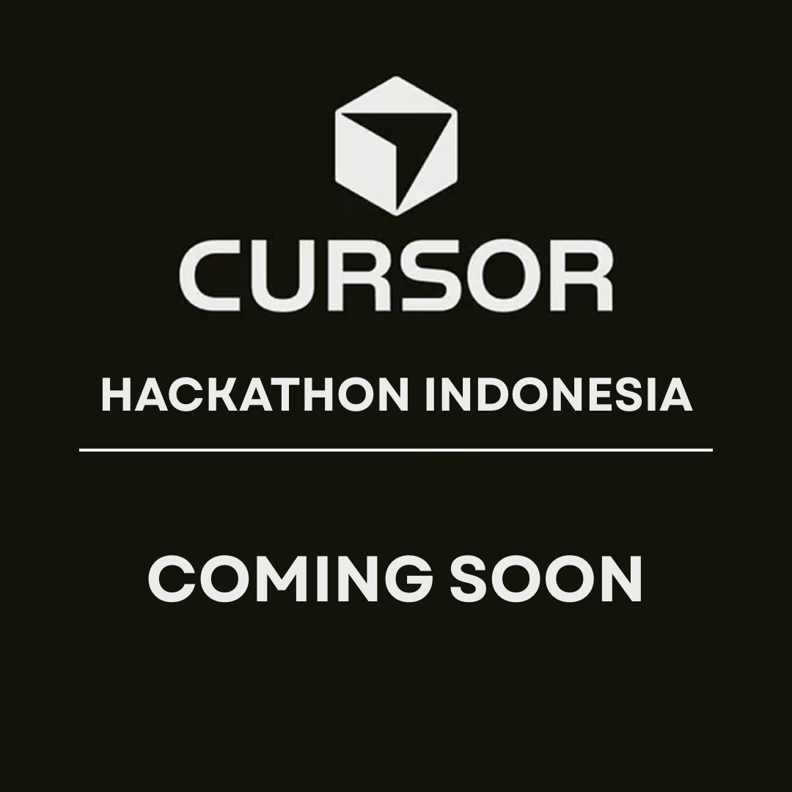</a></td><td valign="top"><strong>SpaceXAI 印尼黑客松</strong> 2026-11-07 周六 07:00–20:00（Asia/Jakarta） 印尼雅加达 — 线下黑客松（详细场地见 Luma）  SpaceXAI 印尼黑客松（雅加达）：围绕 Grok Bot / SpaceXAI Community 的多日线下构建。  <a href="https://luma.com/d4b0eg4v"><strong>去 Luma 报名 →</strong></a></td></tr></table>

### 德国

<table><tr><td width="320" valign="top"></td><td valign="top"><strong>Grok Bot 科隆线下交流</strong> 2026-10-09 周五 18:00–21:00（科隆 CEST） 科隆（报名后可见具体地址）  科隆 Grok Bot 线下：社交、分享/工作坊、带着真实任务动手（Windows/Mac 笔记本或 iPhone；先下 x.ai/bot）。议程 18:00 签到→18:30 演示与动手→20:00 闲聊；欢迎更多 Grok Bot 分享者。主办 Emmanuel Ketcha、Eyad Kelleh、Babajide Mayowa Moibi、Teoman Köse；免费，需主办审批，约 50 席。  <a href="https://luma.com/spacexai-cologne-meetup1"><strong>去 Luma 报名（需审核） →</strong></a></td></tr></table>

<table><tr><td width="320" valign="top"><a href="https://luma.com/spacexai-z2er">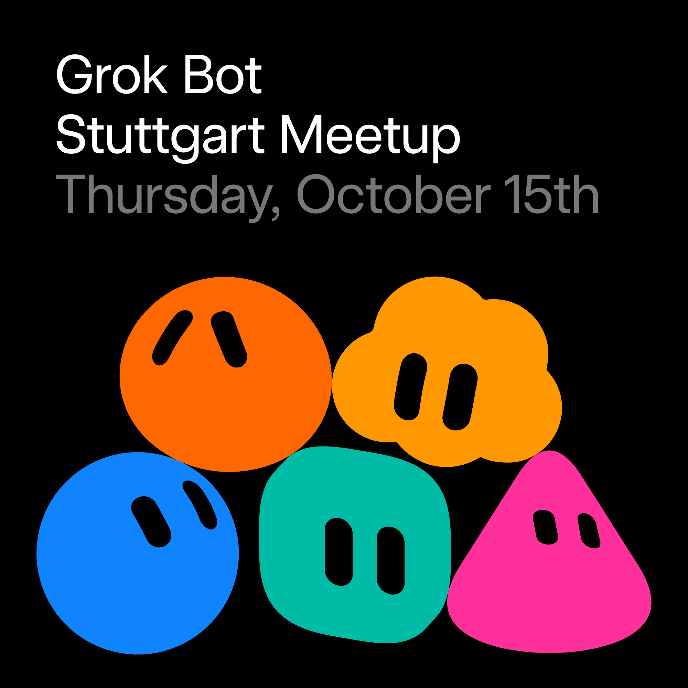</a></td><td valign="top"><strong>Grok Bot Meetup 斯图加特</strong> 2026-10-15 周四 17:30–21:00（Europe/Berlin，UTC+2 / CEST） 德国斯图加特 Epplestraße 225/haus 3, 70567 Stuttgart-Möhringen（线下，一楼）  斯图加特首场 Grok Bot 聚会（Sachin Agrawal；AI collective Stuttgart / SpaceXAI ambassador）。晚场试玩、演示与社区交流。免费需审批（余 84）。slug spacexai-z2er；论坛 New event 171988。  <a href="https://luma.com/spacexai-z2er"><strong>去 Luma 报名 → →</strong></a></td></tr></table>

### 厄瓜多尔

<table><tr><td width="320" valign="top"></td><td valign="top"><strong>Grok Bot 基多线下交流</strong> 2026-09-24 周四 19:30–21:30（厄瓜多尔） 基多 · 报名通过后可见地址  基多线下 Grok Bot。免费，需审核，还剩 47 个名额。  <a href="https://luma.com/grokbotquitomeetup"><strong>去 Luma 报名（需审核） →</strong></a></td></tr></table>

<table><tr><td width="320" valign="top"></td><td valign="top"><strong>Grok Bot 昆巴亚线下交流</strong> 2026-10-03 周六 09:30–12:00（厄瓜多尔） 基多郊区 Cumbayá  基多郊区 Cumbayá 线下 Grok Bot。免费，可候补，还剩 37 个名额。  <a href="https://luma.com/cccumbaya"><strong>去 Luma 报名 →</strong></a></td></tr></table>

### 哈萨克斯坦

<table><tr><td width="320" valign="top"><a href="https://luma.com/t1l3nqrc">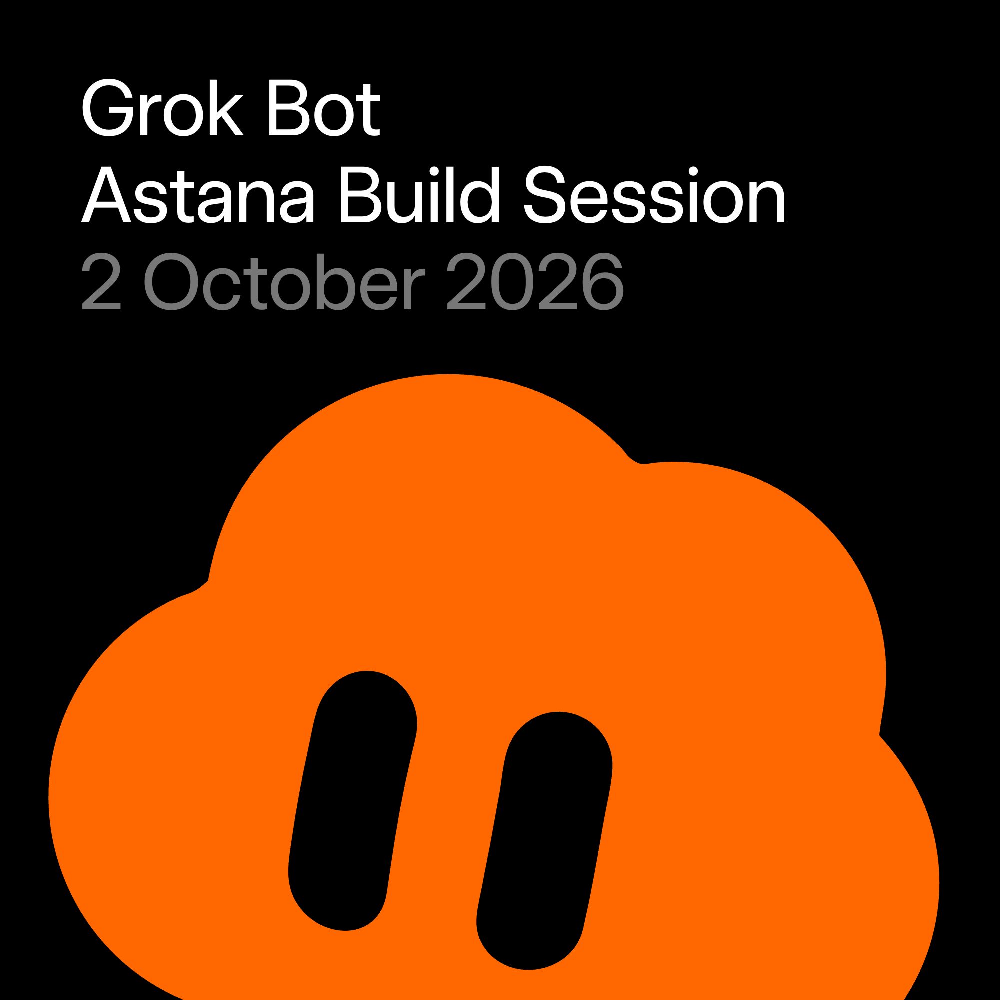</a></td><td valign="top"><strong>Grok Bot Meetup 阿斯塔纳</strong> 2026-10-02 周五 14:00–17:00（Asia/Almaty，UTC+5） 哈萨克斯坦阿斯塔纳（线下；Luma 仅到城市级，报名后告知具体场地）  阿斯塔纳首场 Grok Bot 线下聚会，属中亚与高加索系列。试玩、演示与交流。Luma 免费报名（slug t1l3nqrc）。2026-09-18 已打开页面核实。  <a href="https://luma.com/t1l3nqrc"><strong>在 Luma 报名 →</strong></a></td></tr></table>

<table><tr><td width="320" valign="top"></td><td valign="top"><strong>Grok Bot Meetup 阿拉木图</strong> 2026-10-04 周日 14:00–17:00（Asia/Almaty，UTC+5） 哈萨克斯坦阿拉木图（线下；Luma 仅到城市级，报名后告知具体场地）  阿拉木图首场 Grok Bot 线下聚会，属中亚与高加索系列。试玩、演示与交流。Luma 免费报名（slug vod1qyrk）。2026-09-18 已打开页面核实。  <a href="https://luma.com/vod1qyrk"><strong>在 Luma 报名 →</strong></a></td></tr></table>

### 越南

<table><tr><td width="320" valign="top"><a href="https://luma.com/spacexai-80r9">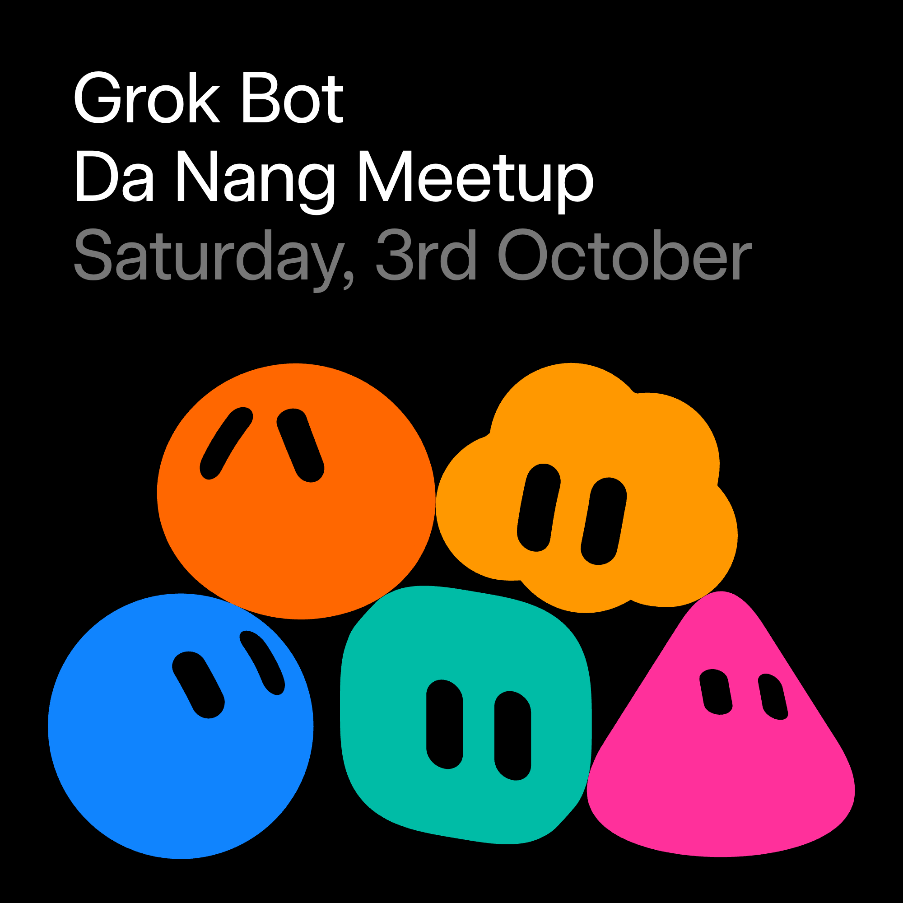</a></td><td valign="top"><strong>Grok Bot Meetup 岘港</strong> 2026-10-03 周六 13:00–16:00（岘港Asia/Ho_Chi_Minh，UTC+7） Vietnam岘港 1710 Cafe & Society, 10 Trần Quý Cáp, Hải Châu, Đà Nẵng 550000, Vietnam（线下）  越南岘港 Grok Bot 聚会（主办 Keith Vaughan, Laksh Arora；Frontier Club Da Nang 支持）。13:00–16:00：入场、破冰、SpaceXAI/Cursor 问答、闪电演示、交流。免费开放报名（扫描时剩余约 70）。场地 1710 Cafe & Society。新 slug spacexai-80r9；论坛尚无 New event 帖。  <a href="https://luma.com/spacexai-80r9"><strong>去 Luma 报名 → →</strong></a></td></tr></table>

<table><tr><td width="320" valign="top"><a href="https://luma.com/spacexai-wgmy">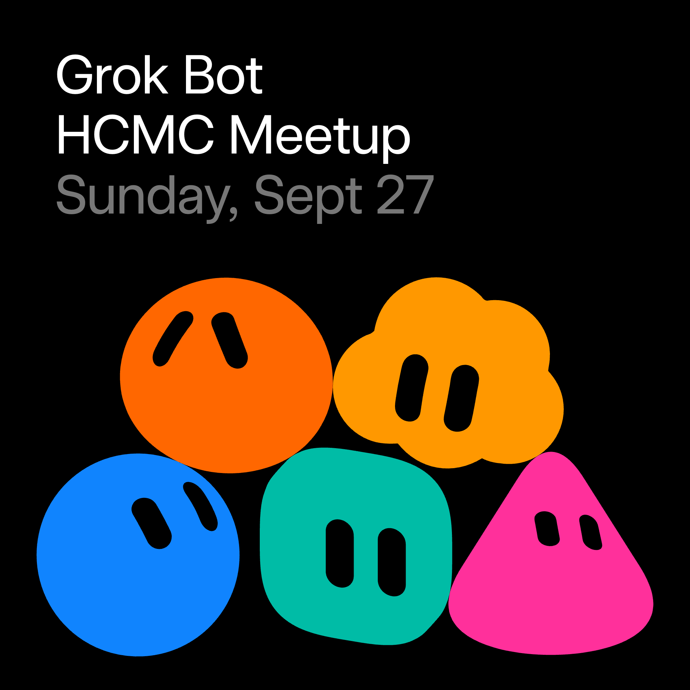</a></td><td valign="top"><strong>Grok Bot Meetup 胡志明市</strong> 2026-09-26 周六 13:00–17:00（Asia/Ho_Chi_Minh，UTC+7） 越南胡志明市（线下；Luma 仅到城市级，报名后告知具体场地）  胡志明市首场官方 Grok Bot 聚会（David Zhang / Ivan Paulo / Sandra Vu；SpaceXAI Community）。周六下午试玩、演示与交流。免费需审批（余 94）。与已入库岘港 dad-20261003 不同场。slug spacexai-wgmy；论坛 New event 171994。  <a href="https://luma.com/spacexai-wgmy"><strong>去 Luma 报名 → →</strong></a></td></tr></table>

### 阿根廷

<table><tr><td width="320" valign="top"></td><td valign="top"><strong>Grok Bot 门多萨线下交流</strong> 2026-10-03 周六 17:00–20:00（门多萨） 门多萨 TIC 科技园，Rafael Cubillos 2100-2198  门多萨线下 Grok Bot。开放报名。  <a href="https://luma.com/cursor-mtu0"><strong>去 Luma 报名 →</strong></a></td></tr></table>

### 澳大利亚

<table><tr><td width="320" valign="top"></td><td valign="top"><strong>Grok Bot 悉尼线下交流</strong> 2026-10-07 周三 17:30–21:00（悉尼） 悉尼 · 报名通过后可见地址  8 月场之后的下一场官方 Cursor 悉尼 Grok Bot 夜。需主办审核。  <a href="https://luma.com/cursor-d70v"><strong>去 Luma 报名（需审核） →</strong></a></td></tr></table>

### 阿塞拜疆

<table><tr><td width="320" valign="top"><a href="https://luma.com/ydy9qy6h">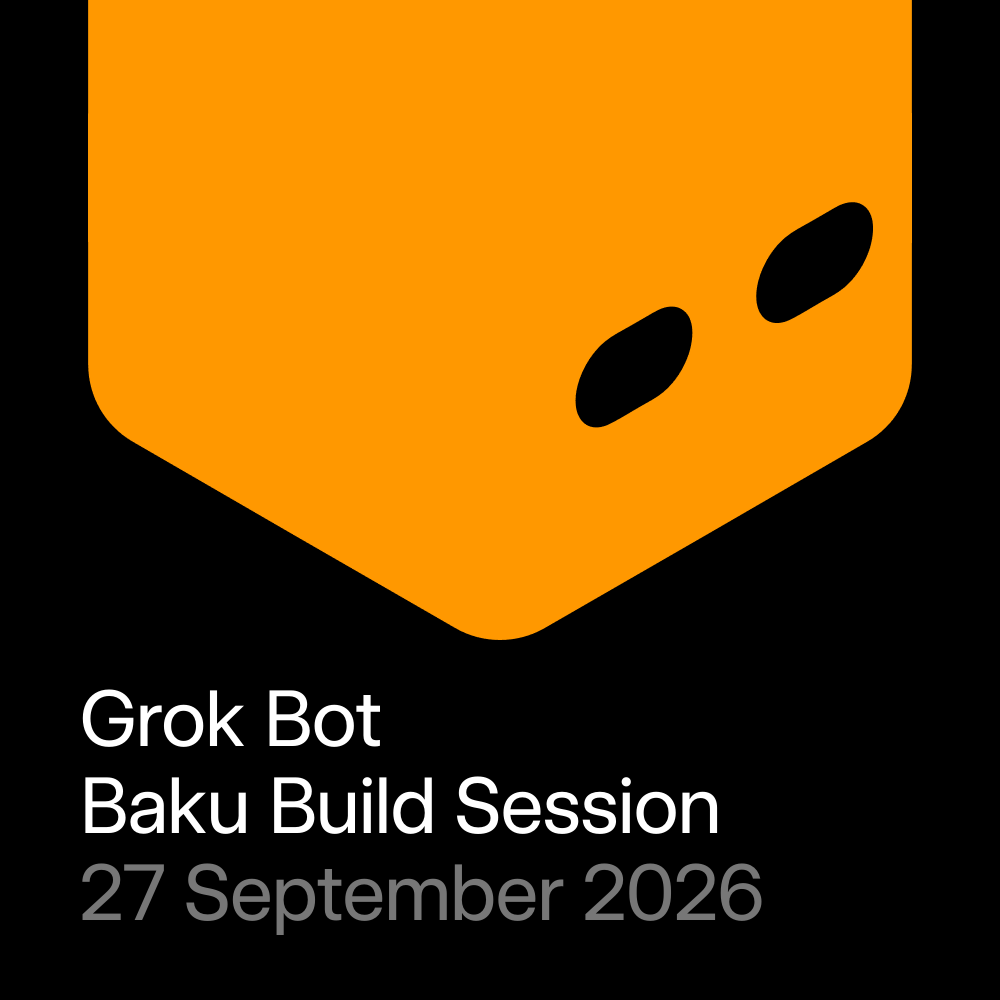</a></td><td valign="top"><strong>Grok Bot Meetup 巴库</strong> 2026-09-27 周日 15:00–18:00（Asia/Baku，UTC+4） 阿塞拜疆巴库（线下；Luma 仅到城市级，报名后告知具体场地）  巴库首场 Grok Bot 线下聚会，属中亚与高加索系列。试玩、演示与交流。Luma 免费报名（slug ydy9qy6h）。2026-09-18 已打开页面核实。  <a href="https://luma.com/ydy9qy6h"><strong>在 Luma 报名 →</strong></a></td></tr></table>

### 贝宁

<table><tr><td width="320" valign="top"><a href="https://luma.com/spacexai-fd2l">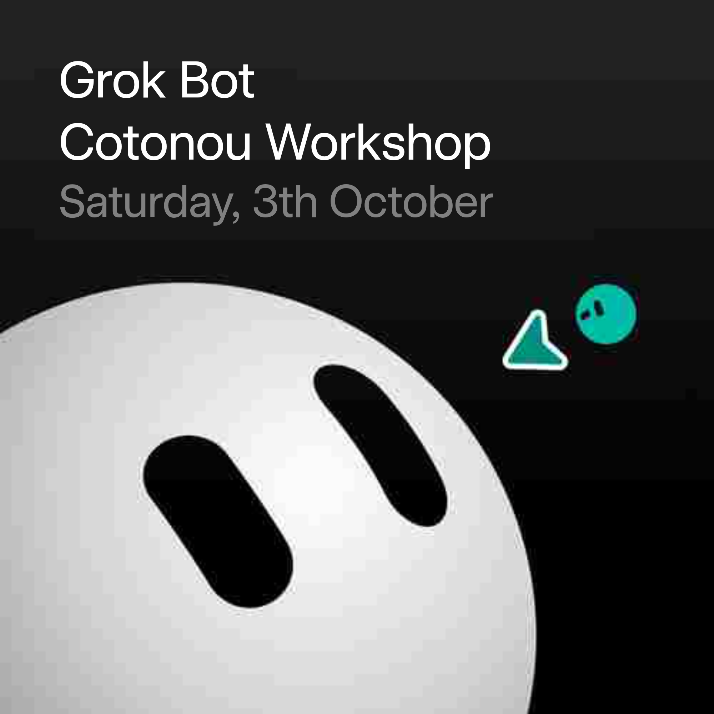</a></td><td valign="top"><strong>Grok Bot 贝宁 Workshop</strong> 2026-10-03 周六 09:00–13:00（贝宁科托努/戈多梅 Africa/Lagos，UTC+1） 贝宁戈多梅（科托努都会区）Bibliothèque Benin Excellence（线下）  SpaceXAI Benin Community 在戈多梅/科托努举办的线下 Workshop（主办 Aina René Régis KIKI；日历 SpaceXAI for Cotonou）。上手 Grok Bot、AI coding / prompt、从想法到可测原型的产品构建，并与当地社区交流。学生与开发者皆可。免费报名（扫描时 guest_count 0）。场地：Bibliothèque Benin Excellence。slug spacexai-fd2l；论坛尚无 New event 帖。  <a href="https://luma.com/spacexai-fd2l"><strong>去 Luma 报名 → →</strong></a></td></tr></table>

### 玻利维亚

<table><tr><td width="320" valign="top"></td><td valign="top"><strong>Grok Bot Meetup 圣克鲁斯</strong> 2026-09-26 周六 08:30–12:00（圣克鲁斯America/La_Paz，UTC-4） 玻利维亚圣克鲁斯 Universidad Central (Unicen), Ave Trinidad 425（线下）  玻利维亚圣克鲁斯首场入库 Grok Bot 聚会（主办 Diego Oliver）。西语上午场：Grok Bot 介绍、动手构建、分享交流。免费报名需审批；场地 Universidad Central (Unicen)。新 slug spacexai-gc1m；论坛尚无 New event 帖。  <a href="https://luma.com/spacexai-gc1m"><strong>去 Luma 报名 → →</strong></a></td></tr></table>

### 捷克

<table><tr><td width="320" valign="top"></td><td valign="top"><strong>Cursor 布拉格黑客松：Forge the Stack</strong> 2026-09-30 周三 12:30–19:00（Europe/Prague） 布拉格 · SpaceXAI Prague — 线下  SpaceXAI Community 布拉格 Cursor/Grok 黑客松（Forge the Stack）。线下；Luma 报名。  <a href="https://luma.com/cursor-mljb"><strong>去 Luma 报名 →</strong></a></td></tr></table>

### 英国

<table><tr><td width="320" valign="top"></td><td valign="top"><strong>Cursor Commerce 伦敦黑客松</strong> 2026-09-26 周六 09:00–18:00（Europe/London） 伦敦 · SpaceXAI London — 线下  SpaceXAI Community 伦敦 Cursor Commerce 黑客松。线下建造日；Luma 报名。  <a href="https://luma.com/cursor-td9f"><strong>去 Luma 报名 →</strong></a></td></tr></table>

### 格鲁吉亚

<table><tr><td width="320" valign="top"><a href="https://luma.com/0scz2dff">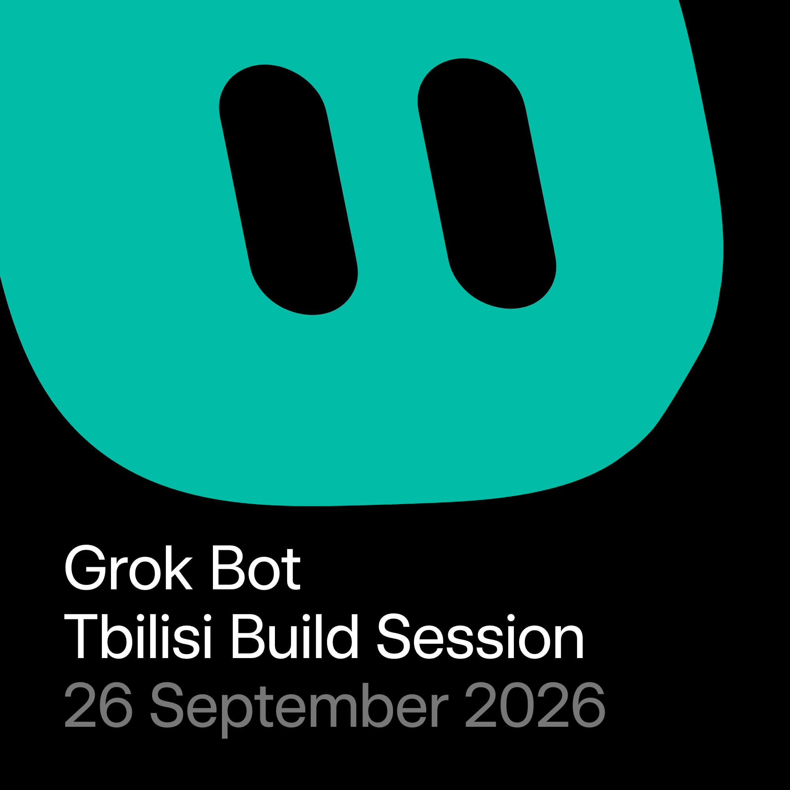</a></td><td valign="top"><strong>Grok Bot Meetup 第比利斯</strong> 2026-09-26 周六 15:00–17:30（Asia/Tbilisi，UTC+4） 格鲁吉亚第比利斯（线下；Luma 仅到城市级，报名后告知具体场地）  第比利斯首场 Grok Bot 线下聚会，属中亚与高加索系列。试玩、演示与交流。Luma 免费报名（slug 0scz2dff）。2026-09-18 已打开页面核实。  <a href="https://luma.com/0scz2dff"><strong>在 Luma 报名 →</strong></a></td></tr></table>

### 危地马拉

<table><tr><td width="320" valign="top"></td><td valign="top"><strong>Grok Bot 危地马拉城线下交流</strong> 2026-10-03 周六 10:00–14:00（危地马拉城） 危地马拉城 Zona 10 弗朗西斯科·马罗金大学 · 报名后可见门牌  Open2 在危地马拉城办的 Grok Bot 见面会：用更好的指令、上下文与端到端流程，而不只是零散任务，并有试用额度（约 36 人意向，需主办审核）。  <a href="https://luma.com/cursor-is2h"><strong>去 Luma 报名（需审核） →</strong></a></td></tr></table>

### 爱尔兰

<table><tr><td width="320" valign="top"></td><td valign="top"><strong>Grok Bot 都柏林 Builder Day</strong> 2026-10-04 周日 11:00–17:30（都柏林 IST） 爱尔兰都柏林 · Baseline（61 Thomas St；Dublin AI Week × Bronto）  都柏林全天 Grok Bot 共建（SpaceXAI for Dublin，属 Dublin AI Week，合作方 Bronto）：现场 demo、搭 bot/工作流/agent、午餐、闪电分享。请预先下载 x.ai/bot。主办 Sanat Thukral、Manoj；免费需审核；约 96 席，有候补。  <a href="https://luma.com/grokbot-dublin"><strong>报名 →</strong></a></td></tr></table>

### 印度

<table><tr><td width="320" valign="top"><a href="https://luma.com/grok-rajkot">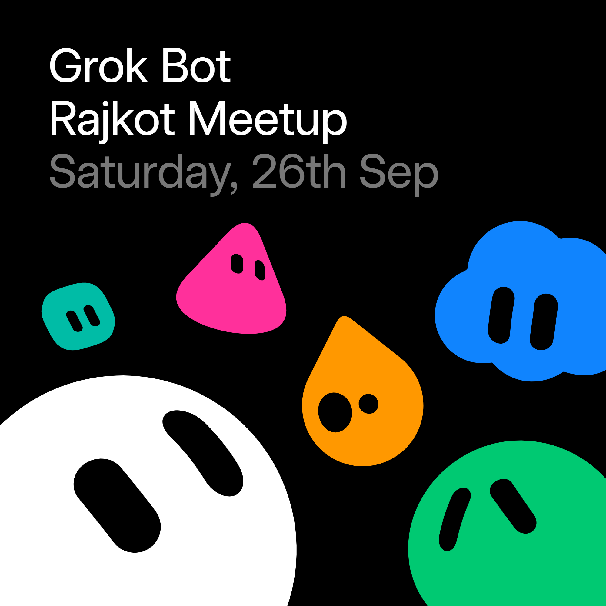</a></td><td valign="top"><strong>Grok Bot 拉杰果德线下交流</strong> 2026-09-26 周六 10:00–13:00（拉杰果德 IST） 印度古吉拉特邦拉杰果德 · 报名通过后可见地址  拉杰果德线下 Grok Bot（Build, Automate & Grow with AI）。SpaceXAI for Rajkot 主办；免费；需审核；报名前地址脱敏。  <a href="https://luma.com/grok-rajkot"><strong>在 Luma 报名（需主办审核） →</strong></a></td></tr></table>

### 意大利

<table><tr><td width="320" valign="top"></td><td valign="top"><strong>Grok 帕多瓦黑客松</strong> 2026-09-25 周五 19:00–23:00（Europe/Rome） 帕多瓦 · Via della Croce Rossa, 42 — 线下  帕多瓦 Grok 黑客松（Via della Croce Rossa 42）：SpaceXAI Community 线下。  <a href="https://luma.com/cursor-v5ch"><strong>去 Luma 报名 →</strong></a></td></tr></table>

### 日本

<table><tr><td width="320" valign="top"></td><td valign="top"><strong>Grok Bot 札幌线下交流 #2</strong> 2026-10-02 周五 19:00–22:00（札幌） 札幌 · 报名通过后可见地址  札幌第二场 Grok Bot 线下。免费，需主办审核。  <a href="https://luma.com/91kju0je"><strong>去 Luma 报名（需审核） →</strong></a></td></tr></table>

### 吉尔吉斯斯坦

<table><tr><td width="320" valign="top"><a href="https://luma.com/7bexxjvh">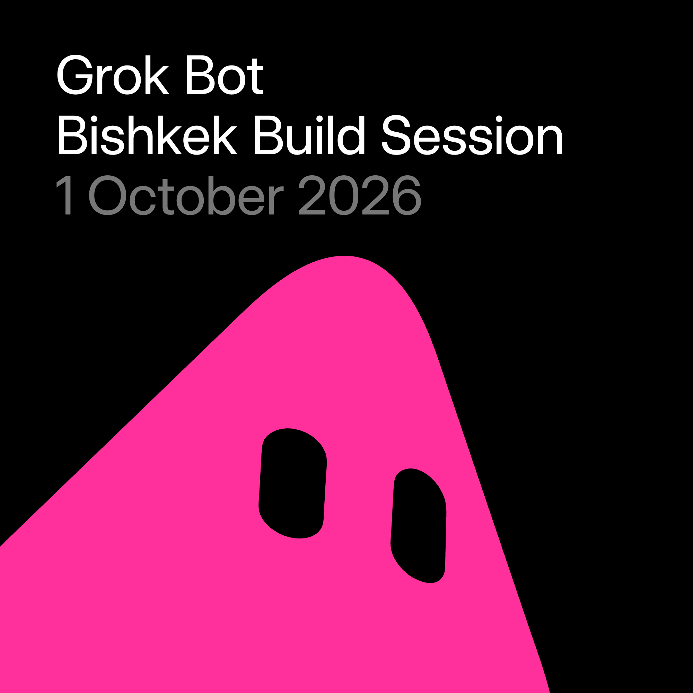</a></td><td valign="top"><strong>Grok Bot Meetup 比什凯克</strong> 2026-10-01 周四 10:00–12:30（Asia/Bishkek，UTC+6） 吉尔吉斯斯坦比什凯克（线下；Luma 仅到城市级，报名后告知具体场地）  比什凯克首场 Grok Bot 线下聚会，属中亚与高加索系列。试玩、演示与交流。Luma 免费报名（slug 7bexxjvh）。2026-09-18 已打开页面核实。  <a href="https://luma.com/7bexxjvh"><strong>在 Luma 报名 →</strong></a></td></tr></table>

### 柬埔寨

<table><tr><td width="320" valign="top"></td><td valign="top"><strong>Grok Bot 金边线下交流</strong> 2026-10-03 周六 14:00–16:00（金边 / Bangkok 时区 GMT+7） 金边 · Smart Startup Space（Connexion Building, Koh Pich）  柬埔寨首场 Grok Bot 线下：演示与交流、现场 credits 试玩（笔记本或手机均可），另有线上嘉宾。与 Smart Startup Space 合办。主办 Taka Kiyone、Luis Romero；免费，需主办审批，约 80 席；新手欢迎。  <a href="https://luma.com/spacexai-jt05"><strong>去 Luma 报名（需审核） →</strong></a></td></tr></table>

### 科威特

<table><tr><td width="320" valign="top"></td><td valign="top"><strong>Grok Bot 科威特线下交流</strong> 2026-09-22 周一 12:30–14:30（科威特/利雅得时间 GMT+3） 科威特 Mubarak Al-Abdullah（Hawalli）· 报名后可见地址  科威特首场 Grok Bot × SpaceXAI：了解并动手试 Grok Bot，认识本地 builder。参与者可领 1 个月 Grok Bot 额度；有零食饮料；带 iPhone/Android/Windows/Mac 即可（无需装 Cursor）。主办 Asama Akhtar；免费，需审核，约剩 24 席。后续还有 Build with Grok Bot 工作坊。  <a href="https://luma.com/197n9c91"><strong>去 Luma 报名（需审核） →</strong></a></td></tr></table>

### 缅甸

<table><tr><td width="320" valign="top"></td><td valign="top"><strong>Grok Bot 仰光工作坊（ACY）</strong> 2026-09-26 周六 13:30–17:00（仰光） 仰光 American Center Yangon  仰光 American Center 的 Grok Bot 动手工作坊。需主办审核。  <a href="https://luma.com/cursor-qu3x"><strong>去 Luma 报名（需审核） →</strong></a></td></tr></table>

### 荷兰

<table><tr><td width="320" valign="top"></td><td valign="top"><strong>Grok Bot 阿姆斯特丹线下交流</strong> 2026-09-22 周二 18:30–21:30（阿姆斯特丹） 阿姆斯特丹 · 场地待定（Luma / 报名后可见）  阿姆斯特丹首场 Grok Bot：晚间 cowork、本地重度用户演示，带电脑领额度。免费报名。  <a href="https://luma.com/grok-bot-amsterdam"><strong>去 Luma 报名 → →</strong></a></td></tr></table>

### 新西兰

<table><tr><td width="320" valign="top"><a href="https://luma.com/spacexai-akl01">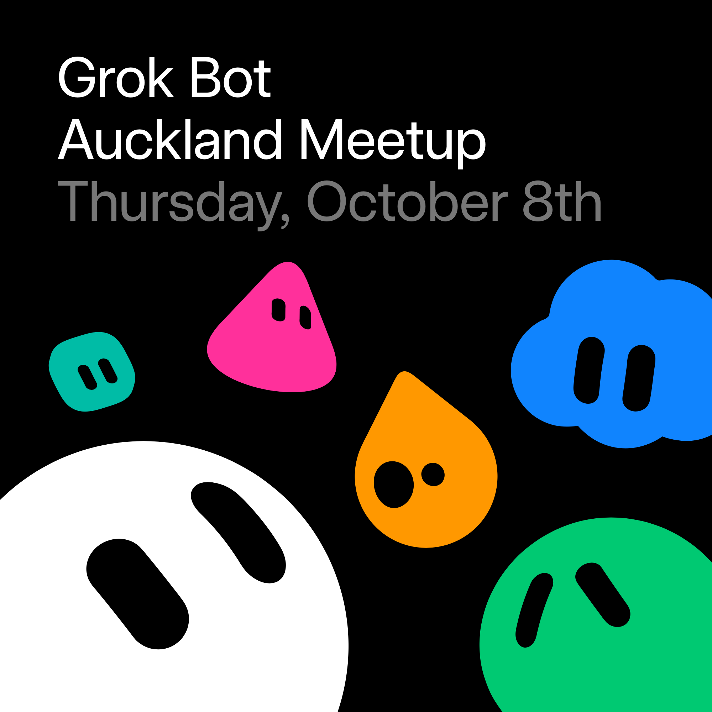</a></td><td valign="top"><strong>Grok Bot Meetup 奥克兰</strong> 2026-10-08 周四 18:00–21:00（Pacific/Auckland） 奥克兰市中心 · 地址对嘉宾可见 — 线下  SpaceXAI Community 新西兰奥克兰 Grok Bot 线下局。Luma 报名。  <a href="https://luma.com/spacexai-akl01"><strong>去 Luma 报名 →</strong></a></td></tr></table>

### 菲律宾

<table><tr><td width="320" valign="top"></td><td valign="top"><strong>Grok Bot 宿务线下交流</strong> 2026-10-10 周六 09:00–11:30（Asia/Manila / PHT） 菲律宾中央维萨亚斯 曼达韦 Zero-Ten Park Cebu Mandaue（线下）  宿务线下 Grok Bot（改期至 2026-10-10 周六）。需主办审核。  <a href="https://luma.com/cursor-dyb8"><strong>去 Luma 报名（需审核） →</strong></a></td></tr></table>

### 巴基斯坦

<table><tr><td width="320" valign="top"><a href="https://luma.com/grokbot-karachi">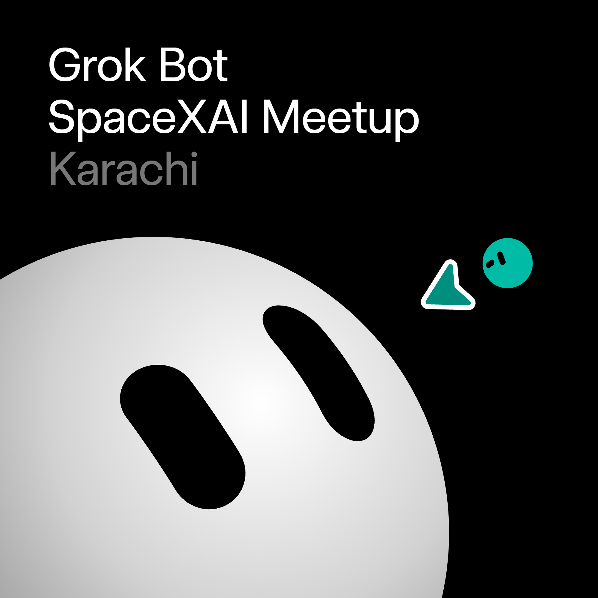</a></td><td valign="top"><strong>Grok Bot 卡拉奇 Meetup</strong> 2026-09-26 周六 17:00–20:00（Asia/Karachi） 卡拉奇 · COLABS Shahrah-e-Faisal, P.E.C.H.S Block 6, Karachi, Pakistan — 线下  卡拉奇线下 Grok Bot 聚会，地点 COLABS Shahrah-e-Faisal。Luma 报名。  <a href="https://luma.com/grokbot-karachi"><strong>去 Luma 报名 →</strong></a></td></tr></table>

### 土耳其

<table><tr><td width="320" valign="top"><a href="https://luma.com/spacexai-neonapps-revenuecat">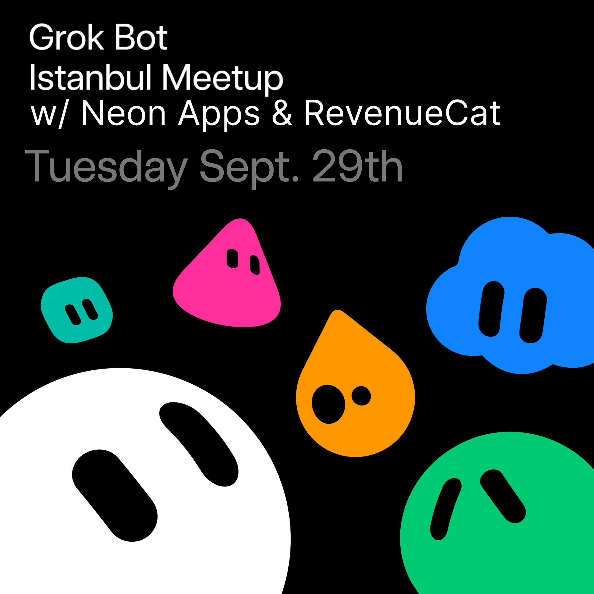</a></td><td valign="top"><strong>Grok Bot Meetup 伊斯坦布尔（Neon Apps & RevenueCat）</strong> 2026-09-29 周二 19:00–22:00（Europe/Istanbul） 伊斯坦布尔 · Neon Apps（数字产品公司）— 线下  SpaceXAI Community 伊斯坦布尔 Grok Bot 线下，联办 Neon Apps & RevenueCat。Luma 报名。  <a href="https://luma.com/spacexai-neonapps-revenuecat"><strong>去 Luma 报名 →</strong></a></td></tr></table>

### 乌干达

<table><tr><td width="320" valign="top"><a href="https://luma.com/spacexai-upc4">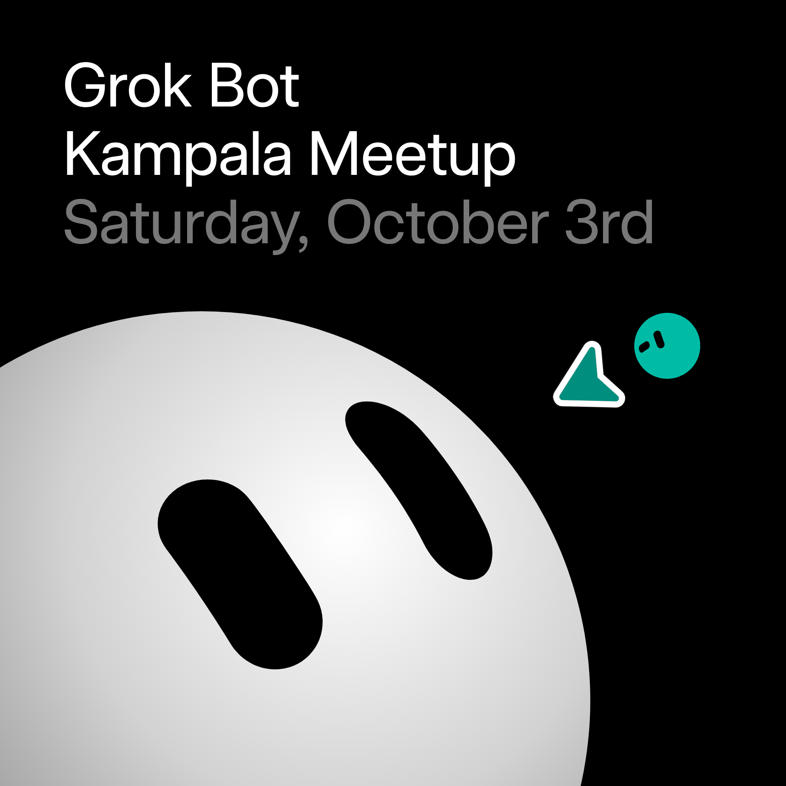</a></td><td valign="top"><strong>Grok Bot 坎帕拉线下交流</strong> 2026-10-03 周六 14:00–17:00（非洲/内罗毕 EAT，UTC+3；坎帕拉同区） 乌干达坎帕拉 · 场地待定（报名后可见）  SpaceXAI for Kampala, Uganda, Africa 下午局（主办 Ronnie 3.0）。产品文案：Grok Bot 是 SpaceXAI 带云端 agent、能真干活的 AI 助手（非纯聊天）；入门、实用工作流（规划/运维/日常）、问答；支持 Android/Mac/iOS/Linux；欢迎新手。免费、无需审核；余位 100；扫描时报名 0。Luma 无具体地址（日历城市坎帕拉 UG）。相对 morning discover 新增（早间 unknown-grokish / 社区日历均未见）。  <a href="https://luma.com/spacexai-upc4"><strong>去 Luma 报名 → →</strong></a></td></tr></table>

### 乌兹别克斯坦

<table><tr><td width="320" valign="top"><a href="https://luma.com/pz9gxlzu">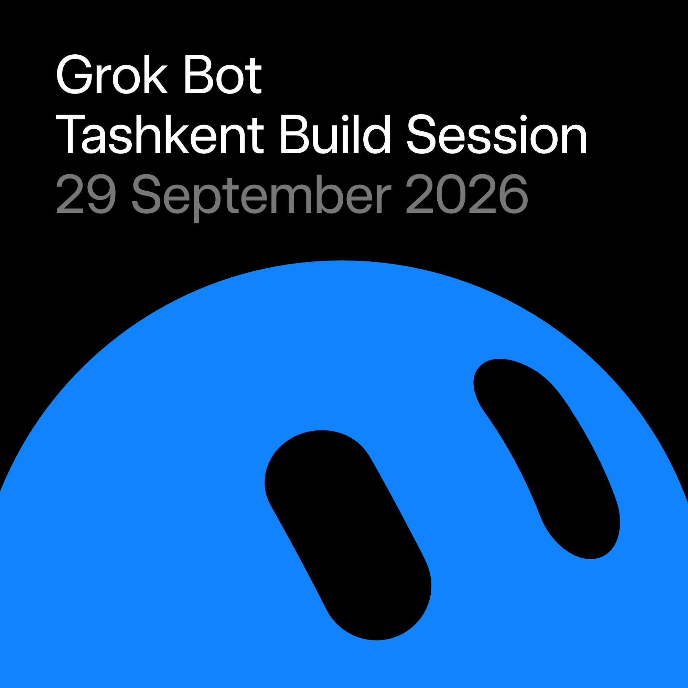</a></td><td valign="top"><strong>Grok Bot Meetup 塔什干</strong> 2026-09-29 周二 18:00–21:00（Asia/Samarkand，UTC+5） 乌兹别克斯坦塔什干（线下；Luma 仅到城市级，报名后告知具体场地）  塔什干首场 Grok Bot 线下聚会，属中亚与高加索系列。试玩、演示与交流。Luma 免费报名（slug pz9gxlzu）。2026-09-18 已打开页面核实。  <a href="https://luma.com/pz9gxlzu"><strong>在 Luma 报名 →</strong></a></td></tr></table>

### 赞比亚

<table><tr><td width="320" valign="top"></td><td valign="top"><strong>Grok Bot 卢萨卡线下交流</strong> 2026-10-02 周五 09:00–14:00（非洲/马普托 CAT，UTC+2） 赞比亚卢萨卡 · 场地待定（报名后可见）  SpaceXAI Zambia / SpaceXAI for Lusaka 动手局（主办 Lloyd situmbeko）。产品文案：Grok Bot 是可登录你工具、把活干完的 AI 同事。现场真工具演示（非幻灯）、现场试用积分、开放 build、餐饮 networking。免费，需审核；约 70 席；扫描时报名 0。Luma 活动页无具体地址（日历城市卢萨卡 ZM）。相对 midday discover 新增。  <a href="https://luma.com/spacexai-ol65"><strong>去 Luma 报名 → →</strong></a></td></tr></table>

### 线上

<table><tr><td width="320" valign="top"></td><td valign="top"><strong>Build with Grok Bot（线上）</strong> 2026-10-17 周六 10:00–12:00（America/Sao_Paulo） 线上 — 活动前分享链接（挂在戈亚尼亚日历）  Build with Grok Bot 线上场（America/Sao_Paulo 时区挂牌）。开始前发链接；Luma 免费报名。  <a href="https://luma.com/y22dqtvt"><strong>去 Luma 报名 →</strong></a></td></tr></table>
