# 活动

<a href="./EVENTS.md"><strong>EN</strong></a> · <strong>中文</strong> · <a href="./EVENTS.ja.md"><strong>日本語</strong></a>

海报、场地和报名方式。首页只留一句话，完整介绍在这一页。[回 README](README.zh.md)。

[回清单](./README.zh.md)

<table><tr><td width="320" valign="top"><a href="https://luma.com/5vkzzvqk">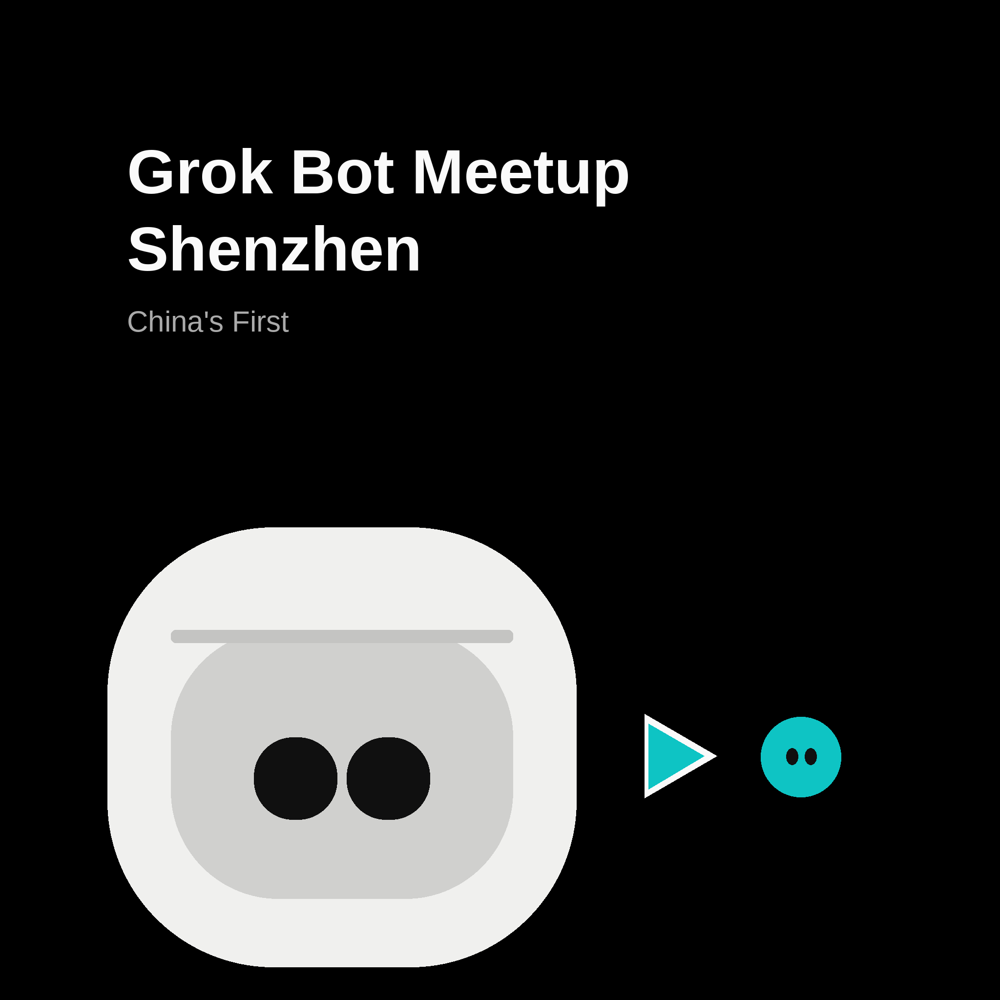</a></td><td valign="top"><strong>Grok Bot 深圳线下交流</strong> 2026-08-30 周日 14:00–17:30 深圳 · 报名通过后可见地址  中国首场 Grok Bot 线下。破冰 + 分享 / Workshop。预报名，需主办审核，名额有限。到时铁柱AGI、阿真在。欢迎深圳 AI 博主，用过 Grok Bot 的优先。  <a href="https://luma.com/5vkzzvqk"><strong>去 Luma 报名 →</strong></a></td></tr></table>

<table><tr><td width="320" valign="top"></td><td valign="top"><strong>Grok Bot 澳门学生工作坊</strong> 2026-09-05 周六 14:30-17:30 澳门大学迎宾馆 N1-1005  免费学生场：上手 Grok Bot + 创始人分享。粤语为主、可英辅。40 人已满，可候补。  <a href="https://luma.com/cursor-macau-creativity-workshop-2026-sep"><strong>去 Luma 候补 →</strong></a></td></tr></table>

<table><tr><td width="320" valign="top"></td><td valign="top"><strong>Grok Bot 拉斯维加斯线下交流</strong> 2026-09-15 周一 18:00-20:00（太平洋夏令时） 拉斯维加斯 · 报名审核后可见场地  破冰 + 分享 / Workshop，Cursor 团队视频问答。需主办审核，场地待定。  <a href="https://luma.com/cursor-kaua"><strong>去 Luma 报名 →</strong></a></td></tr></table>

<table><tr><td width="320" valign="top"></td><td valign="top"><strong>Grok Bot 女性 Build Night（旧金山）</strong> 2026-09-03 周三 17:00–21:00（太平洋夏令时） 旧金山 a16z，180 Townsend St  旧金山女性向轻松场：一起了解 Grok Bot 能干啥，并现场搭起来。  <a href="https://luma.com/a16zgrokbotbuildnight"><strong>去 Luma 报名 →</strong></a></td></tr></table>

<table><tr><td width="320" valign="top"></td><td valign="top"><strong>Grok Bot 特拉维夫线下交流</strong> 2026-09-08 周一 18:00–20:00（以色列夏令时） 特拉维夫 · 报名后可见地址  特拉维夫全球首场 Grok Bot 线下：把真活交给云电脑队友。  <a href="https://luma.com/cursor-qdl0"><strong>去 Luma 报名 →</strong></a></td></tr></table>

<table><tr><td width="320" valign="top"></td><td valign="top"><strong>Grok Meetup 蒙特雷</strong> 2026-09-10 周三 18:00–21:00（蒙特雷时间） 蒙特雷理工 HUB，Av. Eugenio Garza Sada 2501 Sur  Cursor 社区场：在蒙特雷理工创新中心看 Grok / Grok Bot 落地用法。  <a href="https://luma.com/cursor-wgsj"><strong>去 Luma 报名 →</strong></a></td></tr></table>

<table><tr><td width="320" valign="top"><a href="https://luma.com/grok-bot-manila-01">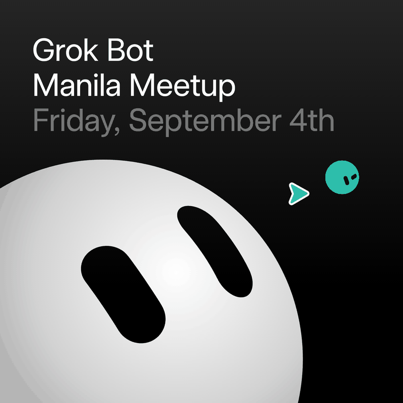</a></td><td valign="top"><strong>Grok Bot 马尼拉线下交流</strong> 2026-09-04 周五 17:00–21:00（马尼拉） 马尼拉 Pasig / Ortigas · 报名后可见地址  Cursor 马尼拉线下 Grok Bot 夜。免费开放报名，还剩 282 个名额。  <a href="https://luma.com/grok-bot-manila-01"><strong>去 Luma 报名 →</strong></a></td></tr></table>

<table><tr><td width="320" valign="top"></td><td valign="top"><strong>Grok Bot 成都线下交流</strong> 2026-09-05 周六 14:30–17:30 成都 · 报名通过后可见地址  中国第二场 Grok Bot 线下。破冰 + 分享 / Workshop。需主办审核，还剩 22 个名额。  <a href="https://luma.com/pdj34ofn"><strong>去 Luma 报名（需审核） →</strong></a></td></tr></table>

<table><tr><td width="320" valign="top"></td><td valign="top"><strong>Grok Bot 巴里洛切线下交流</strong> 2026-09-10 周四 19:00–21:30（阿根廷） 巴里洛切 Av. Ezequiel Bustillo 3241  巴里洛切线下 Grok Bot。免费，还剩 8 个名额。  <a href="https://luma.com/cursor-38kv"><strong>去 Luma 报名 →</strong></a></td></tr></table>

<table><tr><td width="320" valign="top"><a href="https://luma.com/vcow8a4c">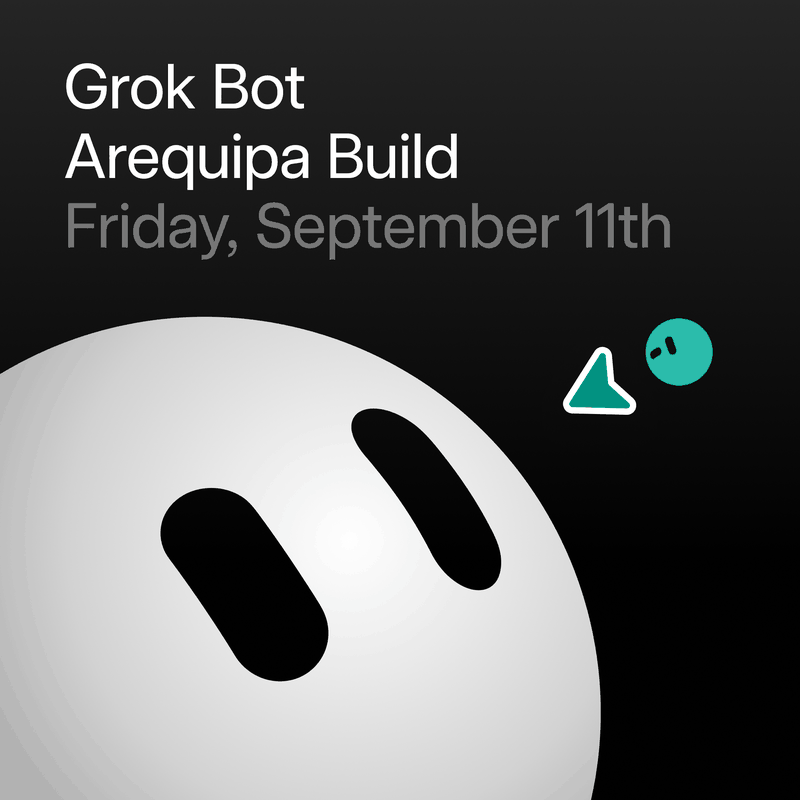</a></td><td valign="top"><strong>Grok Bot 阿雷基帕 Build Night</strong> 2026-09-11 周五 19:00–23:00（秘鲁） 阿雷基帕圣玛丽亚天主教大学（Yanahuara / Umacollo）  阿雷基帕 Grok Bot 动手夜。免费，需审核，可候补，还剩 42 个名额。  <a href="https://luma.com/vcow8a4c"><strong>去 Luma 报名（需审核） →</strong></a></td></tr></table>

<table><tr><td width="320" valign="top"><a href="https://luma.com/ybo7udvo">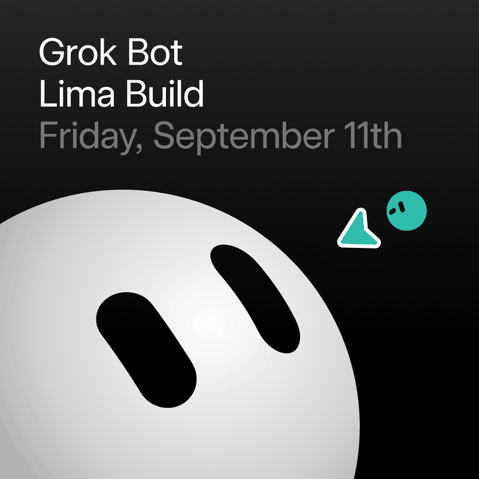</a></td><td valign="top"><strong>Grok Bot 利马 Build Night</strong> 2026-09-11 周五 19:00–23:00（秘鲁） 利马秘鲁天主教大学（San Miguel）  利马 Grok Bot 动手夜。免费，需审核，可候补，还剩 36 个名额。  <a href="https://luma.com/ybo7udvo"><strong>去 Luma 报名（需审核） →</strong></a></td></tr></table>

<table><tr><td width="320" valign="top"></td><td valign="top"><strong>Grok Bot 洛美线下交流</strong> 2026-09-12 周六 09:00–13:00（洛美） 洛美多哥法语学院  洛美线下 Grok Bot。免费，可候补，还剩 198 个名额。  <a href="https://luma.com/cursor-ec8v"><strong>去 Luma 报名 →</strong></a></td></tr></table>

<table><tr><td width="320" valign="top"><a href="https://luma.com/cursor-manta">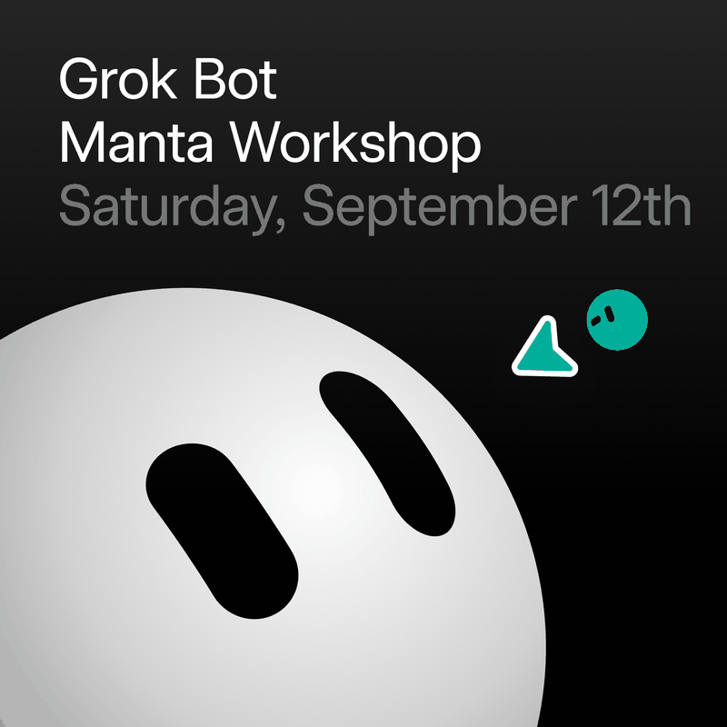</a></td><td valign="top"><strong>Grok Bot 曼塔工作坊</strong> 2026-09-12 周六 08:30–12:30（厄瓜多尔） 厄瓜多尔曼塔 · 报名后可见地址  用 Grok Bot 讲新的 agent 开发栈。免费，可候补，还剩 41 个名额。  <a href="https://luma.com/cursor-manta"><strong>去 Luma 报名 →</strong></a></td></tr></table>

<table><tr><td width="320" valign="top"></td><td valign="top"><strong>Grok Bot 布宜诺斯艾利斯线下交流</strong> 2026-09-16 周三 18:00–20:00（阿根廷） 布宜诺斯艾利斯 · 报名通过后可见地址  布宜诺斯艾利斯线下 Grok Bot。免费，需审核，可候补，还剩 100 个名额。  <a href="https://luma.com/8l9u6sns"><strong>去 Luma 报名（需审核） →</strong></a></td></tr></table>

<table><tr><td width="320" valign="top"><a href="https://luma.com/cursor-0yk6">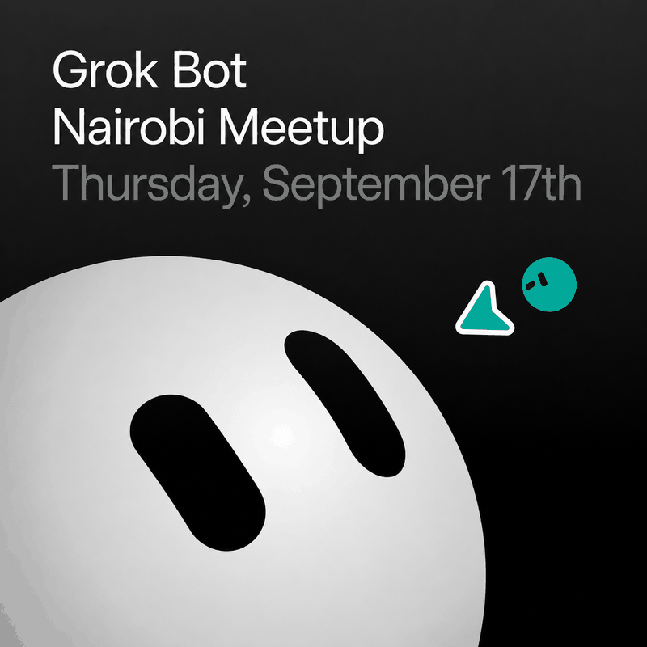</a></td><td valign="top"><strong>Grok Bot 内罗毕线下交流</strong> 2026-09-17 周四 15:30–18:00（内罗毕） 内罗毕 · 场地待定，报名后通知  内罗毕动手玩 Grok Bot。免费，需审核，还剩 60 个名额。  <a href="https://luma.com/cursor-0yk6"><strong>去 Luma 报名（需审核） →</strong></a></td></tr></table>

<table><tr><td width="320" valign="top"></td><td valign="top"><strong>Grok Bot 吉隆坡线下交流</strong> 2026-09-19 周六 18:00–20:00（吉隆坡） 吉隆坡 · 报名通过后可见地址  吉隆坡线下 Grok Bot。免费，需审核，可候补，还剩 99 个名额。  <a href="https://luma.com/grok-bot"><strong>去 Luma 报名（需审核） →</strong></a></td></tr></table>

<table><tr><td width="320" valign="top"></td><td valign="top"><strong>Grok Bot 基多线下交流</strong> 2026-09-24 周四 19:30–21:30（厄瓜多尔） 基多 · 报名通过后可见地址  基多线下 Grok Bot。免费，需审核，还剩 47 个名额。  <a href="https://luma.com/grokbotquitomeetup"><strong>去 Luma 报名（需审核） →</strong></a></td></tr></table>

<table><tr><td width="320" valign="top"><a href="https://luma.com/cursor-coel">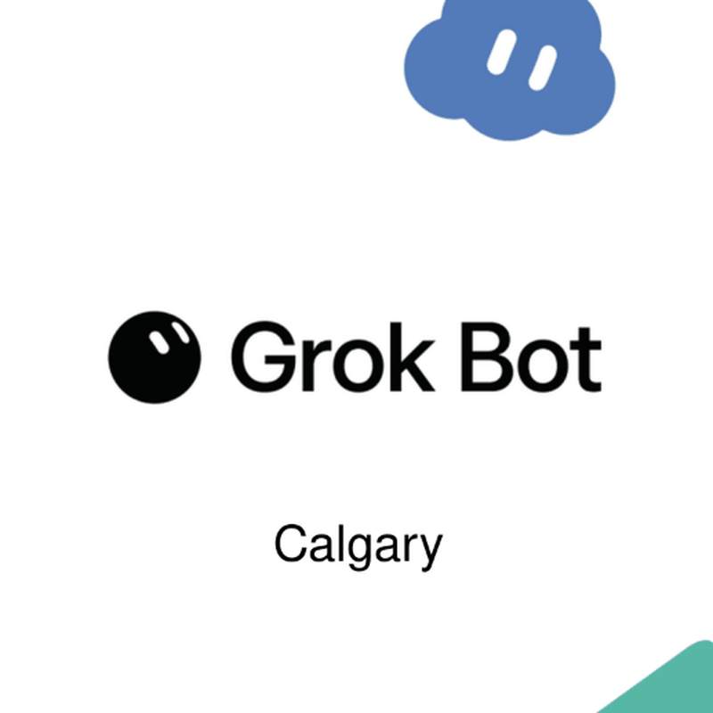</a></td><td valign="top"><strong>Grok Bot 卡尔加里线下交流</strong> 2026-09-30 周三 17:30–20:30（卡尔加里） 卡尔加里 · 场地待定，报名后通知  卡尔加里线下 Grok Bot。免费开放报名。  <a href="https://luma.com/cursor-coel"><strong>去 Luma 报名 →</strong></a></td></tr></table>

<table><tr><td width="320" valign="top"><a href="https://luma.com/91kju0je">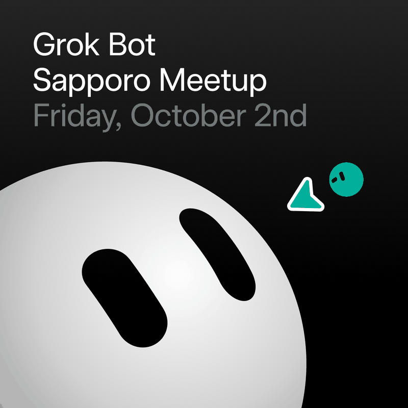</a></td><td valign="top"><strong>Grok Bot 札幌线下交流 #2</strong> 2026-10-02 周五 19:00–22:00（札幌） 札幌 · 报名通过后可见地址  札幌第二场 Grok Bot 线下。免费，需主办审核。  <a href="https://luma.com/91kju0je"><strong>去 Luma 报名（需审核） →</strong></a></td></tr></table>

<table><tr><td width="320" valign="top"></td><td valign="top"><strong>Grok Bot 昆巴亚线下交流</strong> 2026-10-03 周六 09:30–12:00（厄瓜多尔） 基多郊区 Cumbayá  基多郊区 Cumbayá 线下 Grok Bot。免费，可候补，还剩 37 个名额。  <a href="https://luma.com/cccumbaya"><strong>去 Luma 报名 →</strong></a></td></tr></table>

<table><tr><td width="320" valign="top"></td><td valign="top"><strong>Grok Bot 钦奈线下交流</strong> 2026-08-29 周六 11:00–14:00（钦奈） 钦奈 · 报名通过后可见地址  钦奈线下 Grok Bot。需主办审核。  <a href="https://luma.com/29amwgag"><strong>去 Luma 报名（需审核） →</strong></a></td></tr></table>

<table><tr><td width="320" valign="top"><a href="https://luma.com/p4rvaf0y">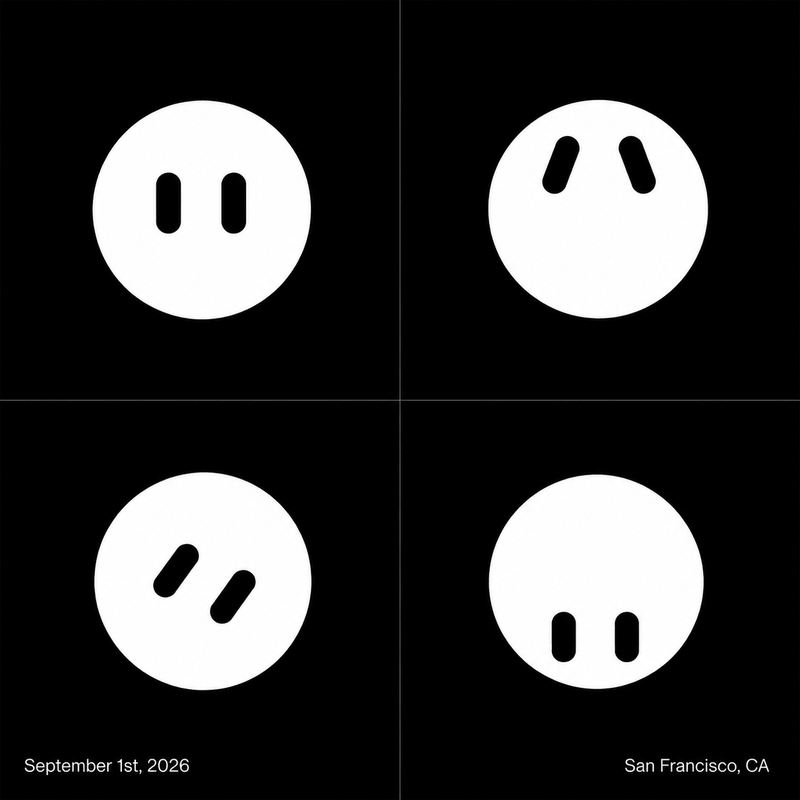</a></td><td valign="top"><strong>旧金山 Grok @bot 构建演示</strong> 2026-09-01 周二 18:00–20:00（旧金山） 旧金山 Yerba Buena · 报名通过后可见地址  旧金山 Grok Bot 构建演示。需审核，可候补。  <a href="https://luma.com/p4rvaf0y"><strong>去 Luma 报名（需审核） →</strong></a></td></tr></table>

<table><tr><td width="320" valign="top"></td><td valign="top"><strong>Grok Bot 奈梅亨共建</strong> 2026-09-02 周三 15:00–20:00（荷兰） 奈梅亨 StartUp Nijmegen, Stationsplein 26  奈梅亨下午一起用 Grok Bot 做东西。开放报名。  <a href="https://luma.com/fw7ovtge"><strong>去 Luma 报名 →</strong></a></td></tr></table>

<table><tr><td width="320" valign="top"></td><td valign="top"><strong>Grok Bot 巴罗达线下交流</strong> 2026-09-05 周六 10:00–13:00（巴罗达） 巴罗达 · 报名通过后可见地址  巴罗达线下 Grok Bot。需主办审核。  <a href="https://luma.com/grokbot-vad-1"><strong>去 Luma 报名（需审核） →</strong></a></td></tr></table>

<table><tr><td width="320" valign="top"></td><td valign="top"><strong>Grok Bot 东京线下交流</strong> 2026-09-09 周三 19:00–21:30（东京） 东京港区 Loglass / 国际兴业三田第2ビル 9F  东京线下 Grok Bot。开放报名。  <a href="https://luma.com/grokbottokyo"><strong>去 Luma 报名 →</strong></a></td></tr></table>

<table><tr><td width="320" valign="top"></td><td valign="top"><strong>Grok Bot 大阪线下交流</strong> 2026-09-17 周四 19:00–21:30（大阪） 大阪北区梅田 North Gate Building  大阪线下 Grok Bot。需主办审核。  <a href="https://luma.com/grokbotosaka"><strong>去 Luma 报名（需审核） →</strong></a></td></tr></table>

<table><tr><td width="320" valign="top"></td><td valign="top"><strong>Grok Bot 宿务线下交流</strong> 2026-09-19 周六 09:00–11:30（宿务） 宿务 · 报名通过后可见地址  宿务线下 Grok Bot。需主办审核。  <a href="https://luma.com/cursor-dyb8"><strong>去 Luma 报名（需审核） →</strong></a></td></tr></table>

<table><tr><td width="320" valign="top"><a href="https://luma.com/grokbot">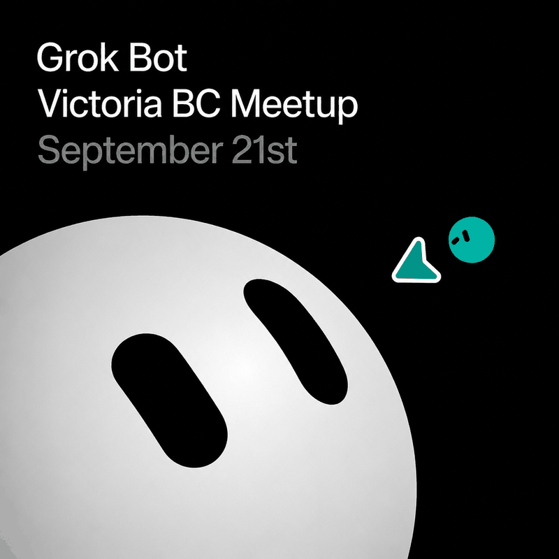</a></td><td valign="top"><strong>Grok Bot 维多利亚（BC）线下交流</strong> 2026-09-21 周一 18:00–21:00（维多利亚） 维多利亚（BC）· 报名通过后可见地址  维多利亚 Grok Bot 动手夜。需主办审核。  <a href="https://luma.com/grokbot"><strong>去 Luma 报名（需审核） →</strong></a></td></tr></table>

<table><tr><td width="320" valign="top"><a href="https://luma.com/cursor-mtu0">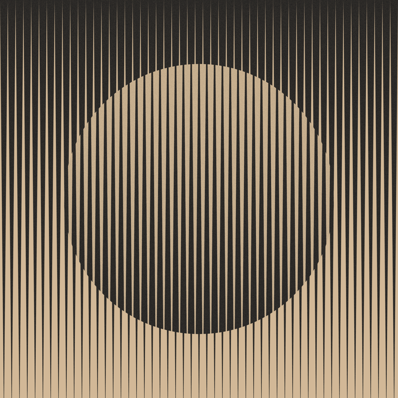</a></td><td valign="top"><strong>Grok Bot 门多萨线下交流</strong> 2026-09-29 周二 16:00–19:00（门多萨） 门多萨 TIC 科技园，Rafael Cubillos 2100-2198  门多萨线下 Grok Bot。开放报名。  <a href="https://luma.com/cursor-mtu0"><strong>去 Luma 报名 →</strong></a></td></tr></table>

<table><tr><td width="320" valign="top"><a href="https://luma.com/cursor-t9m9">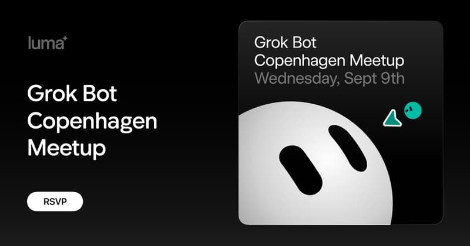</a></td><td valign="top"><strong>Grok Bot 哥本哈根线下交流</strong> 2026-09-09 周三 17:00–20:00（哥本哈根） 哥本哈根 · 报名通过后可见地址  哥本哈根首场 Grok Bot 线下。需主办审核。  <a href="https://luma.com/cursor-t9m9"><strong>去 Luma 报名（需审核） →</strong></a></td></tr></table>

<table><tr><td width="320" valign="top"><a href="https://luma.com/cursor-90pj">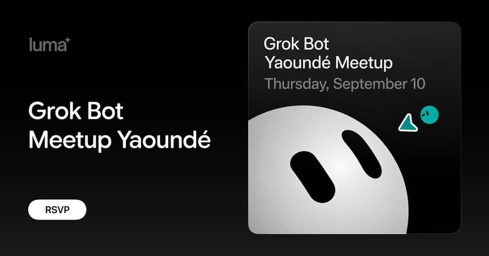</a></td><td valign="top"><strong>Grok Bot 雅温得线下交流</strong> 2026-09-10 周四 11:30–15:00（雅温得） 雅温得 · 报名通过后可见地址  雅温得线下 Grok Bot。需主办审核。  <a href="https://luma.com/cursor-90pj"><strong>去 Luma 报名（需审核） →</strong></a></td></tr></table>

<table><tr><td width="320" valign="top"></td><td valign="top"><strong>Grok Bot 萨德伯里线下交流 #1</strong> 2026-09-17 周四 18:00–20:00（萨德伯里） 萨德伯里 · 报名通过后可见地址  萨德伯里首场 Grok Bot 线下。需主办审核，到场有 credits。  <a href="https://luma.com/cursor-nmzu"><strong>去 Luma 报名（需审核） →</strong></a></td></tr></table>

<table><tr><td width="320" valign="top"><a href="https://luma.com/cursor-ibxj">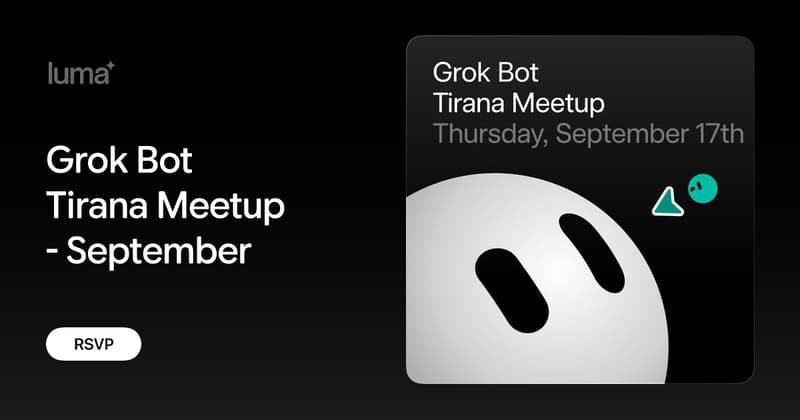</a></td><td valign="top"><strong>Grok Bot 地拉那线下交流</strong> 2026-09-17 周四 18:30–20:00（地拉那） 地拉那 · 报名通过后可见地址  地拉那 9 月 Grok Bot / Cursor 线下。需主办审核。  <a href="https://luma.com/cursor-ibxj"><strong>去 Luma 报名（需审核） →</strong></a></td></tr></table>

<table><tr><td width="320" valign="top"><a href="https://luma.com/puebla-d4iw">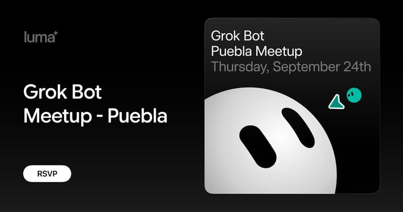</a></td><td valign="top"><strong>Grok Bot 普埃布拉线下交流</strong> 2026-09-24 周四 18:00–22:00（普埃布拉） 普埃布拉 · 报名通过后可见地址  普埃布拉首场 Grok Bot 线下。需主办审核。  <a href="https://luma.com/puebla-d4iw"><strong>去 Luma 报名（需审核） →</strong></a></td></tr></table>

<table><tr><td width="320" valign="top"><a href="https://luma.com/cursor-qu3x">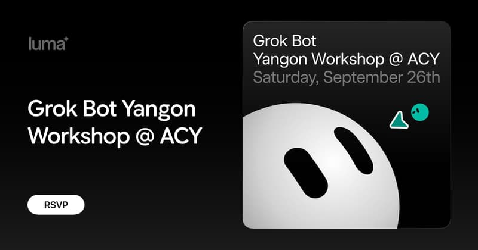</a></td><td valign="top"><strong>Grok Bot 仰光工作坊（ACY）</strong> 2026-09-26 周六 13:30–17:00（仰光） 仰光 American Center Yangon  仰光 American Center 的 Grok Bot 动手工作坊。需主办审核。  <a href="https://luma.com/cursor-qu3x"><strong>去 Luma 报名（需审核） →</strong></a></td></tr></table>

<table><tr><td width="320" valign="top"><a href="https://luma.com/cursor-d70v">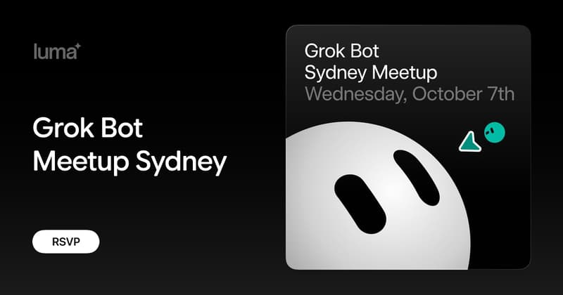</a></td><td valign="top"><strong>Grok Bot 悉尼线下交流</strong> 2026-10-07 周三 17:30–21:00（悉尼） 悉尼 · 报名通过后可见地址  8 月场之后的下一场官方 Cursor 悉尼 Grok Bot 夜。需主办审核。  <a href="https://luma.com/cursor-d70v"><strong>去 Luma 报名（需审核） →</strong></a></td></tr></table>

<table><tr><td width="320" valign="top"><a href="https://luma.com/cfk3aokj">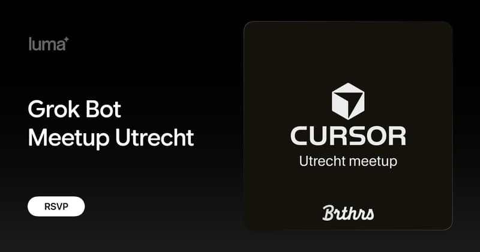</a></td><td valign="top"><strong>Grok Bot 乌得勒支线下交流</strong> 2026-10-29 周四 19:00–21:30（乌得勒支） 乌得勒支 · 报名通过后可见地址  乌得勒支第二场 Grok Bot 社区线下。需主办审核。  <a href="https://luma.com/cfk3aokj"><strong>去 Luma 报名（需审核） →</strong></a></td></tr></table>

<table><tr><td width="320" valign="top"></td><td valign="top"><strong>Grok Bot 纽约学生 Build Night</strong> 2026-09-03 周四 18:00–20:00（纽约） SpaceXAI 纽约 · 报名后可见地址  SpaceXAI 纽约学生场：现场演示 Grok Bot、一起做、有零食，并送一个月含 Grok Bot 的 Cursor Pro。  <a href="https://luma.com/nc8i3yo7"><strong>去 Luma 报名 →</strong></a></td></tr></table>

<table><tr><td width="320" valign="top"></td><td valign="top"><strong>Grok Bot 旧金山学生 Build Night</strong> 2026-09-03 周四 18:00–20:00（旧金山） SpaceXAI 旧金山 · 报名后可见地址  SpaceXAI 旧金山学生场：演示 Grok Bot、动手做、社交和零食，并送一个月含 Grok Bot 的 Cursor Pro。  <a href="https://luma.com/xyd87jsr"><strong>去 Luma 报名 →</strong></a></td></tr></table>

<table><tr><td width="320" valign="top"><a href="https://luma.com/cursor-9mh5">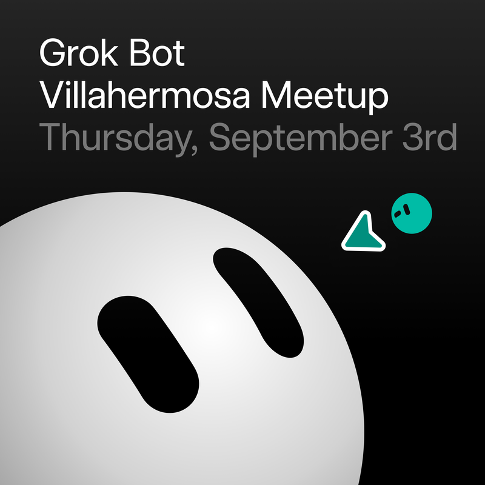</a></td><td valign="top"><strong>Grok Bot 比亚埃尔莫萨线下交流</strong> 2026-09-03 周四 19:00–21:30（比亚埃尔莫萨） 比亚埃尔莫萨 LATI · 报名后可见地址  比亚埃尔莫萨线下：Cursor 和 Grok Bot 使用者交流工作流、云 Agent，以及团队怎么用 Grok Bot。  <a href="https://luma.com/cursor-9mh5"><strong>去 Luma 报名（需审核） →</strong></a></td></tr></table>

<table><tr><td width="320" valign="top"><a href="https://luma.com/cursor-kfex">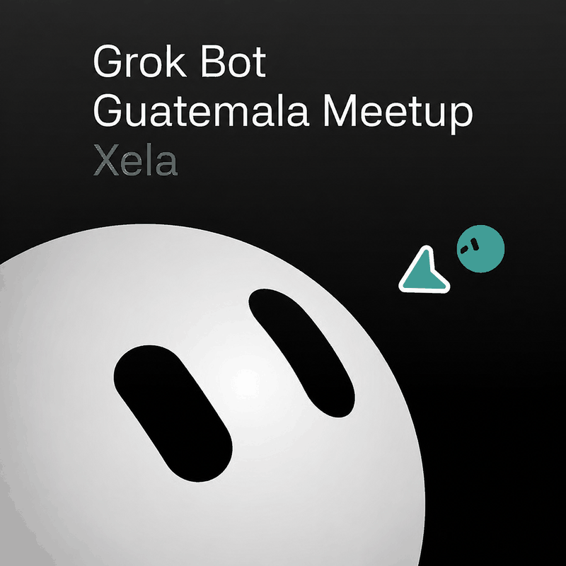</a></td><td valign="top"><strong>Grok Bot 危地马拉克萨尔特南戈线下</strong> 2026-09-20 周日 09:00–15:00（克萨尔特南戈） 克萨尔特南戈中美洲大学  克萨尔特南戈全天创客场：用 Grok Bot 做玛雅语、农村农业、中小企业和医疗教育方向的原型。  <a href="https://luma.com/cursor-kfex"><strong>去 Luma 报名（需审核） →</strong></a></td></tr></table>

<table><tr><td width="320" valign="top"><a href="https://luma.com/cursor-obsw">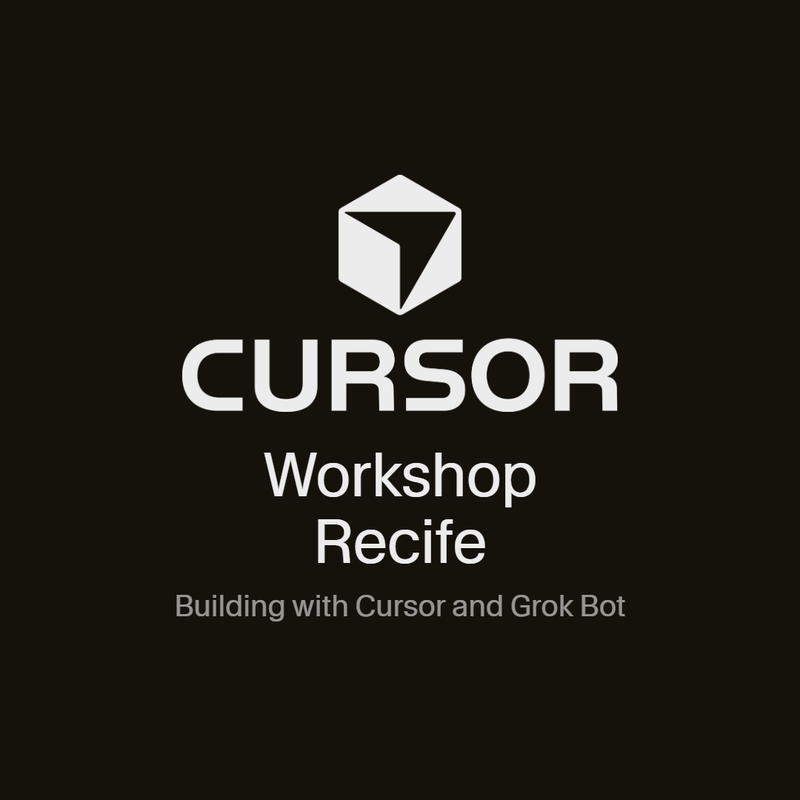</a></td><td valign="top"><strong>Cursor + Grok Bot 累西腓工作坊</strong> 2026-09-23 周三 14:00–17:30（累西腓） 累西腓 Hub Plural Espinheiro  累西腓动手课：用 Cursor 和 Grok Bot 一起交付，把 Grok Bot 当编辑器旁边的队友。  <a href="https://luma.com/cursor-obsw"><strong>去 Luma 报名（需审核） →</strong></a></td></tr></table>

<table><tr><td width="320" valign="top"></td><td valign="top"><strong>Grok Bot 库里蒂巴创业线下</strong> 2026-11-11 周三 18:30–21:00（库里蒂巴） 库里蒂巴 Rua Marcos Moro 72  库里蒂巴创业场：用 Grok Bot 做事、创始人经验，以及智能体时代怎么把想法做出来（嘉宾待定）。需主办审核。  <a href="https://luma.com/cursor-dx23"><strong>去 Luma 报名（需审核） →</strong></a></td></tr></table>
