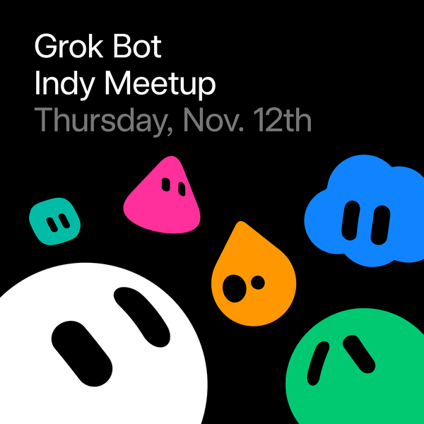
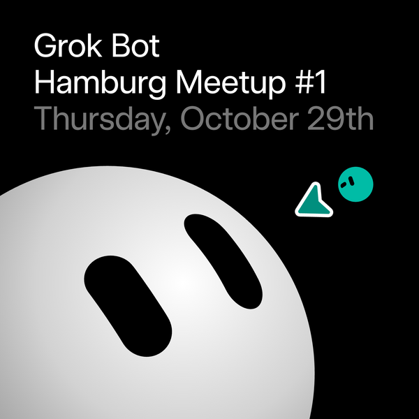

# 活动

<a href="./EVENTS.md"><strong>EN</strong></a> · <strong>中文</strong> · <a href="./EVENTS.ja.md"><strong>日本語</strong></a>

海报、场地和报名方式。首页按国家列出城市，点名称跳到这一页的对应场次。[回 README](README.zh.md)。

[回清单](./README.zh.md)

### 中国

<table><tr><td width="320" valign="top"></td><td valign="top"><strong>Grok Bot 上海线下交流</strong> 2026-10-18 周日 14:00–18:30 上海 · 报名通过后可见地址  上海 Grok Bot 线下：破冰 + 分享/Workshop。预报名需审核。论坛 170454。注意：Luma API 时间目前错成 HKT 09–10（1 小时），以文案 14:00–17:00 为准。  <a href="https://luma.com/spacexai-kh2x"><strong>去 Luma 报名 →</strong></a></td></tr></table>

<table><tr><td width="320" valign="top"></td><td valign="top"><strong>Grok Bot 武汉线下交流</strong> 2026-10-17 周六 14:00–17:30（北京时间） 武汉（场地待确认，确认后更新 Luma 页）  武汉 Grok Bot 线下：交流破冰 + 分享/Workshop。SpaceXAI 产品叙事（能登录你的工具、把做完的活带回来的 AI 队友）。预报名需审核，通过后拉微信群；欢迎分享/志愿者。主办 Hanbing Zhang、chenchong、yuepu；免费，约 150 席。与同日 sha-20261017 上海场不同。  <a href="https://luma.com/kss59f4e"><strong>去 Luma 报名（需审核） →</strong></a></td></tr></table>

<table><tr><td width="320" valign="top"></td><td valign="top"><strong>Grok Bot 澳门工作坊</strong> 2026-10-07 周三 19:00–21:30（Asia/Macau，UTC+8） 澳门 · 澳门科技大学（MUST，路氹 Cotai）— 线下  SpaceXAI 澳门站工作坊：在澳科大（路氹）用 Grok Bot 做 vibe coding。公开免费，约 50 席。Luma 报名。  <a href="https://luma.com/spacexai-macau-must-workshop-oct"><strong>去 Luma 报名 →</strong></a></td></tr></table>

<table><tr><td width="320" valign="top"></td><td valign="top"><strong>SpaceXAI 澳门社区黑客松｜Grok Bot × Physical AI</strong> 2026-11-12 周四 – 11-14 周六，每日 10:00–18:00（Asia/Macau，UTC+8） 澳门 · 澳门旅游塔（Macau Tower）· 线下  澳门三日黑客松，双赛道：用 Grok Bot 三天搭公司，或 Physical AI × Grok Bot（公开+高中生）（主办 John Ku；论坛 173330 / Luma spacexai-macau-hackathlon-nov）。自带电脑；个人报名现场组队；需审批；早间扫描剩余约 80 席。  <a href="https://luma.com/spacexai-macau-hackathlon-nov"><strong>去 Luma 报名 →</strong></a></td></tr></table>

### 美国

<table><tr><td width="320" valign="top"></td><td valign="top"><strong>Grok Bot 匹兹堡线下交流</strong> 2026-10-13 周二 18:30–20:30（美东） 匹兹堡 · Oakland / Lawrenceville（报名后可见详细地址）  匹兹堡首场城市级 Grok Bot 线下（非校园专场）：短演示后动手/换配置；学生与在职皆可。主办 Micah Smith；免费，开放报名（约 30 席）。  <a href="https://luma.com/6lx5t8ru"><strong>去 Luma 报名 →</strong></a></td></tr></table>

<table><tr><td width="320" valign="top"></td><td valign="top"><strong>Grok Bot Meetup 格林维尔</strong> 2026-10-08 周四 18:00–20:00（美国南卡罗来纳州格林维尔 ET，UTC−4） 美国南卡罗来纳州格林维尔（场地待定）（线下；软容量 50–75，有候补）  格林维尔首场入库 Grok Bot 聚会（主办 Brad Shannon；个人 Luma 日历）。议程：约 17:45 入场、欢迎与介绍 Grok Bot、现场演示、Q&A、自由构建。自带电脑，建议预装 https://x.ai/bot。设计师/PM/创始人/开发者皆可。免费报名（扫描时剩余约 66、guest_count 9）。场地待定。新 discover slug utdchtxv；论坛尚无 New event 帖。  <a href="https://luma.com/utdchtxv"><strong>去 Luma 报名 →</strong></a></td></tr></table>

<table><tr><td width="320" valign="top"></td><td valign="top"><strong>Grok Bot 波士顿黑客松</strong> 2026-10-09 周五 09:00–15:00（America/New_York） 波士顿／剑桥 · CambridgeSide — 线下黑客松  波士顿 Grok Bot 黑客松（CambridgeSide）：线下用 Grok Bot 队友一起做。SpaceXAI Community 挂牌。  <a href="https://luma.com/spacexai-zk6r"><strong>去 Luma 报名 →</strong></a></td></tr></table>

<table><tr><td width="320" valign="top"></td><td valign="top"><strong>Cursor Meetup 费城 — 十月场</strong> 2026-10-27 周二 18:00–20:30（America/New_York） 费城 · SpaceXAI Philadelphia — 线下  SpaceXAI Community 费城十月 Cursor/Grok 局（接 9/29 Grok Bot Meetup）。Luma 报名。  <a href="https://luma.com/cursor-c2mq"><strong>去 Luma 报名 →</strong></a></td></tr></table>

<table><tr><td width="320" valign="top"></td><td valign="top"><strong>Cursor Meetup 费城 — 十一月场</strong> 2026-11-17 周二 18:00–20:30（America/New_York） 费城 · SpaceXAI Philadelphia — 线下  SpaceXAI Community 费城十一月 Cursor/Grok 局。Luma 报名。  <a href="https://luma.com/cursor-acqy"><strong>去 Luma 报名 →</strong></a></td></tr></table>

<table><tr><td width="320" valign="top"></td><td valign="top"><strong>Cursor Meetup 费城 — 十二月场</strong> 2026-12-17 周四 18:00–20:30（America/New_York） 费城 · SpaceXAI Philadelphia — 线下  SpaceXAI Community 费城十二月 Cursor/Grok 局。Luma 报名。  <a href="https://luma.com/cursor-8wr8"><strong>去 Luma 报名 →</strong></a></td></tr></table>

<table><tr><td width="320" valign="top"></td><td valign="top"><strong>Grok Bot 坦帕湾 Meetup</strong> 2026-11-14 周六 13:00–16:00（America/New_York） 美国佛罗里达坦帕湾 · 场地待定（报名后通知）。线下。  坦帕湾线下 Grok Bot 聚会（SpaceXAI Tampa）。Luma 报名。  <a href="https://luma.com/spacexai-g0x6"><strong>去 Luma 报名 →</strong></a></td></tr></table>

<table><tr><td width="320" valign="top"></td><td valign="top"><strong>Grok Bot Meetup 华盛顿特区</strong> 2026-10-07 周三 17:30–20:30（美东 EDT，UTC−4） 美国华盛顿特区 · Downtown（Luma 上精确地址暂隐藏）— 线下  华盛顿特区首场 Grok Bot Meetup（HireNimbus 联合创始人主办）。分享 SpaceXAI Galaxy 旧金山行后如何用 Grok Bot 做事。免费；目前约 15 人。Luma 报名。  <a href="https://luma.com/h2ijioha"><strong>去 Luma 报名 →</strong></a></td></tr></table>

<table><tr><td width="320" valign="top"></td><td valign="top"><strong>Startup Club × SpaceXAI Build Night（Caltech）</strong> 2026-10-07 周三 19:00–21:00（America/Los_Angeles） 美国加州帕萨迪纳 · Hameetman Center / Winnett（Caltech）— 线下  Caltech 首场公开 SpaceXAI 之夜（Startup Club）：现场仓库演示后用 Cursor / Grok Bot 构建。Luma 报名。  <a href="https://luma.com/l4yagss3"><strong>去 Luma 报名 →</strong></a></td></tr></table>

<table><tr><td width="320" valign="top"></td><td valign="top"><strong>Grok Bot 工程师工作坊 @ KSU 亚特兰大</strong> 2026-10-16 周五 15:00–17:00（America/New_York，UTC-04:00） 美国佐治亚州亚特兰大 · KSU Marietta — 线下  亚特兰大 KSU Marietta 面向工程师与学生的 Grok Bot 动手工作坊。  <a href="https://luma.com/07lxjoiu"><strong>去 Luma 报名 →</strong></a></td></tr></table>

<table><tr><td width="320" valign="top"></td><td valign="top"><strong>Grok Bot Meetup 西雅图</strong> 2026-10-12 周一 18:00–21:00（美西太平洋 PDT，UTC−7）。 美国西雅图 · Westlake 一带（线下；通过审批后见 Luma 地址）。  西雅图首场 Grok Bot 工作坊+聚会（主办 shrey shah；论坛 173194 / Luma b0x0mc3p）。太平洋时间 18:00–21:00：入场餐饮、动手搭建、社区演示与模板、社交；建议带笔记本。免费需审批，候补开启，约 200 席；晚间扫描时 guest_count 0。  <a href="https://luma.com/b0x0mc3p"><strong>去 Luma 报名 →</strong></a></td></tr></table>

<table><tr><td width="320" valign="top"></td><td valign="top"><strong>SpaceXAI：GrokBot Job Night（亚特兰大）</strong> 2026-10-08 周四 18:30–20:00（America/New_York，EDT，UTC-4） 亚特兰大 · Klaus Advanced Computing Building（266 Ferst Dr NW）· 线下  SpaceXAI 亚特兰大 GrokBot Job Night（Klaus 楼）。免费需审批；早间扫描 guest_count 27。Luma enjt7lt8。勿与 atl-20261016 KSU 工程师场混淆。  <a href="https://luma.com/enjt7lt8"><strong>去 Luma 报名 →</strong></a></td></tr></table>

<table><tr><td width="320" valign="top"></td><td valign="top"><strong>Grok Bot Meetup 芝加哥</strong> 2026-10-16 周五 17:30–20:30（America/Chicago，CDT，UTC−5） 美国芝加哥 · Spaces Fulton Market（159 N Sangamon St）— 线下  配对共建夜：到场随机和陌生人组队，用 Cursor 花约 1.5 小时做一个 Grok Bot，每队展示 3 分钟后全场投票。17:30 开门，18:00 开始搭建；带电脑，楼下保安处需出示 Luma 邀请。免费；主办 Krystian Gebis；论坛 173946；slug spacexai-y33x。  <a href="https://luma.com/spacexai-y33x"><strong>去 Luma 报名 →</strong></a></td></tr></table>

<table><tr><td width="320" valign="top"></td><td valign="top"><strong>Grok Bot Meetup 印第安纳波利斯</strong> 2026-11-12 周四 18:00–20:00（America/Indiana/Indianapolis，EST，UTC−5） 美国印第安纳州 Fishers（印第安纳波利斯周边）· Launch Fishers（12175 Visionary Way）— 线下  面向印第安纳波利斯开发者和企业主的首场 Grok Bot 聚会：介绍、现场演示、问答，然后动手搭建（带电脑和想法）并由参会者展示，目标是带走一个能干活的 Bot。无需经验。免费；主办 Jacob Thifault；论坛 173949；slug cudopyt3。  <a href="https://luma.com/cudopyt3"><strong>去 Luma 报名 →</strong></a></td></tr></table>

### 德国

<table><tr><td width="320" valign="top"></td><td valign="top"><strong>Grok Bot 科隆线下交流</strong> 2026-10-09 周五 18:00–21:00（科隆 CEST） 科隆（报名后可见具体地址）  科隆 Grok Bot 线下：社交、分享/工作坊、带着真实任务动手（Windows/Mac 笔记本或 iPhone；先下 x.ai/bot）。议程 18:00 签到→18:30 演示与动手→20:00 闲聊；欢迎更多 Grok Bot 分享者。主办 Emmanuel Ketcha、Eyad Kelleh、Babajide Mayowa Moibi、Teoman Köse；免费，需主办审批，约 50 席。  <a href="https://luma.com/spacexai-cologne-meetup1"><strong>去 Luma 报名（需审核） →</strong></a></td></tr></table>

<table><tr><td width="320" valign="top"></td><td valign="top"><strong>Grok Bot Meetup 斯图加特</strong> 2026-10-15 周四 17:30–21:00（Europe/Berlin，UTC+2 / CEST） 德国斯图加特 Epplestraße 225/haus 3, 70567 Stuttgart-Möhringen（线下，一楼）  斯图加特首场 Grok Bot 聚会（Sachin Agrawal；AI collective Stuttgart / SpaceXAI ambassador）。晚场试玩、演示与社区交流。免费需审批（余 84）。slug spacexai-z2er；论坛 New event 171988。  <a href="https://luma.com/spacexai-z2er"><strong>去 Luma 报名 →</strong></a></td></tr></table>

<table><tr><td width="320" valign="top"></td><td valign="top"><strong>Build with Grokbot — 法兰克福（11月20日）</strong> 2026-11-20 周五 14:00–22:30（Europe/Berlin，UTC+1）。 德国法兰克福 — Hotel Motel One Frankfurt-Messe（线下）。  法兰克福继 9/10 月场次后的下一场 Build with Grokbot（SpaceXAI for Frankfurt；主办 DJ Gangan 等）。Motel One Messe 下午到晚上搭建；候补开放（扫描时 guest_count 3）。slug l9tfh081。  <a href="https://luma.com/l9tfh081"><strong>去 Luma 报名 →</strong></a></td></tr></table>

<table><tr><td width="320" valign="top"></td><td valign="top"><strong>Grok Bot Meetup 卡塞尔</strong> 2026-11-12 周四 18:00–22:00（卡塞尔 CET，UTC+1） 德国卡塞尔 · 报名后可见场地（Bettenhausen 一带）· 线下  卡塞尔首场 Grok Bot 聚会（SpaceXAI for Kassel；主办 Eyad Kelleh、Maurice Pfurr 等；论坛 173331 / Luma rx61bqy9）。闲聊、演示、现场试用额度；需审批+候补；早间扫描 guest_count 2。  <a href="https://luma.com/rx61bqy9"><strong>去 Luma 报名 →</strong></a></td></tr></table>

<table><tr><td width="320" valign="top"></td><td valign="top"><strong>Build Days w/ GrokBot @ AI Week — 法兰克福（10/30）</strong> 2026-10-30 周五 09:45–18:15（Europe/Berlin，CET，UTC+1） 德国法兰克福 · The Squaire，Am Flughafen 12 — 线下（AI Week × Glassflow）  法兰克福 GrokBot Build Day（The Squaire；AI Week × Glassflow / SpaceXAI）：动手交付场，非纯演讲。免费有候补；午间扫描 guest_count 83。与旧 fra-20261023 同 slug 1rv39ekj（从 10/23 改期到 10/30，场地 Motel One→Squaire）。  <a href="https://luma.com/1rv39ekj"><strong>去 Luma 报名 →</strong></a></td></tr></table>

<table><tr><td width="320" valign="top"></td><td valign="top"><strong>Grok Bot Meetup 汉堡 #1</strong> 2026-10-28 周三 18:00–22:00（Europe/Berlin，CET，UTC+1） 德国汉堡 · House of AI Hamburg（Hongkongstraße 2）— 线下  汉堡首场 Grok Bot 聚会：先吃披萨、简短介绍，然后是社区分享和 Bot 演示、问答和互相对比配置。正在通过报名表征集分享人，粗糙的演示也欢迎。免费；主办 Alexander Zakharov 和 AI BEAVERS；论坛 173947；slug spacexai-76rs。  <a href="https://luma.com/spacexai-76rs"><strong>去 Luma 报名 →</strong></a></td></tr></table>

### 巴西

<table><tr><td width="320" valign="top"></td><td valign="top"><strong>Grok Bot Meetup 维多利亚·达孔基斯塔</strong> 2026-10-14 周三 19:00–22:00（巴西 Bahia，UTC−3） 巴西 Bahia 维多利亚·达孔基斯塔 Hub Conquista（Av. Juracy Magalhães 3405, Boa Vista）（线下）  巴西 Bahia 维多利亚·达孔基斯塔线下 Grok Bot 聚会（挂在 SpaceXAI for Salvador 日历；主办 Benjamin Bauer、Sarah Ferreira Reis）。议程：社交、讲座/工坊、Q&A，围绕 Grok Bot。场地 Hub Conquista 有完整地址；免费、无需审批；扫描时 guest_count 1。社区日历新 slug cursor-iutk + 论坛 171709。  <a href="https://luma.com/cursor-iutk"><strong>去 Luma 报名 →</strong></a></td></tr></table>

<table><tr><td width="320" valign="top"></td><td valign="top"><strong>Grok Bot 库里蒂巴创业线下</strong> 2026-11-11 周三 18:30–21:00（库里蒂巴） 库里蒂巴 Rua Marcos Moro 72  库里蒂巴创业场：用 Grok Bot 做事、创始人经验，以及智能体时代怎么把想法做出来（嘉宾待定）。需主办审核。  <a href="https://luma.com/cursor-dx23"><strong>去 Luma 报名（需审核） →</strong></a></td></tr></table>

<table><tr><td width="320" valign="top"></td><td valign="top"><strong>Grok Bot Meetup 萨尔瓦多（巴西）</strong> 2026-10-08 周四 18:00–21:00（America/Bahia） 巴西萨尔瓦多（巴伊亚）· UNIFACS Campus Tancredo Neves（Av. Tancredo Neves, 2131）— 线下  SpaceXAI 巴西萨尔瓦多 Grok Bot 聚会：社交、分享/工作坊、问答（UNIFACS）。新发布，Luma 报名。  <a href="https://luma.com/spacexai-psox"><strong>去 Luma 报名 →</strong></a></td></tr></table>

<table><tr><td width="320" valign="top"></td><td valign="top"><strong>Grok Bot 弗洛里亚诺波利斯 Building Day</strong> 2026-10-16 周五 14:00–22:00（America/Sao_Paulo，UTC-3）。 巴西弗洛里亚诺波利斯 — Founder Haus（Jurerê Internacional，线下）。  弗洛里亚诺波利斯整下午 Building Day（SpaceXAI for Florianópolis；主办 Alexandre Ferrari / Founder Haus / Christian Rios）。有别于 9/26 Meetup；候补开放（扫描时 guest_count 6）。slug 3t86uc0s。  <a href="https://luma.com/3t86uc0s"><strong>去 Luma 报名 →</strong></a></td></tr></table>

### 加拿大

<table><tr><td width="320" valign="top"></td><td valign="top"><strong>Grok Bot Meetup 多伦多（十月）</strong> 2026-10-26 周一 17:30–20:30（多伦多America/Toronto，UTC-4） 加拿大多伦多 800 Bay 一带（Luma 模糊地址）（线下）  多伦多月度 Grok Bot 聚会十月场（主办 Jia Ming Huang 等；承接已入库 yyz-20260917 九月场）。约 17:30–20:30 于 800 Bay：交流、两位演讲、Q&A、构建；提供餐饮与 Cursor credits。需带电脑；18:15 截止入场。免费报名需审批（扫描时剩余约 400）。新 slug mj5bmugc；勿与 yyz-20260917 混淆。  <a href="https://luma.com/mj5bmugc"><strong>去 Luma 报名 →</strong></a></td></tr></table>

<table><tr><td width="320" valign="top"></td><td valign="top"><strong>Grok Bot Meetup 卡尔加里（10 月）</strong> 2026-10-28 周三 17:30–20:30（卡尔加里 MDT，UTC−6） 加拿大卡尔加里 · 场地待定（见 Luma）· 线下  卡尔加里月度 Grok Bot Meetup（主办 Simon Loewen、Jia Ming Huang；论坛 173296 / Luma i9grzzp3）。山地时间 17:30–20:30：入场、动手、演示、社交；自带笔记本；候补开启；晚间扫描 guest_count 1。  <a href="https://luma.com/i9grzzp3"><strong>去 Luma 报名 →</strong></a></td></tr></table>

<table><tr><td width="320" valign="top"></td><td valign="top"><strong>Grok Bot Meetup 哈利法克斯</strong> 2026-10-15 周三 18:00–20:00（America/Halifax，ADT，UTC-3） 加拿大哈利法克斯 · 市中心（报名后可见精确地址）· 线下  用例分享 + 一场现场 Grok Bot 实装（主办 Rishabh A / SquareCX）。笔记本可选；Luma 免费报名（slug grok-bot-halifax）。论坛 173477。  <a href="https://luma.com/grok-bot-halifax"><strong>去 Luma 报名 →</strong></a></td></tr></table>

<table><tr><td width="320" valign="top"></td><td valign="top"><strong>Grok Bot Meetup 渥太华</strong> 2026-10-17 周六 18:00–22:00（America/Toronto，EDT，UTC-4） 加拿大渥太华 Carleton University Nicol Building, 1125 Colonel By Dr — 线下  渥太华 Grok Bot（Carleton University；Builders Collective Ottawa 等主办）。晚场演示与交流。免费报名；午间扫描 guest_count 62。与旧 yow-20261010 同 slug phs5tofz（从 10/10 改期到 10/17）。  <a href="https://luma.com/phs5tofz"><strong>去 Luma 报名 →</strong></a></td></tr></table>

### 意大利

<table><tr><td width="320" valign="top"></td><td valign="top"><strong>Grok Bot Meetup 罗马</strong> 2026-10-23 周五 10:00–13:00（Europe/Rome） 意大利罗马 · Urbe Hub（Largo Dino Frisullo, 00153 Roma RM）— 线下  SpaceXAI 罗马站（Urbe Hub）：一起用 Grok Bot 构建与分享。与 Urbe Hub 合办。Luma 报名。  <a href="https://luma.com/grok-bot-rome"><strong>去 Luma 报名 →</strong></a></td></tr></table>

<table><tr><td width="320" valign="top"></td><td valign="top"><strong>Grok Bot Meetup — H-FARM 特雷维索</strong> 2026-10-22 周四 18:30–21:00（Europe/Rome，CEST，UTC+2）。 意大利特雷维索省 Roncade · H-FARM（Via Adriano Olivetti 1，31056）— 线下。  威尼托首场 Grok Bot Meetup，场地 H-FARM（SpaceXAI for Padua 日历；主办 Victor Motricala；开场 Diego Pizzocaro / H-FARM AI）。英语晚间：介绍、直播演示、发额度、交流餐饮、动手；必须带笔记本。免费开放报名，启用候补（扫描时 guest_count 2 / 约 128 席）。slug spacexai-kk5f（evt-DQJ18z0yEPgVagi）+ 论坛 173108。  <a href="https://luma.com/spacexai-kk5f"><strong>去 Luma 报名 →</strong></a></td></tr></table>

<table><tr><td width="320" valign="top"></td><td valign="top"><strong>Grok Bot 博洛尼亚线下交流</strong> 2026-10-12 周一 18:00–21:00（Europe/Rome，CEST，UTC+2） 意大利博洛尼亚 · Serre dei Giardini Margherita，Via Castiglione 134 — 线下  博洛尼亚首场 Grok Bot（Serra Liberty / Kilowatt）：演示+自带电脑动手。免费；早间扫描 guest_count 8。Luma spacexai-bologna-01。  <a href="https://luma.com/spacexai-bologna-01"><strong>去 Luma 报名 →</strong></a></td></tr></table>

<table><tr><td width="320" valign="top"></td><td valign="top"><strong>博物馆 Grok Hackathon（帕维亚）</strong> 2026-11-05 周四 10:00–23:30（Europe/Rome，CET，UTC+1） 意大利帕维亚 · Ctrl+Alt Museum（comPVter），Via Riviera 39 — 线下  帕维亚复古计算博物馆全日 Hackathon（延续米兰 Café Cursor 氛围）。免费需主办审核；论坛 173708；slug spacexai-z1ys。  <a href="https://luma.com/spacexai-z1ys"><strong>去 Luma 报名 →</strong></a></td></tr></table>

### 厄瓜多尔

<table><tr><td width="320" valign="top"></td><td valign="top"><strong>Grok Bot Meetup 安巴托</strong> 2026-10-29 周四 08:00–15:00（America/Guayaquil，UTC-5） 厄瓜多尔安巴托 · 安巴托技术大学 Ingahurco 校区 · 线下  SpaceXAI 安巴托站：UTA Ingahurco 校区线下（主办 Kevin Morales）。免费 Standard；论坛 173478；Luma grokbotambatomeetup。  <a href="https://luma.com/grokbotambatomeetup"><strong>去 Luma 报名 →</strong></a></td></tr></table>

<table><tr><td width="320" valign="top"></td><td valign="top"><strong>Grok Bot Meetup 基多</strong> 2026-10-21 周三 17:30–20:30（America/Guayaquil，ECT，UTC-5） 厄瓜多尔基多 · 线下（报名后可见精确地址）  SpaceXAI 基多 Grok Bot 聚会。免费报名；早间扫描 guest_count 12。Luma spacexai-7spd。勿与已过期 uio-20260924 混淆。  <a href="https://luma.com/spacexai-7spd"><strong>去 Luma 报名 →</strong></a></td></tr></table>

### 西班牙

<table><tr><td width="320" valign="top"></td><td valign="top"><strong>Grok Bot Meetup 阿利坎特</strong> 2026-11-07 周六 12:00–14:30（Europe/Madrid） 西班牙阿利坎特 · Sausalito Premium Club（Muelle Levante, 6 / 港口）— 线下  SpaceXAI 阿利坎特首场午间 Meetup：5 分钟闪电演示（Cursor 里的 Grok Bot 工作流）+ 社交。论坛 172631，Luma 报名。  <a href="https://luma.com/spacexai-ol8x"><strong>去 Luma 报名 →</strong></a></td></tr></table>

<table><tr><td width="320" valign="top"></td><td valign="top"><strong>Grok Bot Meetup 毕尔巴鄂</strong> 2026-10-19 周一 18:00–21:30（Europe/Madrid） 西班牙毕尔巴鄂 · La Perrera Espazioa（Sabino Arana Etorbidea, 50）— 线下  SpaceXAI 毕尔巴鄂站（La Perrera Espazioa）：见面交流并用 Grok Bot 构建分享。Luma 免费报名。  <a href="https://luma.com/spacexai-euskadi"><strong>去 Luma 报名 →</strong></a></td></tr></table>

### 英国

<table><tr><td width="320" valign="top"></td><td valign="top"><strong>Grok Bot 社区工程伦敦 Hackathon</strong> 2026-10-22 周四 18:00–22:30（Europe/London，BST，UTC+1） 英国伦敦 · 审核通过后公布场地 — 线下  面向社区工程师、DevRel 和组织者的晚间 Hackathon：Grok Bot 掌握 Slack、Discord、邮箱、日历、Luma、CRM 等上下文，Cursor 把它做成社区工具，现场演示。免费需主办审核；论坛 173849；slug eveur09a。  <a href="https://luma.com/eveur09a"><strong>去 Luma 报名 →</strong></a></td></tr></table>

<table><tr><td width="320" valign="top"></td><td valign="top"><strong>Grok Bot Build NorthWest（奥姆斯柯克）</strong> 2026-10-24 周六 11:00–15:00（Europe/London，BST，UTC+1） 英国奥姆斯柯克 · Edge Hill University，St Helens Rd，L39 4QP — 线下  英格兰西北部 Grok Bot 构建日，在 Edge Hill University：组队、学习并用 Grok Bot 和 Cursor 动手做，欢迎各种水平。免费需主办审核；论坛 173850；slug cursor-i0ov。  <a href="https://luma.com/cursor-i0ov"><strong>去 Luma 报名 →</strong></a></td></tr></table>

### 危地马拉

<table><tr><td width="320" valign="top"></td><td valign="top"><strong>Grok Bot Meetup 危地马拉</strong> 2026-12-05 周六 15:00–20:00（America/Guatemala） 危地马拉 · 场地待定（见 Luma/主办方更新）— 线下  SpaceXAI 危地马拉线下 Grok Bot 聚会（论坛+Luma 已发）。场地细节见 Luma 报名页。  <a href="https://luma.com/spacexai-97mt"><strong>去 Luma 报名 →</strong></a></td></tr></table>

<table><tr><td width="320" valign="top"></td><td valign="top"><strong>Grok Bot 危地马拉：Build & Pitch</strong> 2026-11-21 周六 08:00–15:00（America/Guatemala，CST，UTC−6） 危地马拉城 · 危地马拉谷大学（报名后公布具体地址）— 线下  西语 Build & Pitch：连续四小时用 Grok Bot 单人或组队开发，再做简短路演并获得现场反馈。免费报名；论坛 173855；slug c398wllp。  <a href="https://luma.com/c398wllp"><strong>去 Luma 报名 →</strong></a></td></tr></table>

### 印度尼西亚

<table><tr><td width="320" valign="top"></td><td valign="top"><strong>SpaceXAI 印尼黑客松</strong> 2026-11-07 周六 07:00–20:00（Asia/Jakarta） 印尼雅加达 — 线下黑客松（详细场地见 Luma）  SpaceXAI 印尼黑客松（雅加达）：围绕 Grok Bot / SpaceXAI Community 的多日线下构建。  <a href="https://luma.com/d4b0eg4v"><strong>去 Luma 报名 →</strong></a></td></tr></table>

<table><tr><td width="320" valign="top"></td><td valign="top"><strong>Grok Bot Meetup 巴厘岛</strong> 2026-10-25 周日 13:00–16:00（Asia/Makassar） 巴厘岛Canggu / 巴东 · 地址报名后可见 — 线下  SpaceXAI 巴厘岛（Canggu）Grok Bot 聚会：工作流分享、额度、餐饮。设计/PM/创始人/新手欢迎。Luma 报名。  <a href="https://luma.com/ubpln69o"><strong>去 Luma 报名 →</strong></a></td></tr></table>

### 日本

<table><tr><td width="320" valign="top"></td><td valign="top"><strong>Grok Bot 东京黑客松</strong> 2026-10-11 周六 10:00–18:00（Asia/Tokyo） 日本东京 · 御茶ノ水ソラシティ（千代田区神田骏河台4-6）— 线下  SpaceXAI 东京黑客松（御茶ノ水ソラシティ）：全日线下用 Grok Bot 构建。Luma 报名。  <a href="https://luma.com/grokbot-hackathon-tokyo"><strong>去 Luma 报名 →</strong></a></td></tr></table>

<table><tr><td width="320" valign="top"></td><td valign="top"><strong>Grok Bot 神奈川 Meetup（川崎）</strong> 2026-11-04 周三 18:30–21:00（Asia/Tokyo，JST，UTC+9） 日本川崎 · Uvance Innovation Studio，JR 川崎塔 26 层（幸区大宫町 1-5）— 线下  大家一起动手做 Bot、分两轮分享成果，最后有交流会（只供饮料）；面向已订阅对应 Grok Bot 套餐的人。免费需主办审核；论坛 173852；slug spacexai-kanagawa-meetup-2。  <a href="https://luma.com/spacexai-kanagawa-meetup-2"><strong>去 Luma 报名 →</strong></a></td></tr></table>

### 韩国

<table><tr><td width="320" valign="top"></td><td valign="top"><strong>Grok Bot 首尔 Meetup</strong> 2026-10-27 周二 19:00–22:00（Luma 时区 Europe/Amsterdam；首尔首场 Meetup）。 韩国首尔 — 线下（Luma 地址暂隐/待公布）。  首尔首场 Grok Bot Meetup（主办 Andreas Kruszakin-Liboska + Eric Kim）。晚上一起搭 Bot、看演示；建议带笔记本，现场提供 credits。免费报名（扫描时 guest_count 4）。slug 6ee6i3v6；论坛尚无 New event 帖。  <a href="https://luma.com/6ee6i3v6"><strong>去 Luma 报名 →</strong></a></td></tr></table>

<table><tr><td width="320" valign="top"></td><td valign="top"><strong>Grok Bot Meetup 首尔（10/13）</strong> 2026-10-13 周二 18:00–22:00（Asia/Seoul，KST，UTC+9） 韩国首尔 · 그로브1219，城东区 Seoulsup 4-gil 12-19 — 线下  首尔第二场 Grok Bot Meetup（有别于 sel-20261027 / slug 6ee6i3v6）。个人 Luma 日历，主办含 Jey Shim 等。地址 Grove1219（城东区）。免费报名；slug 3leebkxk。  <a href="https://luma.com/3leebkxk"><strong>去 Luma 报名 →</strong></a></td></tr></table>

### 秘鲁

<table><tr><td width="320" valign="top"></td><td valign="top"><strong>Grok Bot Meetup 万卡约</strong> 2026-10-23 周四 16:00–19:30（秘鲁利马时区 PET，UTC−5） 秘鲁万卡约 Parque Huamanmarca · 线下  万卡约 Grok Bot 动手局（主办 Ignacio Velasquez；论坛 173396 / Luma x5jqstsk）：少聊天、多构建，自带笔记本一下午做出可用应用。免费；需审批+候补；剩余名额 40；晚间扫描 guest_count 0。  <a href="https://luma.com/x5jqstsk"><strong>去 Luma 报名 →</strong></a></td></tr></table>

<table><tr><td width="320" valign="top"></td><td valign="top"><strong>Grok Bot 利马：面向 builder</strong> 2026-10-17 周六 10:00–11:30（America/Lima，PET，UTC−5） 秘鲁利马 · UPCH La Molina 校区，Jr. José Antonio 310 — 线下  西语 Grokbot 入门场：从基础讲到新能力，展示一个用 Grok Bot 做的真实项目，发入门额度并有问答，无需经验。免费需主办审核；论坛 173848；slug 7q78rrm9。  <a href="https://luma.com/7q78rrm9"><strong>去 Luma 报名 →</strong></a></td></tr></table>

### 多哥

<table><tr><td width="320" valign="top"></td><td valign="top"><strong>Grok Bot 工作坊 洛美</strong> 2026-10-17 周六 15:00–18:00（Africa/Lome，GMT，UTC+0） 多哥洛美 · Lomé Business School（LBS），96 Jean-Paul 2 — 线下  与 ACULPA 协会合办的三小时法语实操工作坊：讲 Grok Bot 最新更新、现场演示并动手搭自己的 bot，请带电脑。免费报名；论坛 173847；slug spacexai-kdvf。  <a href="https://luma.com/spacexai-kdvf"><strong>去 Luma 报名 →</strong></a></td></tr></table>

<table><tr><td width="320" valign="top"></td><td valign="top"><strong>Grok Bot 构建日 洛美</strong> 2026-11-14 周六 09:00–17:00（Africa/Lome，GMT，UTC+0） 多哥洛美 · Lomé Business School（LBS），96 Jean-Paul 2 — 线下  法语一日 Hackathon：介绍 Grok Bot、组队、用一整天做出你的 bot 或工具，向评委演示并交流，无需经验。免费报名；论坛 173853；slug syepftk0。  <a href="https://luma.com/syepftk0"><strong>去 Luma 报名 →</strong></a></td></tr></table>

### 阿尔巴尼亚

<table><tr><td width="320" valign="top"></td><td valign="top"><strong>Grok Bot 地拉那工作坊：组建你的 AI 团队</strong> 2026-10-17 周六 12:00–13:30（地拉那 CEST，UTC+2） 阿尔巴尼亚地拉那 Coolab（Rruga E Dibrës Nr.65）· 线下  SpaceXAI 地拉那工作坊：用 Grok Bot 组建 AI 团队（主办 Dorian Kane、Dhimiter Gero；论坛 173299 / Luma spacexai-kpc5）。Coolab 动手局；候补开启；晚间扫描 guest_count 1。  <a href="https://luma.com/spacexai-kpc5"><strong>去 Luma 报名 →</strong></a></td></tr></table>

### 奥地利

<table><tr><td width="320" valign="top"></td><td valign="top"><strong>Grok Bot Vienna Build Day</strong> 2026-10-31 周六 13:00–18:00（Europe/Vienna，CET，UTC+1） 维也纳 · Roßau · Flinn 场地（报名后可见精确地址）· 线下  官方 SpaceXAI 赞助的维也纳 Build Day（Flinn 场地，主办 Abdul Basit Banbhan）：演示、学习与社交。免费需审批；论坛 173479。  <a href="https://luma.com/spacexai-build-day-vienna"><strong>去 Luma 报名 →</strong></a></td></tr></table>

### 孟加拉国

<table><tr><td width="320" valign="top"></td><td valign="top"><strong>Grok Bot Meetup 达卡</strong> 2026-10-31 周六 14:00–16:00（达卡时间 BST，UTC+6） 孟加拉国达卡 · 场地见 Luma（报名前地址脱敏）· 线下  达卡 Grok Bot 动手共建局（主办 Mahinoor Rahman；论坛 173297 / Luma spacexai-qnlu）。一起探索想法、做项目、学习；无候补；晚间扫描 guest_count 0。  <a href="https://luma.com/spacexai-qnlu"><strong>去 Luma 报名 →</strong></a></td></tr></table>

### 保加利亚

<table><tr><td width="320" valign="top"></td><td valign="top"><strong>Grok Bot Meetup 索非亚</strong> 2026-10-30 周五 15:00–17:00（Europe/Sofia，EET，UTC+2） 保加利亚索非亚 · 保加利亚陆军体育场（Borisova Gradina），bul. Dragan Tsankov 3 — 线下  与 StartUp Bulgaria Crossroads 合办的两小时 Build with Grok 实操工作坊，由 SpaceXAI 大使 Kristiyan Velkov 和 Niccolò Mascaro 带领；请带电脑，名额有限。免费报名；论坛 173851；slug grok-bot-sofia。  <a href="https://luma.com/grok-bot-sofia"><strong>去 Luma 报名 →</strong></a></td></tr></table>

### 科特迪瓦

<table><tr><td width="320" valign="top"></td><td valign="top"><strong>Grok Bot Meetup 阿比让</strong> 2026-11-07 周六 09:00–17:00（Africa/Abidjan / GMT） 科特迪瓦阿比让 · Alto café（Danga Nord，Institut Coeur de Grace 附近）— 线下  SpaceXAI 阿比让站（Alto café）：全天随到随建、用 Grok Bot 交流（Café Cursor Abidjan 续场）。轻松咖啡氛围；目前约 11 人。Luma 报名。  <a href="https://luma.com/spacexai-2qgv"><strong>去 Luma 报名 →</strong></a></td></tr></table>

### 哥伦比亚

<table><tr><td width="320" valign="top"></td><td valign="top"><strong>Grok Bot Meetup Zarzal</strong> 2026-10-17 周六 14:00–16:30（America/Bogota，COT，UTC-5） 哥伦比亚 Zarzal · Universidad del Valle Sede Zarzal — Campus "Bolivar"，Cl. 14 #7-134 — 线下  SpaceXAI for Pereira 日历在 Zarzal（考卡山谷）的下午 Meetup：想法、AI、Grok 与动手。免费约 60 席；论坛 173707；slug spacexai-zarzal。  <a href="https://luma.com/spacexai-zarzal"><strong>去 Luma 报名 →</strong></a></td></tr></table>

### 埃塞俄比亚

<table><tr><td width="320" valign="top"></td><td valign="top"><strong>Grok Bot Hackathon 吉马</strong> 2026-11-14 周六 08:00 至 11-15 周日 11:00（Africa/Addis_Ababa，EAT，UTC+3） 埃塞俄比亚吉马 · 吉马大学 — 线下  SpaceXAI 亚的斯亚贝巴日历发布、在吉马大学举办的通宵 Grok Bot Hackathon，主办 natnael Eskinder 和 Alpha Lencho。免费报名；论坛 173854；slug spacexai-yijh。  <a href="https://luma.com/spacexai-yijh"><strong>去 Luma 报名 →</strong></a></td></tr></table>

### 芬兰

<table><tr><td width="320" valign="top"></td><td valign="top"><strong>SpaceXAI Grok Bot：Breakfast & Build（赫尔辛基）</strong> 2026-10-27 周二 09:00–11:00（Europe/Helsinki，EET，UTC+2） 芬兰赫尔辛基 · Kamppi · 线下（AI Collective Finland）  AI Collective × SpaceXAI 赫尔辛基 Grok Bot Breakfast & Build（Kamppi）。Luma aic-fi-10-27；午间扫描 guest_count 0。  <a href="https://luma.com/aic-fi-10-27"><strong>去 Luma 报名 →</strong></a></td></tr></table>

### 加纳

<table><tr><td width="320" valign="top"></td><td valign="top"><strong>Grok Bot 阿克拉 Builders Night</strong> 2026-10-17 周五 15:30–20:00（Africa/Abidjan，GMT，UTC+0） 加纳阿克拉 · Adjiringanor / Adenta（报名后 Luma 可见具体场地）— 线下  加纳 SpaceXAI 社区首场 Grok Bot Builders Night：给 Bot 派活后边等边做。免费；早间扫描 guest_count 98。Luma grokbotaccrabuildersnight。  <a href="https://luma.com/grokbotaccrabuildersnight"><strong>去 Luma 报名 →</strong></a></td></tr></table>

### 以色列

<table><tr><td width="320" valign="top"></td><td valign="top"><strong>Grok Bot Meetup 特拉维夫</strong> 2026-10-19 周一 18:00–20:00（亚洲/耶路撒冷 IDT，UTC+3） 特拉维夫 · Claroty 主办场地（报名后可见精确地址）· 线下  特拉维夫下一场 Grok Bot 聚会（主办 Elie Steinbock、Vlad Tansky；Luma ax8q461b）：Claroty 场地；短分享/演示与智能体验收主题。免费；午间扫描剩约 144 席、guest_count 206。勿与已过期 tlv-20260908 混淆。  <a href="https://luma.com/ax8q461b"><strong>去 Luma 报名 →</strong></a></td></tr></table>

### 肯尼亚

<table><tr><td width="320" valign="top"></td><td valign="top"><strong>Grok Bot 肯尼亚工作坊</strong> 2026-10-08 周三 15:00–18:00（Africa/Nairobi，EAT，UTC+3） 内罗毕 · Upper Hill（报名后可见精确地址）· 线下  SpaceXAI 肯尼亚 Grok Bot 实操工作坊（内罗毕，主办 Felix Jumason）。免费需审批；晚间扫描 guest_count 24；论坛 173480；Luma spacexai-9apo。勿与已过期 nbo-20260917 混淆。  <a href="https://luma.com/spacexai-9apo"><strong>去 Luma 报名 →</strong></a></td></tr></table>

### 柬埔寨

<table><tr><td width="320" valign="top"></td><td valign="top"><strong>Grok Bot Meetup 暹粒</strong> 2026-11-01 周日 14:00–18:00（暹粒 / 曼谷时区 ICT，UTC+7） 柬埔寨暹粒 The Creative House（Street Wat Po）· 线下  暹粒首场 Grok Bot 聚会（SpaceXAI 金边日历；主办 Taka Kiyone、Luis Romero 等；论坛 173298 / Luma spacexai-yvwt）。闲聊、演示、交流；候补开启；晚间扫描 guest_count 0。  <a href="https://luma.com/spacexai-yvwt"><strong>去 Luma 报名 →</strong></a></td></tr></table>

### 斯里兰卡

<table><tr><td width="320" valign="top"></td><td valign="top"><strong>Grok Bot Meetup 科伦坡</strong> 2026-10-17 周六 09:30–17:00（Asia/Colombo，UTC+5:30） 斯里兰卡科伦坡 · DHPL Auditorium（42 Nawam Mawatha, Colombo 2）— 线下  SpaceXAI 科伦坡站：幻灯片介绍、Grok Bot 现场演示、问答与社交（DHPL Auditorium）。Luma 报名。  <a href="https://luma.com/grokbot-cmb"><strong>去 Luma 报名 →</strong></a></td></tr></table>

### 摩洛哥

<table><tr><td width="320" valign="top"></td><td valign="top"><strong>Grok Bot 摩洛哥线下交流（卡萨布兰卡）</strong> 2026-10-17 周五 11:00–15:00（Africa/Casablanca，UTC+1） 摩洛哥卡萨布兰卡 · LA GIRONDE 一带（报名后 Luma 可见具体场地）— 线下  SpaceXAI 摩洛哥 Grok Bot（卡萨布兰卡）。免费；早间扫描 guest_count 0。Luma spacexai-slxi。勿与 cas-20260919 混淆。  <a href="https://luma.com/spacexai-slxi"><strong>去 Luma 报名 →</strong></a></td></tr></table>

### 墨西哥

<table><tr><td width="320" valign="top"></td><td valign="top"><strong>Grok Bot 墨西哥城 × SpaceXAI</strong> 2026-10-09 周四 10:00–13:00（America/Mexico_City，CST，UTC-6） 墨西哥城 · Hipódromo Condesa（报名后 Luma 可见具体场地）— 线下  墨西哥城 Grok Bot 回归场（SpaceXAI）：短演示真实用法。免费；早间扫描 guest_count 0。Luma spacexai-yfrs。勿与 cdmx-20260926 混淆。  <a href="https://luma.com/spacexai-yfrs"><strong>去 Luma 报名 →</strong></a></td></tr></table>

### 挪威

<table><tr><td width="320" valign="top"></td><td valign="top"><strong>Grok Bot Meetup 奥斯陆</strong> 2026-10-16 周五 17:00–19:00（Europe/Oslo） 奥斯陆 · Mesh Youngstorget（Mesh Community），Møllergata 6–8 — 线下  SpaceXAI 奥斯陆首场 Grok Bot Meetup（MESH）：一起搭 Bot、交流，提供额度。Luma 报名。  <a href="https://luma.com/spacexai-94dg"><strong>去 Luma 报名 →</strong></a></td></tr></table>

### 新西兰

<table><tr><td width="320" valign="top"></td><td valign="top"><strong>Grok Bot Meetup 奥克兰</strong> 2026-10-08 周四 18:00–21:00（Pacific/Auckland） 奥克兰市中心 · 地址对嘉宾可见 — 线下  SpaceXAI Community 新西兰奥克兰 Grok Bot 线下局。Luma 报名。  <a href="https://luma.com/spacexai-akl01"><strong>去 Luma 报名 →</strong></a></td></tr></table>

### 菲律宾

<table><tr><td width="320" valign="top"></td><td valign="top"><strong>Grok Bot 宿务线下交流</strong> 2026-10-10 周六 09:00–11:30（Asia/Manila / PHT） 菲律宾中央维萨亚斯 曼达韦 Zero-Ten Park Cebu Mandaue（线下）  宿务线下 Grok Bot（改期至 2026-10-10 周六）。需主办审核。  <a href="https://luma.com/cursor-dyb8"><strong>去 Luma 报名（需审核） →</strong></a></td></tr></table>

### 瑞典

<table><tr><td width="320" valign="top"></td><td valign="top"><strong>SpaceXAI | CXO Experience 斯德哥尔摩</strong> 2026-10-14 周二 08:30–13:30（Europe/Stockholm，CEST，UTC+2） 瑞典斯德哥尔摩 · Wisdome Stockholm，Museivägen 7 — 线下  SpaceXAI 日历斯德哥尔摩 CXO Experience（Wisdome）。公开 Luma 活动有候补（slug spacexai-dt0z）。午间扫描相对目录为新增。  <a href="https://luma.com/spacexai-dt0z"><strong>去 Luma 报名 →</strong></a></td></tr></table>

### 特立尼达和多巴哥

<table><tr><td width="320" valign="top"></td><td valign="top"><strong>Grok Bot 黑客松 — 西班牙港</strong> 2026-10-30 周五 10:00–13:00（AST，UTC-4） 特立尼达和多巴哥西班牙港 · CinemaONE IMAX，One Woodbrook Place — 线下  西班牙港免费线下 Grok Bot 黑客松：带真实想法下午动手。早间扫描 guest_count 0。Luma spacexai-box6。  <a href="https://luma.com/spacexai-box6"><strong>去 Luma 报名 →</strong></a></td></tr></table>

### 线上

<table><tr><td width="320" valign="top"></td><td valign="top"><strong>Build with Grok Bot（线上）</strong> 2026-10-17 周六 10:00–12:00（America/Sao_Paulo） 线上 — 活动前分享链接（挂在戈亚尼亚日历）  Build with Grok Bot 线上场（America/Sao_Paulo 时区挂牌）。开始前发链接；Luma 免费报名。  <a href="https://luma.com/y22dqtvt"><strong>去 Luma 报名 →</strong></a></td></tr></table>
